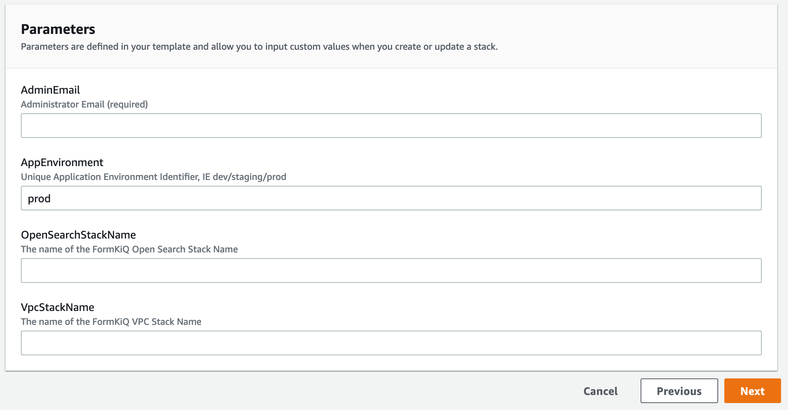

# Advanced Document Search

## Overview

Advanced Document Search is a FormKiQ Enterprise Add-On Module that enhances built-in search functionality by integrating OpenSearch.

✅ Extend Search Functionality, including multiple tag parameters and fulltext queries, through OpenSearch

✅ Optionally Include OCR Results in fulltext queries

## Installation

<iframe width="560" height="315" src="https://www.youtube.com/embed/brvHNrICnXE" title="YouTube video player" frameborder="0" allow="accelerometer; autoplay; clipboard-write; encrypted-media; gyroscope; picture-in-picture; web-share" allowfullscreen></iframe>

On your [FormKiQ Enterprise](https://github.com/formkiq) page, you'll find CloudFormation single-click installation links.

The Advanced Document Search module uses the AWS OpenSearch service. The OpenSearch service can be inside of a VPC or outside of a VPC. FormKiQ provides methods for doing either type of installation.

If you are NOT using a VPC, you can skip the `Install VPC` section.

### Install VPC (recommended)

To install OpenSearch inside of a VPC, the first step is to use the provided `VPC Creation Script` link to create a VPC preconfigure to work with FormKiQ.

The VPC CloudFormation script, will create a AWS VPC specifically designed to work with FormKiQ. Multiple Public / Private Subnets will be created across multiple availability zones to provide the best reliability possible.

You can customize the CIDR ranges to meet your network requirements.

:::note
Remember the Stack Name you used to install the VPC, as you'll need it in the next section.
:::

### Install OpenSearch

On your https://github.com/formkiq[FormKiQ Enterprise] page, you'll find links to create OpenSearch using single-click installation links.

When configurating the OpenSearch **WITH VPC**, you'll need to enter the VpcStackName which is the name of the VPC Stack you created above. The script will use outputs from the previous script in its configuration. You'll also need to select the same private subnet CIDRs used during the creation of the VPC.

It is also important that your `AppEnvironment` match exactly the same string used in your FormKiQ installation.

:::note
Remember the Stack Name you used to install OpenSearch, as you'll need it in the next section.
:::

### Update FormKiQ

After installing OpenSearch, you'll need to enable the OpenSearch module in FormKiQ. This is done by selecting your FormKiQ Stack from the CloudFormation console and click the `Update Stack`.

On the CloudFormation configuration page, enter the Stack Names of the OpenSearch installation and optionally the VPC installation.

CloudFormation will then update FormKiQ installation to enable OpenSearch.

## API

The Advanced Document Search Module adds several new endpoints, including the following API endpoint to the Documents section of the API:

* `PUT /documents/{documentId}/fulltext` - Replaces the specified document's fulltext metadata for OpenSearch (if exists)

:::note
all FormKiQ API endpoints are case-sensitive
:::

