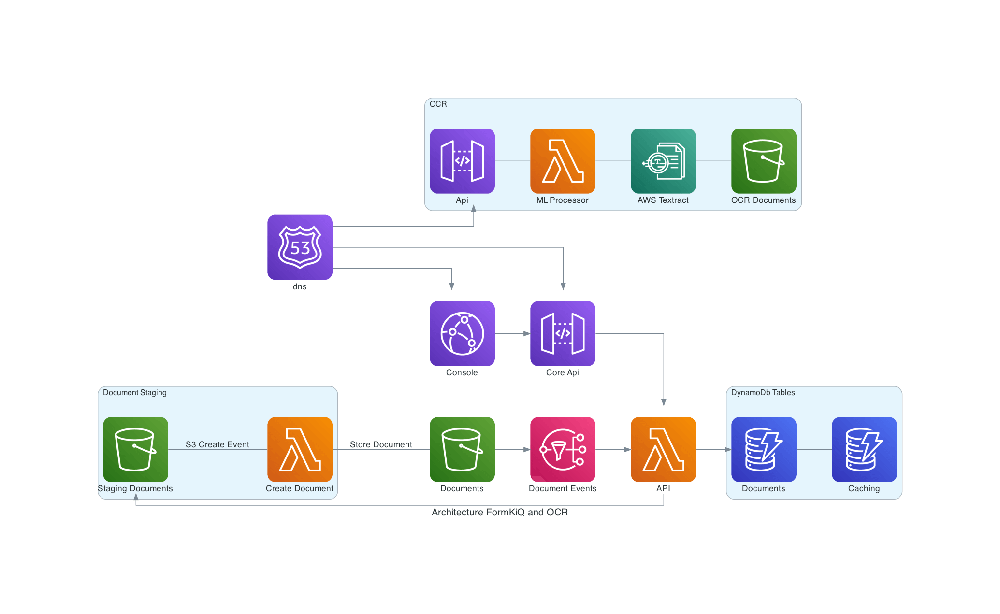

# Document OCR

✅ Use Amazon Textract to extract text and structured table or form data from documents

Document OCR is a FormKiQ Module that provides optical character recognition (OCR) for the extraction of text and structured table or form data from documents.

The module uses Tessaract as its OCR engine for FormKiQ Core, with [Amazon Textract](https://aws.amazon.com/textract) as an option for Pro or Enterprise. Amazon Textract uses advanced machine learning (ML) algorithms to identify, understand, and extract text and data from documents, including from forms and tables.

## Use Case

* If you would like to add metadata for document retrieval, this module can provide that metadata from scanned documents; you can then create tags (in the case of form or table data) or enable the entire OCR result to be searched using the Fulltext Search module
