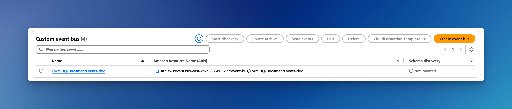
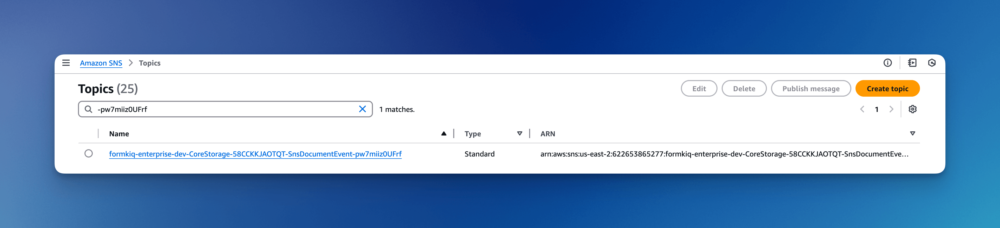

# Documents

## Overview

At the heart of the FormKiQ document management platform lies a sophisticated framework that seamlessly integrates storing, retrieving, and organizing documents. Built on Amazon S3, our platform's robust storage capabilities ensure documents are securely housed and easily retrievable, guaranteeing data integrity and scalability.

Documents can be organized in a way that mirrors their workflow, projects, or departments. This intuitive hierarchy ensures efficient navigation, as documents are logically grouped for swift access. Users can effortlessly retrieve specific files by browsing through familiar folder paths or by utilizing powerful search functionalities. This combination of advanced storage solutions and user-centric organization not only streamlines document management but also enhances collaboration and knowledge sharing across teams.

[See full API documentation here](/docs/api-reference/add-document)

## Core Components

### Document Metadata

FormKiQ supports two types of metadata for maximum flexibility:

#### Standard Metadata
Essential document properties tracked automatically:
- Path/filename
- Content type
- Checksum
- File size
- Deep link path (enabling an external document's metadata to be included within FormKiQ while the file object itself is stored in another system)

#### Extended Metadata
Custom data directly attached to documents:
- Supports up to 25 metadata entries per document
- Versioned with document changes
- Enables comprehensive audit trails
- Searchable through full-text solutions

When using document versioning, as documents evolve and new versions are created, the platform retains a historical record of metadata changes, providing a comprehensive history of the document's attributes across iterations. This powerful feature allows for accurate tracking and auditing for document controls.

:::note
Each document only supports up to 25 Metadata entries.
:::

### Document Attributes

FormKiQ's document management platform revolutionizes document organization through powerful document attributes that enable:
- Custom classification schemes
- Advanced search functionality
- Workflow automation
- Access control

[See full API documentation here](/docs/api-reference/get-document-attributes)
[Learn more about Attributes](/docs/features/attributes)

#### Key Features

1. **Customizable Document Attributes**
Users can define and assign specific attributes to each document. These attributes may include document type, author, creation date, department, confidentiality level, and more. By enabling tailored metadata, this feature supports various document management needs across different industries.

2. **Searchable Attributes**
Document attributes are searchable, allowing users to quickly locate documents based on specific metadata. The platform's search functionality leverages these attributes to deliver highly accurate results, saving time and reducing search effort.

3. **Schema-based Classification**
Utilizing SiteSchema, document attributes can be organized into predefined classifications. This schema-based organization allows for consistency across documents and makes it easier to enforce organizational standards for document handling.

4. **Dynamic Document Classification**
Documents can be automatically or manually classified based on their attributes. This dynamic classification improves the accuracy of document categorization and simplifies document retrieval.

### Document Relationships

The Document Relationship feature enables users to create logical links between documents, essential for connecting related files and providing context for how documents relate to each other.

#### Relationship Types:
1. **PRIMARY**: Main document serving as the principal source
2. **ATTACHMENT**: Supporting files linked to primary documents
3. **APPENDIX**: Additional reference materials
4. **SUPPLEMENT**: Standalone supplementary information
5. **ASSOCIATED**: Documents with non-hierarchical connections
6. **RENDITION**: Alternative formats or translations
7. **TEMPLATE**: Templates, such as those used in document generation
8. **DATASOURCE**: Datasources, such as those used in document generation

## Deep Links / External Documents

In addition to documents that are added directly into FormKiQ's object storage (S3), you can also add deep-linked / external documents as well. This can include any document accessible by URL, including S3 objects (using the S3:// protocol).

You can add organize these deep-linked documents with their own FormKiQ path, and can create attributes as well.

Some limitations exist, as FormKiQ does not have access to process those documents. You can use one of [FormKiQ's Document Gateways Add-On Modules](/docs/formkiq-modules/modules/document-gateways) for stronger integration with documents in Microsoft 365, MS SharePoint, and Google Workspace.

### AWS S3 Deep Link

**S3 Deep Links** in FormKiQ let you reference documents that already live in your own or another AWS S3 bucket without having to copy or migrate them into FormKiQ’s managed storage. 

Instead of duplicating files, you simply add a deep link pointing to the S3 object, and FormKiQ can organize it with paths and attributes just like any other document. 

This is especially valuable if you already have large volumes of content in S3, since you can immediately bring them under FormKiQ’s document management framework while avoiding unnecessary storage costs and migration overhead.

#### Cross-Account S3 Access

If your S3 Deep Link points to a bucket in **another AWS account**, the source bucket must be configured to allow FormKiQ to read the object. This is done by attaching a **bucket policy** that grants cross-account access. The policy ensures that only FormKiQ’s execution role, properly tagged with environment and application metadata, can fetch objects. It also enforces secure transport (HTTPS/TLS) to prevent accidental insecure access.

A typical bucket policy for cross-account S3 Deep Links looks like this:

```json
{
  "Version": "2012-10-17",
  "Statement": [
    {
      "Sid": "FormKiQ_Cross_Account_Access",
      "Effect": "Allow",
      "Principal": { "AWS": "arn:aws:iam::FORMKIQ_SOURCE_AWS_ACCOUNT_ID:root" },
      "Action": ["s3:GetObject*"],
      "Resource": "arn:aws:s3:::BUCKET_NAME/*",
      "Condition": {
        "Bool": { "aws:SecureTransport": "true" },
        "StringEquals": {
          "aws:PrincipalType": "AssumedRole",
          "aws:PrincipalTag/AppEnvironment": "FORMKIQ_APP_ENVIRONMENT",
          "aws:PrincipalTag/Application": "FormKiQ"
        }
      }
    }
  ]
}
```

This configuration ensures:
* Cross-account access is limited to FormKiQ’s AWS account (FORMKIQ_SOURCE_AWS_ACCOUNT_ID).
* Only assumed roles with the correct tags (AppEnvironment, Application) can access objects.
* All access is forced over secure transport (TLS).

##### Buckets Encrypted with a Customer Managed KMS Key

If the source S3 bucket uses server-side encryption with a customer managed KMS key (SSE-KMS), then the KMS key must also allow FormKiQ’s AWS account to decrypt objects. Without this, FormKiQ will be able to reference the file but fail to open or download it.

Add the following statement to the KMS key policy in the source account:

```
{
  "Sid": "AllowAcctAToDecryptViaS3",
  "Effect": "Allow",
  "Principal": { "AWS": "arn:aws:iam::ACCOUNT_A_ID:root" },
  "Action": ["kms:Decrypt", "kms:DescribeKey"],
  "Resource": "*",
  "Condition": {
    "StringEquals": {
      "kms:ViaService": "s3.REGION.amazonaws.com",
      "aws:PrincipalAccount": "ACCOUNT_A_ID"
    }
  }
}
```

Where:
* ACCOUNT_A_ID = The AWS account ID where FormKiQ is running.
* REGION = The region of the source S3 bucket.

This configuration ensures that:
* Decryption is only allowed when the request originates via S3.
* Only the specified AWS account (where FormKiQ runs) can decrypt.
* Access is limited to the exact KMS key used by the source bucket.

## Document Management Features

### Document Actions

The primary purpose of Document Actions is to enhance the document management workflow by automating tasks such as content extraction, metadata tagging, notifications, integrations with other systems, and security checks. 

By leveraging these actions, you can improve efficiency, ensure data consistency, and integrate your document processes with broader business systems.

#### Use Cases

##### Optical Character Recognition (OCR):

Automatically extract text from scanned images or PDFs. This is useful for converting non-searchable documents into searchable ones, enabling better indexing and retrieval.

##### Full-Text Extraction:
Extract all textual content from a document for indexing or analysis purposes. This action helps in creating a searchable text corpus that can be used for quick lookups or further natural language processing.
  
##### Document Tagging:
Utilize machine learning or external engines (like ChatGPT) to analyze the document and generate relevant metadata or tags. This can standardize how documents are categorized, making it easier to filter and search documents later.

##### Webhook Integration:
Trigger an external system by sending a callback URL when a document is processed. For instance, after a document is updated, a webhook can notify your CRM system or a third-party application to take further action.

##### Notification:
Send out email notifications (or other types of alerts) automatically when certain events occur—such as when a new document is added or when an important document status changes. This helps keep teams informed and facilitates rapid response.

##### Intelligent Document Processing (IDP)

Apply advanced machine learning models to classify, extract, and validate data from documents. For instance, an IDP action might analyze invoices to extract key fields (like dates, amounts, and vendor information) and validate them against internal systems, improving data accuracy and speeding up document workflows.

##### EventBridge Integration

Publish document events to AWS EventBridge so that various parts of your ecosystem can react to document changes in real time.

##### Antivirus Scanning

Automatically scan documents for viruses or malware as soon as they are added, enhancing the security of your document repository.

#### Supported Actions

FormKiQ supports various automated actions for document processing:

| Action | Description | Edition |
|--------|-------------|----------|
| **ANTIVIRUS** | Scans documents using [ClamAv](https://www.clamav.net) for detecting trojans, viruses, malware & other malicious threats | **Explore** and Commercial Deployments (**Essentials**, **Advanced**, **Enterprise**) |
| **DOCUMENTTAGGING** | Intelligent document tagging using artificial intelligence | **Core** |
| **EVENTBRIDGE** | Enables AWS EventBridge integration for event-driven architectures. Sends document data and metadata as events for further processing. [Full EventBridge documentation](/docs/features/documents#amazon-eventbridge) | **Core** |
| **FULLTEXT** | Extracts and indexes text content for search capabilities using [Typesense](https://typesense.org/) or [Opensearch](https://aws.amazon.com/opensearch-service) | **Core** (TypeSense), OpenSearch is an Add-On for **Advanced** and **Enterprise** Deployments |
| **IDP** | Extracts and processes document data using Document Attributes | **Explore** and Commercial Deployments (**Essentials**, **Advanced**, **Enterprise**), as well as optional Add-Ons |
| **NOTIFICATION** | Email notifications | **Core** |
| **OCR** | Text extraction from images/PDFs | **Core** (Tesseract), with Amazon Textract available with **Explore** and Commercial Deployments (**Essentials**, **Advanced**, **Enterprise**), as well as optional Add-Ons  |
| **PUBLISH** | Publication of approved documents | **Explore** and Commercial Deployments (**Essentials**, **Advanced**, **Enterprise**) |
| **WEBHOOK** | External system integration | **Core** |


### Document Versions

FormKiQ's versioning system provides:
- Complete change history
- Version comparison
- Rollback capabilities
- Comprehensive audit trails

[See API documentation](/docs/api-reference/get-document-versions)

:::note
Not available with FormKiQ Core; available as part of FormKiQ Explore and FormKiQ's Commercial Deployments (Essentials, Advanced, and Enterprise)
:::

### Document User Activities

The platform tracks and logs all document interactions:
- View access
- Modifications
- Sharing events
- Deletion records

[See API documentation](/docs/api-reference/get-user-activities)

:::note
Not available with FormKiQ Core; available as part of FormKiQ Explore and FormKiQ's Commercial Deployments (Essentials, Advanced, and Enterprise)
:::

## Document Events Features

The Document Event System is a robust mechanism designed to enable real-time, scalable, and decoupled processing of document-related operations, such as creation, metadata updates, and deletions. By leveraging [Amazon EventBridge](https://aws.amazon.com/eventbridge/) (and maintaining support for legacy [Amazon SNS](https://aws.amazon.com/sns/)-based notifications), FormKiQ can easily integrate with various downstream applications and services.

This document outlines the design and implementation of the Document Event System in our Document Management System. The system captures events associated with document operations (such as creation, metadata updates, and deletions) and publishes them to Amazon EventBridge for downstream processing.

### Amazon EventBridge



As of version 1.17.0, each FormKiQ installation comes with its own [Amazon EventBridge](https://aws.amazon.com/eventbridge/) setup to be connected to. FormKiQ publishes document events to Amazon EventBridge automatically. This allows easy integration for:

* Real-time Processing:
EventBridge routes events to subscribed targets for immediate handling.

* Scalability:
Leverages EventBridge’s ability to handle high volumes of events across distributed systems.

* Decoupling:
Separates the event production from consumption, allowing independent scaling and evolution of each component

#### Supported Event Types
 
Each document event uses the DetailType field in the EventBridge Message to distinguish between the different kinds of events. The supported DetailType event types are:


| DetailType  |Description |
|----------|-------------|
| New Document Create Metadata | Triggered when a new document is created |
| New Document Create Content | Triggered when a document is created or updated with new content |
| Document Delete | Triggered when a document is deleted |
| Document Soft Delete | Triggered when a document is soft deleted |
| Document Restore | Triggered when a document restored from a soft delete |
| New Document Create Metadata | Triggered when a new document is created |
| Document Create Metadata | Triggered when an existing document attributes are created |
| Document Update Metadata | Triggered when a document or document attributes are changed |
| Document Delete Metadata | Triggered when a document metadata is deleted |

#### Event Payload Schema

Each event published to EventBridge follows a consistent JSON schema. The payload structure is as follows:

```json
{
  "siteId": "string",
  "path": "string",
  "deepLinkPath": "string",
  "insertedDate": "string",
  "lastModifiedDate": "string",
  "checksum": "string",
  "checksumType": "SHA1",
  "documentId": "string",
  "contentType": "string",
  "userId": "string",
  "contentLength": 0,
  "versionId": "string",
  "metadata": [
    {
      "key": "string",
      "value": "string",
      "values": ["string"]
    }
  ],
  "attributes": [
    {
      "key": "string",
      "stringValue": "string",
      "stringValues": [],
      "numberValue": 0,
      "numberValues": [],
      "booleanValue": false
    }
  ],
  "url": "S3 Presigned Url",
  "changedAttributes":
    {
        "myKey":
        {
            "stringValue": "1234"
        }
    }
}
```

### Amazon SNS (Legacy)



In addition to the current EventBridge-based event system, FormKiQ supports an event notification mechanism that utilizes Amazon SNS. From verion 1.17.0 onward, this legacy system is maintained for backward compatibility with systems that have not yet migrated to the new EventBridge-based architecture.


#### Supported Event Types

The following event types are supported, each with a corresponding `DetailType` used in Amazon EventBridge:

- **CONTENT**  
  - **DetailType:** `Document Create Event`  
  - **Description:** Triggered when a document is created or updated with new content.

- **DELETE_METADATA**  
  - **DetailType:** `Document Delete Metadata`  
  - **Description:** Triggered when metadata is removed from a document.

- **SOFT_DELETE_METADATA**  
  - **DetailType:** `Document Soft Delete Metadata`  
  - **Description:** Triggered when metadata is soft-deleted (i.e., logically removed) for a document.

#### SNS Subscription Policy Filter

For SNS-based legacy events, subscribers can use a subscription policy filter to receive only the event types they are interested in. The subscription filter inspects an attribute named type in the SNS message attributes. The supported values for this attribute are:
  • create: For document creation or content update events.
  • delete: For document metadata deletion events.
  • softDelete: For document metadata soft deletion events.

Example Policy Filter

To subscribe only to create events, the subscription filter policy can be defined as follows:

```
{
  "type": [
    "create"
  ]
}
```

Subscribers can also adjust the filter to include multiple event types. For example, to receive both delete and softDelete events:

```
{
  "type": [
    "delete",
    "softDelete"
  ]
}
```

#### Event Payload Schema

Each event published to Amazon SNS follows a consistent JSON schema. The payload structure is as follows:

```json
{
  "siteId": "string",
  "path": "string",
  "s3bucket": "string",
  "s3key": "string",
  "type": "string",
  "documentId": "string",
  "content": "string",
  "contentType": "string",
  "userId": "string",
  "url": "S3 Presigned Url"
}
```

## Document Checksum

FormKiQ supports Amazon S3’s checksum feature which provides a way to ensure data integrity during uploading of documents. When you upload an object to S3, you can specify a checksum using one of supported SHA-1, or SHA-256. S3 will validate the checksum upon receipt. If the checksum does not match the file, S3 will return a **400** status code.

### SHA-256 Example

Using the *POST /documents/upload* API

Generates an S3 Presigned URL with SHA-256 checksum validation to ensure data integrity.

#### Request Body

```json
{
  "path": "mydoc.txt",
  "checksum": "6719766fe1a874fcf79c636a1be3ae37d0bf84ca08032c26fbd63f3fd837cda3",
  "checksumType": "SHA256"
}
```

#### Response

The API response will return checksum headers that need to be sent along with the uploaded file.

```json
{
    "headers": {
        "x-amz-checksum-sha256": "Zxl2b+GodPz3nGNqG+OuN9C/hMoIAywm+9Y/P9g3zaM=",
        "x-amz-sdk-checksum-algorithm": "SHA256"
    },
    "documentId": "09c10219..",
    "url": "https:// ..."
}
```

#### Upload File to S3 using PUT

Use the url and headers from the response to upload your file directly to Amazon S3 using a PUT request.

```bash
curl -X PUT "<url from response>" \
  -H "x-amz-checksum-sha256: Zxl2b+GodPz3nGNqG+OuN9C/hMoIAywm+9Y/P9g3zaM=" \
  -H "x-amz-sdk-checksum-algorithm: SHA256" \
  --upload-file ./mydoc.txt
```

## Best Practices

### Document Organization

**Implement consistent naming conventions:**
- Standardize file naming: `[ProjectCode]-[DocumentType]-[YYYY-MM-DD]-[Version]`
  - Example: `PRJ001-Contract-2024-02-15-v2.pdf`
- Use consistent casing for paths: `/Clients/ClientName/Projects/ProjectName/`
  - Example: `/Clients/Acme/Projects/WebsiteRedesign/Contracts/`

**Use attributes for classification:**
- Tag documents with department ownership:
  ```json
  {
    "key": "department",
    "stringValue": "Legal"
  }
  ```
- Add priority levels:
  ```json
  {
    "key": "priority",
    "numberValue": 1
  }
  ```
- Mark document status:
  ```json
  {
    "key": "status",
    "stringValue": "In Review"
  }
  ```

**Establish clear relationship hierarchies:**
- Link related documents properly:
  - Main contract (PRIMARY) → Addendum (ATTACHMENT)
  - Meeting minutes (PRIMARY) → Supporting materials (SUPPLEMENT)
  - Original document (PRIMARY) → Translations (RENDITION)

**Leverage metadata for searchability:**
- Include author information:
  ```json
  {
    "key": "author",
    "stringValue": "Jane Smith"
  }
  ```
- Add project identifiers:
  ```json
  {
    "key": "projectId",
    "stringValue": "PRJ-2024-0123"
  }
  ```
- Tag with relevant keywords:
  ```json
  {
    "key": "keywords",
    "stringValues": ["contract", "renewal", "client-facing"]
  }
  ```

### Version Control

**Leverage versioning and consider specific attributes for critical documents:**
- Legal contracts
- Financial reports
- Compliance documents
- Policy documents

**Document version changes:**
- Consider adding change notes to each version of a critical document:
  ```json
  {
    "key": "changeNotes",
    "stringValue": "Updated section 3.2 with revised payment terms"
  }
  ```
- Consider track approvers for each version of a critical document:
  ```json
  {
    "key": "approvedBy",
    "stringValue": "Thomas Johnson"
  }
  `` `

**Regular backup procedures:**
- Leverage AWS Backups
- Consider cross-region replication for disaster recovery
- Document the restoration process for emergency situations

### Security

**Configure appropriate access controls:**
- Implement role-based permissions:
  - Viewers (READ): Can only download and view documents
  - Contributors (READ/WRITE/DELETE): Can upload and edit documents and set attributes
  - Data Governance (GOVERN): Can add access attributes for use by Open Policy Agent
  - Administrators: Can manage users, access policiess, and API key access
- Use attribute-based access for document-level granularity:
  ```json
  {
    "key": "confidentialityLevel",
    "stringValue": "Restricted"
  }
  ```

**Regular security audits:**
- Review user access logs monthly
- Verify document permission settings quarterly
- Conduct penetration testing annually
- Use the `/documents/{documentId}/userActivities` endpoint to audit document access

## API Document Endpoints

[See full Documents API documentation here](/docs/category/formkiq-api)

### POST /documents 

Creates a new document; body may include document content if less than 5 MB. Returns a unique **documentId** used in subsequent operations.

:::note
This endpoint works well for smaller-sized documents, such as most Markdown (.md) files or JSON data that fits well within the 5 MB limit and is a text content-type. For most other types of documents, we recommend using **[POST /documents/upload](#post-documentsupload)**
:::

#### Sample Request

```bash
curl -X POST "https://<FORMKIQ_API>/documents?siteId=yourSiteId" \
  -H "Authorization: YOUR_JWT_TOKEN" \
  -H "Content-Type: application/json" \
  -d '{
        "path": "invoice123.pdf",
        "contentType": "application/pdf",
        "isBase64": true,
        "content": "Base64EncodedDocumentContent=="
      }'
```

#### Sample Response (HTTP 201)

```JSON
{
  "documentId": "string"
}
```

### GET /documents 

Retrieves a list of recently added documents. You can filter the list by parameters such as siteId, date, or actionStatus.

#### Sample Request

```bash
curl -X GET "https://<FORMKIQ_API>/documents?siteId=yourSiteId&limit=10" \
  -H "Authorization: YOUR_JWT_TOKEN"
```

#### Sample Response (HTTP 200)

```
{
  "next": "string",
  "previous": "string",
  "documents": [
    {
      "siteId": "string",
      "path": "string",
      "width": "string",
      "height": "string",
      "deepLinkPath": "string",
      "insertedDate": "string",
      "lastModifiedDate": "string",
      "checksum": "string",
      "checksumType": "SHA1",
      "documentId": "string",
      "contentType": "string",
      "userId": "string",
      "contentLength": 0,
      "version": "string",
      "versionKey": "string",
      "s3version": "string",
      "belongsToDocumentId": "string",
      "metadata": [
        {
          "key": "string",
          "value": "string",
          "values": [
            "string"
          ]
        }
      ]
    }
  ]
}
```

### GET /documents/&lt;documentId&gt;

Retrieves detailed metadata for a specific document.

#### Sample Request

```BASH
curl -X GET "https://<FORMKIQ_API>/documents/{documentId}?siteId=yourSiteId" \
  -H "Authorization: YOUR_JWT_TOKEN"
```

#### Sample Response (HTTP 200)

```JSON
{
  "siteId": "string",
  "path": "string",
  "width": "string",
  "height": "string",
  "deepLinkPath": "string",
  "insertedDate": "string",
  "lastModifiedDate": "string",
  "checksum": "string",
  "checksumType": "SHA1",
  "documentId": "string",
  "contentType": "string",
  "userId": "string",
  "contentLength": 0,
  "versionId": "string",
  "metadata": [
    {
      "key": "string",
      "value": "string",
      "values": [
        "string"
      ]
    }
  ]
}
```

### PATCH /documents/&lt;documentId&gt;

Used to update document metadata (and optionally content). If you omit the content, the API may return a pre-signed URL for uploading large files.

#### Sample Request

```BASH
curl -X PATCH "https://<FORMKIQ_API>/documents/{documentId}?siteId=yourSiteId" \
  -H "Authorization: YOUR_JWT_TOKEN" \
  -H "Content-Type: application/json" \
  -d '{
        "path": "invoice123_updated.pdf",
        "contentType": "application/pdf",
        "isBase64": true,
        "content": "UpdatedBase64EncodedContent=="
      }'
```

#### Sample Response (HTTP 200)

```JSON
{
  "documentId": "string",
  "uploadUrl": "string"
}
```

### DELETE /documents/&lt;documentId&gt;

Remove a document. You can choose to soft-delete the document (temporary removal) or permanently delete it by adjusting the softDelete query parameter.

The SoftDelete parameter allows for the temporary removal of a document's metadata, attributes, etc from being retrieved from all API requests.

The document can be permanently deleted by calling the DELETE /documents/&lt;documentId&gt; with softDelete=false or restored using the PUT /documents/&lt;documentId&gt;/restore.

Only the GET /documents?deleted=true will return all the soft deleted documents.

#### Sample Request Soft Delete

```BASH
curl -X DELETE "https://<FORMKIQ_API>/documents/{documentId}?siteId=yourSiteId&softDelete=true" \
  -H "Authorization: YOUR_JWT_TOKEN"
```

#### Sample Request Hard Delete

```BASH
curl -X DELETE "https://<FORMKIQ_API>/documents/{documentId}?siteId=yourSiteId" \
  -H "Authorization: YOUR_JWT_TOKEN"
```

### GET /documents/&lt;documentId&gt;/url

Returns a URL for the document's contents; this URL will expire (the default is 48 hours).

#### Sample Request

```BASH
curl -X GET "https://<FORMKIQ_API>/{documentId}/url?siteId=yourSiteId" \
  -H "Authorization: YOUR_JWT_TOKEN"
```

#### Sample Response (HTTP 200)

```JSON
{
  "documentId": "string",
  "url": "string"
}
```

### GET /documents/&lt;documentId&gt;/content

Retrieves the content of the document with the specified **documentId**.
- If the content is plain text and under 6 MB, the content will be returned directly.
- If the content is plain text but exceeds 6 MB, an error will be returned.
- For documents not in plain text format, pre-signed S3 URLs will be returned to download the content from S3.
It is recommended to use the **/documents/&lt;documentId&gt;/url** endpoint to retrieve pre-signed S3 URLs for downloading the content.


#### Sample Request

```BASH
curl -X GET "https://<FORMKIQ_API>/{documentId}/content?siteId=yourSiteId" \
  -H "Authorization: YOUR_JWT_TOKEN"
```

#### Sample Response (HTTP 200)

If the document has a Content-Type of **text/**, **application/json**, **application/x-www-form-urlencoded** the **content** field will be returned. All other Content-Type, the **contentUrl** field will be returned, which is a S3 Presigned url.

```JSON
{
  "content": "string",
  "contentUrl": "string",
  "contentType": "string"
}
```

### POST /documents/upload

Returns a URL that can be used to upload document content and create a new document, while allowing metadata to also be sent; this endpoint (whether GET or POST) is required in order to add content that is larger than 5 MB. 

The POST endpoint allow the adding of document metadata at the same time as the document is created.

#### Sample Request

```bash
curl -X POST "https://<FORMKIQ_API>/documents?siteId=yourSiteId" \
  -H "Authorization: YOUR_JWT_TOKEN" \
  -H "Content-Type: application/json" \
  -d '{
        "path": "invoice123.pdf",
        "contentType": "application/pdf",
        "isBase64": true,
        "content": "Base64EncodedDocumentContent=="
      }'
```

#### Sample Response (HTTP 201)

```JSON
{
  "documentId": "string",
  "url": "string"
}
```

## API Document Attribute Endpoints

[See full Document Attributes API documentation here](/docs/category/formkiq-api)

### POST /documents/&lt;documentId&gt;/attributes 

Add multiple attributes to a document.

#### Sample Request - Standard Attribute

Adds invoiceDate (String), invoiceNo (Number) and invoicePay indicator (boolean) to a document.

```BASH
curl -X POST "https://<FORMKIQ_API>/documents/{documentId}/attributes?siteId=yourSiteId" \
  -H "Authorization: YOUR_JWT_TOKEN" \
  -H "Content-Type: application/json" \
  -d '{
  "attributes": [
    {
      "key": "invoiceDate",
      "stringValue": "2025-01-25"
    },
    {
      "key": "invoiceNo",
      "numberValue": 12345
    },
    {
      "key": "invoicePay",
      "booleanValue": true
    }
  ]}'
```

#### Sample Request - Classification Attribute

Adds a [Classification Schema](/docs/features/schemas) to a document. This classification requires the attribute **invoiceDate** to be added to all documents.

```BASH
curl -X POST "https://<FORMKIQ_API>/documents/{documentId}/attributes?siteId=yourSiteId" \
  -H "Authorization: YOUR_JWT_TOKEN" \
  -H "Content-Type: application/json" \
  -d '{
  "attributes": [
    {
      "classificationId": "28d49090-6555-4049-b93a-b92a39e29843"
    },
    {
      "key": "invoiceDate",
      "stringValue": "2025-01-25"
    }
  ]
}'
```

#### Sample Request - Relationship Attribute

Creates a **ASSOCIATED** relationship between original document and document **5c245b25-dc93-46df-9ac4-0e1e251a8eb0** and an inverse relationship (optional) of **PRIMARY** between **5c245b25-dc93-46df-9ac4-0e1e251a8eb0** and the original document.

```BASH
curl -X POST "https://<FORMKIQ_API>/documents/{documentId}/attributes?siteId=yourSiteId" \
  -H "Authorization: YOUR_JWT_TOKEN" \
  -H "Content-Type: application/json" \
  -d '{
  "attributes": [
    {
      "documentId": "5c245b25-dc93-46df-9ac4-0e1e251a8eb0",
      "relationship": "ASSOCIATED",
      "inverseRelationship": "PRIMARY"
    }
  ]
}'
```

### GET /documents/&lt;documentId&gt;/attributes 

Retrieves a listing of a document's attributes.

#### Sample Request

```BASH
curl -X GET "http://localhost/documents/{documentId}/url?siteId=yourSiteId&duration=48" \
  -H "Authorization: YOUR_JWT_TOKEN"
```

#### Sample Response (HTTP 200)

```JSON
{
  "attributes": [
    {
      "key": "invoiceDate",
      "stringValue": "2025-01-25"
    },
    {
      "key": "invoiceNo",
      "numberValue": 12345
    },
    {
      "key": "invoicePay",
      "booleanValue": true
    }
  ]}
}
```

## API Document Action Endpoints

[See full Document Actions API documentation here](/docs/category/formkiq-api)

### GET /documents/&lt;documentId&gt;/actions 

Retrieves a document's actions and their status.

#### Sample Request

```BASH
curl -X GET "http://localhost/documents/{documentId}/actions?siteId=yourSiteId&duration=48" \
  -H "Authorization: YOUR_JWT_TOKEN"
```

#### Sample Response (HTTP 200)

```JSON
{
  "actions": [
    {
      "type": "OCR",
      "parameters": {
        "ocrParseTypes": "TEXT,FORMS,TABLES",
        "ocrEngine": "tesseract",
        "ocrOutputType": true,
        "ocrNumberOfPages": "-1",
        "addPdfDetectedCharactersAsText": true
      },
      "insertedDate": "2024-10-29T12:34:56Z",
      "startDate": "2024-10-29T12:35:00Z",
      "completedDate": "2024-10-29T12:36:00Z"
    }
  ]
}
```

### POST /documents/&lt;documentId&gt;/actions 

Below is an example payload for the POST /documents/&lt;documentId&gt;/actions endpoint that demonstrates every all ACTION type.

For **OCR** action type, the /documents/&lt;documentId&gt;/ocr endpoints can be used to fetch the OCR data after the OCR action has completed.

For **FULLTEXT** action type, the /documents/&lt;documentId&gt;/fulltext, /searchFulltext, /queryFulltext endpoints can be used to fetch data after the FULLTEXT action has completed.

#### OCR Action

##### Tesseract OCR Sample Request

Basic OCR using Tesseract and extracting text for all pages.

```BASH
curl -X POST "https://<FORMKIQ_API>/documents/{documentId}/actions?siteId=yourSiteId" \
  -H "Authorization: YOUR_JWT_TOKEN" \
  -H "Content-Type: application/json" \
  -d '{
      "type": "OCR",
      "parameters": {
        "ocrEngine": "tesseract"
      }
    }'
```

##### Tesseract OCR Sample Request

Basic OCR using Tesseract and extracting text for the first 2 pages.

```BASH
curl -X POST "https://<FORMKIQ_API>/documents/{documentId}/actions?siteId=yourSiteId" \
  -H "Authorization: YOUR_JWT_TOKEN" \
  -H "Content-Type: application/json" \
  -d '{
      "type": "OCR",
      "parameters": {
        "ocrEngine": "tesseract",
        "ocrNumberOfPages: "2"
      }
    }'
```

##### AWS Textract OCR Sample Request

OCR request that uses AWS Textract to extract all the TEXT, Key-Value pairs and Table data from all pages in the document.

```BASH
curl -X POST "https://<FORMKIQ_API>/documents/{documentId}/actions?siteId=yourSiteId" \
  -H "Authorization: YOUR_JWT_TOKEN" \
  -H "Content-Type: application/json" \
  -d '{
      "type": "OCR",
      "parameters": {
        "ocrEngine": "textract",
        "ocrParseTypes: "TEXT,FORMS,TABLES"
      }
    }'
```

#### Fulltext Action

##### Full Text extract all text

Extract all text and send it to either Typesense / Opensearch.

```BASH
curl -X POST "https://<FORMKIQ_API>/documents/{documentId}/actions?siteId=yourSiteId" \
  -H "Authorization: YOUR_JWT_TOKEN" \
  -H "Content-Type: application/json" \
  -d '{
      "type": "FULLTEXT"
    }'
```

##### Full Text extract Max Characters text

Extract up to a maximum number of characters to either Typesense / Opensearch.

```BASH
curl -X POST "https://<FORMKIQ_API>/documents/{documentId}/actions?siteId=yourSiteId" \
  -H "Authorization: YOUR_JWT_TOKEN" \
  -H "Content-Type: application/json" \
  -d '{
      "type": "FULLTEXT",
      "parameters": {
        "characterMax": "2000"
      }
    }'
```

#### DocumentTagging Action

Sends document content to ChatGPT and asks ChatGPT to extract the "author", "title", "description" from the document and then adds them as document tags.

```BASH
curl -X POST "https://<FORMKIQ_API>/documents/{documentId}/actions?siteId=yourSiteId" \
  -H "Authorization: YOUR_JWT_TOKEN" \
  -H "Content-Type: application/json" \
  -d '{
      "type": "DOCUMENTTAGGING",
      "parameters": {
        "engine": "chatgpt",
        "tags": "author,title,description"
      }
    }'
```

#### WEBHOOK Action

Sends webhook request to external system.

```BASH
curl -X POST "https://<FORMKIQ_API>/documents/{documentId}/actions?siteId=yourSiteId" \
  -H "Authorization: YOUR_JWT_TOKEN" \
  -H "Content-Type: application/json" \
  -d '{
      "type": "WEBHOOK",
      "parameters": {
        "url": "https://yourdomain.com/webhook-endpoint"
      }
    }'
```

#### Notification Action

Send email notification action.

```BASH
curl -X POST "https://<FORMKIQ_API>/documents/{documentId}/actions?siteId=yourSiteId" \
  -H "Authorization: YOUR_JWT_TOKEN" \
  -H "Content-Type: application/json" \
  -d '{
      "type": "NOTIFICATION",
      "parameters": {
        "notificationType": "email",
        "notificationToCc": "email@yourdomain.com",
        "notificationToBcc": "email@yourdomain.com",
        "notificationSubject": "Email Subject",
        "notificationText": "Email Text",
        "notificationHtml": "<p>Email HTML Text</p>"
      }
    }'
```

#### Intelligent Document Processing

Runs a Intelligent Document Processing mapping process against a document.

```BASH
curl -X POST "https://<FORMKIQ_API>/documents/{documentId}/actions?siteId=yourSiteId" \
  -H "Authorization: YOUR_JWT_TOKEN" \
  -H "Content-Type: application/json" \
  -d '{
      "type": "IDP",
      "parameters": {
        "mappingId": "a1009cbc-53f4-447a-baee-1adb6518c30f"
      }
    }'
```

#### EventBridge Notification

Sends an EventBridge notification. [See full EventBridge documentation here](/docs/features/documents#amazon-eventbridge)

```BASH
curl -X POST "https://<FORMKIQ_API>/documents/{documentId}/actions?siteId=yourSiteId" \
  -H "Authorization: YOUR_JWT_TOKEN" \
  -H "Content-Type: application/json" \
  -d '{
      "type": "EVENTBRIDGE",
      "parameters": {
        "eventBusName": "event-bus-name or event-bus-arn"
      }
    }'
```

#### Antivirus Action (Anti-Malware Scan)

Requests Antivirus / anti-malware scan on a document. Document and S3 object will be tagged with the results.

```BASH
curl -X POST "https://<FORMKIQ_API>/documents/{documentId}/actions?siteId=yourSiteId" \
  -H "Authorization: YOUR_JWT_TOKEN" \
  -H "Content-Type: application/json" \
  -d '{
      "type": "ANTIVIRUS"
    }'
```