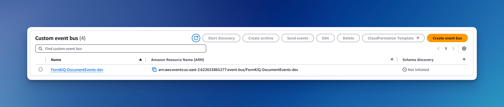
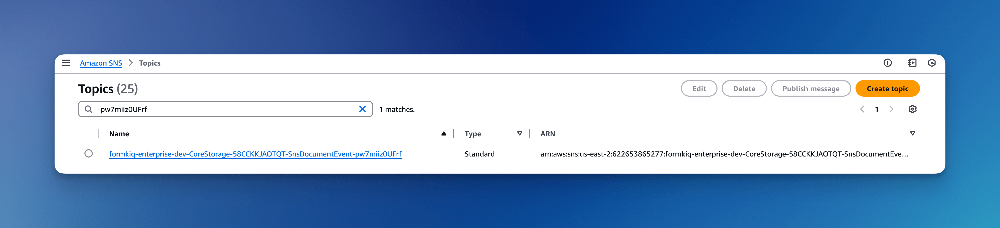

# Documents

## Overview

Documents are the core resource in FormKiQ. A document combines a stable `documentId`, optional file content, a path, metadata, attributes, actions, events, and site-level access control.

FormKiQ stores document content in Amazon S3 and stores document metadata in Amazon DynamoDB. Documents belong to a FormKiQ site, identified by `siteId`, so the same deployment can support separate teams, departments, customers, or document spaces.

Use this page to understand how documents work conceptually. For implementation examples, use the tutorials and generated API reference:

- [Documents API Tutorial](/docs/tutorials/Documents/documents-api)
- [Document Attributes API Tutorial](/docs/tutorials/Documents/document-attributes-api)
- [Full Documents API Reference](/docs/category/formkiq-api)
- [Document Storage](/docs/platform/document_storage)

## What Is a Document?

A FormKiQ document can represent:

- A file uploaded into FormKiQ-managed S3 storage
- A metadata-only record
- A reference to an external file through a deep link
- A document participating in workflows, rulesets, search, OCR, classification, or integrations

The main document fields are:

| Field | Purpose |
| --- | --- |
| `documentId` | Stable identifier used by the API to retrieve, update, process, or delete the document. |
| `siteId` | Tenant or site boundary that controls where the document belongs. |
| `path` | User-facing folder and filename path used for organization and browsing. |
| `contentType` | MIME type for the document content. |
| `contentLength` | Size of the document content when available. |
| `checksum` / `checksumType` | Optional integrity check for uploaded content. |
| `deepLinkPath` | External URL or S3 URI when the document points to content outside FormKiQ-managed storage. |
| `metadata` | Small set of document metadata fields stored with the document record. |
| `attributes` | Structured business fields used for classification, search, workflows, and access control. |

## Document Lifecycle

A typical document lifecycle looks like this:

1. Create the document metadata.
2. Upload file content directly or through a presigned S3 URL.
3. Add attributes, classifications, or relationships.
4. Run document actions such as OCR, full-text extraction, antivirus scanning, webhooks, or EventBridge notifications.
5. Search, retrieve, download, or route the document through workflows.
6. Update metadata, attributes, content, or version information.
7. Audit activity, review versions, or report on document state.
8. Soft delete, restore, or permanently delete the document when required.

## Document Identity and Organization

### Sites and Tenancy

Every document belongs to a site. In a single-tenant setup, most documents use the `default` site. In a multi-tenant setup, different sites can represent teams, departments, customers, or regional repositories.

For tenancy planning, see [Multi-Tenant and Multi-Instance Deployments](/docs/platform/multi-tenant-vs-multi-instance).

### Paths

The `path` field gives users and systems a familiar way to organize documents. Paths can mirror folders, departments, projects, customers, cases, or workflow stages.

Examples:

- `contracts/acme/master-service-agreement.pdf`
- `finance/invoices/2026/05/invoice-1042.pdf`
- `hr/policies/benefits-handbook.pdf`

Paths are useful for browsing and display, but API integrations should store and use `documentId` for durable document references.

### Relationships

Document relationships connect related files and provide context for how documents belong together.

| Relationship | Use case |
| --- | --- |
| `PRIMARY` | Main document in a related group. |
| `ATTACHMENT` | Supporting file linked to a primary document. |
| `APPENDIX` | Additional reference material. |
| `SUPPLEMENT` | Standalone supplementary information. |
| `ASSOCIATED` | Non-hierarchical relationship between documents. |
| `RENDITION` | Alternative format, translation, or generated output. |
| `TEMPLATE` | Template used by document generation. |
| `DATASOURCE` | Data source used by document generation. |

## Metadata vs Attributes

FormKiQ supports both document metadata and document attributes. They are related, but they are not the same thing.

| Type | Best for | Notes |
| --- | --- | --- |
| Standard metadata | Core document facts such as path, content type, size, checksum, dates, and deep link path. | Created and maintained as part of the document record. |
| Extended metadata | Small amounts of custom data stored directly with the document. | Limited to 25 metadata entries per document. |
| Attributes | Structured business fields such as invoice number, department, owner, confidentiality, status, or classification. | Better for search, workflows, schemas, classification, and access policies. |

:::note
Each document supports up to 25 metadata entries. For business classification, search filters, rules, and access decisions, prefer document attributes.
:::

### Document Attributes

Document attributes help organize and automate document-heavy processes. Common uses include:

- Classification, such as `documentType`, `department`, or `confidentiality`
- Search filters, such as `vendor`, `invoiceNumber`, or `projectId`
- Workflow routing, such as `status`, `priority`, or `assignedTeam`
- Access control, such as `owner` or `classification`
- Reporting, such as `region`, `customer`, or `retentionCategory`

For the full attributes guide, see [Attributes](/docs/features/attributes). For schema-based classification, see [Schemas](/docs/features/schemas).

## Upload and Storage Options

Choose the upload pattern based on file size, source system, and integration requirements.

| Method | Best for | API or feature |
| --- | --- | --- |
| Inline document create | Small text, JSON, Markdown, or base64 content under the inline content limit. | [`POST /documents`](/docs/api-reference/add-document) |
| Presigned upload | Most binary files, large files, PDFs, images, Office files, and browser uploads. | [`POST /documents/upload`](/docs/api-reference/add-document-upload) |
| Existing upload URL | Uploading content for a document where metadata has already been created. | [`GET /documents/{documentId}/upload`](/docs/api-reference/get-document-upload) |
| Deep link | Referencing external content without copying it into FormKiQ storage. | [Deep Links / External Documents](#deep-links--external-documents) |
| FormKiQ CLI or import tooling | Large imports, migrations, and bulk file movement. | [FormKiQ CLI](/docs/formkiq-modules/modules/formkiq-cli) |

For storage architecture and bucket behavior, see [Document Storage](/docs/platform/document_storage).

## Deep Links / External Documents

Deep links let FormKiQ manage a document record whose content lives outside FormKiQ-managed storage. The document can still have a FormKiQ path, attributes, relationships, and metadata.

Use deep links when:

- Content already exists in another repository.
- You want FormKiQ to index, classify, or organize external records.
- You want to avoid copying large volumes of content during an initial integration.
- Another system remains the system of record for the file content.

Deep links also have limitations. FormKiQ may not be able to process, OCR, extract, scan, or download external content unless it has access to the target object. For stronger integrations with Microsoft 365, SharePoint, Google Workspace, and related systems, see [Document Gateways](/docs/formkiq-modules/modules/document-gateways).

### AWS S3 Deep Link

S3 deep links reference documents that already exist in your own S3 bucket or another AWS account's S3 bucket. This can reduce migration overhead and avoid duplicate storage when content already lives in S3.

For cross-account S3 deep links:

- The source bucket must allow FormKiQ to read the referenced object.
- Access should be scoped to the FormKiQ AWS account and expected execution role.
- Bucket policy conditions should require secure transport.
- If the source bucket uses a customer managed KMS key, the key policy must allow decrypt access through S3.

The exact bucket and KMS policy should be reviewed against your account, region, encryption, and least-privilege requirements. For broader storage guidance, see [Document Storage](/docs/platform/document_storage).

## Document Management Features

### Document Actions

Document actions run processing or integration tasks against a document. Actions can be requested when a document is created, added later through the API, or triggered by workflows and rules depending on the deployment.

Common document action use cases:

| Use case | What it does |
| --- | --- |
| OCR | Extracts text from images and PDFs so scanned documents can become searchable. |
| Full-text extraction | Extracts text content for indexing and search. |
| Document tagging | Uses AI or configured extraction logic to generate tags or metadata. |
| Webhook | Calls an external system after a document event or processing step. |
| Notification | Sends an email notification when configured conditions occur. |
| Intelligent Document Processing | Classifies, extracts, and validates structured data from documents. |
| EventBridge | Publishes document events to AWS EventBridge for downstream automation. |
| Antivirus | Scans documents for malware when the antivirus module is enabled. |

#### Supported Actions

| Action | Description | Availability |
| --- | --- | --- |
| `ANTIVIRUS` | Scans documents using ClamAV for malicious content. | Explore and commercial deployments. |
| `DOCUMENTTAGGING` | Generates document tags using configured AI or tagging logic. | Core. |
| `EVENTBRIDGE` | Sends document data and metadata to Amazon EventBridge. | Core. |
| `FULLTEXT` | Extracts and indexes text content for search using Typesense or OpenSearch. | Core with Typesense; OpenSearch is available as an add-on for Advanced and Enterprise. |
| `IDP` | Runs intelligent document processing using mappings and attributes. | Explore, commercial deployments, and optional add-ons. |
| `NOTIFICATION` | Sends email notifications. | Core. |
| `OCR` | Extracts text from images or PDFs. | Core with Tesseract; Amazon Textract is available with Explore, commercial deployments, and optional add-ons. |
| `PUBLISH` | Publishes approved documents. | Explore and commercial deployments. |
| `WEBHOOK` | Calls an external webhook. | Core. |

For endpoint details, see [Get Document Actions](/docs/api-reference/get-document-actions) and [Add Document Actions](/docs/api-reference/add-document-actions).

### Document Versions

Document versioning preserves the history of document content and metadata changes. It can support audit review, rollback, comparison, and controlled document management.

Versioning is useful for:

- Legal contracts
- Policies and procedures
- Financial reports
- Compliance records
- Customer-facing generated documents

:::note
Document versioning is not available with FormKiQ Core. It is available as part of FormKiQ Explore and commercial deployments.
:::

For details, see [Document Versioning](/docs/formkiq-modules/modules/document-versioning) and [Get Document Versions](/docs/api-reference/get-document-versions).

### Soft Deletes and Restore

Soft delete removes a document from normal active-document listings without immediately purging all record information. This can help with recovery, review, and controlled deletion workflows.

Use:

- [`DELETE /documents/{documentId}`](/docs/api-reference/delete-document) to delete a document.
- [`PUT /documents/{documentId}/restore`](/docs/api-reference/set-document-restore) to restore a soft-deleted document.
- [`DELETE /documents/{documentId}/purge`](/docs/api-reference/purge-document) when permanent deletion is required and allowed.

For walkthrough details, see [Soft Deletes](/docs/tutorials/Documents/soft-deletes).

### Document User Activities

Document activity records provide visibility into who accessed or changed a document and when the action occurred. Activity data can support audit reviews, governance workflows, security investigations, and reporting.

:::note
Document user activities are not available with FormKiQ Core. They are available as part of FormKiQ Explore and commercial deployments.
:::

For details, see [Get Document User Activities](/docs/api-reference/get-document-user-activities) and [Reporting, Analytics, and Audit](/docs/platform/reporting-and-analytics).

## Document Events Features

FormKiQ can publish document events when documents are created, updated, processed, deleted, restored, or changed. Events let downstream systems react without tightly coupling those systems to the document API.

Use document events for:

- Workflow automation
- Search indexing
- Analytics pipelines
- External notifications
- CRM, ERP, or case management integration
- Compliance or audit reporting

### Amazon EventBridge



As of version 1.17.0, each FormKiQ installation includes an Amazon EventBridge integration. FormKiQ publishes document events to EventBridge so other systems can subscribe and react.

EventBridge supports:

- Real-time routing to subscribed targets
- Decoupled downstream processing
- Scalable event-driven integration
- AWS-native filtering and routing

#### Supported Event Types

Each EventBridge document event uses the `DetailType` field to identify the type of event.

| DetailType | Description |
| --- | --- |
| `New Document Create Metadata` | Triggered when a new document metadata record is created. |
| `New Document Create Content` | Triggered when a document is created or updated with new content. |
| `Document Delete` | Triggered when a document is deleted. |
| `Document Soft Delete` | Triggered when a document is soft deleted. |
| `Document Restore` | Triggered when a document is restored from soft delete. |
| `Document Create Metadata` | Triggered when existing document metadata or attributes are created. |
| `Document Update Metadata` | Triggered when document metadata or attributes are changed. |
| `Document Delete Metadata` | Triggered when document metadata is deleted. |

#### Event Payload Schema

EventBridge payloads use a consistent document schema. Fields can vary based on event type and document state.

```json
{
  "siteId": "string",
  "path": "string",
  "deepLinkPath": "string",
  "insertedDate": "string",
  "lastModifiedDate": "string",
  "checksum": "string",
  "checksumType": "SHA1",
  "documentId": "string",
  "contentType": "string",
  "userId": "string",
  "contentLength": 0,
  "versionId": "string",
  "metadata": [
    {
      "key": "string",
      "value": "string",
      "values": ["string"]
    }
  ],
  "changed": {
    "path": "previous/path.txt"
  },
  "attributes": {
    "department": {
      "stringValue": "Finance"
    }
  },
  "url": "S3 presigned URL",
  "addedAttributes": ["department"],
  "changedAttributes": {
    "status": {
      "stringValue": "Approved"
    }
  }
}
```

### Amazon SNS (Legacy)



FormKiQ also supports a legacy Amazon SNS notification mechanism for backward compatibility with systems that have not migrated to EventBridge.

#### Supported Event Types

| Type | DetailType | Description |
| --- | --- | --- |
| `CONTENT` | `Document Create Event` | Triggered when a document is created or updated with new content. |
| `DELETE_METADATA` | `Document Delete Metadata` | Triggered when metadata is removed from a document. |
| `SOFT_DELETE_METADATA` | `Document Soft Delete Metadata` | Triggered when metadata is soft deleted for a document. |

#### SNS Subscription Policy Filter

SNS subscribers can use a subscription filter policy to receive only selected event types. The subscription filter inspects the `type` message attribute.

Supported values:

- `create`
- `delete`
- `softDelete`

Example filter for create events:

```json
{
  "type": ["create"]
}
```

Example filter for delete and soft-delete events:

```json
{
  "type": ["delete", "softDelete"]
}
```

#### Event Payload Schema

```json
{
  "siteId": "string",
  "path": "string",
  "s3bucket": "string",
  "s3key": "string",
  "type": "string",
  "documentId": "string",
  "content": "string",
  "contentType": "string",
  "userId": "string",
  "url": "S3 presigned URL"
}
```

## Document Checksum

FormKiQ supports S3 checksum validation for document uploads. When requesting an upload URL, you can provide a checksum and checksum type. Amazon S3 validates the checksum when the file is uploaded and rejects the upload if the checksum does not match.

Use checksums when:

- Upload integrity is important.
- Files are transferred over unreliable networks.
- A source system already computes SHA checksums.
- Regulated workflows require evidence that content was not altered during upload.

### SHA-256 Example

Request an upload URL with SHA-256 checksum validation:

```json
{
  "path": "mydoc.txt",
  "checksum": "6719766fe1a874fcf79c636a1be3ae37d0bf84ca08032c26fbd63f3fd837cda3",
  "checksumType": "SHA256"
}
```

The API response returns upload headers that must be included when uploading the file to S3:

```json
{
  "headers": {
    "x-amz-checksum-sha256": "Zxl2b+GodPz3nGNqG+OuN9C/hMoIAywm+9Y/P9g3zaM=",
    "x-amz-sdk-checksum-algorithm": "SHA256"
  },
  "documentId": "09c10219...",
  "url": "https://..."
}
```

Upload the file using the returned URL and headers:

```bash
curl -X PUT "<url from response>" \
  -H "x-amz-checksum-sha256: Zxl2b+GodPz3nGNqG+OuN9C/hMoIAywm+9Y/P9g3zaM=" \
  -H "x-amz-sdk-checksum-algorithm: SHA256" \
  --upload-file ./mydoc.txt
```

## Best Practices

### Document Organization

Use consistent paths and naming conventions so documents remain easy to browse, search, and govern.

Good path examples:

- `clients/acme/contracts/master-service-agreement.pdf`
- `finance/invoices/2026/05/invoice-1042.pdf`
- `projects/alpha/design/final-specification.docx`

Prefer attributes for business meaning instead of encoding every detail into the path. For example:

```json
{
  "key": "department",
  "stringValue": "Legal"
}
```

```json
{
  "key": "status",
  "stringValue": "In Review"
}
```

```json
{
  "key": "keywords",
  "stringValues": ["contract", "renewal", "client-facing"]
}
```

### Version Control

Use document versioning for records where history matters, such as legal contracts, financial reports, compliance documents, and policies.

Consider adding attributes that describe version state:

```json
{
  "key": "changeNotes",
  "stringValue": "Updated payment terms"
}
```

```json
{
  "key": "approvedBy",
  "stringValue": "Thomas Johnson"
}
```

### Security

Configure access controls based on how documents are used.

- Use RBAC for site-level and group-level access.
- Use folder permissions when a subset of a site requires narrower access.
- Use ABAC and OPA when document attributes should affect access decisions.
- Use `GOVERN` access for data governance and document control roles.
- Review user activity data where auditability is required.

For details, see [Security](/docs/platform/security).

### Backup and Recovery

Plan recovery around the document content, metadata, search index, and audit data.

- Review S3 versioning and lifecycle requirements.
- Confirm DynamoDB Point-in-Time Recovery.
- Plan OpenSearch snapshot and restore if enhanced search is installed.
- Test restore procedures before production.
- Align retention with compliance and operational requirements.

For details, see [Backup and Recovery](/docs/platform/backup_and_recovery).

## API Document Endpoints

Use the generated API reference for exact request and response schemas.

| Operation | Purpose | API reference |
| --- | --- | --- |
| Add document | Create a document, optionally with small inline content. | [`POST /documents`](/docs/api-reference/add-document) |
| List documents | Retrieve recent or filtered documents. | [`GET /documents`](/docs/api-reference/get-documents) |
| Get document | Retrieve metadata for a specific document. | [`GET /documents/{documentId}`](/docs/api-reference/get-document) |
| Update document | Update document metadata or content. | [`PATCH /documents/{documentId}`](/docs/api-reference/update-document) |
| Delete document | Soft delete or delete a document. | [`DELETE /documents/{documentId}`](/docs/api-reference/delete-document) |
| Restore document | Restore a soft-deleted document. | [`PUT /documents/{documentId}/restore`](/docs/api-reference/set-document-restore) |
| Get content URL | Retrieve a presigned URL for document content. | [`GET /documents/{documentId}/url`](/docs/api-reference/get-document-url) |
| Get content | Retrieve text content directly or a content URL for binary content. | [`GET /documents/{documentId}/content`](/docs/api-reference/get-document-content) |
| Create upload URL | Create a presigned URL for uploading document content. | [`POST /documents/upload`](/docs/api-reference/add-document-upload) |
| Get upload URL | Retrieve a presigned URL for uploading content to an existing document. | [`GET /documents/{documentId}/upload`](/docs/api-reference/get-document-upload) |

### POST /documents

Creates a document. This endpoint is useful for metadata-only documents and small inline content. For most files, use [`POST /documents/upload`](/docs/api-reference/add-document-upload).

### GET /documents

Lists documents the caller is authorized to access. Results can be filtered and paginated.

### GET /documents/&lt;documentId&gt;

Retrieves metadata for a specific document.

### PATCH /documents/&lt;documentId&gt;

Updates document metadata and, in supported cases, document content.

### DELETE /documents/&lt;documentId&gt;

Deletes a document. Depending on parameters and configuration, this can be a soft delete or permanent delete.

### GET /documents/&lt;documentId&gt;/url

Returns a presigned URL for downloading document content.

### GET /documents/&lt;documentId&gt;/content

Returns direct text content for supported text content types or a presigned content URL for other files.

### POST /documents/upload

Creates a document upload URL. This is the recommended path for most file uploads.

## API Document Attribute Endpoints

| Operation | Purpose | API reference |
| --- | --- | --- |
| Add attributes | Add multiple attributes to a document. | [`POST /documents/{documentId}/attributes`](/docs/api-reference/add-document-attributes) |
| Get attributes | List attributes for a document. | [`GET /documents/{documentId}/attributes`](/docs/api-reference/get-document-attributes) |
| Set attributes | Replace or set document attributes. | [`PUT /documents/{documentId}/attributes`](/docs/api-reference/set-document-attributes) |
| Delete attribute | Delete an attribute from a document. | [`DELETE /documents/{documentId}/attributes/{attributeKey}`](/docs/api-reference/delete-document-attribute) |

### POST /documents/&lt;documentId&gt;/attributes

Adds standard attributes, classification attributes, or relationship attributes to a document.

### GET /documents/&lt;documentId&gt;/attributes

Retrieves the attributes attached to a document.

## API Document Action Endpoints

| Operation | Purpose | API reference |
| --- | --- | --- |
| Get actions | Retrieve a document's actions and current status. | [`GET /documents/{documentId}/actions`](/docs/api-reference/get-document-actions) |
| Add action | Run an action such as OCR, full-text extraction, webhook, notification, IDP, EventBridge, or antivirus. | [`POST /documents/{documentId}/actions`](/docs/api-reference/add-document-actions) |
| Retry action | Retry a failed or selected document action. | [`POST /documents/{documentId}/actions/{actionId}/retry`](/docs/api-reference/add-document-retry-action) |

### GET /documents/&lt;documentId&gt;/actions

Retrieves the processing actions associated with a document.

### POST /documents/&lt;documentId&gt;/actions

Adds a processing or integration action to a document. For action-specific parameters, use the generated API reference.

## Where to Go Next

- [Documents API Tutorial](/docs/tutorials/Documents/documents-api)
- [Document Attributes API Tutorial](/docs/tutorials/Documents/document-attributes-api)
- [Soft Deletes Tutorial](/docs/tutorials/Documents/soft-deletes)
- [Document Storage](/docs/platform/document_storage)
- [Search](/docs/features/search)
- [Rulesets](/docs/features/rulesets)
- [Workflows](/docs/features/workflows)
- [Document Event Processing](/docs/tutorials/event-and-integration-patterns/document-event-processing)
