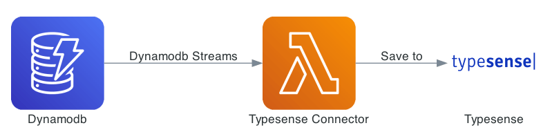

# Search

FormKiQ supports searching for documents using: [Amazon DynamoDB](https://aws.amazon.com/dynamodb), [Amazon OpenSearch](https://aws.amazon.com/opensearch-service) (formerly Elasticsearch Service) and [Typesense](https://typesense.org). Each system offers unique features and benefits, catering to different use cases and performance requirements.

## DynamoDb

[Amazon DynamoDB](https://aws.amazon.com/dynamodb) is a fully managed NoSQL database service that provides fast and predictable performance with seamless scalability. It is designed to handle large-scale document storage and retrieval with high availability and durability.

**Main Features**

* **Scalability**: Automatically scales to handle increased traffic and data volumes without compromising performance.

* **Performance**: Provides single-digit millisecond response times, making it suitable for real-time applications.

* **Flexibility**: Supports key-value and document data models, allowing for flexible schema design.

## OpenSearch

The FormKiQ document management platform harnesses the power of [Amazon OpenSearch](https://aws.amazon.com/opensearch-service), an advanced and open-source search and analytics engine, to deliver an unparalleled full-text search experience. Seamlessly integrated into FormKiQ, OpenSearch empowers users to explore the content within their documents with unparalleled precision. By employing OpenSearch's robust capabilities, users can effortlessly perform comprehensive full-text searches across their entire document repository, swiftly retrieving documents that contain specific keywords, phrases, or concepts. The result is a dynamic document management ecosystem that fosters efficient navigation and empowers users to extract maximum value from their data-rich 
documents.

FormKiQ uses change data capture for DynamoDB to recorder all data changes in DynamoDB and then update Opensearch automatically.

**Main Features**

* **Full-Text Search**: Supports complex search queries, including full-text search, filtering, and ranking of results.

* **Analytics**: Offers advanced analytics and aggregation capabilities, enabling comprehensive data insights.

## Typesense

[Typesense](https://typesense.org) is an open-source, typo-tolerant search engine that is optimized for fast and relevant search results. It is designed to be easy to set up and use, providing a seamless search experience.



FormKiQ document management platform supports seamless integration of Typesense. Deployed using AWS ECS Fargate, Typesense eliminates the need for manual server management, ensuring a hassle-free experience. 

Leveraging Typesense's cutting-edge capabilities, users can effortlessly embark on comprehensive searches across their document repository, quickly accessing files that contain specific keywords, phrases, or content. 

FormKiQ uses change data capture for DynamoDB to recorder all data changes in DynamoDB and then update Typesense automatically.

**Main Features**

* **Typo Tolerance**: Automatically corrects typos in search queries, providing relevant results even for misspelled words.

* **Speed**: Delivers extremely fast search responses, making it ideal for real-time applications.

* **Relevance**: Uses advanced algorithms to ensure search results are relevant and accurately ranked.

* **Simplicity**: Easy to install and configure, with a straightforward API for integration.


## Search Patterns

The following are examples of document search patterns and which search services support them. 

FormKiQ supports the following search criteria:

* Search by key

* Search by key and exact value

* Search by key and value in a list of values

* Search by key and values that begin with a value

* Search by key and a range of values

This flexible search functionality empowers users to swiftly locate documents based on their unique attributes / tags, streamlining information retrieval and optimizing workflow efficiency. 

### Single Attribute / Tag Search

```
API Endpoint: /search, /searchFulltext
```

FormKiQ supports searching for a single attribute / tag using DynamoDb, OpenSearch and Typesense using the API endpoints listed above.

#### POST /search request

**Search by key**

```
{
  "query": {
    "attribute": {
      "key": "category"
    }
  }
}
```

**Search by key and value**

```
{
  "query": {
    "attribute": {
      "key": "category",
      "eq" : "person"
    }
  }
}
```

**Search by key and value begins with**

```
{
  "query": {
    "attribute": {
      "key": "category",
      "beginsWith" : "p"
    }
  }
}
```

**Search by key and number range of values**

```
{
  "query": {
    "attribute": {
      "key": "category",
      "range" : {"start":10, "end":"90", "type":"NUMBER"}
    }
  }
}
```

**Search by key and string range of values**

```
{
  "query": {
    "attribute": {
      "key": "invoice",
      "range" : {"start":"2024-01-10", "end":"2024-01-31", "type":"STRING"}
    }
  }
}
```

### Multiple Attribute Search

```
API Endpoint: /search, /searchFulltext
```

FormKiQ supports searching for a multiple attributes using DynamoDb and OpenSearch using the API endpoints listed above.

:::note
Multiple attributes using DynamoDb is only supported when using [Composite Keys](#). Composite Keys require "eq" criteria to be used for each attribute except for the last one.
:::

#### POST /search request

**Search by keys and value**

```
{
  "query": {
    "attributes": [{
      "key": "category",
      "eq" : "person"
    },{
      "key": "name",
      "eq" : "John"
    }]
  }
}

```

**Search by keys and value begins with**

```
{
  "query": {
    "attributes": [{
      "key": "category",
      "eq" : "person"
    },{
      "key": "name",
      "beginsWith" : "J"
    }]
  }
}

```

**Search by keys and number range of values**

```
{
  "query": {
    "attributes": [{
      "key": "documentType",
      "eq" : "invoice"
    },{
      "key": "total",
      "range" : {"start":1000, "end":"9000", "type":"NUMBER"}
    }]
  }
}
```

**Search by key and string range of values**

```
{
  "query": {
    "attributes": [{
      "key": "documentType",
      "eq" : "invoice"
    },{
      "key": "date",
      "range" : {"start":"2024-01-10", "end":"2024-01-31", "type":"STRING"}
    }]
  }
}
```

### Document Full-text Search

```
API Endpoint: /search, /searchFulltext
```

FormKiQ supports searching for a single attribute / tag using OpenSearch or Typesense using the API endpoints listed above.

#### POST /search request

**Search for text**

```
{
  "query": {
    "text": "invoice documents"
  }
}
```

#### POST /searchFulltext request

**Search for text**

```
{
  "query": {
    "text": "invoice documents"
  }
}
```

### Custom Complex Search

```
API Endpoint: /queryFulltext
```

FormKiQ supports custom complex search queries, including full-text search, structured search, and complex queries using OpenSearch using the API endpoints listed above.

```
{
  "query": {
    "match": {
      "title": "Wind"
    }
  }
}
```
