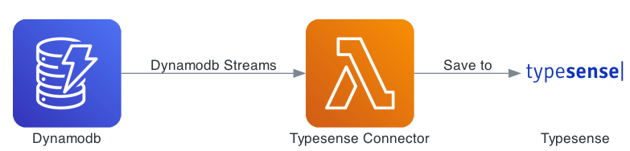

# Search

## Overview

FormKiQ supports structured document search and optional full-text search. The right search option depends on what you are searching, which search backend is installed, and whether the query can be served from DynamoDB or needs a search engine.

Core metadata and tag search is backed by Amazon DynamoDB. Full-text search can use Typesense or Amazon OpenSearch, depending on the FormKiQ edition, modules, and deployment configuration.

## Choose a Search Option

| Need | API operation | Backend | Notes |
| --- | --- | --- | --- |
| Search by one tag or attribute | [`POST /search`](/docs/api-reference/document-search) | DynamoDB | Best for exact, begins-with, list, and range searches on known metadata. |
| Search by multiple tags or attributes | [`POST /search`](/docs/api-reference/document-search) | DynamoDB | Requires configured composite keys for DynamoDB-backed multi-attribute search. |
| Search document text with Typesense | [`POST /search`](/docs/api-reference/document-search) | Typesense | Uses the `query.text` parameter when Typesense is enabled. |
| Search document text with OpenSearch | [`POST /searchFulltext`](/docs/api-reference/search-fulltext) | OpenSearch | Available when the enhanced full-text search module is installed. |
| Run raw OpenSearch DSL | [`POST /queryFulltext`](/docs/api-reference/query-fulltext) | OpenSearch | Use for advanced filters, sorting, aggregations, and custom queries. |

:::tip
Use `/search` first when users need predictable lookups by tags, attributes, folders, paths, or document IDs. Use full-text search when users need to search inside document content, OCR output, or broader indexed metadata.
:::

## Search Providers

### DynamoDB

Amazon DynamoDB is the default search path for structured document metadata.

Use DynamoDB-backed search when you need:

- Tag or attribute lookup
- Exact value, value list, begins-with, and range criteria
- Low-latency access patterns
- Predictable search fields
- Composite key searches across multiple tags or attributes

DynamoDB search is usually the best fit for application workflows that know the metadata fields they need to search, such as `customerId`, `documentType`, `invoiceNumber`, `status`, or `projectId`.

### Typesense

Typesense can provide fast text search when it is enabled in the deployment.

Use Typesense-backed search when you need:

- Text search through the `/search` API
- Typo-tolerant search behavior
- Fast search over indexed content and metadata
- A simpler full-text option than raw OpenSearch queries



### OpenSearch

Amazon OpenSearch Service provides enhanced full-text and advanced search capabilities.

Use OpenSearch-backed search when you need:

- Full-text search through `/searchFulltext`
- More flexible multi-attribute search without DynamoDB composite key limitations
- Raw OpenSearch Query DSL through `/queryFulltext`
- Aggregations, custom filters, sorting, and advanced ranking behavior
- Search operations over indexed document content, tags, attributes, and metadata

OpenSearch is available as an add-on module. Plan for its cost, capacity, backup, and indexing behavior separately from the core serverless FormKiQ services.

## Search Capabilities

### Supported Search Criteria

The available criteria depend on the endpoint and backend, but common FormKiQ search patterns include:

- Search by tag key or attribute key
- Search by exact value with `eq`
- Search by any value in a list with `eqOr`
- Search by value prefix with `beginsWith`
- Search by string or number range
- Search within a specific list of document IDs
- Search text content when Typesense or OpenSearch is enabled

### What Gets Searched

Structured search works best against metadata that was deliberately added to documents:

- Tags
- Attributes
- Folder and path metadata
- Document IDs
- Composite key fields

Full-text search works against indexed text and metadata. Depending on the deployment and document workflow, indexed text may come from:

- Plain text document content
- Extracted text from document actions
- OCR results
- Tags and attributes synchronized into the search index
- Metadata produced by mappings, rulesets, or document workflows

For OCR behavior, see [Optical Character Recognition](/docs/features/ocr). For mapping extracted values into attributes, see [Mappings](/docs/features/mappings).

### Indexing and Reindexing

Search results depend on what has been indexed.

- DynamoDB-backed metadata search is updated when document metadata is written.
- Composite key searches require the relevant composite keys to exist in the site or classification schema.
- Full-text search requires a configured search backend and indexed text.
- OCR and full-text actions may run asynchronously, so new content may not be searchable immediately.
- Existing documents may need to be reindexed after changing schemas, composite keys, mappings, or full-text configuration.

Use [`POST /reindex/documents/{documentId}`](/docs/api-reference/add-reindex-document) when a document needs to be reprocessed for a search target.

## Attribute and Tag Search

### Single Attribute Search

Use [`POST /search`](/docs/api-reference/document-search) for most structured searches.

#### Search by Key

```json
{
  "query": {
    "attribute": {
      "key": "category"
    }
  }
}
```

#### Search by Key and Value

```json
{
  "query": {
    "attribute": {
      "key": "category",
      "eq": "person"
    }
  }
}
```

#### Search by Key Prefix

```json
{
  "query": {
    "attribute": {
      "key": "category",
      "beginsWith": "p"
    }
  }
}
```

#### Search by Value List

```json
{
  "query": {
    "attribute": {
      "key": "status",
      "eqOr": ["approved", "pending-review"]
    }
  }
}
```

#### Search by Number Range

```json
{
  "query": {
    "attribute": {
      "key": "total",
      "range": {
        "start": 10,
        "end": 90,
        "type": "NUMBER"
      }
    }
  }
}
```

#### Search by String Range

```json
{
  "query": {
    "attribute": {
      "key": "invoiceDate",
      "range": {
        "start": "2024-01-10",
        "end": "2024-01-31",
        "type": "STRING"
      }
    }
  }
}
```

### Multiple Attribute Search

Use multiple attributes when the document schema has a composite key that matches the fields being searched.

:::note
DynamoDB-backed multiple attribute search requires composite keys. All attributes except the last search field must use `eq` criteria so FormKiQ can use the configured access pattern efficiently.
:::

#### Multiple Keys and Values

```json
{
  "query": {
    "attributes": [
      {
        "key": "documentType",
        "eq": "invoice"
      },
      {
        "key": "vendorId",
        "eq": "vendor-123"
      }
    ]
  }
}
```

#### Multiple Keys with Prefix

```json
{
  "query": {
    "attributes": [
      {
        "key": "documentType",
        "eq": "invoice"
      },
      {
        "key": "invoiceNumber",
        "beginsWith": "INV-2024"
      }
    ]
  }
}
```

#### Multiple Keys with Number Range

```json
{
  "query": {
    "attributes": [
      {
        "key": "documentType",
        "eq": "invoice"
      },
      {
        "key": "total",
        "range": {
          "start": 1000,
          "end": 9000,
          "type": "NUMBER"
        }
      }
    ]
  }
}
```

#### Multiple Keys with String Range

```json
{
  "query": {
    "attributes": [
      {
        "key": "documentType",
        "eq": "invoice"
      },
      {
        "key": "invoiceDate",
        "range": {
          "start": "2024-01-10",
          "end": "2024-01-31",
          "type": "STRING"
        }
      }
    ]
  }
}
```

For schema configuration, see [Schemas](/docs/features/schemas).

## Full-text Search

Full-text search requires Typesense or OpenSearch.

### Typesense Text Search

When Typesense is enabled, use [`POST /search`](/docs/api-reference/document-search) with `query.text`.

```json
{
  "query": {
    "text": "invoice documents"
  }
}
```

### OpenSearch Full-text Search

When the enhanced full-text search module is installed, use [`POST /searchFulltext`](/docs/api-reference/search-fulltext).

```json
{
  "query": {
    "text": "invoice documents"
  }
}
```

OpenSearch full-text search also supports richer attribute criteria. Typed values use `stringValue`, `numberValue`, or `booleanValue`.

```json
{
  "query": {
    "attributes": [
      {
        "key": "documentType",
        "eq": {
          "stringValue": "invoice"
        }
      },
      {
        "key": "approved",
        "eq": {
          "booleanValue": true
        }
      }
    ]
  }
}
```

## Complex Search

Use [`POST /queryFulltext`](/docs/api-reference/query-fulltext) when you need direct access to OpenSearch Query DSL.

This endpoint is intended for advanced OpenSearch use cases, including Boolean queries, custom filters, sorting, aggregations, and backend-specific tuning.

### Basic Match Query

```json
{
  "query": {
    "match": {
      "content": "invoice"
    }
  }
}
```

### Aggregation Example

Request:

```json
{
  "query": {
    "match_all": {}
  },
  "aggs": {
    "document_types": {
      "terms": {
        "field": "documentType.keyword"
      }
    }
  }
}
```

Example response:

```json
{
  "took": 3,
  "hits": {
    "total": {
      "value": 150,
      "relation": "eq"
    },
    "hits": []
  },
  "aggregations": {
    "document_types": {
      "doc_count_error_upper_bound": 0,
      "sum_other_doc_count": 0,
      "buckets": [
        {
          "key": "invoice",
          "doc_count": 57
        },
        {
          "key": "contract",
          "doc_count": 43
        }
      ]
    }
  }
}
```

### Combined Query and Filter

```json
{
  "query": {
    "bool": {
      "must": [
        {
          "match": {
            "content": "invoice"
          }
        }
      ],
      "filter": [
        {
          "term": {
            "status.keyword": "approved"
          }
        },
        {
          "range": {
            "amount": {
              "gte": 1000
            }
          }
        }
      ]
    }
  }
}
```

For complete OpenSearch query capabilities, refer to the [OpenSearch Query DSL documentation](https://opensearch.org/docs/latest/query-dsl/).

## Provider Compatibility

| Capability | DynamoDB via `/search` | Typesense via `/search` | OpenSearch via `/searchFulltext` or `/queryFulltext` |
| --- | --- | --- | --- |
| Single tag or attribute search | Yes | Indexed content only | Yes |
| Multiple tag or attribute search | Yes, with composite keys | Indexed content only | Yes |
| Text search | No | Yes, when enabled | Yes |
| Raw search-engine query DSL | No | No | Yes, through `/queryFulltext` |
| Aggregations | No | No | Yes, through `/queryFulltext` |

## API Reference

| Operation | Use for |
| --- | --- |
| [`POST /search`](/docs/api-reference/document-search) | DynamoDB-backed tag and attribute search, document ID filtering, and Typesense text search when Typesense is enabled. |
| [`POST /searchFulltext`](/docs/api-reference/search-fulltext) | OpenSearch-backed full-text search and more flexible multi-tag or multi-attribute search. |
| [`POST /queryFulltext`](/docs/api-reference/query-fulltext) | Raw OpenSearch search requests using OpenSearch Query DSL. |
| [`POST /documents/{documentId}/actions`](/docs/api-reference/add-document-actions) | Run actions such as `FULLTEXT` or `OCR` so document content can be extracted and indexed. |
| [`POST /reindex/documents/{documentId}`](/docs/api-reference/add-reindex-document) | Reindex an existing document after schema, composite key, mapping, or full-text configuration changes. |

## Troubleshooting Search Results

If a search returns no results, check the following:

- Confirm the document exists in the same `siteId` being searched.
- Confirm the searched tag or attribute is present on the document.
- Confirm the correct endpoint is being used for the installed backend.
- Confirm composite keys are configured before using multiple DynamoDB-backed attributes.
- Confirm OCR or full-text actions completed before searching document content.
- Confirm OpenSearch or Typesense is installed and healthy before using full-text search.
- Reindex existing documents after changing schemas, composite keys, mappings, or search configuration.
