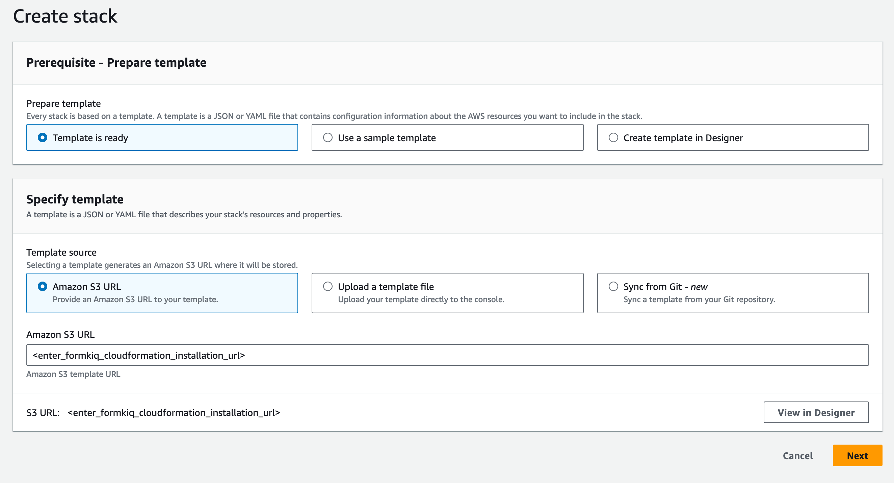

# Installing FormKiQ
# (Commercially-Licensed Offerings)

## Overview

As with FormKiQ Core, **FormKiQ Essentials**, **Advanced**, and **Enterprise** editions are deployed using AWS CloudFormation, which automates the creation and management of required AWS resources. This guide walks you through the installation process.

## Prerequisites

Before beginning installation, ensure you have reviewed the [FormKiQ prerequisites](/docs/getting-started/quick-start#prerequisites).

## Installation Steps

### 1. Select AWS Region

Choose your deployment region from the following options:

| AWS Region | Location | Install Link |
|------------|----------|--------------|
| us-east-1 | N. Virginia | [Install](https://console.aws.amazon.com/cloudformation/home?region=us-east-1#/stacks/new) |
| us-east-2 | Ohio | [Install](https://console.aws.amazon.com/cloudformation/home?region=us-east-2#/stacks/new) |
| us-west-2 | Oregon | [Install](https://console.aws.amazon.com/cloudformation/home?region=us-west-2#/stacks/new) |
| ca-central-1 | Canada (Central) | [Install](https://console.aws.amazon.com/cloudformation/home?region=ca-central-1#/stacks/new) |
| eu-central-1 | Frankfurt | [Install](https://console.aws.amazon.com/cloudformation/home?region=eu-central-1#/stacks/new) |
| eu-west-1 | Ireland | [Install](https://console.aws.amazon.com/cloudformation/home?region=eu-west-1#/stacks/new) |
| eu-west-3 | Paris | [Install](https://console.aws.amazon.com/cloudformation/home?region=eu-west-3#/stacks/new) |
| ap-south-1 | Mumbai | [Install](https://console.aws.amazon.com/cloudformation/home?region=ap-south-1#/stacks/new) |
| ap-southeast-1 | Singapore | [Install](https://console.aws.amazon.com/cloudformation/home?region=ap-southeast-1#/stacks/new) |
| ap-southeast-2 | Sydney | [Install](https://console.aws.amazon.com/cloudformation/home?region=ap-southeast-2#/stacks/new) |
| ap-northeast-2 | Seoul | [Install](https://console.aws.amazon.com/cloudformation/home?region=ap-northeast-2#/stacks/new) |
| sa-east-1 | São Paulo | [Install](https://console.aws.amazon.com/cloudformation/home?region=sa-east-1#/stacks/new) |

### 2. Create CloudFormation Stack

1. Click the installation link for your chosen region
2. Log into AWS Console if prompted
3. You'll be directed to "CloudFormation Create Stack"



### 3. Configure Stack Settings

#### Stack Name
- Format: `formkiq-<edition>-<environment>`
- Example: `formkiq-enterprise-prod`
- Allowed characters: A-Z, a-z, 0-9, and hyphens (-)

:::tip Environment Separation
For production deployments, we recommend:
- Using [AWS Organizations](https://aws.amazon.com/organizations)
- Creating separate AWS accounts for each environment (dev, test/qa, staging, production)
- This approach improves security and cost tracking
:::

#### Core Parameters
Review and configure the standard FormKiQ parameters as described in the [Quick Start Guide](/docs/getting-started/quick-start#set-admin-email).

#### Additional Parameters

##### Certificate Integration
```plaintext
Parameter: CertificateStackName
Description: Name of the deployed FormKiQ Certificate CloudFormation stack
Required: When using SSL certificates
```

##### OpenSearch Integration
```plaintext
Parameter: OpenSearchStackName
Description: Name of the deployed OpenSearch CloudFormation stack
Required: When using OpenSearch
Note: VpcStackName must also be specified with OpenSearch
```

### 4. Complete Installation

1. Review all configuration settings
2. Navigate through remaining CloudFormation screens
3. On the final page:
   - Review the acknowledgments
   - Check required boxes
   - Click "Submit" to create the stack


## Post-Installation

After stack creation completes:
1. Verify all resources are created successfully
2. Check for any error messages in CloudFormation events
3. Review the outputs tab for important endpoint information

## Troubleshooting

Common installation issues:
- Insufficient IAM permissions
- VPC configuration errors with OpenSearch
- Certificate validation failures

For detailed assistance, refer to our [troubleshooting guide](/docs/category/troubleshooting) or contact support.

## Next Steps

After successful installation:
1. Configure authentication
2. Set up initial users
3. Review security settings
4. Test basic functionality

See our [API Walkthrough](/docs/getting-started/api-walkthrough/) to get started.