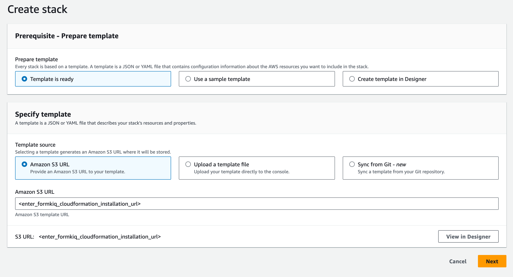
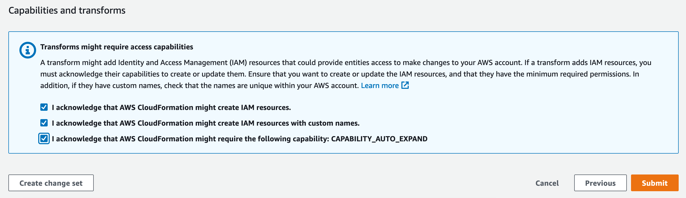

# Commercial Deployment Notes

## Overview

FormKiQ **Essentials**, **Advanced**, and **Enterprise** are deployed using AWS CloudFormation, but the installation links and templates are customer-specific. They are provided during onboarding or by the FormKiQ team based on the licensed edition, modules, target AWS regions, and deployment requirements.

For the public, open-source installation path, use the [Core AWS Quick Start](/docs/getting-started/quick-start).

## Prerequisites

Before beginning a commercial deployment:

- Review the shared [FormKiQ prerequisites](/docs/getting-started/quick-start#prerequisites)
- Confirm the AWS region or regions for deployment
- Confirm whether the deployment requires VPC, OpenSearch, certificate, SSO, OCR/IDP, or other module configuration
- Confirm that you have the customer-specific CloudFormation link or template URL provided by FormKiQ

## Installation Steps

### 1. Open the Customer-Specific Installation Link

Use the CloudFormation installation link or template URL provided by FormKiQ for your licensed edition and deployment region.

### 2. Create CloudFormation Stack

1. Open the provided installation link
2. Log into the AWS Console if prompted
3. Confirm that the CloudFormation template URL is populated
4. Continue to the stack configuration step



### 3. Configure Stack Settings

#### Stack Name
- Format: `formkiq-<edition>-<environment>`
- Example: `formkiq-enterprise-prod`
- Allowed characters: A-Z, a-z, 0-9, and hyphens (-)

:::tip Environment Separation
For production deployments, we recommend:
- Using [AWS Organizations](https://aws.amazon.com/organizations)
- Creating separate AWS accounts for each environment (dev, test/qa, staging, production)
- This approach improves security and cost tracking
:::

#### Core Parameters
Review and configure the standard FormKiQ parameters as described in the [Quick Start Guide](/docs/getting-started/quick-start#required-parameters).

#### Additional Parameters

Your commercial template may include additional parameters depending on licensed edition, selected modules, and deployment architecture.

##### Certificate Integration
```plaintext
Parameter: CertificateStackName
Description: Name of the deployed FormKiQ Certificate CloudFormation stack
Required: When using SSL certificates
```

##### OpenSearch Integration
```plaintext
Parameter: OpenSearchStackName
Description: Name of the deployed OpenSearch CloudFormation stack
Required: When using OpenSearch
Note: VpcStackName must also be specified with OpenSearch
```

### 4. Complete Installation

1. Review all configuration settings
2. Navigate through remaining CloudFormation screens
3. On the final page:
   - Review the acknowledgments
   - Check required boxes
   - Click "Submit" to create the stack



## Post-Installation

After stack creation completes:
1. Verify all resources are created successfully
2. Check for any error messages in CloudFormation events
3. Review the outputs tab for important endpoint information

## Troubleshooting

Common installation issues:
- Insufficient IAM permissions
- VPC configuration errors with OpenSearch
- Certificate validation failures

For detailed assistance, refer to our [troubleshooting guide](/docs/category/troubleshooting) or contact support.

## Next Steps

After successful installation:
1. Configure authentication
2. Set up initial users
3. Review security settings
4. Test basic functionality

See our [API Walkthrough](/docs/getting-started/api-walkthrough/) to get started.
