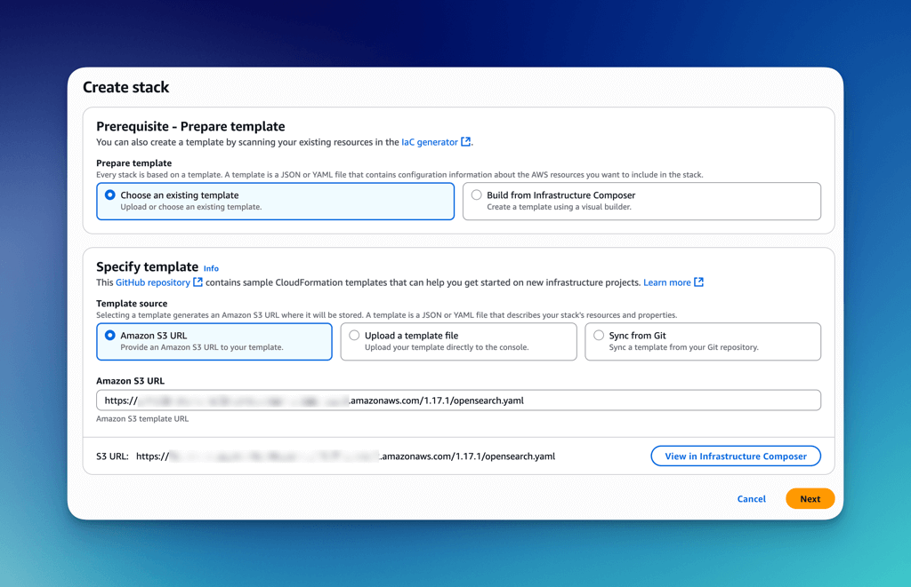
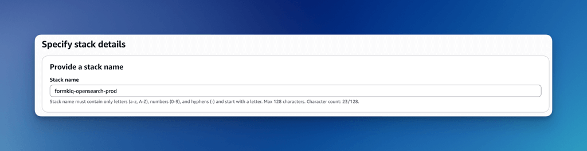

# Amazon OpenSearch Managed

## Prerequisites

1. **Required Installations**
* [FormKiQ Advanced/Enterprise](https://formkiq.com/pricing)
* [VPC Configuration](/docs/getting-started/quick-start#install-vpc)

2. **Service Role Setup**
Run the following AWS CLI command to enable OpenSearch service role:
```bash
aws iam create-service-linked-role --aws-service-name opensearchservice.amazonaws.com
```

## Create Stack

* Access CloudFormation console via the installation link
* Enter the OpenSearch module S3 URL (provided separately)



## Stack Parameters

This template includes a set of parameters that allow you to customize the deployment of AWS resources. Each parameter provides flexibility to tailor the stack to your environment or operational needs.

### Stack Name

Stack name must contain only letters (a-z, A-Z), numbers (0-9), and hyphens (-) and start with a letter. Max 128 characters.

Format: `formkiq-opensearch-<environment>`
Example: `formkiq-opensearch-prod`



### Configuration Parameters

| Parameter                | Type   | Default           | Description |
|--------------------------|--------|-------------------|-------------|
| `VpcStackName`           | String | *(none)*          | Name of the VPC CloudFormation stack used to import VPC ID, subnets, and CIDR blocks. |
| `Name`                   | String | `formkiq-prod`    | Unique, lowercase name for the OpenSearch domain. Must include only lowercase letters, numbers, and hyphens. |
| `EnableMultiAZStandby`   | String | `false`           | Enables Multi-AZ with standby for data nodes. Improves availability but increases cost. |
| `OpenSearchVersion`      | String | `OpenSearch_2.17` | OpenSearch engine version to deploy. Must be a valid supported version. |
| `DataInstanceType`       | String | `t3.small.search` | EC2 instance type for data nodes. Affects performance and pricing. |
| `DataInstanceCount`      | Number | `1`               | Number of data nodes in the cluster. Impacts redundancy and capacity. |
| `DataNodeVolumeSize`     | Number | `10`              | Size (in GiB) of the EBS volume for each data node. Minimum is 10 GiB. |
| `DedicatedMasterType`    | String | `""`              | Instance type for dedicated master nodes. Leave empty to disable. |
| `DedicatedMasterCount`   | Number | `0`               | Number of dedicated master nodes. Use `0` to disable; use `3+` for production. |
| `AlarmEmail`             | String | `""`              | Optional email address to receive CloudWatch alarm notifications. Leave empty to disable SNS alerts. |
| `RetentionInDays`        | Number | `90`              | Number of days to retain logs in CloudWatch Log Groups. Must match one of the supported retention values. |
| `LogsSearchSlowEnabled`  | String | `false`           | Enable CloudWatch log group for slow search query logs. |
| `LogsIndexSlowEnabled`   | String | `false`           | Enable CloudWatch log group for slow indexing operation logs. |
| `LogsErrorEnabled`       | String | `false`           | Enable CloudWatch log group for application error logs. |


## Post-Installation Steps

### Update FormKiQ Stack

1. Select your FormKiQ stack in CloudFormation
2. Click "Update"
3. Choose "Use current template"
4. Set `OpenSearchStackName` to your OpenSearch stack name


### Complete Update

1. Review configuration
2. Navigate through confirmation screens
3. Acknowledge capabilities
4. Submit stack update


## Post-Deployment Notes

- Documents and metadata automatically sync with OpenSearch
- Document content sync requires explicit configuration
- Verify cluster health after deployment
- Monitor resource usage

## Development Configuration Summary

For development environments, recommended settings:
- Single data node (DataInstanceCount: 1)
- t3.small.search instances
- No dedicated master nodes
- 10GB storage
- gp3 volume type
- Single private subnet deployment