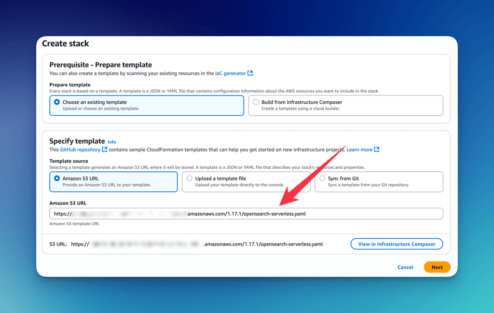
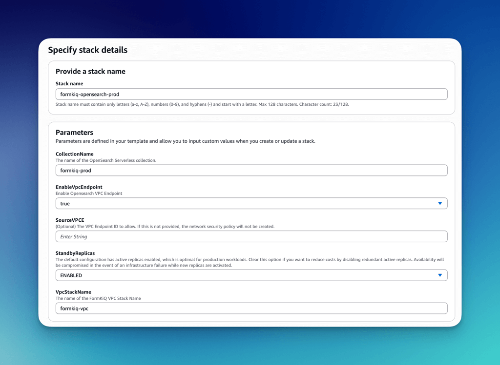
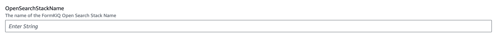

# OpenSearch Serverless

## Prerequisites

**Required Installations**
   - [FormKiQ Advanced/Enterprise](https://formkiq.com/pricing)
   - [VPC Configuration](/docs/getting-started/quick-start#install-vpc)

## Create Stack

* Access CloudFormation console via the installation link
* Enter the OpenSearch Serverless module S3 URL (provided separately)

## Stack Parameters

### Stack Name

Stack name must contain only letters (a-z, A-Z), numbers (0-9), and hyphens (-) and start with a letter. Max 128 characters.

Format: `formkiq-opensearch-<environment>`

Example: `formkiq-opensearch-prod`

### Collection Name

The name of the OpenSearch Serverless Collection. This value is used to identify and reference the collection throughout the stack. Should be unique per account/region.

Format: `formkiq-<environment>`

Example: `formkiq-prod`

### EnableVpcEndpoint

Indicates whether this stack should create the required VPC endpoint for OpenSearch Serverless access.

* If set to "true", the template will create a new VPC endpoint and output it as VpcEndpoint in the stack outputs.
* If set to "false", it assumes a VPC endpoint has already been created manually and skips the automatic creation.

OpenSearch Serverless requires a VPC endpoint for access. You must either:
* Enable this option to let the template create one for you, or
* Disable it and manually provide the VPC endpoint ID via the SourceVPCE parameter.

### SourceVPCE

The VPC Endpoint ID (e.g., vpce-abc123def456) to allow network access to the OpenSearch Serverless collection.

Usage guidance:
* If EnableVpcEndpoint is set to "true", leave SourceVPCE blank. Once the stack is deployed, update the stack by setting SourceVPCE to the VpcEndpoint value from the stack outputs to apply the network policy.
* If you’re managing the VPC endpoint manually, set EnableVpcEndpoint to "false" and provide the existing VPC endpoint ID here.

This parameter is only used to create a network security policy that controls which VPC endpoints can access the collection.

### SourceVPCE

(Optional) The ID of the VPC Endpoint (e.g., vpce-123abc456) allowed to access the OpenSearch Serverless collection. If not provided, the NetworkSecurityPolicy will not be created. Use this to restrict access from specific endpoints.

### StandbyReplicas

Determines whether redundant active replicas are enabled for high availability. 

* ENABLED – Recommended for production (better availability, higher cost)
* DISABLED – Cost-optimized for dev/test (less availability)

## Post-Installation Steps

### Update FormKiQ Stack

1. Select your FormKiQ stack in CloudFormation
2. Click "Update"
3. Choose "Use current template"
4. Set `OpenSearchStackName` to your OpenSearch stack name

### Complete Update

1. Review configuration
2. Navigate through confirmation screens
3. Acknowledge capabilities
4. Submit stack update

## Post-Deployment Notes

* Documents and metadata automatically sync with OpenSearch
* Document content sync requires explicit configuration
