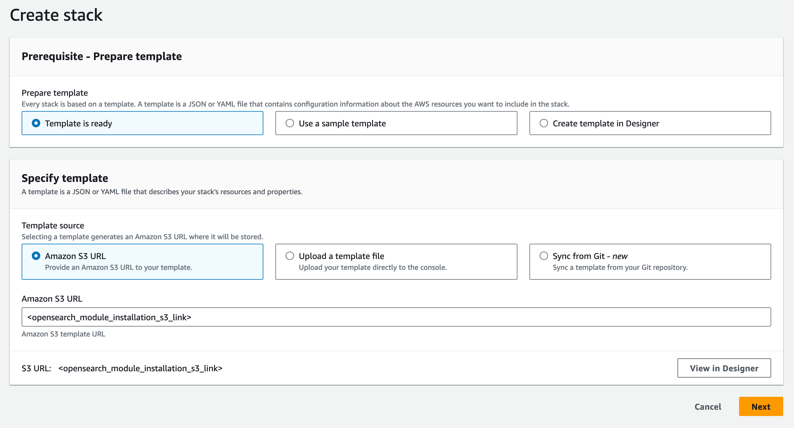
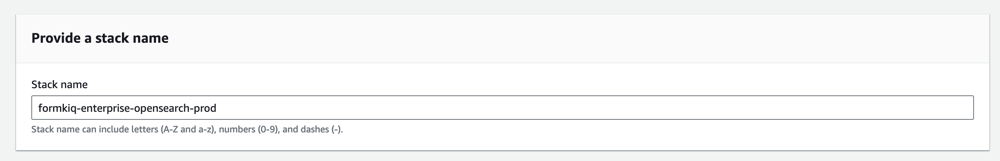

# OpenSearch (Amazon OpenSearch Service)

## Prerequisites

1. **Required Installations**
   - FormKiQ Advanced/Enterprise
   - [VPC Configuration](/docs/getting-started/quick-start#install-vpc)

2. **Service Role Setup**
   Run the following AWS CLI command to enable OpenSearch service role:
   ```bash
   aws iam create-service-linked-role --aws-service-name opensearchservice.amazonaws.com
   ```

## Installation Process

### 1. Select AWS Region
Choose the same region as your FormKiQ installation:

| AWS Region | Location | Install Link |
|------------|----------|--------------|
| us-east-1 | N. Virginia | [Install](https://console.aws.amazon.com/cloudformation/home?region=us-east-1#/stacks/new) |
| us-east-2 | Ohio | [Install](https://console.aws.amazon.com/cloudformation/home?region=us-east-2#/stacks/new) |
| us-west-2 | Oregon | [Install](https://console.aws.amazon.com/cloudformation/home?region=us-west-2#/stacks/new) |
| ca-central-1 | Canada (Central) | [Install](https://console.aws.amazon.com/cloudformation/home?region=ca-central-1#/stacks/new) |
| eu-central-1 | Frankfurt | [Install](https://console.aws.amazon.com/cloudformation/home?region=eu-central-1#/stacks/new) |
| eu-west-1 | Ireland | [Install](https://console.aws.amazon.com/cloudformation/home?region=eu-west-1#/stacks/new) |
| eu-west-3 | Paris | [Install](https://console.aws.amazon.com/cloudformation/home?region=eu-west-3#/stacks/new) |
| ap-south-1 | Mumbai | [Install](https://console.aws.amazon.com/cloudformation/home?region=ap-south-1#/stacks/new) |
| ap-southeast-1 | Singapore | [Install](https://console.aws.amazon.com/cloudformation/home?region=ap-southeast-1#/stacks/new) |
| ap-southeast-2 | Sydney | [Install](https://console.aws.amazon.com/cloudformation/home?region=ap-southeast-2#/stacks/new) |
| ap-northeast-2 | Seoul | [Install](https://console.aws.amazon.com/cloudformation/home?region=ap-northeast-2#/stacks/new) |
| sa-east-1 | São Paulo | [Install](https://console.aws.amazon.com/cloudformation/home?region=sa-east-1#/stacks/new) |

### 2. Create Stack

1. Access CloudFormation console via the installation link
2. Enter the OpenSearch module S3 URL (provided separately)



### 3. Configure Stack Name

Format: `formkiq-enterprise-opensearch-<environment>`
Example: `formkiq-enterprise-opensearch-prod`



## Configuration Parameters

### Basic Configuration

| Parameter | Description | Development Recommendation |
|-----------|-------------|---------------------------|
| AppEnvironment | Environment identifier (dev/staging/prod) | Must match FormKiQ installation |
| Name | Domain name (3-28 chars) | Format: `formkiq-enterprise-<environment>` |
| OpenSearchVersion | OpenSearch version | Latest stable version |

### Instance Configuration

| Parameter | Description | Development Recommendation |
|-----------|-------------|---------------------------|
| DataInstanceCount | Number of data nodes | 1 |
| DataInstanceType | Instance type for data nodes | t3.small.search |
| DataNodeVolumeSize | EBS volume size (GiB) | 10 |

### Dedicated Master Configuration

| Parameter | Description | Development Recommendation |
|-----------|-------------|---------------------------|
| DedicatedMasterEnabled | Enable dedicated master nodes | false |
| DedicatedMasterCount | Number of master nodes | 0 |
| DedicatedMasterType | Master node instance type | t3.small.search |

### Storage Configuration

| Parameter | Description | Recommendation |
|-----------|-------------|----------------|
| EBSVolumeType | EBS volume type | gp3 |
| ZoneAwarenessConfig | Enable zone awareness | Depends on replica requirements |

### Network Configuration

| Parameter | Description | Notes |
|-----------|-------------|--------|
| VpcStackName | VPC stack name | Must match existing VPC stack |
| VpcSubnets | Deployment subnets | Select private subnets only |

:::note
For development with single data node, select only one subnet
:::

## Post-Installation Steps

### 1. Update FormKiQ Stack

1. Select your FormKiQ stack in CloudFormation
2. Click "Update"
3. Choose "Use current template"
4. Set `OpenSearchStackName` to your OpenSearch stack name


### 2. Complete Update

1. Review configuration
2. Navigate through confirmation screens
3. Acknowledge capabilities
4. Submit stack update


## Post-Deployment Notes

- Documents and metadata automatically sync with OpenSearch
- Document content sync requires explicit configuration
- Verify cluster health after deployment
- Monitor resource usage

## Development Configuration Summary

For development environments, recommended settings:
- Single data node (DataInstanceCount: 1)
- t3.small.search instances
- No dedicated master nodes
- 10GB storage
- gp3 volume type
- Single private subnet deployment