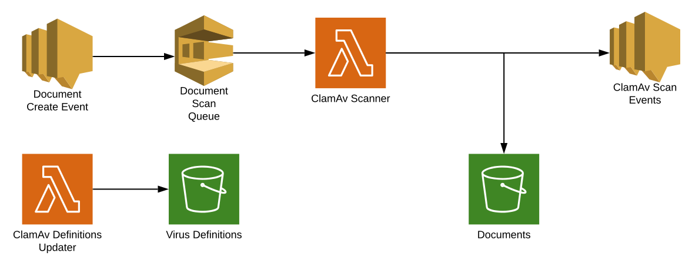

# Anti-Malware / Antivirus

## Overview

The Anti-Malware module provides automated security scanning for all documents in your FormKiQ system using the [ClamAV](http://www.clamav.net) antivirus engine. This module automatically protects your document management system from trojans, viruses, malware, and other malicious threats.

## Key Features

- Automatic scanning of all new documents
- Automated document status tracking
- Scan results tagged on documents

## How It Works

1. Using FormKiQ's Document Events, each newly-created document is automatically added to a ClamAV Scanning SQS queue.

2. An AWS Lambda function for ClamAV virus scanning pulls each document from the SQS queue and scans it for trojans, viruses, malware, and other malicious threats.

3. The results from the scan are:
   - Added as S3 Tags to the document
   - Attached to the document in DynamoDB
   - Posted to a ClamAV Scan Events SNS topic

## Use Cases

### Compliance Requirements
- Meets organizational compliance goals requiring antivirus scanning of all documents
- Provides automated scanning without additional effort

### External Document Processing
- Secures documents received from external sources
- Protects documents processed through:
  - FormKiQ API's public endpoints
  - Optional FormKiQ Add-On Modules (e.g., Document Email Processing)
- Safeguards both stored and exported documents