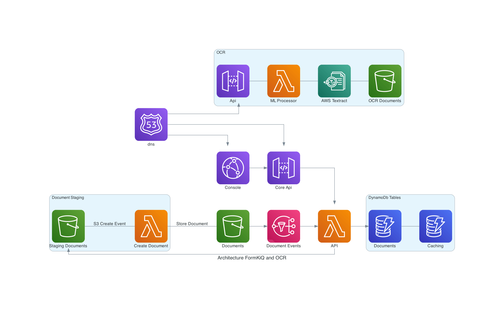

# Enhanced Document OCR and Classification
## (using Amazon Textract, Amazon Bedrock, and Amazon Comprehend)

## Overview

The Enhanced Document OCR module provides advanced document processing capabilities through integration with powerful AWS services. While FormKiQ Core includes Tesseract for basic OCR, this enhanced module leverages Amazon Textract, Bedrock, and Comprehend for sophisticated document processing, classification, and intelligent content extraction.

## Key Features

### Document Processing
- High-accuracy OCR with Amazon Textract
- Multi-document PDF splitting
- PDF portfolio processing
- Intelligent document classification
- Form and table data extraction

### Document Intelligence
- Customizable processing orchestration
- Integration with FormKiQ Mappings
- Amazon Bedrock AI processing
- Amazon Comprehend analysis
- Automated content classification

### Advanced Capabilities
- Add searchable text layers to PDFs
- Extract structured data
- Process handwritten text
- Maintain document formatting
- Generate document metadata

## Document Processing Features

### Multi-Document Handling
- Split PDF compilations into individual documents
- Process PDF portfolios
- Extract embedded documents
- Maintain document relationships
- Automate document organization

### Intelligent Classification
- Automatic document type detection
- Content-based categorization
- Custom classification rules
- Metadata generation
- Hierarchical classification

### Orchestration Options
- FormKiQ Mappings integration
- Amazon Bedrock processing
- Amazon Comprehend analysis
- Custom processing workflows
- Flexible pipeline configuration

## Use Cases

### Document Processing
- Split large document compilations
- Process incoming document packages
- Extract form and table data
- Generate searchable archives

### Intelligent Processing
- Automated document routing
- Content classification
- Data extraction
- Compliance verification

### Document Management
- Organize document collections
- Generate document metadata
- Enable content search
- Maintain document relationships

## Processing Options

### Document Splitting
- Page-based splitting
- Content-based separation
- Portfolio extraction
- Relationship preservation
- Metadata inheritance

### Classification Methods
- Content analysis
- Layout detection
- Metadata examination
- Custom rule processing
- AI-powered classification

### Processing Orchestration
- Sequential processing
- Parallel execution
- Conditional workflows
- Custom mapping rules
- Service integration

## Integration Options

### FormKiQ Mappings
- Custom extraction rules
- Data transformation
- Validation rules
- Output formatting
- Processing logic

### Amazon Bedrock
- AI-powered analysis
- Content understanding
- Pattern recognition
- Custom model integration
- Advanced classification

### Amazon Comprehend
- Natural language processing
- Entity extraction
- Sentiment analysis
- Key phrase detection
- Language detection

## Best Practices

### Document Preparation
- Optimize input quality
- Structure documents appropriately
- Define clear separation points
- Maintain consistent formatting

### Processing Configuration
- Define classification rules
- Configure orchestration workflows
- Set processing priorities
- Optimize resource usage

### Quality Control
- Validate splitting accuracy
- Verify classification results
- Monitor processing success
- Implement error handling

## Technical Considerations

### Performance
- Batch processing optimization
- Resource allocation
- Processing parallelization
- Workflow efficiency

### Integration
- Service coordination
- API utilization
- Error handling
- State management

### Data Management
- Result storage
- Relationship tracking
- Metadata organization
- Version control