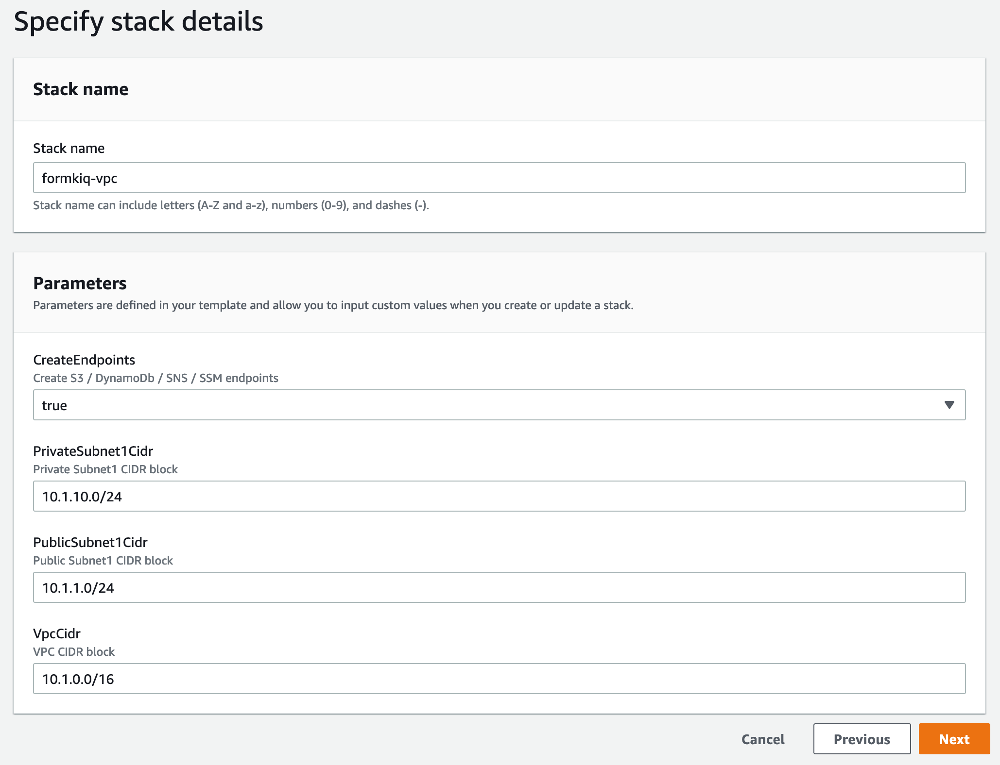

# Enhanced Full-text Document Search

## Overview

The Enhanced Full-text Search module integrates OpenSearch to provide advanced search capabilities for your FormKiQ document management system. This Enterprise Add-On Module extends the built-in search functionality with powerful features including multi-tag parameter searches and full-text queries.


## Key Features

- Advanced full-text search capabilities
- Multiple tag parameter support
- Optional OCR result indexing
- Powerful query capabilities
- Real-time indexing

## Installation Process

<iframe width="560" height="315" src="https://www.youtube.com/embed/brvHNrICnXE" title="YouTube video player" frameborder="0" allow="accelerometer; autoplay; clipboard-write; encrypted-media; gyroscope; picture-in-picture; web-share" allowfullscreen></iframe>

### VPC Setup (Recommended)

For enhanced security, it's recommended to deploy OpenSearch within a VPC. If you're not using a VPC, you can skip this step.

1. Access the CloudFormation console
2. Create a new stack using the VPC template
3. Configure CIDR ranges for your network requirements



:::note
Note the VPC Stack Name for use in OpenSearch configuration
:::

### OpenSearch Installation

1. Access the CloudFormation console
2. Create a new stack for OpenSearch
3. Configure the following parameters:
   - AppEnvironment (must match FormKiQ installation)
   - VpcStackName (if using VPC)
   - Select private subnet CIDRs (if using VPC)

:::note
Note the OpenSearch Stack Name for FormKiQ configuration
:::

### FormKiQ Integration

1. Select your FormKiQ stack in CloudFormation
2. Click "Update Stack"
3. Enter the OpenSearch Stack Name
4. Optionally enter the VPC Stack Name
5. Complete the stack update


## OpenSearch Configuration

### Storage Planning

Calculate storage requirements using the formula:
```
<data size> * (1 + number of replicas) * 1.45 = minimum storage requirement
```

Example for 100GB with 1 replica:
```
100 * (1 + 1) * 1.45 = 290GB
```

### Shard Configuration

Calculate optimal shard count using:
```
<storage requirements> * 1.1 / <shard size>
```

Example for 100GB with 25GB shard size:
```
100 * 1.1 / 25 = 5 shards
```

### Instance Types

#### Data Nodes

| Memory Optimized | vCPU | Memory (GiB) | Price Per hour |
|-----------------|------|--------------|----------------|
| r6g.large.search | 2 | 16 | $0.167 |
| r6g.xlarge.search | 4 | 32 | $0.335 |
| r6g.2xlarge.search | 8 | 64 | $0.669 |

| General Purpose | vCPU | Memory (GiB) | Price Per hour |
|----------------|------|--------------|----------------|
| t3.small.search | 2 | 2 | $0.036 |
| t3.medium.search | 2 | 4 | $0.073 |
| m6g.large.search | 2 | 8 | $0.128 |
| m6g.xlarge.search | 4 | 16 | $0.256 |
| m6g.2xlarge.search | 8 | 32 | $0.511 |

#### Dedicated Master Nodes

| Instance count | RAM size | Max shards | Recommended type |
|---------------|----------|------------|------------------|
| 1 – 10 | 8 GiB | 10K | m5.large.search or m6g.large.search |
| 11 – 30 | 16 GiB | 30K | 5.2xlarge.search or c6g.2xlarge.search |
| 31 – 75 | 32 GiB | 40K | r5.xlarge.search or r6g.xlarge.search |
| 76 – 125 | 64 GiB | 75K | r5.2xlarge.search or r6g.2xlarge.search |
| 126 – 200 | 128 GiB | 75K | r5.4xlarge.search or r6g.4xlarge.search |

## Kibana Integration

Kibana provides powerful visualization and exploration capabilities for your document data.

### Access Configuration

1. Default access through FormKiQ 'Admins' group
2. System access via opensearch_lambda_role
3. Access requires VPN or SSH tunnel setup

### Dashboard Access

1. Find OpenSearch Dashboards URL in AWS Console
2. Configure secure access method (VPN/SSH tunnel)
3. Login with appropriate credentials


:::note
Access requires VPN or SSH tunnel. See:
- [AWS Client VPN Setup](https://docs.aws.amazon.com/vpn/latest/clientvpn-admin/what-is.html)
- [SSH Tunnel Configuration](https://repost.aws/knowledge-center/opensearch-outside-vpc-ssh)
:::

## OpenSearch Repository Snapshots

An OpenSearch snapshot repository is a named location where snapshots are stored and restored. FormKiQ configures all snapshots to use a single S3 bucket, with the siteId as the S3 prefix/folder.

### List all Repositories

Using the **GET /sites/global/opensearch/snapshotRepositories** API will returns every registered snapshot repository.

Using the **GET /sites/:siteId/opensearch/snapshotRepository** will return the snapshot repository for a specific SiteId.

### Creating a Snapshot

Using the **POST /sites/:siteId/opensearch/snapshots/:snapshotName** API, while specifying a name of the snapshot will tell OpenSearch to create a snapshot of the :siteId's index.

The **GET /sites/:siteId/opensearch/snapshots/:snapshotName** API will return the current status of the snapshot.

The **GET /sites/:siteId/opensearch/snapshots** API will return ALL the snapshots for a particular siteId.

### Restoring a Snapshot

To restore a previously taken snapshot, the **POST /sites/:siteId/opensearch/snapshots/:snapshotName/restore** API to a **NEW** index that appends "&lt;snapshot_name&gt;_restored" to the index name.

:::note
The restored index will NOT be used unless you set the SiteId's Index using the PUT /sites/:siteId/opensearch/indices
:::

### Setting SiteId Index

You can override a SiteId's default index using the **PUT /sites/:siteId/opensearch/indices with body &lbrace; "indexName": "&lt;name&gt;" &rbrace;**

Getting a SiteId's current index configuration can be retrieved using the **GET /sites/:siteId/opensearch/indices**


For detailed pricing information and configuration examples, see our [Cost Analysis Guide](/docs/platform/costs#opensearch-service-costs).