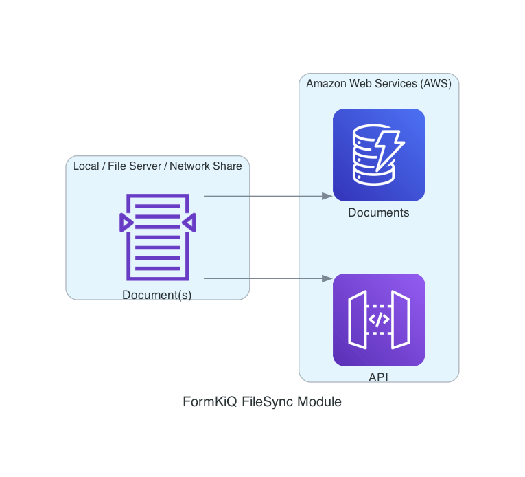
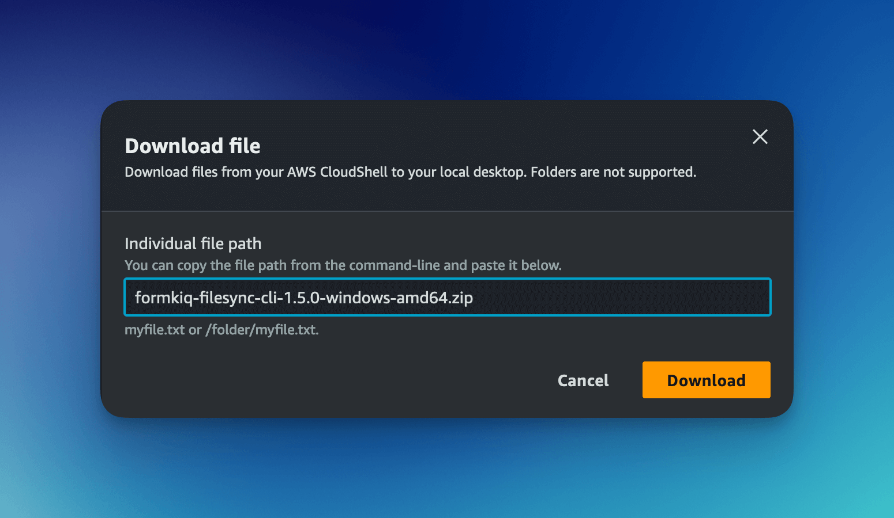
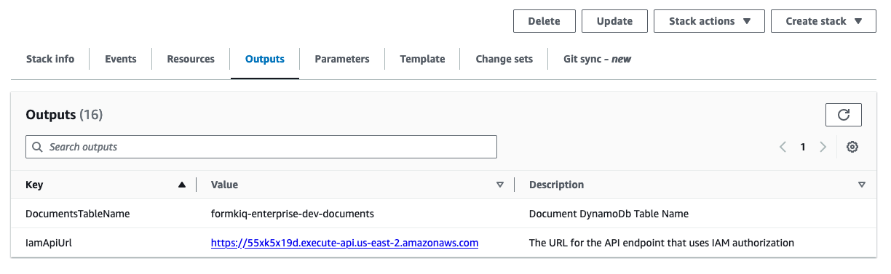
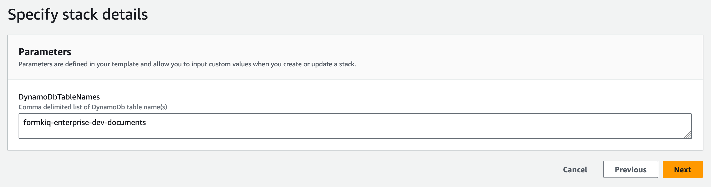
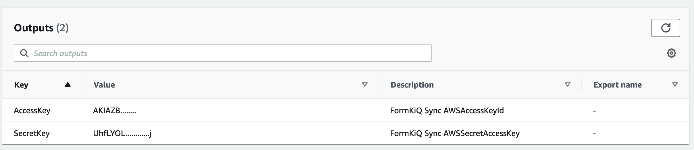

# FileSync CLI

## Overview

The FileSync CLI is an Enterprise Add-On Module that enables:
- Document / Attribute Importing through CSV files
- Document synchronization between local file systems and FormKiQ
- Document synchronization with OpenSearch
- Automated file monitoring and sync



## Installation

The FileSync CLI is available as part of your FormKiQ Essentials, Advanced or Enterprise installations.

The CLI is available for 3 different platforms, available from your custom FormKiQ S3 bucket. 

| Platform | Location |
|----------|-----------|
| Windows | s3://YOUR-FORMKIQ-S3-BUCKET/cli/formkiq-filesync-cli-VERSION-windows-amd64.zip |
| Linux | s3://YOUR-FORMKIQ-S3-BUCKET/cli/formkiq-filesync-cli-VERSION-linux-amd64.zip |
| macOS | s3://YOUR-FORMKIQ-S3-BUCKET/cli/formkiq-filesync-cli-VERSION-darwin-amd64.zip |

### Installation Steps

- Open [AWS CloudShell](https://console.aws.amazon.com/cloudshell/home)

- Copy CLI artifact:
```bash
aws s3 cp s3://YOUR-FORMKIQ-S3-BUCKET/cli/formkiq-filesync-cli-VERSION-windows-amd64.zip .
```

- Download file through CloudShell Actions menu



### Static Credentials (deprecated)

CLI comes with a CloudFormation script that can generate IAM Static Credentials. 

- Access your [AWS CloudFormation Console](https://console.aws.amazon.com/cloudformation)
- Locate your FormKiQ installation
- Note the following from Stack Outputs:
   - `IamApiUrl`
   - `DocumentsTableName`



- Create a new CloudFormation stack for FileSync CLI
- Configure stack parameters:
   - Stack Name
   - Comma-delimited list of FormKiQ DocumentsTable ARN(s)



- Note the `AccessKey` and `SecretKey` from stack Outputs



:::note
FileSync CLI supports multiple FormKiQ installations
:::

## Usage

```
usage: fk
    --configure          configure AWS credentials
    --delete-documents   Delete documents
    --delete-site        Delete Site
    --import            Import csv file
    --list              list document ids
    --show              show sync profiles
    --sync              sync files with FormKiQ
    --sync-dynamodb     sync documents between dynamodb tables
    --sync-opensearch   sync documents with Opensearch
    --watch             watch directories for file changes
```

The FileSync CLI requires to be run with the following IAM permissions:

- execute-api:Invoke
- kms:Encrypt
- kms:Decrypt
- kms:GenerateDataKey
- cloudformation:ListStacks
- cloudformation:DescribeStacks

The following IAM permissions to the FormKiQ DynamoDb tables
- dynamodb:BatchGetItem
- dynamodb:DeleteItem
- dynamodb:GetItem
- dynamodb:Query
- dynamodb:Scan
- dynamodb:UpdateItem
- dynamodb:BatchWriteItem

## --configure

Below the CLI can be used, it needs to be connected to your FormKiQ installation.

### CloudShell

When running the CLI using CloudShell you can use the command

```bash
fk --configure --app-environment FORMKIQ_APP_ENVIRONMENT \
               --region AWS_REGION
```

### AWS CLI

If your environment is configured using the [AWS CLI](https://docs.aws.amazon.com/cli/v1/userguide/cli-chap-configure.html)

```bash
fk --configure --aws-profile AWS_PROFILE \
               --region AWS_REGION \
               --app-environment FORMKIQ_APP_ENVIRONMENT
```

### Static Credentials

Specify FormKiQ App Environment:

```bash
fk --configure --access-key ACCESS_KEY \
               --secret-key ACCESS_SECRET \
               --region AWS_REGION \
               --app-environment FORMKIQ_APP_ENVIRONMENT
```

### CloudFormation Configuration (deprecated)

Required information:
- Access Key and Secret Key from FileSync CLI stack
- DocumentsStageS3Bucket from FormKiQ stack
- AWS Region of installation

Basic configuration:
```bash
fk --configure --access-key ACCESS_KEY \
               --secret-key ACCESS_SECRET \
               --region AWS_REGION \
               --iam-api-url IAM_API_URL \
               --documents-dynamodb-tablename DOCUMENTS_TABLE_NAME
```

With profile:
```bash
fk --configure --access-key ACCESS_KEY \
               --secret-key ACCESS_SECRET \
               --region AWS_REGION \
               --iam-api-url IAM_API_URL \
               --documents-dynamodb-tablename DOCUMENTS_TABLE_NAME \
               --profile dev
```

### --show

The --show command will list the CLI configurations.

```bash
fk --show
```

## --import

The CLI includes a built-in CSV importer for quickly bulk-loading:

- **Attributes**  
- **Documents**  
- **Document Content**  
- **Document Attributes**  

### Import Attributes

Bulk define or update the metadata fields (attributes) that can later be applied to your documents.

* AttributeKey: the unique key for the attribute

* DataType: data type of the attribute (e.g. STRING, NUMBER, BOOLEAN, KEY_ONLY)

* Type: classification of the attribute (STANDARD, GOVERNANCE, OPA)

#### CSV Format

```csv
AttributeKey,DataType,Type
status,STRING,STANDARD
priority,NUMBER,STANDARD
...
```

#### Command

```bash
fk --import-csv --attributes <attributes-file.csv>
```

### Import Documents

Bulk register documents (by UUID, path, content type, and optional deep-link) into FormKiQ.

* DocumentId: unique UUID identifier for the document

:::note
For DocumentId, you can create any UUID v4 for use in this column (UUID v4 is supported by all major programming languages). That ID will be imported into FormKiQ as FormKiQ's `documentId` property; this is how you can prevent duplicate uploads when re-processing the CSV)

You can also generate a list of UUIDs in advance using a tool such as https://www.uuidgenerator.net/
:::

* Path: virtual path within FormKiQ (must start with /)

* ContentType: MIME type of the document

* DeepLink: (optional) URL to access the document directly

#### CSV Format

```csv
DocumentId,Path,ContentType,DeepLink
550e8400-e29b-41d4-a716-446655440000,/invoices/2025/05/001.pdf,application/pdf,
123e4567-e89b-12d3-a456-426614174000,/reports/2025/Q1.xlsx,application/vnd.openxmlformats-officedocument.spreadsheetml.sheet,
...
```

#### Command

```bash
fk --import-csv --documents <documents-file.csv>
```

### Import Document Contents

Bulk upload or link the actual binary content of your documents into FormKiQ from your local filesystem or an S3 bucket.

* DocumentId: must match an existing document’s UUID

* Location: local filesystem path or S3 URI to the document file

#### CSV Format

```csv
DocumentId,Location
550e8400-e29b-41d4-a716-446655440000,/path/to/file.pdf
123e4567-e89b-12d3-a456-426614174000,s3://my-bucket/documents/report.xlsx
...
```

#### Command

```bash
fk --import-csv --document-contents <document-contents-file.csv>
```

### Import Document Attributes

Bulk assign attribute values to existing documents.

* DocumentId: must match an existing document’s UUID

* AttributeKey: must match a defined attribute

* StringValue / NumberValue / BooleanValue: supply exactly one value type per row; leave the others blank

#### CSV Format

```csv
DocumentId,AttributeKey,StringValue,NumberValue,BooleanValue
550e8400-e29b-41d4-a716-446655440000,status,approved,,
550e8400-e29b-41d4-a716-446655440000,priority,,5,
123e4567-e89b-12d3-a456-426614174000,reviewed,,,
123e4567-e89b-12d3-a456-426614174000,isPublished,,,true
...
```

#### Command

```bash
fk --import-csv --document-attributes <doc-attrs-file.csv>
```

## --sync

### Basic Sync
```bash
fk --sync -d /documents --verbose
```

### S3 Sync
```bash
fk --sync -d s3://myBucket/documents --verbose
```

### Time-based Sync
```bash
# Last 24 hours
fk --sync -d /documents --verbose --mtime 0

# Older than 7 days
fk --sync -d /documents --verbose --mtime 7

# Last 30 days
fk --sync -d /documents --verbose --mtime -30
```

### Actions Sync
```bash
fk --sync --actions '[
  {
    "type": "OCR",
    "parameters": {
      "ocrParseTypes": "TABLES"
    }
  },
  {
    "type": "FULLTEXT"
  },
  {
    "type": "WEBHOOK",
    "parameters": {
      "url": "https://pipedream.com/12345"
    }
  }
]' -d /documents --verbose
```

### Watch Mode
```bash
fk --watch -d /documents --verbose
```

### Pre-Hook Integration

The `--pre-hook` parameter enables document-specific customization during sync.

Request Format:
```json
{
    "path": "<filename>",
    "config": {
        "directory": "<directory>",
        "actions": "<actions>",
        "siteId": "<siteId>",
        "stagebucket": "<stagingbucket>"
    }
}
```

Response Example:
```json
{
  "tags": [
    {
      "key": "category",
      "value": "document"
    },
    {
      "key": "user",
      "values": ["1", "2"]
    }
  ],
  "metadata": [
    {
      "key": "property1",
      "value": "value1"
    }
  ]
}
```

## --sync-dynamodb
```bash
fk --sync-dynamodb \
    --source formkiq-enterprise-dev1-documents \
    --destination formkiq-enterprise-dev2-documents
```

## --sync-opensearch

```bash
# Sync specific documents
fk --sync-opensearch --document-ids 2def5ec0-0d6e-4912-916d-cdfca99575c9 -v

# Sync all documents
fk --sync-opensearch --document-ids all -v

# Sync with content
fk --sync-opensearch --document-ids all --content -v
```

## Document Management

### List Documents
```bash
fk --list --limit 100
```

### Delete Documents
```bash
# Generate list
fk --list > documents.txt

# Delete documents
fk --delete-documents --file documents.txt
```