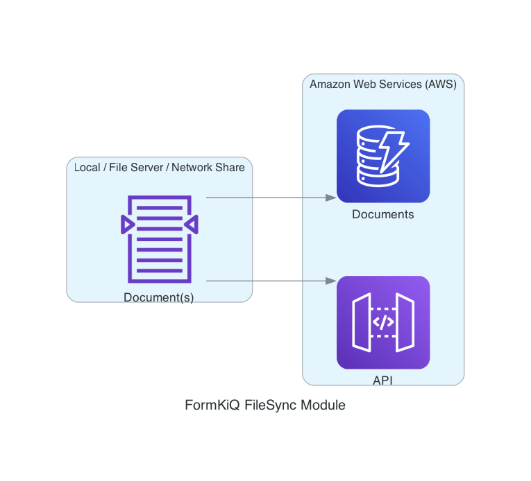
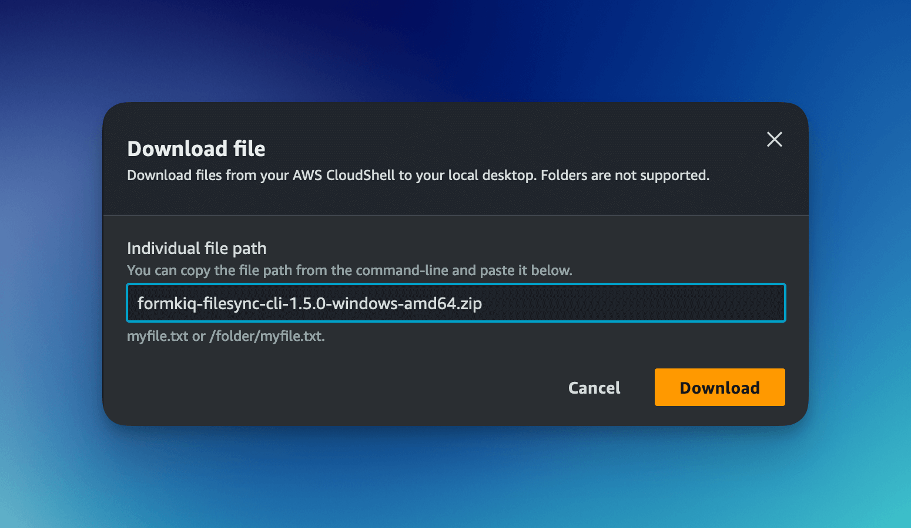

# FileSync CLI

## Overview

The FileSync CLI is a FormKiQ commercial module for moving files and document metadata into, between, and around FormKiQ environments.

Use it when you need to:

- Sync files from a local directory or S3 location into FormKiQ.
- Watch a local directory and upload new or changed files.
- Import documents, attributes, document content, and document attributes from CSV files.
- Copy FormKiQ document metadata between DynamoDB tables.
- Sync or verify migrated documents in OpenSearch.
- List, delete, purge, or remove large sets of documents.



## Before You Begin

Confirm you have:

- A FormKiQ Essentials, Advanced, or Enterprise installation.
- Access to the FormKiQ deployment's AWS account and Region.
- Access to the custom FormKiQ S3 bucket that contains the FileSync CLI package.
- The FormKiQ `IamApiUrl` and `DocumentsTableName` stack outputs, or permission to let the CLI discover them from CloudFormation.
- AWS credentials or an AWS profile with the permissions required for the workflows you plan to run.

:::note
Use an AWS profile or CloudShell role where possible. Static access keys are supported for older workflows but should be treated as deprecated.
:::

## Install the CLI

The CLI package is available from your custom FormKiQ S3 bucket.

| Platform | Location |
| --- | --- |
| Linux | `s3://YOUR-FORMKIQ-S3-BUCKET/cli/formkiq-filesync-cli-VERSION-linux-amd64.zip` |
| macOS | `s3://YOUR-FORMKIQ-S3-BUCKET/cli/formkiq-filesync-cli-VERSION-darwin-amd64.zip` |
| Windows | `s3://YOUR-FORMKIQ-S3-BUCKET/cli/formkiq-filesync-cli-VERSION-windows-amd64.zip` |

### CloudShell

Open [AWS CloudShell](https://console.aws.amazon.com/cloudshell/home) in the same AWS account and Region as your FormKiQ deployment, then copy the Linux artifact:

```bash
aws s3 cp s3://YOUR-FORMKIQ-S3-BUCKET/cli/formkiq-filesync-cli-VERSION-linux-amd64.zip .
```

Download the file through the CloudShell Actions menu.



After extracting the package, verify the executable:

```bash
fk --help
```

## Configure a FormKiQ Profile

Before using the CLI, configure a FormKiQ profile. Profiles are stored locally and contain the FormKiQ API URL, DynamoDB table name, Region, and AWS credential source.

### CloudShell or AWS Role

Use this when your shell already has AWS permissions through an attached role:

```bash
fk --configure \
  --app-environment FORMKIQ_APP_ENVIRONMENT \
  --region AWS_REGION
```

### AWS Named Profile

Use this when your workstation is already configured with the AWS CLI:

```bash
fk --configure \
  --aws-profile AWS_PROFILE \
  --region AWS_REGION \
  --app-environment FORMKIQ_APP_ENVIRONMENT
```

### Static Credentials

Use static credentials only when an AWS role or named profile is not available:

```bash
fk --configure \
  --access-key ACCESS_KEY \
  --secret-key ACCESS_SECRET \
  --region AWS_REGION \
  --app-environment FORMKIQ_APP_ENVIRONMENT
```

### Manual Configuration

If CloudFormation discovery is not available, provide the FormKiQ API URL and DynamoDB table name directly:

```bash
fk --configure \
  --access-key ACCESS_KEY \
  --secret-key ACCESS_SECRET \
  --region AWS_REGION \
  --iam-api-url IAM_API_URL \
  --documents-dynamodb-tablename DOCUMENTS_TABLE_NAME
```

Create a named profile with `--profile`:

```bash
fk --configure \
  --aws-profile AWS_PROFILE \
  --region AWS_REGION \
  --app-environment FORMKIQ_APP_ENVIRONMENT \
  --profile dev
```

### Verify Configuration

Check the default profile connection:

```bash
fk --status
```

List configured profiles:

```bash
fk --show
```

:::note
The current `--status` command checks the default profile.
:::

## Common Workflows

### Sync Files to FormKiQ

Sync a local directory:

```bash
fk --sync \
  --dir /documents \
  --siteId default \
  --recursive \
  --verbose
```

Sync from an S3 location:

```bash
fk --sync \
  --dir s3://my-bucket/documents \
  --siteId default \
  --recursive \
  --verbose
```

Limit files by name pattern:

```bash
fk --sync \
  --dir /documents \
  --siteId default \
  --recursive \
  --include "*.pdf" \
  --verbose
```

Run a dry run before uploading:

```bash
fk --sync \
  --dir /documents \
  --siteId default \
  --recursive \
  --dry-run
```

Add document actions during sync:

```bash
fk --sync \
  --dir /documents \
  --siteId default \
  --actions '[
    {
      "type": "OCR",
      "parameters": {
        "ocrParseTypes": "TABLES"
      }
    },
    {
      "type": "FULLTEXT"
    }
  ]'
```

Use a pre-hook to add document-specific tags or actions:

```bash
fk --sync \
  --dir /documents \
  --siteId default \
  --pre-hook https://example.com/formkiq-filesync-hook
```

The pre-hook receives:

```json
{
  "path": "/documents/invoice-001.pdf",
  "config": {
    "directory": "/documents",
    "actions": "",
    "siteId": "default"
  }
}
```

The pre-hook can return `tags` and `actions`:

```json
{
  "tags": [
    {
      "key": "category",
      "value": "invoice"
    },
    {
      "key": "department",
      "values": ["finance", "operations"]
    }
  ],
  "actions": [
    {
      "type": "FULLTEXT"
    }
  ]
}
```

### Watch a Directory

Use watch mode to upload files when they are created or changed:

```bash
fk --watch \
  --dir /documents \
  --siteId default \
  --recursive \
  --syncDelay 2 \
  --verbose
```

### Import Data from CSV

The CSV importer supports attributes, documents, document content, and document attributes.

:::note
For large imports, review [Scaling FormKiQ Components](/docs/platform/overview#scaling-formkiq-components) before running production imports.
:::

#### Import Attributes

CSV format:

```csv
AttributeKey,DataType,Type
status,STRING,STANDARD
priority,NUMBER,STANDARD
reviewed,BOOLEAN,STANDARD
```

Command:

```bash
fk --import-csv \
  --attributes attributes.csv \
  --site-id default
```

#### Import Documents

CSV format:

```csv
DocumentId,Path,ContentType,DeepLink
550e8400-e29b-41d4-a716-446655440000,/invoices/2025/05/001.pdf,application/pdf,
123e4567-e89b-12d3-a456-426614174000,/reports/2025/Q1.xlsx,application/vnd.openxmlformats-officedocument.spreadsheetml.sheet,
```

Command:

```bash
fk --import-csv \
  --documents documents.csv \
  --site-id default
```

`DocumentId` must be a UUID. Reusing the same ID lets you rerun an import without creating duplicate documents.

#### Import Document Content

CSV format:

```csv
DocumentId,Location
550e8400-e29b-41d4-a716-446655440000,/path/to/file.pdf
123e4567-e89b-12d3-a456-426614174000,s3://my-bucket/documents/report.xlsx
```

Command:

```bash
fk --import-csv \
  --document-contents document-contents.csv \
  --site-id default
```

Use `--mime-extract` when the source content is a MIME file and the CLI should upload the extracted document part.

#### Import Document Attributes

CSV format:

```csv
DocumentId,AttributeKey,StringValue,NumberValue,BooleanValue
550e8400-e29b-41d4-a716-446655440000,status,approved,,
550e8400-e29b-41d4-a716-446655440000,priority,,5,
123e4567-e89b-12d3-a456-426614174000,isPublished,,,true
```

Command:

```bash
fk --import-csv \
  --document-attributes document-attributes.csv \
  --site-id default
```

#### Verify CSV Imports

Run the same import command with `--verify` to compare the CSV data with FormKiQ:

```bash
fk --import-csv \
  --documents documents.csv \
  --site-id default \
  --verify
```

### Migrate or Restore DynamoDB Metadata

Use `--restore-dynamodb` to copy items from one FormKiQ DynamoDB document table to another.

```bash
fk --restore-dynamodb \
  --from-table SOURCE_DOCUMENTS_TABLE \
  --to-table TARGET_DOCUMENTS_TABLE \
  --profile default \
  --thread-count 16
```

Restore selected partition keys:

```bash
fk --restore-dynamodb \
  --from-table SOURCE_DOCUMENTS_TABLE \
  --to-table TARGET_DOCUMENTS_TABLE \
  --profile default \
  --pk "site#default#document#example-document-id"
```

:::caution
`--restore-dynamodb` performs direct DynamoDB writes. Use it only when source and target tables have compatible key schema and item structure. Prefer restoring into an empty or controlled target table.
:::

For a complete migration flow, see [Migrate Documents from Core to Enterprise](/docs/how-tos/migration-core-to-enterprise).

### Sync OpenSearch

Generate a document ID file from the target site:

```bash
fk --list-documents \
  --site-id default \
  --limit 1000 > document-ids.txt
```

Sync documents into OpenSearch:

```bash
fk --sync-opensearch \
  --site-id default \
  --file document-ids.txt \
  --content \
  --profile default
```

Verify documents exist in OpenSearch:

```bash
fk --sync-opensearch-verify \
  --site-id default \
  --file document-ids.txt \
  --profile default
```

### Bulk Document Operations

List document IDs:

```bash
fk --list-documents \
  --site-id default \
  --limit 1000 > document-ids.txt
```

Delete documents from a file:

```bash
fk --delete-documents \
  --site-id default \
  --file document-ids.txt \
  --limit 1000
```

Purge documents from a file:

```bash
fk --purge-documents \
  --site-id default \
  --file document-ids.txt \
  --limit 1000
```

Delete all data for a site:

```bash
fk --delete-site \
  --site-id SITE_ID \
  --dry-run
```

Run without `--dry-run` only after confirming the site ID and backup plan.

### Import Amazon Comprehend Output

Use `--import-comprehend` to import classified documents from Amazon Comprehend output stored in S3.

```bash
fk --import-comprehend \
  --site-id default \
  --output-data-s3uri s3://bucket/comprehend-output/output.tar.gz \
  --documents-s3uri s3://bucket/source-documents/
```

Add `--split-by-class-name` to split imported documents by Comprehend class name.

### Run Data Migrations

Use `--data-migration --path-gsi2` to backfill the folder/path GSI2 index for a site.

```bash
fk --data-migration \
  --path-gsi2 \
  --site-id default \
  --profile default
```

## Command Reference

| Command | Purpose | Key options |
| --- | --- | --- |
| `--configure` | Configure a FormKiQ profile. | `--region`, `--app-environment`, `--aws-profile`, `--access-key`, `--secret-key`, `--iam-api-url`, `--documents-dynamodb-tablename`, `--profile` |
| `--status` | Test the default FormKiQ profile connection. | `--insecure` |
| `--show` | List configured profiles. | None |
| `--sync` | Upload files from local storage or S3. | `--dir`, `--siteId`, `--recursive`, `--include`, `--actions`, `--pre-hook`, `--dry-run`, `--profile` |
| `--watch` | Watch a local directory and upload changed files. | `--dir`, `--siteId`, `--recursive`, `--syncDelay`, `--include`, `--dry-run`, `--profile` |
| `--import-csv` | Import CSV data. | `--attributes`, `--documents`, `--document-contents`, `--document-attributes`, `--site-id`, `--verify`, `--delimiter`, `--limit`, `--profile` |
| `--restore-dynamodb` | Copy DynamoDB items from one table to another. | `--from-table`, `--to-table`, `--pk`, `--thread-count`, `--profile` |
| `--list-documents` | List document IDs for a site. | `--site-id`, `--limit`, `--profile` |
| `--sync-opensearch` | Sync document records into OpenSearch. | `--site-id`, `--file`, `--content`, `--dry-run`, `--profile` |
| `--sync-opensearch-verify` | Verify document records in OpenSearch. | `--site-id`, `--file`, `--profile` |
| `--delete-documents` | Delete documents listed in a file. | `--site-id`, `--file`, `--limit`, `--insecure` |
| `--purge-documents` | Purge documents listed in a file. | `--site-id`, `--file`, `--limit`, `--insecure` |
| `--delete-site` | Delete a site and related document/search data. | `--site-id`, `--dry-run`, `--profile` |
| `--import-comprehend` | Import Amazon Comprehend output. | `--output-data-s3uri`, `--documents-s3uri`, `--site-id`, `--split-by-class-name`, `--profile` |
| `--data-migration --path-gsi2` | Backfill folder/path GSI2 index records. | `--site-id`, `--profile` |

## Permissions

The exact permissions depend on the workflow.

### Configuration and Status

- `cloudformation:ListStacks`
- `cloudformation:DescribeStacks`
- `execute-api:Invoke`
- `dynamodb:Query`

### Sync and CSV Import

- `execute-api:Invoke`
- `s3:GetObject`
- `s3:PutObject`
- `s3:ListBucket`
- `kms:Encrypt`
- `kms:Decrypt`
- `kms:GenerateDataKey`

### DynamoDB Restore and Data Migration

- `dynamodb:DescribeTable`
- `dynamodb:Scan`
- `dynamodb:Query`
- `dynamodb:BatchWriteItem`
- `dynamodb:UpdateItem`

### Bulk Delete and Site Cleanup

- `execute-api:Invoke`
- `dynamodb:DeleteItem`
- `dynamodb:Query`
- `dynamodb:Scan`
- `dynamodb:UpdateItem`

## Troubleshooting

| Problem | Likely cause | What to check |
| --- | --- | --- |
| `profile 'default' not found` | The CLI has not been configured or the wrong profile is being used. | Run `fk --configure`, then `fk --show`. |
| API connection fails | Incorrect `IamApiUrl`, Region, credentials, or API permissions. | Run `fk --status` and confirm `execute-api:Invoke`. |
| DynamoDB connection fails | Incorrect table name, Region, or DynamoDB permissions. | Confirm the `DocumentsTableName` output and DynamoDB permissions. |
| S3 uploads fail | Missing S3 or KMS permissions. | Confirm bucket access and `kms:Encrypt`, `kms:Decrypt`, and `kms:GenerateDataKey`. |
| CSV import creates errors | Missing required CSV headers or invalid document IDs. | Confirm headers match the required format and `DocumentId` values are UUIDs. |
| OpenSearch sync does not show documents | The document ID file is missing IDs or sync did not run for the expected site. | Regenerate the file with `fk --list-documents --site-id SITE_ID` and rerun sync. |
| Large imports are slow or throttled | Thread count, API capacity, DynamoDB capacity, or downstream processing limits. | Reduce concurrency, import in batches, and review scaling settings. |

## Related Guides

- [Migrate Documents from Core to Enterprise](/docs/how-tos/migration-core-to-enterprise)
- [Migration and Data Import](/docs/platform/migration-and-data-import)
- [Documents](/docs/features/documents)
- [Search](/docs/features/search)
