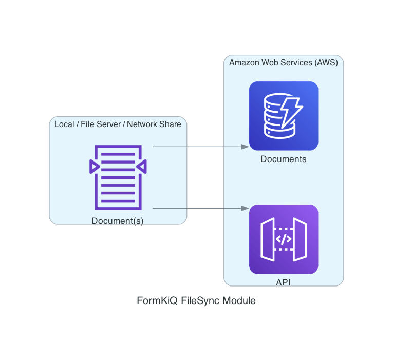

# FormKiQ CLI

## Overview

The FormKiQ CLI is a FormKiQ commercial module for moving files and document metadata into, between, and around FormKiQ environments.

Use it when you need to:

- Sync files from a local directory or S3 location into FormKiQ.
- Watch a local directory and upload new or changed files.
- Import documents, attributes, document content, document attributes, and site group permissions
  from CSV files.
- Export and import site configuration such as attributes, schemas, workflows, rulesets, mappings, locales, entity types, and entities.
- Copy FormKiQ document metadata between DynamoDB tables.
- Sync or verify migrated documents in OpenSearch.
- List, inspect, back up, and restore OpenSearch snapshots.
- List, delete, purge, or remove large sets of documents.



## Before You Begin

Confirm you have:

- A FormKiQ Essentials, Advanced, or Enterprise installation.
- Access to the FormKiQ deployment's AWS account and Region.
- Access to the [FormKiQ CLI GitHub releases](https://github.com/formkiq/formkiq-cli/releases/latest).
- The FormKiQ `IamApiUrl` and `DocumentsTableName` stack outputs, or permission to let the CLI discover them from CloudFormation.
- AWS credentials or an AWS profile with the permissions required for the workflows you plan to run.

:::note
Use an AWS profile or CloudShell role where possible. Static access keys are supported for older workflows but should be treated as deprecated.
:::

## Install the CLI

The FormKiQ CLI binaries are published as release assets in the public [formkiq/formkiq-cli](https://github.com/formkiq/formkiq-cli) repository.

| Platform | Download |
| --- | --- |
| Linux | Download the Linux asset from the [latest FormKiQ CLI release](https://github.com/formkiq/formkiq-cli/releases/latest). |
| macOS | Download the macOS asset from the [latest FormKiQ CLI release](https://github.com/formkiq/formkiq-cli/releases/latest). |
| Windows | Download the Windows asset from the [latest FormKiQ CLI release](https://github.com/formkiq/formkiq-cli/releases/latest). |

### CloudShell

Open [AWS CloudShell](https://console.aws.amazon.com/cloudshell/home) in the same AWS account and Region as your FormKiQ deployment, then download the Linux release asset from GitHub. Copy the asset URL from the [latest FormKiQ CLI release](https://github.com/formkiq/formkiq-cli/releases/latest), then run:

```bash
curl -L -o formkiq-cli.zip "PASTE_LINUX_RELEASE_ASSET_URL"
unzip formkiq-cli.zip
chmod +x fk
```

After extracting the package, verify the executable:

```bash
./fk --help
```

## Configure a FormKiQ Profile

Before using the CLI, configure a FormKiQ profile. Profiles are stored locally and contain the FormKiQ API URL, DynamoDB table name, Region, and AWS credential source.

### CloudShell or AWS Role

Use this when your shell already has AWS permissions through an attached role:

```bash
fk --configure \
  --app-environment FORMKIQ_APP_ENVIRONMENT \
  --region AWS_REGION
```

### AWS Named Profile

Use this when your workstation is already configured with the AWS CLI:

```bash
fk --configure \
  --aws-profile AWS_PROFILE \
  --region AWS_REGION \
  --app-environment FORMKIQ_APP_ENVIRONMENT
```

### Static Credentials

Use static credentials only when an AWS role or named profile is not available:

```bash
fk --configure \
  --access-key ACCESS_KEY \
  --secret-key ACCESS_SECRET \
  --region AWS_REGION \
  --app-environment FORMKIQ_APP_ENVIRONMENT
```

### Manual Configuration

If CloudFormation discovery is not available, provide the FormKiQ API URL and DynamoDB table name directly:

```bash
fk --configure \
  --access-key ACCESS_KEY \
  --secret-key ACCESS_SECRET \
  --region AWS_REGION \
  --iam-api-url IAM_API_URL \
  --documents-dynamodb-tablename DOCUMENTS_TABLE_NAME
```

Create a named profile with `--profile`:

```bash
fk --configure \
  --aws-profile AWS_PROFILE \
  --region AWS_REGION \
  --app-environment FORMKIQ_APP_ENVIRONMENT \
  --profile dev
```

### S3 VPC Endpoint

If the CLI runs in a network where public S3 endpoints are blocked, add the regional S3 interface
VPC endpoint to the profile during configuration:

```bash
fk --configure \
  --aws-profile AWS_PROFILE \
  --region ap-southeast-1 \
  --app-environment FORMKIQ_APP_ENVIRONMENT \
  --s3-endpoint-url https://vpce-123.s3.ap-southeast-1.vpce.amazonaws.com
```

The endpoint is stored as `s3_endpoint_url` in the selected FormKiQ profile. You can override the
profile value for an individual document content import by supplying `--s3-endpoint-url` on the
import command.

### Verify Configuration

Check the default profile connection:

```bash
fk --status
```

List configured profiles:

```bash
fk --show
```

:::note
The current `--status` command checks the default profile.
:::

## Common Workflows

### Sync Files to FormKiQ

Sync a local directory:

```bash
fk --sync \
  --dir /documents \
  --siteId default \
  --recursive \
  --verbose
```

Sync from an S3 location:

```bash
fk --sync \
  --dir s3://my-bucket/documents \
  --siteId default \
  --recursive \
  --verbose
```

Limit files by name pattern:

```bash
fk --sync \
  --dir /documents \
  --siteId default \
  --recursive \
  --include "*.pdf" \
  --verbose
```

Run a dry run before uploading:

```bash
fk --sync \
  --dir /documents \
  --siteId default \
  --recursive \
  --dry-run
```

Add document actions during sync:

```bash
fk --sync \
  --dir /documents \
  --siteId default \
  --actions '[
    {
      "type": "OCR",
      "parameters": {
        "ocrParseTypes": "TABLES"
      }
    },
    {
      "type": "FULLTEXT"
    }
  ]'
```

Use a pre-hook to add document-specific tags or actions:

```bash
fk --sync \
  --dir /documents \
  --siteId default \
  --pre-hook https://example.com/formkiq-filesync-hook
```

The pre-hook receives:

```json
{
  "path": "/documents/invoice-001.pdf",
  "config": {
    "directory": "/documents",
    "actions": "",
    "siteId": "default"
  }
}
```

The pre-hook can return `tags` and `actions`:

```json
{
  "tags": [
    {
      "key": "category",
      "value": "invoice"
    },
    {
      "key": "department",
      "values": ["finance", "operations"]
    }
  ],
  "actions": [
    {
      "type": "FULLTEXT"
    }
  ]
}
```

### Watch a Directory

Use watch mode to upload files when they are created or changed:

```bash
fk --watch \
  --dir /documents \
  --siteId default \
  --recursive \
  --syncDelay 2 \
  --verbose
```

### Import Data from CSV

The CSV importer supports attributes, documents, document content, document attributes, and site
group permissions.

:::note
For large imports, review [Scaling FormKiQ Components](/docs/platform/overview#scaling-formkiq-components) before running production imports.
:::

#### Import Attributes

CSV format:

```csv
AttributeKey,DataType,Type
status,STRING,STANDARD
priority,NUMBER,STANDARD
reviewed,BOOLEAN,STANDARD
reviewDate,DATE,STANDARD
```

Command:

```bash
fk --import-csv \
  --attributes attributes.csv \
  --site-id default
```

#### Import Documents

CSV format:

```csv
DocumentId,Path,ContentType,DeepLink,Artifacts,ArtifactCategory,ResourceType
550e8400-e29b-41d4-a716-446655440000,/invoices/2025/05/001.pdf,application/pdf,,true,,DOCUMENT
123e4567-e89b-12d3-a456-426614174000,/reports/2025/Q1.xlsx,application/vnd.openxmlformats-officedocument.spreadsheetml.sheet,https://example.com/reports/Q1,,quarterly-report,DEEP_LINK
```

| Column | Required | Description |
| --- | --- | --- |
| `DocumentId` | Yes | UUID v4 for the document. Reuse the same ID to rerun an import without creating a duplicate. |
| `Path` | Yes | Virtual FormKiQ path or document name. |
| `ContentType` | Yes | Document MIME type. The value may be empty. |
| `DeepLink` | Yes | External URL for the document. The value may be empty. |
| `Artifacts` | No | Whether the document supports artifact documents. Accepted values are `true` and `false`. |
| `ArtifactCategory` | No | Artifact category assigned to the document. |
| `ResourceType` | No | Document resource type. Accepted values are `DOCUMENT`, `DOSSIER`, and `DEEP_LINK`. |

CSV headers are case-sensitive. `Artifacts`, `ArtifactCategory`, and `ResourceType` can be omitted entirely, so the existing four-column `documents.csv` format remains valid. Blank optional values are not sent to FormKiQ.

Command:

```bash
fk --import-csv \
  --documents documents.csv \
  --site-id default
```

The import creates a sequenced success file beside the input file, such as `documents.success.001.csv`. Its final `ArtifactId` column contains the identifier returned by `POST /documents`:

```csv
DocumentId,Path,ContentType,DeepLink,Artifacts,ArtifactCategory,ResourceType,ArtifactId
550e8400-e29b-41d4-a716-446655440000,/invoices/2025/05/001.pdf,application/pdf,,true,,DOCUMENT,01KJ4FA17H9Q8ZJ3YV6M2C8W5X
```

Use the returned `ArtifactId` in the document content and document attribute CSV files when the operation targets that artifact. Documents without artifacts have a blank `ArtifactId`.

#### Import Document Content

CSV format:

```csv
DocumentId,ArtifactId,Location
550e8400-e29b-41d4-a716-446655440000,01KJ4FA17H9Q8ZJ3YV6M2C8W5X,/path/to/file.pdf
123e4567-e89b-12d3-a456-426614174000,,s3://my-bucket/documents/report.xlsx
```

`ArtifactId` is optional. Omit the column or leave it blank to upload content to the primary document.

Command:

```bash
fk --import-csv \
  --document-contents document-contents.csv \
  --site-id default
```

Use `--mime-extract` when the source content is a MIME file and the CLI should upload the extracted document part.

##### Upload Through an S3 VPC Endpoint

By default, the CLI uploads document content with an HTTP `PUT` to the presigned S3 URL returned by
FormKiQ. If a firewall blocks that URL and requires S3 traffic to use an interface VPC endpoint, use
direct S3 upload mode:

```bash
fk --import-csv \
  --document-contents document-contents.csv \
  --site-id default \
  --direct-s3-upload \
  --s3-endpoint-url https://vpce-123.s3.ap-southeast-1.vpce.amazonaws.com
```

The CLI still requests the FormKiQ upload URL so FormKiQ can prepare the document version or
artifact and provide the authoritative destination bucket and key. The CLI then discards the URL's
presigned authentication parameters and signs a new S3 request with the AWS identity selected by
the FormKiQ profile.

| Content source | Direct upload operation |
| --- | --- |
| Local filesystem path | `PutObject` |
| `s3://bucket/key` | `CopyObject` |
| MIME content used with `--mime-extract` | `PutObject` after extraction |

:::warning
Direct upload mode does not use the authorization contained in the presigned URL. The selected AWS
identity must have `s3:PutObject` permission on the FormKiQ documents bucket. An S3 source also
requires `s3:GetObject`; encrypted objects may require KMS permissions. The bucket policy, VPC
endpoint policy, endpoint security group, and network routing must allow the request.
:::

#### Import Document Attributes

CSV format:

```csv
DocumentId,ArtifactId,AttributeKey,StringValue,NumberValue,BooleanValue,DateValue
550e8400-e29b-41d4-a716-446655440000,01KJ4FA17H9Q8ZJ3YV6M2C8W5X,status,approved,,,
550e8400-e29b-41d4-a716-446655440000,01KJ4FA17H9Q8ZJ3YV6M2C8W5X,priority,,5,,
123e4567-e89b-12d3-a456-426614174000,,isPublished,,,true,
123e4567-e89b-12d3-a456-426614174000,,reviewDate,,,,2026-08-14T00:00:00Z
```

`ArtifactId` is optional. Omit the column or leave it blank to assign attributes to the primary document.

Populate only one of `StringValue`, `NumberValue`, `BooleanValue`, or `DateValue` in each row. Use an ISO-8601 date or date-time for `DateValue`; UTC date-times such as `2026-08-14T00:00:00Z` are recommended. Repeat a row with the same document, artifact, and attribute key to import multiple string or date values. `DateValue` may be omitted from CSV files that do not import date attributes.

Command:

```bash
fk --import-csv \
  --document-attributes document-attributes.csv \
  --site-id default
```

#### Import Site Group Permissions

Use a CSV file to set the complete permission list for multiple site groups. The file contains one
group per row:

```csv
GroupName,Permissions
CMS-Users,READ
CMS-Contract-Readers,READ
CMS-Contract-Contributors,READ|WRITE
CMS-Contract-Read-All,READ
CMS-Contract-Operations,READ|WRITE|GOVERN
CMS-Archive-Managers,READ|WRITE
CMS-Template-Managers,READ|WRITE
CMS-Workflow-Managers,READ|WRITE
CMS-NonProd-Workflow-Testers,READ|WRITE
CMS-Platform-Admins,DELETE|READ|WRITE|GOVERN
```

| Column | Required | Description |
| --- | --- | --- |
| `GroupName` | Yes | Group name supplied as `{groupName}` to `PUT /sites/{siteId}/groups/{groupName}/permissions`. |
| `Permissions` | Yes | Pipe-delimited permission list. Accepted values are `ADMIN`, `DELETE`, `READ`, `WRITE`, and `GOVERN`. The value may be empty. |

Permission names are case-insensitive during import, and duplicate values in a row are ignored. Each
row replaces the group's complete permission set; permissions are not added to the existing set. An
empty `Permissions` value clears all permissions for that group. CSV headers are case-sensitive.

Command:

```bash
fk --import-csv \
  --site-group-permissions site-group-permissions.csv \
  --site-id default
```

Use `--dry-run` to parse the file without changing FormKiQ. Use `--verify` after importing to
compare each CSV row with the permissions currently assigned to its group:

```bash
fk --import-csv \
  --site-group-permissions site-group-permissions.csv \
  --site-id default \
  --verify
```

#### Verify CSV Imports

Run the same import command with `--verify` to compare the CSV data with FormKiQ:

```bash
fk --import-csv \
  --documents documents.csv \
  --site-id default \
  --verify
```

### Export and Import Configuration

Use `--export-config` and `--import-config` to move configuration settings between FormKiQ installations.

Configuration is exported by type into JSON files in the output directory. You can export or import one type at a time, or combine multiple type flags in the same command.

Supported configuration types:

| Type | Flag | Export file |
| --- | --- | --- |
| Attributes | `--attributes` | `attributes.json` |
| Classifications | `--classifications` | `classifications.json` |
| Entity types | `--entity-types` | `entityTypes.json` |
| Entities | `--entities --entity-type-id ENTITY_TYPE_ID` | `entities-ENTITY_TYPE_ID.json` |
| Locale resources | `--locale` | `locale.json` |
| Mappings | `--mappings` | `mappings.json` |
| OPA policy items | `--opa` | `opa.json` |
| Rulesets | `--rulesets` | `rulesets.json` |
| Schemas | `--schemas` | `schemas.json` |
| Workflows | `--workflows` | `workflows.json` |

#### Export Configuration

Export selected configuration types from a site:

```bash
fk --export-config \
  --attributes \
  --schemas \
  --classifications \
  --site-id default \
  --output ./config
```

Export entity types:

```bash
fk --export-config \
  --entity-types \
  --site-id default \
  --output ./config
```

Export entities for a specific entity type:

```bash
fk --export-config \
  --entities \
  --entity-type-id person \
  --site-id default \
  --output ./config
```

#### Import Configuration

Import selected configuration types into a site:

```bash
fk --import-config \
  --attributes \
  --schemas \
  --classifications \
  --site-id default \
  --input ./config
```

Import entity types before importing entities that depend on them:

```bash
fk --import-config \
  --entity-types \
  --site-id default \
  --input ./config
```

Import entities for a specific entity type:

```bash
fk --import-config \
  --entities \
  --entity-type-id person \
  --site-id default \
  --input ./config
```

Use `--dry-run` with `--import-config` to read and validate the input files without writing changes:

```bash
fk --import-config \
  --workflows \
  --rulesets \
  --site-id default \
  --input ./config \
  --dry-run
```

:::note
Entity imports try to add each entity first. If the add fails, the CLI updates the existing entity using the exported `entityId`.
:::

### Migrate or Restore DynamoDB Metadata

Use `--restore-dynamodb` to copy items from one FormKiQ DynamoDB document table to another.

```bash
fk --restore-dynamodb \
  --from-table SOURCE_DOCUMENTS_TABLE \
  --to-table TARGET_DOCUMENTS_TABLE \
  --profile default \
  --thread-count 16
```

Restore selected partition keys:

```bash
fk --restore-dynamodb \
  --from-table SOURCE_DOCUMENTS_TABLE \
  --to-table TARGET_DOCUMENTS_TABLE \
  --profile default \
  --pk "site#default#document#example-document-id"
```

:::caution
`--restore-dynamodb` performs direct DynamoDB writes. Use it only when source and target tables have compatible key schema and item structure. Prefer restoring into an empty or controlled target table.
:::

For a complete migration flow, see [Migrate Documents from Core to Enterprise](/docs/how-tos/migration-core-to-enterprise).

### Sync OpenSearch

Generate a document ID file from the target site:

```bash
fk --list-documents \
  --site-id default \
  --limit 1000 > document-ids.txt
```

Sync documents into OpenSearch:

```bash
fk --sync-opensearch \
  --site-id default \
  --file document-ids.txt \
  --content \
  --profile default
```

Verify documents exist in OpenSearch:

```bash
fk --sync-opensearch-verify \
  --site-id default \
  --file document-ids.txt \
  --profile default
```

### Manage OpenSearch Snapshots

Use `--opensearch --list-snapshots` to return the snapshot list JSON for a site's OpenSearch index:

```bash
fk --opensearch \
  --list-snapshots \
  --site-id default \
  --profile default
```

Use `--opensearch --get-snapshot` to return the JSON details for a specific snapshot:

```bash
fk --opensearch \
  --get-snapshot \
  --site-id default \
  --snapshot-name migration-2026-06-26 \
  --profile default
```

Use `--opensearch --create-snapshot` to create a manual snapshot for a site's OpenSearch index:

```bash
fk --opensearch \
  --create-snapshot \
  --site-id default \
  --snapshot-name migration-2026-06-26 \
  --profile default
```

Use `--opensearch --restore-snapshot` to restore a snapshot into a separate restored OpenSearch index:

```bash
fk --opensearch \
  --restore-snapshot \
  --site-id default \
  --snapshot-name migration-2026-06-26 \
  --profile default
```

:::note
OpenSearch snapshot backup and restore require the OpenSearch module and snapshot support to be enabled for the deployment. Snapshot backups are not supported for OpenSearch Serverless.
:::

The previous snapshot operation flags, `--list`, `--get`, `--backup`, and `--restore`, are still accepted as aliases.

### Get Document Metadata or Content

Get a single document and print its metadata as JSON:

```bash
fk --document \
  --get \
  --document-id DOCUMENT_ID \
  --site-id default
```

Omit `--site-id` to use the default site. To get an artifact document, include its artifact ID:

```bash
fk --document \
  --get \
  --document-id DOCUMENT_ID \
  --artifact-id ARTIFACT_ID \
  --site-id default
```

Without an output file, the command returns document metadata as JSON. To save the document content,
provide `--output-file`:

```bash
fk --document \
  --get \
  --document-id DOCUMENT_ID \
  --site-id default \
  --output-file ./document.pdf
```

The CLI requests a presigned URL from FormKiQ and streams the content from that URL into the output
file. If the file already exists, it is replaced. `--artifact-id` can also be used with
`--output-file` to download artifact content.

### Update a Document Path

Change the path of an existing document:

```bash
fk --document \
  --update \
  --document-id DOCUMENT_ID \
  --site-id default \
  --path folder/document.pdf
```

To update an artifact document's path, include `--artifact-id ARTIFACT_ID`. A successful update
prints the FormKiQ API response as JSON.

Add `-v` or `--verbose` to print the PATCH endpoint and serialized request payload before the
update:

```text
update document (PATCH /documents/DOCUMENT_ID): Payload "{"path":"folder/document.pdf",...}"
```

### Bulk Document Operations

List document IDs:

```bash
fk --list-documents \
  --site-id default \
  --limit 1000 > document-ids.txt
```

Delete documents from a file:

```bash
fk --delete-documents \
  --site-id default \
  --file document-ids.txt \
  --limit 1000
```

Purge documents from a file:

```bash
fk --purge-documents \
  --site-id default \
  --file document-ids.txt \
  --limit 1000
```

### Delete Empty Folders

The `-s/--site-id` option is required for every empty-folder cleanup command.

Preview empty folders across a site without deleting anything:

```bash
fk --delete-empty-folders \
  --site-id default \
  --dry-run
```

The dry run prints the folders in deepest-first deletion order. This allows an empty parent folder
to be removed after its empty children.

Limit the preview to a folder branch with `--path`:

```bash
fk --delete-empty-folders \
  --site-id default \
  --path archive/old \
  --dry-run
```

After reviewing the output, remove `--dry-run` to perform the cleanup:

```bash
fk --delete-empty-folders \
  --site-id default \
  --path archive/old
```

The CLI lists the candidates again and asks for confirmation before deleting them. When `--path`
is supplied, that folder is also deleted if its entire branch is empty. Folders containing a
document, or containing a descendant folder with a document, are retained.

Delete all data for a site:

```bash
fk --delete-site \
  --site-id SITE_ID \
  --dry-run
```

Run without `--dry-run` only after confirming the site ID and backup plan.

### Import Amazon Comprehend Output

Use `--import-comprehend` to import classified documents from Amazon Comprehend output stored in S3.

```bash
fk --import-comprehend \
  --site-id default \
  --output-data-s3uri s3://bucket/comprehend-output/output.tar.gz \
  --documents-s3uri s3://bucket/source-documents/
```

Add `--split-by-class-name` to split imported documents by Comprehend class name.

### Run Data Migrations

Use `--data-migration --path-gsi2` to backfill the folder/path GSI2 index for a site.

```bash
fk --data-migration \
  --path-gsi2 \
  --site-id default \
  --profile default
```

## Command Reference

| Command | Purpose | Key options |
| --- | --- | --- |
| `--configure` | Configure a FormKiQ profile. | `--region`, `--app-environment`, `--aws-profile`, `--access-key`, `--secret-key`, `--iam-api-url`, `--documents-dynamodb-tablename`, `--s3-endpoint-url`, `--profile` |
| `--status` | Test the default FormKiQ profile connection. | `--insecure` |
| `--show` | List configured profiles. | None |
| `--document --get` | Get document metadata or download content. | `--document-id` (required), `--site-id`, `--artifact-id`, `--output-file`, `--profile`, `--insecure` |
| `--document --update` | Update a document path. | `--document-id` (required), `--path` (required), `--site-id`, `--artifact-id`, `--verbose`, `--profile`, `--insecure` |
| `--sync` | Upload files from local storage or S3. | `--dir`, `--siteId`, `--recursive`, `--include`, `--actions`, `--pre-hook`, `--dry-run`, `--profile` |
| `--watch` | Watch a local directory and upload changed files. | `--dir`, `--siteId`, `--recursive`, `--syncDelay`, `--include`, `--dry-run`, `--profile` |
| `--import-csv` | Import CSV data. | `--attributes`, `--documents`, `--document-contents`, `--document-attributes`, `--site-group-permissions`, `--site-id`, `--verify`, `--delimiter`, `--limit`, `--mime-extract`, `--direct-s3-upload`, `--s3-endpoint-url`, `--profile` |
| `--export-config` | Export site configuration to JSON files. | `--attributes`, `--classifications`, `--entities`, `--entity-type-id`, `--entity-types`, `--locale`, `--mappings`, `--opa`, `--rulesets`, `--schemas`, `--workflows`, `--site-id`, `--output`, `--profile` |
| `--import-config` | Import site configuration from JSON files. | `--attributes`, `--classifications`, `--entities`, `--entity-type-id`, `--entity-types`, `--locale`, `--mappings`, `--opa`, `--rulesets`, `--schemas`, `--workflows`, `--site-id`, `--input`, `--dry-run`, `--profile` |
| `--restore-dynamodb` | Copy DynamoDB items from one table to another. | `--from-table`, `--to-table`, `--pk`, `--thread-count`, `--profile` |
| `--list-documents` | List document IDs for a site. | `--site-id`, `--limit`, `--profile` |
| `--sync-opensearch` | Sync document records into OpenSearch. | `--site-id`, `--file`, `--content`, `--dry-run`, `--profile` |
| `--sync-opensearch-verify` | Verify document records in OpenSearch. | `--site-id`, `--file`, `--profile` |
| `--opensearch` | List, inspect, create, or restore OpenSearch snapshots. | `--list-snapshots`, `--get-snapshot`, `--create-snapshot`, `--restore-snapshot`, `--site-id`, `--snapshot-name`, `--profile` |
| `--delete-documents` | Delete documents listed in a file. | `--site-id`, `--file`, `--limit`, `--insecure` |
| `--delete-empty-folders` | Delete empty folder branches, deepest-first. | `--site-id` (required), `--path`, `--dry-run`, `--profile`, `--insecure` |
| `--purge-documents` | Purge documents listed in a file. | `--site-id`, `--file`, `--limit`, `--insecure` |
| `--delete-site` | Delete a site and related document/search data. | `--site-id`, `--dry-run`, `--profile` |
| `--import-comprehend` | Import Amazon Comprehend output. | `--output-data-s3uri`, `--documents-s3uri`, `--site-id`, `--split-by-class-name`, `--profile` |
| `--data-migration --path-gsi2` | Backfill folder/path GSI2 index records. | `--site-id`, `--profile` |

## Permissions

The exact permissions depend on the workflow.

### Configuration and Status

- `cloudformation:ListStacks`
- `cloudformation:DescribeStacks`
- `execute-api:Invoke`
- `dynamodb:Query`

### Sync and CSV Import

- `execute-api:Invoke`
- `s3:GetObject`
- `s3:PutObject`
- `s3:ListBucket`
- `kms:Encrypt`
- `kms:Decrypt`
- `kms:GenerateDataKey`

### DynamoDB Restore and Data Migration

- `dynamodb:DescribeTable`
- `dynamodb:Scan`
- `dynamodb:Query`
- `dynamodb:BatchWriteItem`
- `dynamodb:UpdateItem`

### Bulk Delete and Site Cleanup

- `execute-api:Invoke`
- `dynamodb:DeleteItem`
- `dynamodb:Query`
- `dynamodb:Scan`
- `dynamodb:UpdateItem`

### OpenSearch Snapshot Management

- `execute-api:Invoke`

## Troubleshooting

| Problem | Likely cause | What to check |
| --- | --- | --- |
| `profile 'default' not found` | The CLI has not been configured or the wrong profile is being used. | Run `fk --configure`, then `fk --show`. |
| API connection fails | Incorrect `IamApiUrl`, Region, credentials, or API permissions. | Run `fk --status` and confirm `execute-api:Invoke`. |
| DynamoDB connection fails | Incorrect table name, Region, or DynamoDB permissions. | Confirm the `DocumentsTableName` output and DynamoDB permissions. |
| S3 uploads fail | Missing S3 or KMS permissions. | Confirm bucket access and `kms:Encrypt`, `kms:Decrypt`, and `kms:GenerateDataKey`. |
| CSV import creates errors | Missing required CSV headers or invalid document IDs. | Confirm headers match the required format and `DocumentId` values are UUIDs. |
| OpenSearch sync does not show documents | The document ID file is missing IDs or sync did not run for the expected site. | Regenerate the file with `fk --list-documents --site-id SITE_ID` and rerun sync. |
| OpenSearch snapshot list, inspect, backup, or restore fails | Snapshot support is not enabled, OpenSearch Serverless is being used for backup, or API permissions are missing. | Confirm the OpenSearch module configuration and `execute-api:Invoke` permission. |
| Large imports are slow or throttled | Thread count, API capacity, DynamoDB capacity, or downstream processing limits. | Reduce concurrency, import in batches, and review scaling settings. |

## Related Guides

- [Migrate Documents from Core to Enterprise](/docs/how-tos/migration-core-to-enterprise)
- [Migration and Data Import](/docs/platform/migration-and-data-import)
- [Documents](/docs/features/documents)
- [Search](/docs/features/search)
