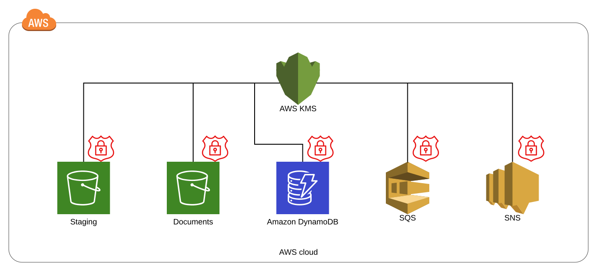

# Full Encryption

## Overview

The Full Encryption module, included by default in FormKiQ Essentials, Advanced, and Enterprise editions, provides comprehensive encryption for all data, both in-transit and at-rest. This module leverages [AWS Key Management Service (AWS KMS)](https://aws.amazon.com/kms) for robust key management and encryption across all FormKiQ services.

## Key Features

### Comprehensive Protection
- In-transit encryption
- At-rest encryption
- Centralized key management
- Automated key rotation
- Access control and auditing

### Integrated Services
The Full Encryption module secures data across all FormKiQ-utilized AWS services:

| Service | Description | Encryption Coverage |
|---------|-------------|-------------------|
| [Amazon DynamoDB](https://aws.amazon.com/dynamodb) | Database service | Tables and indexes |
| [Amazon S3](https://aws.amazon.com/s3) | Object storage | Documents and metadata |
| [Amazon SQS](https://aws.amazon.com/sqs) | Message queuing | Queue messages |
| [Amazon SNS](https://aws.amazon.com/sns) | Notification service | Notifications |

## AWS KMS Integration

### Key Management
- Automated key creation
- Secure key storage
- Controlled key access
- Key usage monitoring
- Compliance tracking

### Security Features
- Centralized access control
- Key usage policies
- Automatic key rotation
- Secure key deletion
- Access auditing

## Optional CloudTrail Integration

AWS CloudTrail integration provides detailed logging of all KMS key usage:

### Capabilities
- Key usage monitoring
- Access tracking
- Audit trail creation
- Security investigation
- Compliance reporting

### Configuration
- Default: Disabled (to control costs)
- Customizable log delivery
- S3 bucket designation
- Event filtering options
- Retention settings

## Use Cases

### Compliance Requirements
- Meet encryption mandates
- Ensure data protection
- Maintain audit trails
- Document security controls

### Data Protection
- Secure sensitive documents
- Protect customer data
- Safeguard business information
- Control access to content

### Security Monitoring
- Track key usage
- Monitor access patterns
- Investigate incidents
- Generate security reports

## Best Practices

1. **Key Management**
   - Monitor key usage
   - Review access policies
   - Plan key rotation
   - Document key purposes

2. **CloudTrail Configuration**
   - Consider cost implications
   - Define retention periods
   - Configure alert triggers
   - Monitor log storage

3. **Access Control**
   - Limit key access
   - Review permissions regularly
   - Document access policies
   - Monitor usage patterns

For more information about AWS KMS features and pricing, visit the [AWS KMS Documentation](https://aws.amazon.com/kms).