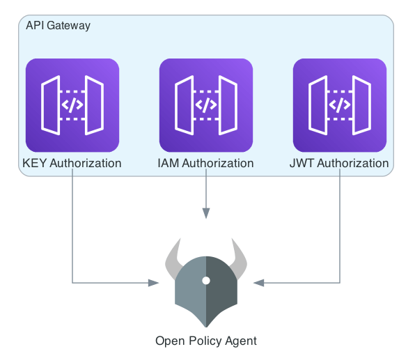

# Open Policy Agent (OPA)

## Overview

[Open Policy Agent (OPA)](https://www.openpolicyagent.org/) is an open-source policy engine integrated with FormKiQ to provide fine-grained access control. This integration enables organizations to define and enforce attribute-based access controls (ABAC) across their document management system.



## Key Features

- Centralized policy management
- Fine-grained access control
- Attribute-based decisions
- Policy evaluation engine
- Site-specific configurations

:::note
OPA policy can be configured globally or per FormKiQ site
:::

## API Integration

### Policy Management

| Endpoint | Method | Description | Note |
|----------|---------|-------------|------|
| `/sites/opa/accessPolicies` | PUT | Configure OPA policy | Admins only |
| `/sites/{siteId}/opa/accessPolicy` | GET | Retrieve OPA policy | Admins only |
| `/sites/{siteId}/opa/accessPolicy` | DELETE | Remove OPA policy | Admins only |

#### Configure Policy
```json
{
  "policy": "string",
  "siteId": "string"
}
```

## Policy Evaluation

### Input Data Format

FormKiQ provides the following structure to OPA's decision engine:

```json
{
    "resource": "<resource path specifies the endpoint>",
    "httpMethod": "<http method>",
    "pathParameters": "<map of parameters from the request URL>",
    "queryParameters": "<map of query from the request URL>",
    "user": {
        "username": "<user name>",
        "roles": "<string list of roles>"
    }
}
```

Example input for document access:
```json
{
    "resource": "/documents/{documentId}",
    "httpMethod": "GET",
    "pathParameters": {
        "documentId": "fe03fe66-1338-4163-a86b-ab455202fd57"
    },
    "queryParameters":{
        "siteId": "default"
    }, 
    "user":{
        "username": "<email>@yourcompany.com",
        "roles": ["Admins"]
    }
}
```

## Access Control Types

### Role-Based Access Control (RBAC)

Example RBAC policy:
```
package formkiq

import future.keywords.if
import future.keywords.in

default allow := false

# Allow Admins role
allow if {
    "Admins" in input.user.roles
}

# Allow User Role in SiteId
allow if {
    input.queryParameters.siteId in input.user.roles
}

# Allow User Read Role in SiteId
allow if {
    input.httpMethod == "GET"
    concat("_read", [input.queryParameters.siteId, ""]) in input.user.roles
}

# Allow User Read Role in SiteId access to /search
allow if {
    input.httpMethod == "POST"
    input.resource == "/search"
    concat("_read", [input.queryParameters.siteId, ""]) in input.user.roles
}
```

### Attribute-Based Access Control (ABAC)

ABAC enables access control based on resource attributes. These attributes can be managed through:
- `POST /documents` during creation
- `POST /documents/{documentId}/accessAttributes`
- `PUT /documents/{documentId}/accessAttributes`

:::note
Access attribute endpoints require Admin role
:::

Example ABAC policy:
```
package formkiq

import future.keywords.if
import future.keywords.in

default allow := false

# Allow customer service access to specific document types
allow if {
    "customer_service" in input.user.roles
    data.documents.documentType = "customerService"
}
```

## Limitations

### Partial Evaluations

Some policy evaluations may require data store access, leading to "partial" evaluations. Key considerations:

1. Search Limitations
   - `POST /search` cannot complete partial evaluations
   - Use `POST /searchFulltext` or `POST /queryFulltext` instead

2. Performance Impact
   - DynamoDB optimizes for predictable access patterns
   - Complex attribute evaluations may affect performance

3. Best Practices
   - Design policies with data access patterns in mind
   - Use OpenSearch for complex attribute searches
   - Consider caching frequently accessed attributes