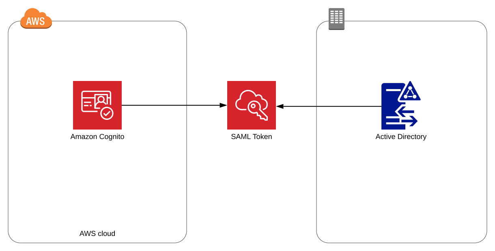
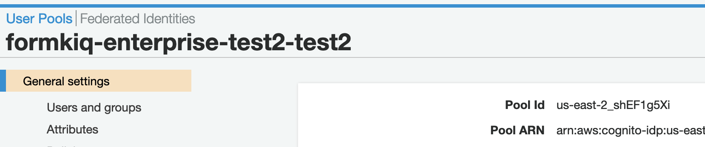
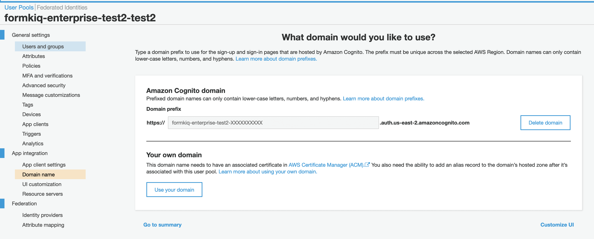
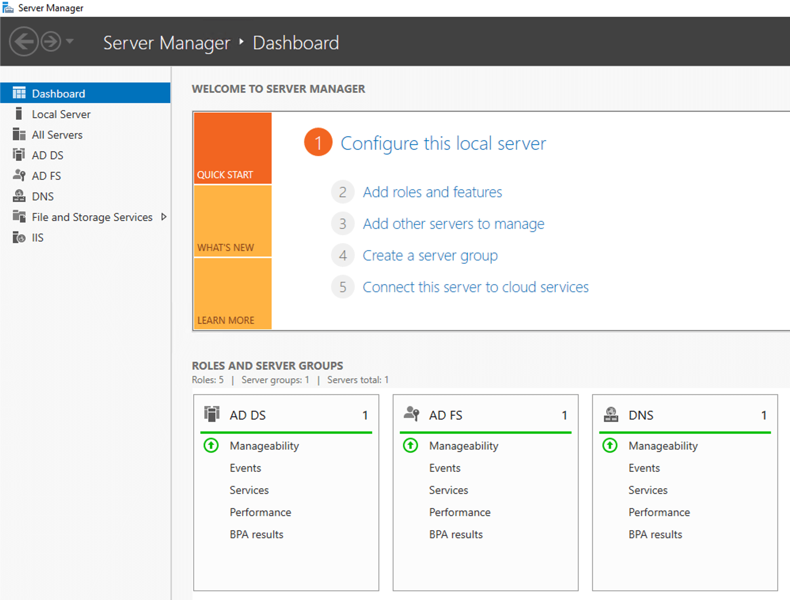
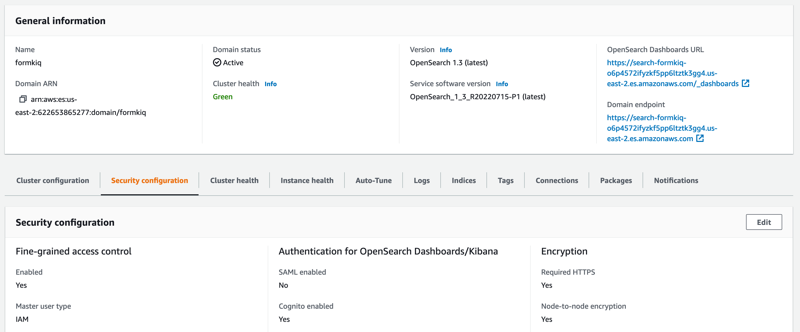

# Single Sign-On and Custom JWT Authorizer

## Overview

The Single Sign-On (SSO) and Custom JWT Authorizer module enables flexible authentication configuration for FormKiQ console and API endpoints. While FormKiQ uses AWS Cognito by default, this Enterprise Add-On Module allows integration with various authentication providers.

## Supported Authentication Methods

- Custom JWT providers (e.g., [Auth0](https://auth0.com))
- SAML 2.0 identity providers
- Public providers:
  - [Facebook](https://docs.aws.amazon.com/cognito/latest/developerguide/facebook.html)
  - [Google](https://docs.aws.amazon.com/cognito/latest/developerguide/google.html)
  - [Apple](https://docs.aws.amazon.com/cognito/latest/developerguide/apple.html)
- OpenID Connect providers
- Microsoft Active Directory Federation Services

## Active Directory Integration Guide

### 1. Retrieve Cognito Information

#### Access User Pool Settings
1. Open Amazon Cognito in AWS Console
2. Navigate to Settings
3. Note the User Pool ID

#### Get Cognito Domain
1. Go to App Integration >> Domain Name
2. Note the domain name

### 2. Configure AD FS

:::note
Requirements:
- AD FS servers need https access to amazoncognito.com
- Apply changes to all servers in multi-server setups
:::

#### Access AD FS Management
1. Open Server Manager
2. Select AD FS
3. Navigate to Tools > AD FS Management

#### Configure Relying Party Trust
1. Select "Relying Party Trusts"
2. Choose "Add Relying Party Trust Wizard"
3. Select "Claims aware" option
4. Choose "Enter data about the relying party manually"
5. Enter display name (e.g., "FormKiQ ADFS Login")
6. Configure SAML 2.0 WebSSO protocol URL using your Cognito domain
7. Set relying party trust identifier: `urn:amazon:cognito:sp:<yourUserPoolID>`

#### Configure Claim Rules
1. Select your Relying Party Trust
2. Edit Claim Issuance Policy
3. Add rules for:
   - Windows account name
   - Email address

### 3. Test Integration

1. Access FormKiQ Console
2. Select external provider login
3. Choose Corporate ID
4. Sign in with AD credentials

## User Access Configuration

### Group Management
- All user groups must be prefixed with `formkiq_`
- Minimum requirement: `formkiq_default` group for default siteId access
- Groups determine read/write permissions

## OpenSearch/Kibana SAML Authentication

### Configuration Steps

1. Access OpenSearch Console
2. Select domain for authentication changes
3. Navigate to Security Configuration
4. Disable Cognito Authentication
5. Enable SAML Authentication

### SAML Setup

After enabling SAML, note the following URLs:
- Service provider entity ID
- IdP-initiated SSO URL
- SP-initiated SSO URL

### Configuration Options
- Use IdP-initiated SSO URL for IdP directory authentication
- Use SP-initiated SSO URL for OpenSearch Dashboards authentication

For detailed configuration instructions, see [OpenSearch SAML Documentation](https://docs.aws.amazon.com/opensearch-service/latest/developerguide/saml.html).

## Best Practices

1. **Security**
   - Regularly review authentication settings
   - Monitor access patterns
   - Maintain updated IdP configurations

2. **User Management**
   - Use descriptive group names
   - Document access policies
   - Regular access reviews

3. **Integration**
   - Test authentication flows
   - Monitor SSO sessions
   - Configure timeouts appropriately