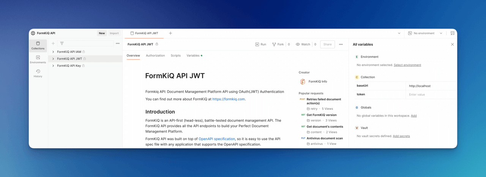
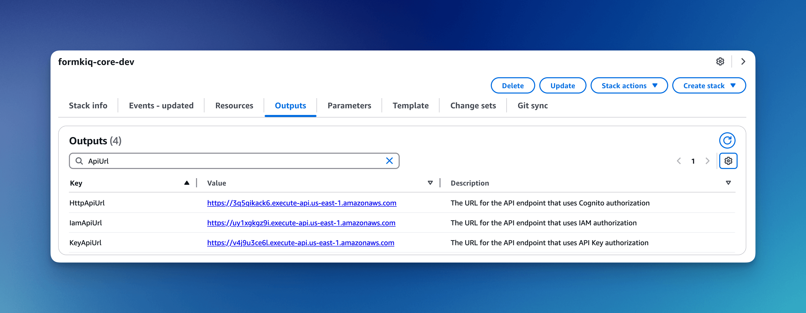
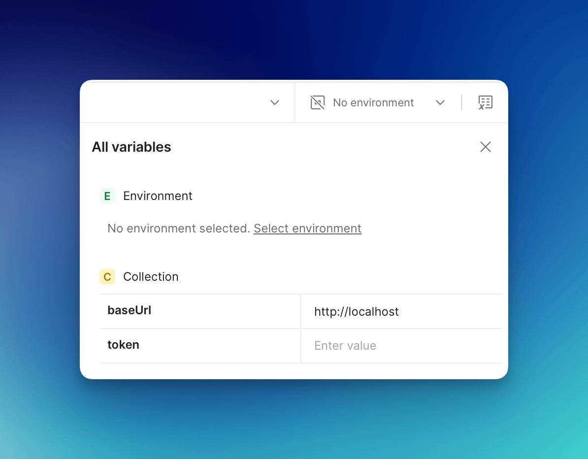
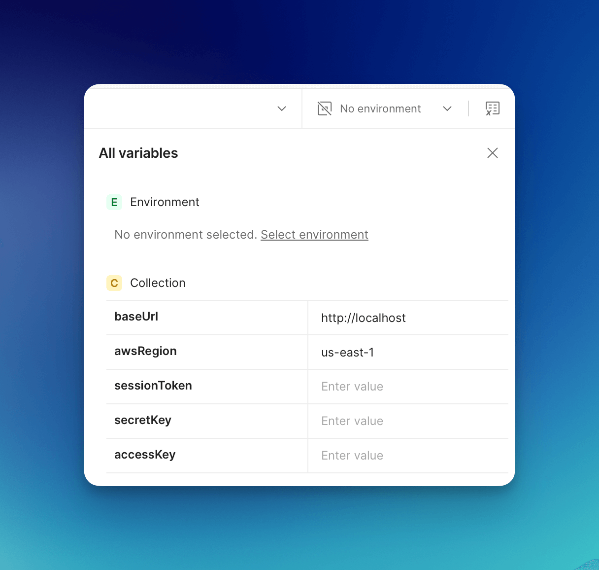
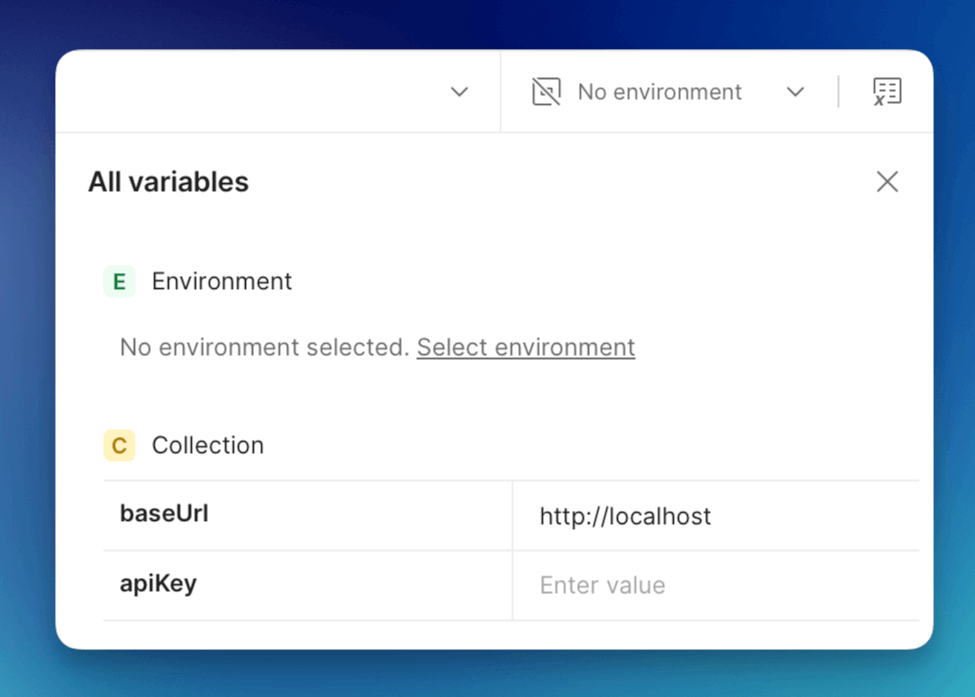
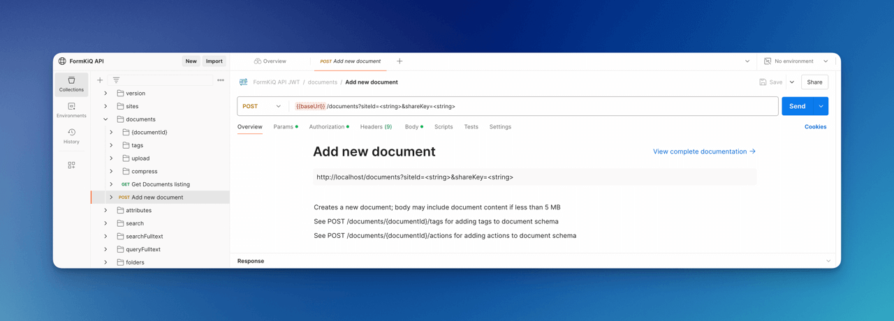
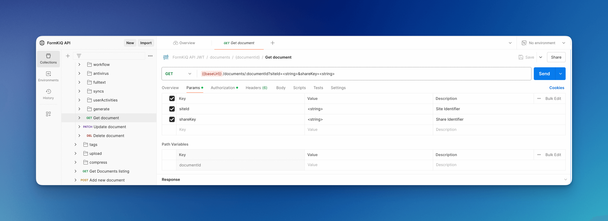
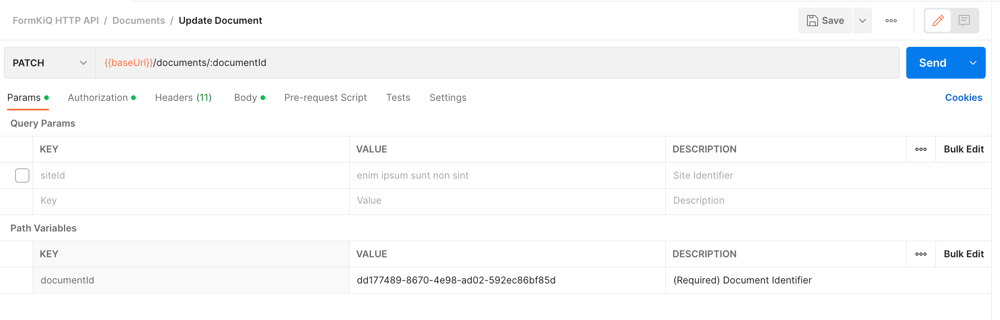
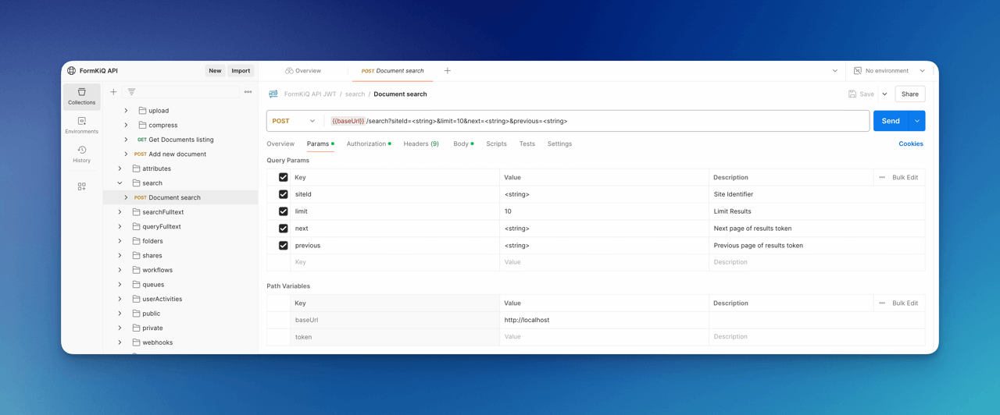

# API Walkthrough

Learn the fundamentals of using the FormKiQ Document API:
- Adding and updating documents
- Retrieving document content
- Searching documents with tags and metadata

## Before You Begin

You need a working FormKiQ installation and an API client. This walkthrough uses Postman because the FormKiQ collections are available through the Postman Public API Network.

Before configuring Postman, open the CloudFormation **Outputs** tab for your FormKiQ stack and collect the values below:

| Item | Where to find it | Notes |
|------|------------------|-------|
| HTTP API URL | CloudFormation stack output `HttpApiUrl` | Use for JWT-authenticated API calls. |
| IAM API URL | CloudFormation stack output `IamApiUrl` | Use for AWS IAM-authenticated API calls. |
| API key URL | CloudFormation stack output `KeyApiUrl` | Use for API key-authenticated API calls, when enabled. |
| AWS region | AWS console region selector | Must match the region where FormKiQ is installed. |
| Admin user | Admin email used during installation | Recommended for the first JWT test. |
| Site ID | FormKiQ tenant/site identifier | Use `default` unless you are testing a multi-tenant setup. |

:::note
If you have not installed FormKiQ yet, start with the [Quick Start Guide](/docs/category/getting-started).
:::

<div
  style={{
    position: "relative",
    paddingBottom: "56.25%", // 16:9 aspect ratio
    height: 0,
    overflow: "hidden"
  }}
>
  <iframe
    src="https://www.youtube.com/embed/kJMr1U9pZHA"
    title="How to Set Up Authentication for FormKiQ: Complete Guide to JWT, IAM, and API Key Methods"
    frameBorder="0"
    allow="accelerometer; autoplay; clipboard-write; encrypted-media; gyroscope; picture-in-picture"
    allowFullScreen
    style={{
      position: "absolute",
      top: 0,
      left: 0,
      width: "100%",
      height: "100%"
    }}
  />
</div>

## Postman Public API Network

Access the [FormKiQ API on the Postman Public API network](https://www.postman.com/formkiq/formkiq-api/overview) for immediate testing and integration.



Available collections:

| Collection | Best for | Base URL |
|------------|----------|----------|
| JWT Authentication | First test with the admin user created during installation. | `HttpApiUrl` |
| AWS IAM Authentication | Backend services, AWS workloads, and signed server-side requests. | `IamApiUrl` |
| API Key Authentication | Controlled service access or development scenarios where API keys are enabled. | `KeyApiUrl` |

:::note
FormKiQ's API uses OpenAPI specification, available in the [FormKiQ Core GitHub repository](https://github.com/formkiq/formkiq-core/tree/master/docs/openapi).
:::

<div
  style={{
    position: "relative",
    paddingBottom: "56.25%", // 16:9 aspect ratio
    height: 0,
    overflow: "hidden"
  }}
>
  <iframe
    src="https://www.youtube.com/embed/_qM6CDJfFII"
    title="Document Management Made Easy: A FormKiQ API Walkthrough using Postman"
    frameBorder="0"
    allow="accelerometer; autoplay; clipboard-write; encrypted-media; gyroscope; picture-in-picture"
    allowFullScreen
    style={{
      position: "absolute",
      top: 0,
      left: 0,
      width: "100%",
      height: "100%"
    }}
  />
</div>

## Choose an Authentication Method {#acquire-access-token}

Each Postman collection uses a different authentication method. Use one collection at a time and make sure its base URL matches the authentication method.

### JWT Authentication

JWT authentication is the recommended first test after installation. Sign in to the FormKiQ Console with the admin user, acquire a [JWT token](/docs/platform/security#jwt-token), and use the `HttpApiUrl` stack output as the API base URL.

### IAM Authentication

IAM authentication uses AWS credentials and signed requests. Use this option for AWS-based backend integrations or server-side services that should authenticate through AWS IAM. Use the `IamApiUrl` stack output as the API base URL.

For setup details, see [AWS IAM Authentication](/docs/platform/security#aws-iam).

### API Key Authentication

API key authentication is available when API keys are enabled and created for the target site. Use the `KeyApiUrl` stack output as the API base URL.

For setup details, see [API Key Authentication](/docs/platform/security#api-key).

For more information, see [API Security Tokens](/docs/platform/security#api-security).

## Configure Postman

Find API URLs in CloudFormation Outputs:



Create or update a Postman environment with the values needed by the collection you are using.

| Variable | JWT collection | IAM collection | API key collection |
|----------|----------------|----------------|--------------------|
| `baseUrl` | `HttpApiUrl` | `IamApiUrl` | `KeyApiUrl` |
| `siteId` | `default` | `default` | `default` |
| `token` | JWT token | Not used | Not used |
| `awsRegion` | Not used | FormKiQ AWS region | Not used |
| `apiKey` | Not used | Not used | Generated API key |

### JWT Authentication
- Set **baseUrl**: HttpApiUrl
- Set **token**: JWT token from browser
- Set **siteId**: default



### IAM Authentication
- Set **baseUrl**: IamApiUrl
- Set **awsRegion**: Your installation region
- Set AWS credentials
- Set **siteId**: default



### API Key Authentication
- Set **baseUrl**: KeyApiUrl
- Set **apiKey**: Generated API key
- Set **siteId**: default



:::tip
If an API request fails immediately with an authentication error, confirm that the collection, base URL, and credentials all use the same authentication method.
:::

## Working with Documents via the API

### Document Metadata Options

FormKiQ provides two ways to add custom metadata to documents:

1. **Attributes** (Recommended)
   - Structured metadata with defined types
   - Must be created at site level first
   - Supports validation and complex data types
   - Enhanced search capabilities

2. **Tags** (Legacy)
   - Simple key-value pairs
   - No predefined structure
   - Limited search capabilities

<mark>**For simplicity, we will work with tags during this walkthrough.**</mark>

### Add Document

Use the **Add new Document** API under **Documents**:



Request fields:

| Field | Description |
|-------|-------------|
| path | Document name/path |
| contentType | Media type |
| isBase64 | Base64 encoding flag |
| content | Document content |
| tags | Document tags (legacy) |

Example request:

```json
{
  "path": "test.txt",
  "contentType": "text/plain",
  "isBase64": false,
  "content": "This is sample data file",
  "tags": [
    {
      "key": "category",
      "value": "sample"
    }
  ]
}
```

Expected response:

```json
{
  "documentId": "c5590f65-7a36-4cb4-b0be-549849bbbcdf",
  "siteId": "default"
}
```

Save the returned `documentId`. You will use it to retrieve, update, search for, and delete the test document.

:::note
Maximum content size: 5MB
For larger files, use **Add Document Upload** to create a presigned S3 upload URL.
:::

### Get Document Metadata

Use **Get Document** API with document ID:



Expected result:

- response status is `200`
- response includes the same `documentId`
- response includes the `path` value `test.txt`
- response includes the tag `category=sample`

### Update Document

Modify content, tags, or metadata using **Update Document** API:



Example update:

```json
{
  "contentType": "text/plain",
  "content": "Updated content",
  "tags": [
    {
      "key": "status",
      "value": "updated"
    }
  ]
}
```

Expected result:

- response status is `200`
- the document keeps the same `documentId`
- the document metadata reflects the updated content or tags

### Search Documents

Use **Document Search** API for tag and metadata queries:



Example searches:

Tag search:

```json
{
  "query": {
    "tag": {
      "key": "category",
      "value": "sample"
    }
  }
}
```

Expected result:

- response status is `200`
- the response includes the test document you created
- the returned document has the saved `documentId`

Text search (requires Typesense):

```json
{
  "query": {
    "text": "Lorem ipsum dolor"
  }
}
```

:::note
Full-text search requires a search engine such as Typesense or OpenSearch. If you installed FormKiQ Core without search, use tag or attribute search for this walkthrough.
:::

### Delete the Test Document

When you finish testing, use **Delete Document** with the saved `documentId` to remove the test document.

For a soft delete, set `softDelete=true`. For permanent deletion, use the delete behavior appropriate for your environment and retention requirements.

## Troubleshooting API Calls

### 401 Unauthorized

The token or API key is missing, expired, or configured against the wrong collection. Refresh the JWT token, confirm the API key value, and verify that the collection is using the correct `baseUrl`.

### 403 Forbidden

The caller is authenticated but does not have permission for the requested site or operation. Confirm the user, IAM role, or API key has access to the target `siteId`.

### Wrong API URL

Each authentication method has its own API URL. Use `HttpApiUrl` with JWT, `IamApiUrl` with IAM, and `KeyApiUrl` with API keys.

### No Search Results

Confirm the document was created in the same `siteId` you are searching. For full-text search, confirm that Typesense or OpenSearch is installed and enabled.

### Missing Document ID

If a later request fails because the document ID is missing, rerun **Add new Document** and save the `documentId` from the response.

## Next Steps

- For more document examples, see the [Documents API Tutorial](/docs/tutorials/Documents/documents-api)
- For structured metadata, see the [Document Attributes API Tutorial](/docs/tutorials/Documents/document-attributes-api)
- For SDK-based integrations, see [SDKs & API Integration](/docs/category/sdk-api-integration)
- For endpoint details, review the [API Reference](/docs/category/formkiq-api)
- For broader examples, explore [FormKiQ Tutorials](/docs/category/tutorials)
- Join our [Slack Community](https://join.slack.com/t/formkiqcommunity/shared_invite/zt-2ki1i21w1-9ZYagvhY7ex1pH5Cyg2O3g)
