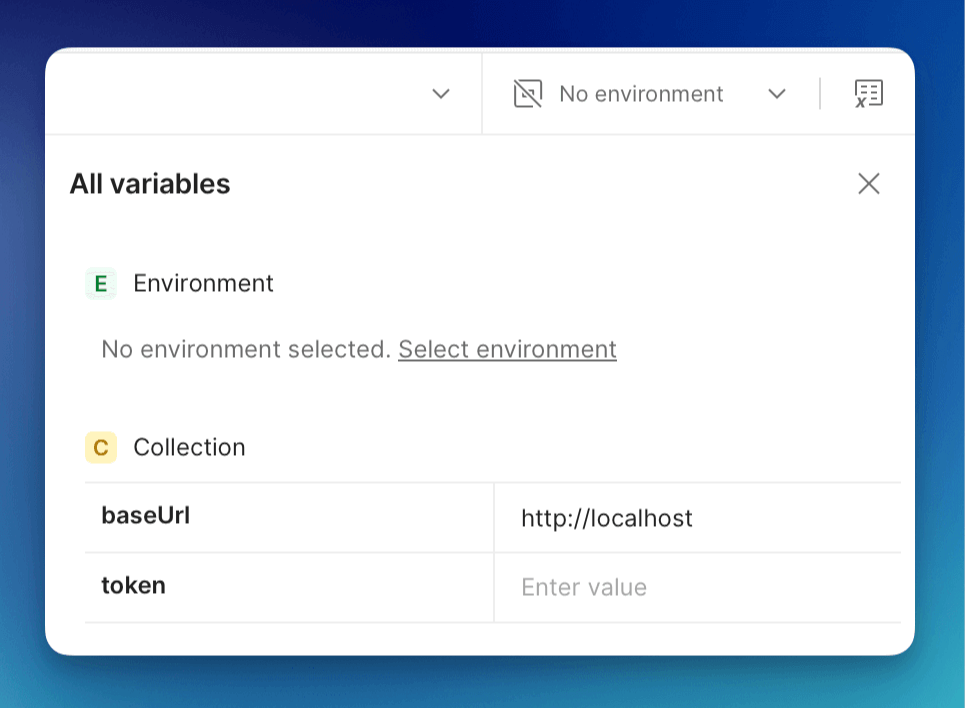

# API Walkthrough

Learn the fundamentals of using the FormKiQ Document API:
- Adding and updating documents
- Retrieving document content
- Searching documents with tags and metadata

## Prerequisites

* FormKiQ installation ([Quick Start Guide](/docs/category/getting-started))
* API access credentials (JWT token, API key, or AWS IAM credentials)
* API client (Postman recommended)

## Postman Public API Network

Access the [FormKiQ API on the Postman Public API network](https://www.postman.com/formkiq/formkiq-api/overview) for immediate testing and integration.


Available Collections:
1. **JWT Authentication**: Token-based authentication for secure session management
2. **AWS IAM Authentication**: AWS Identity and Access Management integration
3. **API Key Authentication**: Simple key-based access for testing and development

:::note
FormKiQ's API uses OpenAPI specification, available in the [FormKiQ Core GitHub repository](https://github.com/formkiq/formkiq-core/tree/master/docs/openapi).
:::

## Acquire Access Token

Depending on which Postman collection you want to use, authentication requires either acquiring a [JWT token](/docs/platform/security#jwt-token), setting up [AWS IAM Authentication](/docs/platform/security#aws-iam), or creating and providing an [API Key](/docs/platform/security#api-key)

More info: [API Security Tokens](/docs/platform/security#api-security).


## Configure Postman

Find API URLs in CloudFormation Outputs:


Configure each collection:

### JWT Authentication
- Set **baseUrl**: HttpApiUrl
- Set **token**: JWT token from browser



### IAM Authentication
- Set **baseUrl**: IamApiUrl
- Set **awsRegion**: Your installation region
- Set AWS credentials


### API Key Authentication
- Set **baseUrl**: KeyApiUrl
- Set **apiKey**: Generated API key


## Working with Documents via the API

### Document Metadata Options

FormKiQ provides two ways to add custom metadata to documents:

1. **Attributes** (Recommended)
   - Structured metadata with defined types
   - Must be created at site level first
   - Supports validation and complex data types
   - Enhanced search capabilities

2. **Tags** (Legacy)
   - Simple key-value pairs
   - No predefined structure
   - Limited search capabilities

<mark>**For simplicity, we will work with tags during this walkthrough.**</mark>

### Add Document

Use the **Add new Document** API under **Documents**:


Request fields:

| Field | Description |
|-------|-------------|
| path | Document name/path |
| contentType | Media type |
| isBase64 | Base64 encoding flag |
| content | Document content |
| tags | Document tags (legacy) |

Example request:
```json
{
  "path": "test.txt",
  "contentType": "text/plain",
  "isBase64": false,
  "content": "This is sample data file",
  "tags": [
    {
      "key": "category",
      "value": "sample"
    }
  ]
}
```

:::note
Maximum content size: 5MB
For larger files (up to 5GB), use Add Document Upload
:::

### Get Document Metadata

Use **Get Document** API with document ID:


### Update Document

Modify content, tags, or metadata using **Update Document** API:


Example update:
```json
{
  "contentType": "text/plain",
  "content": "Updated content",
  "tags": [
    {
      "key": "status",
      "value": "updated"
    }
  ]
}
```

### Search Documents

Use **Document Search** API for tag and metadata queries:


Example searches:

Tag search:
```json
{
  "query": {
    "tag": {
      "key": "category",
      "value": "sample"
    }
  }
}
```

Text search (requires Typesense):
```json
{
  "query": {
    "text": "Lorem ipsum dolor"
  }
}
```

## Next Steps

- Explore [FormKiQ Tutorials](/docs/category/tutorials)
- Review [API Reference](/docs/category/api-reference)
- Join our [Slack Community](https://join.slack.com/t/formkiqcommunity/shared_invite/zt-2ki1i21w1-9ZYagvhY7ex1pH5Cyg2O3g)