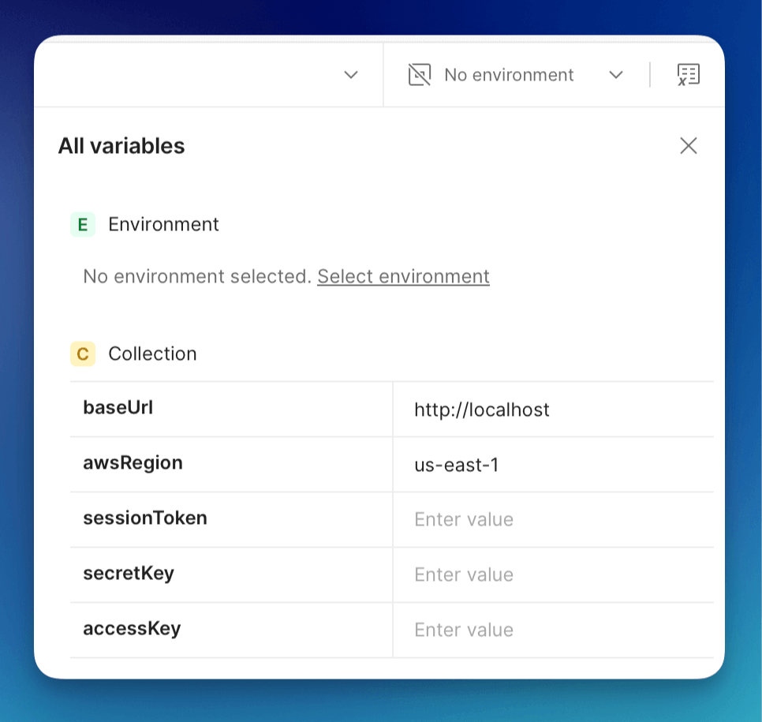
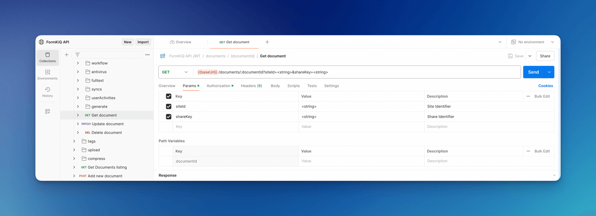

# API Walkthrough

This tutorial will take you through the basics of the FormKiQ Document API, including:

* How to Add a document
* How to Update that document
* And How to search for documents

## Prerequisite

* You have installed FormKiQ; see the [Quick Start](/docs/category/getting-started)

## Postman Public API Network

The [FormKiQ API is available on the Postman Public API network](https://www.postman.com/formkiq/formkiq-api/overview). By using the Postman Public API network, you can enter your FormKiQ connection details and immediately be able to test and user the FormKiQ API.


There are 3 Collections in the FormKiQ API. Each collection is the same API but using a different authorization scheme. 

* **JWT Authentication Collection**: Uses JSON Web Tokens (JWT) for stateless, token-based authentication. Suitable for applications requiring secure, session-based communication.

* **AWS IAM Authentication Collection**: Leverages AWS Identity and Access Management (IAM) for authentication. Ideal for AWS-integrated environments where IAM roles and policies manage access control.

* **API Key Authentication Collection**: Employs API keys for straightforward authentication. Perfect for quick integration and testing purposes.

:::note

The FormKiQ API was built using the OpenAPI specification. OpenAPI is an open standard for how to describe API endpoints, request bodies and their responses.

Since it is an open standard it is supported by many applications. In this case, we can import them into Postman and quickly get access to the FormKiQ API.

The FormKIQ OpenAPI specifications can be found on the FormKiQ Core's github page in the https://github.com/formkiq/formkiq-core/tree/master/docs/openapi folder.
:::

## Authentication

Depending on which authentication you want to use, below find instructions for each method.

### JWT Token

Follow these steps to retrieve a JWT token using your browser's developer tools. The JWT token will be configured in the FormKiQ JWT API collection in the following section.

#### **Google Chrome**

1. Log in to the FormKiQ Web Console.
2. Press `F12` (or `Ctrl+Shift+I` / `Cmd+Option+I` on macOS) to open the Developer Tools.
3. Click on the **Network** tab.
4. Refresh the page or perform an action within the console.
5. Locate a network request containing the token. Look in the **Authorization** header or the response body.
6. Right-click on the request and select **Copy** > **Copy as cURL** or inspect its details to find the JWT token.

#### **Safari**

1. Open Safari and log in to the FormKiQ Web Console.
2. Enable the Develop menu if it's not already visible:
   - Go to **Safari > Preferences > Advanced** and check **Show Develop menu in menu bar**.
3. Press `Cmd+Option+I` to open the Web Inspector.
4. Navigate to the **Network** tab.
5. Perform an action (e.g., refresh the page) to populate network requests.
6. Find the request containing the token in the **Authorization** header or response body.
7. Inspect the request for the JWT token and copy it as needed.

#### **Mozilla Firefox**

1. Log in to the FormKiQ Web Console.
2. Press `Ctrl+Shift+I` (or `Cmd+Option+I` on macOS) to open Developer Tools.
3. Go to the **Network** tab.
4. Refresh the page or perform an action within the console.
5. Look for a network request with the JWT token in the **Authorization** header or response body.
6. Right-click on the request and select **Copy** > **Copy Request Headers** or inspect its details to retrieve the JWT token.

### AWS IAM

To use AWS IAM authentication, you will need to create an AWS IAM user with the **AmazonAPIGatewayInvokeFullAccess** policy attached and generate an access key and secret key for the user. The AmazonAPIGatewayInvokeFullAccess policy is what allows the user access to call the API Gateway which controls access to the FormKiQ API.

* Create a new IAM user in the [AWS IAM Console](https://console.aws.amazon.com/iam/home)
* Attach the AmazonAPIGatewayInvokeFullAccess policy to the user
* Create an AccessKey / SecretKey for the IAM user.

### API Key

To generate an API key using the FormKiQ Console, log in and navigate to the **API Keys** in the Administration section. 

Click **Create new**, provide a name for the key and select the permissions associated. Once generated, copy the API key immediately, as it will be required to authenticate API requests.


## Configure Postman

The following are instruction on how to configure Postman for each collection.

You will need the API urls for each authentication method which can be found in the **Outputs** of your CloudFormation installation.


Click on the **Variables** button on each collection and enter the following information.

### FormKiQ API JWT

The JWT API requires the entering of the **HttpApiUrl** into the **baseUrl** variable and the JWT Token obtains above into the **token** variable.


### FormKiQ API IAM

The IAM API requires the entering of the **IamApiUrl** into the **baseUrl** variable, the **awsRegion** is the region that your FormKiQ installation is in.

The accessKey, secretKey and sessionToken are you IAM access. 

:::note
If you only have the accessKey / secretKey, you can leave the sessionToken empty.
:::



### FormKiQ API Key

The Key API requires the entering of the **KeyApiUrl** into the **baseUrl** variable and the generated apiKey into the **apiKey** variable.


## FormKiQ API

Now that the FormKiQ API is configured, we walk through a very basic API functions.

### Add a Document

To add a document, open the **FormKiQ API** and under the **Documents** folder you will find the **Add new Document** API.


Click the **Body** tab, we can now define the document we would like to add.

There are a number of fields we can configure in the request.

| Field    | Description |
| -------- | ------- |
| path | Path or Name of document |
| contentType | Document media type |
| isBase64 | Is the content field Base64-encoded |
| content | Document content |
| tags | Document tag list |
| metadata | Document metadata list |

A body for simple text document is:

```
{
  "path": "test.txt",
  "contentType": "text/plain",
  "isBase64": false,
  "content": "This is sample data file",
}
```

The request will return a response that contains the `documentId` of the newly created document.
```
{
  "documentId":"dd177489-8670-4e98-ad02-592ec86bf85d"
}
```

You can also specify tags and metadata when creating a document:

```
{
  "path": "test.txt",
  "contentType": "text/plain",
  "isBase64": false,
  "content": "This is sample data file",
  "tags": [
    {
      "key": "category",
      "value": "sample"
    },
    {
      "key": "players",
      "values": [
        "111",
        "222"
      ]
    }
  ],
  "metadata": [
    {
      "key": "info",
      "value": "Lorem ipsum dolor sit amet, consectetur adipiscing elit, sed do eiusmod tempor incididunt ut labore et dolore magna aliqua."
    }
  ]
}
```

:::note
There is a maximum file size of 5 MB for the content. Large file uploads are supported by the Add Document Upload where you can create documents the same way, but in addition a documentId being returned you’ll also get an S3 Presigned URL that allows you to upload files up to 5 GB.
:::

### Get Document Metadata

We can now retrieve the newly added document by using the **Get Document** API.



Under the **Params** tab:

* Unselect the siteId, shareKey parameters
* Add the DocumentId path variable

Sending the request, will return the document information.

```
{
  "metadata": [
      {
          "key": "info",
          "value": "Lorem ipsum dolor sit amet, consectetur adipiscing elit, sed do eiusmod tempor incididunt ut labore et dolore magna aliqua."
      }
  ],
  "path": "test.txt",
  "siteId": "default",
  "contentLength": 24,
  "documentId": "dd177489-8670-4e98-ad02-592ec86bf85d",
  "contentType": "text/plain"
  ...
}
```

:::note
The document tags are stored separate to the document. You can use the APIs under the `Document Tags` to retrieve them.
:::

### Update Document

The **Update Document** API is used to update the document. You can use this API to update the document content or to add/update metadata and/or tags.


Under the **Params** tab:

* Unselect the siteId, shareKey parameters
* Add the DocumentId path variable

Click on the **Body** tab. The request body is the same as the add document request body.

So you can easily update the document content, add a tag and a metadata all with one request.

```
{
  "contentType": "text/plain",
  "isBase64": false,
  "content": "This is updated data",
  "tags": [
    {
      "key": "type",
      "value": "text"
    }
  ],
  "metadata": [
    {
      "key": "info2",
      "value": "Lorem ipsum dolor sit amet, consectetur adipiscing elit, sed do eiusmod tempor incididunt ut labore et dolore magna aliqua."
    }
  ]
}
```

Using the **Get Document** request from the previous step, you'll see the response has now changed.

```
{
  "metadata": [
      {
          "key": "info",
          "value": "Lorem ipsum dolor sit amet, consectetur adipiscing elit, sed do eiusmod tempor incididunt ut labore et dolore magna aliqua."
      },
      {
          "key": "info2",
          "value": "Lorem ipsum dolor sit amet, consectetur adipiscing elit, sed do eiusmod tempor incididunt ut labore et dolore magna aliqua."
      }
  ],
  "path": "test.txt",
  "siteId": "default",
  "documentId": "dd177489-8670-4e98-ad02-592ec86bf85d",
  "contentType": "text/plain"
  ...
}
```

### Get Document

There are two ways to get the document contents, through the **Get Document Content** or **Get Document Url** APIs.

The only difference between the two APIs, is the **Get Document Content** will return the actual document content if it is a text/\*, application/x-www-form-urlencoded or application/json.

```
{
    "content": "This is updated data",
    "isBase64": false,
    "contentType": "text/plain"
}
```

If the content is not a text document or the **Get Document Url** is used, a [Presigned URL](https://docs.aws.amazon.com/AmazonS3/latest/userguide/using-presigned-url.html) is returned which allows access to the file without any additional security credentials or permissions. The duration of the access can be controlled via request parameters.

```
{
    "url": "https://formkiq....s3.us-east-2.amazonaws.com/dd177489-8670-4e98-ad02-592ec86bf85d?response-content-disposition=...",
    "documentId": "dd177489-8670-4e98-ad02-592ec86bf85d"
}
```

### Document Search

The **Document Search** API allows for easy and quick searching for documents by their metadata.


Under the **Params** tab:

* Unselect all parameters

In the **Body** tab, we can specify the search criteria.

#### Search by Document Tag Key

```
{
  "query": {
    "tag": {
      "key": "category"
    }
  }
}
```

#### Search by Document Tag Key & Value

```
{
  "query": {
    "tag": {
      "key": "category",
      "value": "person"
    }
  }
}
```

#### Search by Metadata Text

```
{
  "query": {
    "text": "Lorem ipsum dolor"
  }
}
```

:::note
To enable Metadata Text search, you need to have enabled [Typesense](https://typesense.org) during installation.
:::

The request response will contain of a list of document that match the search criteria.

```
{
  "documents": [
    {
      "path": "test.txt",
      "metadata": [
          {
              "key": "info",
              "value": "Lorem ipsum dolor sit amet, consectetur adipiscing elit, sed do eiusmod tempor incididunt ut labore et dolore magna aliqua."
          }
      ],
      "documentId": "dd177489-8670-4e98-ad02-592ec86bf85d",
      "matchedTag": {
          "type": "USERDEFINED",
          "value": "sample",
          "key": "category"
      },
      ...
    }
  ]
}
```

## Summary

And there you have it! We have shown how easy it is to use the FormKiQ API to create, update and search for a document.

This is just the tip of the iceberg when it comes to working with the FormKiQ APIs.

To learn more about how you can use the FormKiQ API to collect, organize, process, and integrate your documents and web forms, see the full list of [FormKiQ Tutorials](/docs/category/tutorials).

You can also check out the [FormKiQ API Reference](/docs/category/api-reference) for more endpoints you can try out.

If you have any questions, reach out to us on our https://github.com/formkiq/formkiq-core or in our [FormKiQ Slack Community](https://join.slack.com/t/formkiqcommunity/shared_invite/zt-2ki1i21w1-9ZYagvhY7ex1pH5Cyg2O3g).
