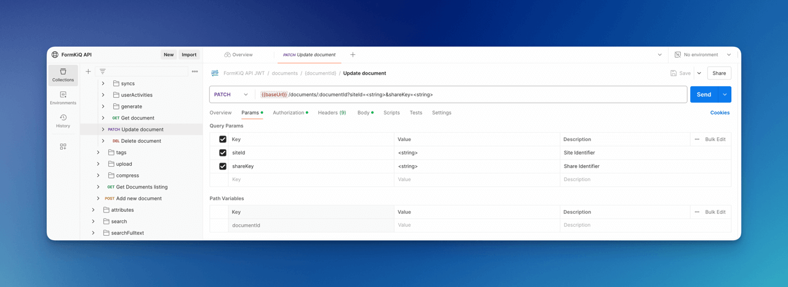

# API Walkthrough

This tutorial will take you through the basics of the FormKiQ Document API, including:

* How to Add a document
* How to Update that document
* And How to search for documents

## Prerequisite

* You have installed FormKiQ; see the [Quick Start](./quick-start)
* Install a API Client like https://www.postman.com.

## OpenAPI

The FormKiQ API was built using the OpenAPI specification. OpenAPI is an open standard for how to describe API endpoints, request bodies and their responses.

Since it is an open standard it is supported by many applications. In this case, we can import them into Postman and quickly get access to the FormKiQ API.

The FormKIQ OpenAPI specifications can be found on the FormKiQ Core's github page in the https://github.com/formkiq/formkiq-core/tree/master/docs/openapi folder.

| File    | Url |
| -------- | ------- |
| `openapi-auth.yaml` | https://raw.githubusercontent.com/formkiq/formkiq-core/master/docs/openapi/openapi-auth.yaml |
| `openapi-jwt.yaml` | https://raw.githubusercontent.com/formkiq/formkiq-core/master/docs/openapi/openapi-jwt.yaml |

The `openapi-auth.yaml` describes then authentication APIs available. We will use this to get the access token required for accessing the FormKiQ API.

The `openapi-jwt.yaml` describes the entire document management API that FormKiQ provides.

## Postman Import


To import the FormKiQ API into Postman, start by opening Postman.


To import the FormKiQ API:

* Click the `Import` button
* Enter the URL for the openapi-auth.yaml file
* Click the `Continue` button

By default Postman will import/sort the API by url. The FormKiQ API has tagged every URL so we will change Postman to import by tag, this will make the API much more readable and organized.

To do this:


* Click the `Show advanced settings`
* Scroll down to `Folder organization`
* Change from `Paths` to `Tags`
* Click the `Import` button to finish

Repeat the steps for the `openapi-jwt.yaml` URL and you will end up with both the `FormKiQ Authentication API` and `FormKiQ HTTP API`.


## Configure Postman

We now need to connect Postman to a FormKiQ installation. To do this we need to login to the [AWS Management Console](https://console.aws.amazon.com) and goto the [CloudFormation Console](https://console.aws.amazon.com/cloudformation/home).

image::formkiq-cloudformation-outputs.png[FormKiQ CloudFormation Outputs,1000,1000]

Clicking the FormKiQ installation and the `Outputs` we will see the different AWS resources that were created. To configure Postman we will need 2 values from the list, the `CognitoApiEndpoint` and the `HttpApiUrl`.

Go back to Postman and click on the `three-dots` next to the `FormKiQ Authentication API` and select `Edit`.

image::postman-edit-auth.png[Postman Edit Auth API,1000,1000]

Select the `Variables` tab and for the `baseUrl` variable, set the `CURRENT VALUE` to the value from the `CognitoApiEndpoint`.

image::postman-edit-variables-auth.png[Postman Edit Auth Variables,1000,1000]

Follow the same steps for the `FormKiQ HTTP API` and set the `CURRENT VALUE` of the `baseUrl` to the value from the `HttpApiUrl`.

image::postman-edit-variables-http.png[Postman Edit HTTP Variables,1000,1000]

Postman has now been connected to FormKiQ, we can now use the FormKiQ API.

## JWT Authentication

To use the FormKiQ API, we need an access token. Using the `FormKiQ Authentication API` makes it really easy to get one.


* Open the `Login` API under `FormKiQ Authentication API`
* Click the `Body` tab
* Enter your username / password
* Click `Send`

You should receive a response back that contains a `AccessToken`. Using this access token will allow us to use the FormKiQ API.

:::note
The response contains a `ExpiresIn` value. This is the time in seconds that the access token is valid for.
:::

## Add a Document

To add a document, open the `FormKiQ HTTP API` and under the `Documents` folder you will find the `Add Document` API.

Opening the `Add Document` API, we will need to make 2 changes.

image::postman-adddocument-params.png[Postman Add Document Params,1000,1000]

On the `Params` tab, unselect the siteId parameter. The siteId parameter is used to specify a specific tenant to add a document to. Since we have not created any additional tenant unselecting the siteId, FormKiQ will default to using the default siteId.


On the `Authorization` tab, in the `Access Token` input, we need to copy and paste the access token we got from the `FormKiQ Authentication API`.

image::postman-adddocument-body.png[Postman Add Document Body,1000,1000]

On the `Body` tab, we can now define the document we would like to add.

There are a number of fields we can configure in the request.

| Field    | Description |
| -------- | ------- |
| path | Path or Name of document |
| contentType | Document media type |
| isBase64 | Is the content field Base64-encoded |
| content | Document content |
| tags | Document tag list |
| metadata | Document metadata list |

A body for simple text document is:

```
{
  "path": "test.txt",
  "contentType": "text/plain",
  "isBase64": false,
  "content": "This is sample data file",
}
```

The request will return a response that contains the `documentId` of the newly created document.
```
{
  "documentId":"dd177489-8670-4e98-ad02-592ec86bf85d"
}
```

You can also specify tags and metadata when creating a document:

```
{
  "path": "test.txt",
  "contentType": "text/plain",
  "isBase64": false,
  "content": "This is sample data file",
  "tags": [
    {
      "key": "category",
      "value": "sample"
    },
    {
      "key": "players",
      "values": [
        "111",
        "222"
      ]
    }
  ],
  "metadata": [
    {
      "key": "info",
      "value": "Lorem ipsum dolor sit amet, consectetur adipiscing elit, sed do eiusmod tempor incididunt ut labore et dolore magna aliqua."
    }
  ]
}
```

:::note
There is a maximum file size of 5 MB for the content. Large file uploads are supported by the Add Document Upload where you can create documents the same way, but in addition a documentId being returned you’ll also get an S3 Presigned URL that allows you to upload files up to 5 GB.
:::

## Get Document Metadata

We can now retrieve the newly added document by using the `Get Document` API.


Once again we need to:

* Unselect the siteId parameter
* Add the DocumentId path variable
* In the `Authorization` tab, add the Access token

Sending the request, will return the document information.

```
{
  "metadata": [
      {
          "key": "info",
          "value": "Lorem ipsum dolor sit amet, consectetur adipiscing elit, sed do eiusmod tempor incididunt ut labore et dolore magna aliqua."
      }
  ],
  "path": "test.txt",
  "siteId": "default",
  "contentLength": 24,
  "documentId": "dd177489-8670-4e98-ad02-592ec86bf85d",
  "contentType": "text/plain"
  ...
}
```

:::note
The document tags are stored separate to the document. You can use the APIs under the `Document Tags` to retrieve them.
:::

## Update Document

The `Update Document` API is used to update the document. You can use this API to update the document content or to add/update metadata and/or tags.



Once again we need to:

* Unselect the siteId parameter
* Add the DocumentId path variable
* In the `Authorization` tab, add the Access token

Click on the `Body` tab. The request body is the same as the add document request body.

So you can easily update the document content, add a tag and a metadata all with one request.

```
{
  "contentType": "text/plain",
  "isBase64": false,
  "content": "This is updated data",
  "tags": [
    {
      "key": "type",
      "value": "text"
    }
  ],
  "metadata": [
    {
      "key": "info2",
      "value": "Lorem ipsum dolor sit amet, consectetur adipiscing elit, sed do eiusmod tempor incididunt ut labore et dolore magna aliqua."
    }
  ]
}
```

Using the `Get Document` request from the previous step, you'll see the response has now changed.

```
{
  "metadata": [
      {
          "key": "info",
          "value": "Lorem ipsum dolor sit amet, consectetur adipiscing elit, sed do eiusmod tempor incididunt ut labore et dolore magna aliqua."
      },
      {
          "key": "info2",
          "value": "Lorem ipsum dolor sit amet, consectetur adipiscing elit, sed do eiusmod tempor incididunt ut labore et dolore magna aliqua."
      }
  ],
  "path": "test.txt",
  "siteId": "default",
  "documentId": "dd177489-8670-4e98-ad02-592ec86bf85d",
  "contentType": "text/plain"
  ...
}
```

## Get Document

There are two ways to get the document contents, through the `Get Document Content` or `Get Document Url` APIs.

The only difference between the two APIs, is the `Get Document Content` will return the actual document content if it is a text/\*, application/x-www-form-urlencoded or application/json.

```
{
    "content": "This is updated data",
    "isBase64": false,
    "contentType": "text/plain"
}
```

If the content is not a text document or the `Get Document Url` is used, a [Presigned URL](https://docs.aws.amazon.com/AmazonS3/latest/userguide/using-presigned-url.html) is returned which allows access to the file without any additional security credentials or permissions. The duration of the access can be controlled via request parameters.

```
{
    "url": "https://formkiq....s3.us-east-2.amazonaws.com/dd177489-8670-4e98-ad02-592ec86bf85d?response-content-disposition=...",
    "documentId": "dd177489-8670-4e98-ad02-592ec86bf85d"
}
```

## Document Search

The `Document Search` API allows for easy and quick searching for documents by their metadata.

image::postman-document-search-params.png[Postman Document Search,1000,1000]

Once again we need to:

* Unselect all parameters
* In the `Authorization` tab, add the Access token

In the `Body` tab, we can specify the search criteria.

*Search by Document Tag Key*

```
{
  "query": {
    "tag": {
      "key": "category"
    }
  }
}
```

*Search by Document Tag Key & Value*

```
{
  "query": {
    "tag": {
      "key": "category",
      "value": "person"
    }
  }
}
```

*Search by Metadata Text*

```
{
  "query": {
    "text": "Lorem ipsum dolor"
  }
}
```

:::note
To enable Metadata Text search, you need to have enabled [Typesense](https://typesense.org) during installation.
:::

The request response will contain of a list of document that match the search criteria.

```
{
  "documents": [
    {
      "path": "test.txt",
      "metadata": [
          {
              "key": "info",
              "value": "Lorem ipsum dolor sit amet, consectetur adipiscing elit, sed do eiusmod tempor incididunt ut labore et dolore magna aliqua."
          }
      ],
      "documentId": "dd177489-8670-4e98-ad02-592ec86bf85d",
      "matchedTag": {
          "type": "USERDEFINED",
          "value": "sample",
          "key": "category"
      },
      ...
    }
  ]
}
```

## Summary

And there you have it! We have shown how easy it is to use the FormKiQ API to create, update and search for a document.

This is just the tip of the iceberg when it comes to working with the FormKiQ APIs.

To learn more about how you can use the FormKiQ API to collect, organize, process, and integrate your documents and web forms, see the full list of [FormKiQ Tutorials](/docs/category/tutorials).

If you have any questions, reach out to us on our https://github.com/formkiq/formkiq-core or in our [FormKiQ Slack Community](https://join.slack.com/t/formkiqworkspace/shared_invite/zt-22ujpnl76-Zztjyt9Zco7h2f1BYjnxyQ).
