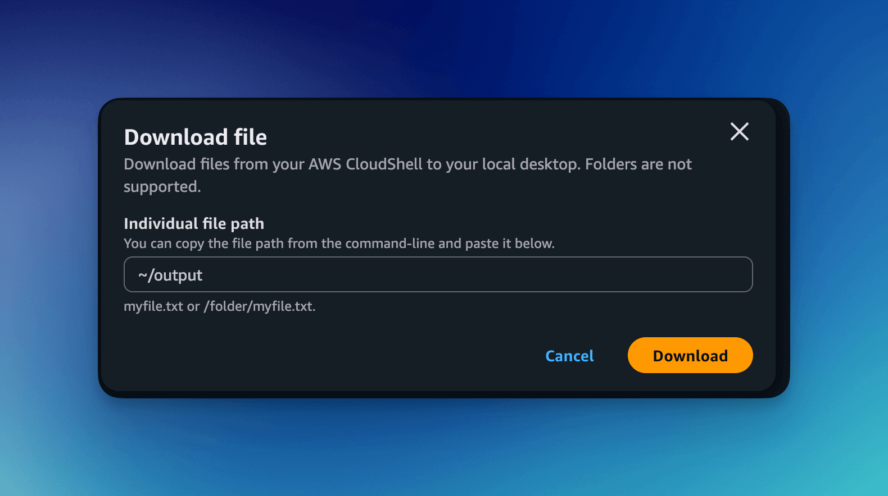

# CloudFormation Stack Failed

Use this guide when a FormKiQ CloudFormation stack does not reach `CREATE_COMPLETE` or `UPDATE_COMPLETE`.

CloudFormation failures are usually easiest to diagnose by finding the first failed resource in the root stack or a nested stack. Later failures are often side effects of the first one.

## What You Need

- Access to the AWS account and Region where FormKiQ is being installed or updated.
- Permission to view CloudFormation stacks and stack events.
- AWS CloudShell or a terminal with the AWS CLI configured.
- The root FormKiQ stack name.

## Start in the CloudFormation Console

1. Open the [CloudFormation Console](https://console.aws.amazon.com/cloudformation).
2. Switch to the AWS Region where FormKiQ is being installed.
3. Open the root FormKiQ stack.
4. Select the **Events** tab.
5. Look for the first event with a status ending in `_FAILED`.

If the failed resource is a nested stack, open that nested stack and repeat the same event review there.

## Use the CloudShell Helper Script

The helper script gathers root and nested stack events so you can review them in one output file.

### Open AWS CloudShell

Sign in to the [AWS Management Console](https://console.aws.amazon.com/) and open AWS CloudShell from the top navigation bar.


### Download the Script

Run:

```bash
curl -O https://docs.formkiq.com/scripts/list-cfn-events.sh
chmod +x list-cfn-events.sh
```

The `chmod +x` command makes the script executable so it can be run with `./list-cfn-events.sh`.

### Run the Script

Pass the root stack name and save the output:

```bash
./list-cfn-events.sh my-root-stack-name > output
```

Example output:

```text
========================================
  CloudFormation Events for Stack:
      my-root-stack-name
    (since 2025-06-14T14:30:22Z to now)
========================================

2025-06-14T15:02:10Z    MyBucket        CREATE_COMPLETE    AWS::S3::Bucket        -
2025-06-14T15:01:58Z    MyBucketPolicy  CREATE_FAILED      AWS::S3::BucketPolicy  Policy already exists
```

The script repeats the event block for each nested stack.

To download the output file, select **Download File** from the CloudShell **Actions** menu.



## Interpret the Results

When reading the output:

- Look for statuses ending in `_FAILED`.
- Start with the earliest failed resource, not the last message in the stack.
- Read the status reason carefully; it often contains the AWS service error.
- If the failed resource is a nested stack, inspect the nested stack events.
- Check whether the root cause is permissions, naming conflict, quota, unsupported Region, VPC configuration, or service-linked role setup.

Common examples:

| Failure pattern | What to check |
| --- | --- |
| `AccessDenied` | IAM permissions, KMS key policy, bucket policy, service role permissions. |
| Resource already exists | Stack name, bucket name, policy name, custom domain, retained resources from a previous install. |
| Service quota exceeded | AWS service quotas for Lambda, OpenSearch, API Gateway, VPC, or other deployed services. |
| Unsupported parameter or Region | Template parameters and AWS service availability in the selected Region. |
| VPC or subnet error | Subnet selection, route tables, NAT access, security groups, and OpenSearch VPC requirements. |
| ECS service-linked role exists | This may be safe if the role already exists; review the specific status reason. |

## After Fixing the Cause

After the cause is understood:

1. Decide whether the stack can be updated, retried, or must be deleted and recreated.
2. Avoid deleting a stack that contains production documents or configuration unless a backup and recovery plan exists.
3. If this is a new failed installation with no production data, reinstalling may be the fastest path.
4. If this is an update failure, review rollback state before making another change.

For update failures, see [Updates, Upgrades, and Rollbacks](/docs/platform/updates_upgrades_and_rollbacks).

## Where to Go Next

- [Quick Start (AWS)](/docs/getting-started/quick-start)
- [Internal Server Error](/docs/troubleshooting/internal-server-error)
- [Updates, Upgrades, and Rollbacks](/docs/platform/updates_upgrades_and_rollbacks)
- [Backup and Recovery](/docs/platform/backup_and_recovery)
- [Status Monitoring and Alerting](/docs/how-tos/set-up-status-monitoring-and-alerting)
