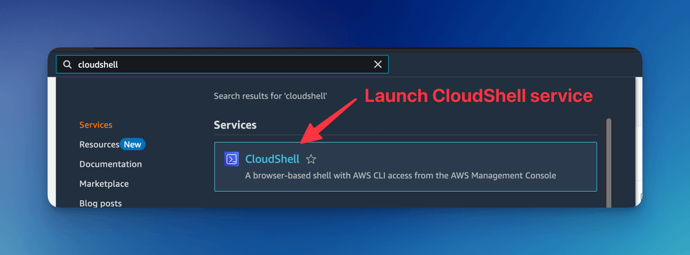

# CloudFormation Troubleshooting

This tutorial shows you how to use **AWS CloudShell** to run a helper script (`list-cfn-events.sh`) that gathers and displays all CloudFormation events. This will show you how to quickly zero in on the resource and error message responsible for a deployment failure.

## Open AWS CloudShell

* Sign in to the [AWS Management Console](https://console.aws.amazon.com/).

* Click the **CloudShell** icon in the top navigation bar (looks like a “>_” prompt).



## Download the Script

In CloudShell’s terminal, download the pre-built script:

```bash
curl -O https://docs.formkiq.com/scripts/list-cfn-events.sh
chmod +x list-cfn-events.sh
```

:::note
The chmod +x command sets the script’s execute permission bit, making it executable so you can run it directly with ./list-cfn-events.sh.
:::

## Run the Script

Execute the script, passing your root stack’s name and saving the output into a file:

```bash
./list-cfn-events.sh my-root-stack-name > output
```

You’ll see output like:

```
========================================
  CloudFormation Events for Stack:
      my-root-stack-name
    (since 2025-06-14T14:30:22Z to now)
========================================

2025-06-14T15:02:10Z    MyBucket        CREATE_COMPLETE    AWS::S3::Bucket        -
2025-06-14T15:01:58Z    MyBucketPolicy  CREATE_FAILED      AWS::S3::BucketPolicy  Policy already exists
…
```

The script then repeats the header-and-events block for each nested stack.

The output file can be downloaded by selecting **Download File** under the **Actions** menu.


## Interpret the Results

* Look for *_FAILED statusesAny line where the Status column ends in _FAILED indicates the resource that caused the rollback or failure.

* Read the Status ReasonThe final column often contains the AWS-reported error message (e.g. “Policy already exists”, “Access denied”, etc.).

* Nested Stack ContextIf the failure occurs inside a nested stack, you’ll see it under that nested stack’s header—so you know exactly which template and resource need fixing.
```