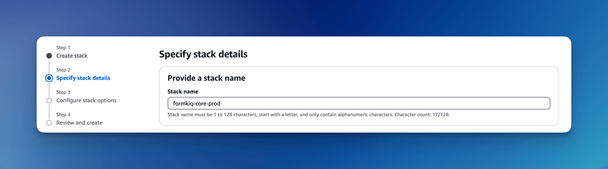
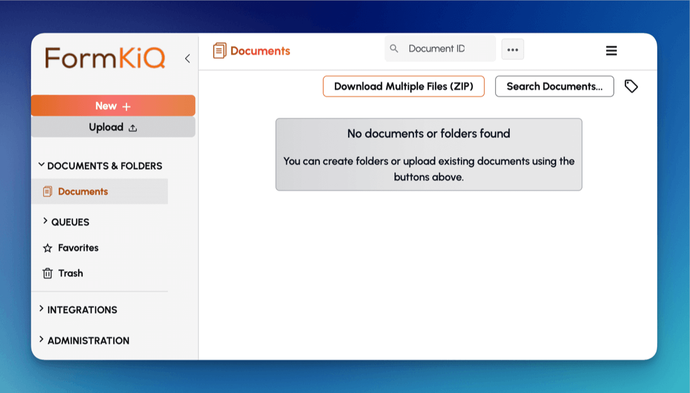
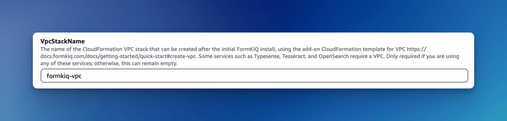

# Quick Start (AWS)

**Deploying FormKiQ into your AWS account with CloudFormation.**

Deploy and configure FormKiQ in your AWS account in approximately 15 minutes using AWS CloudFormation. The automated setup process provisions and connects all required resources through a streamlined installation workflow.

import Head from '@docusaurus/Head';

<Head>

  {/* VideoObject Schema for the embedded YouTube video */}
  <script type="application/ld+json">
    {JSON.stringify({
      "@context": "https://schema.org",
      "@type": "VideoObject",
      "name": "Deploying FormKiQ Core's Document Management Platform into Your AWS Account",
      "description": "Learn how to deploy and configure FormKiQ in your AWS account in approximately 15 minutes using AWS CloudFormation.",
      "thumbnailUrl": "https://i.ytimg.com/vi/G5R6ldbHYKs/hqdefault.jpg",
      "uploadDate": "2023-01-01T08:00:00+08:00",
      "contentUrl": "https://www.youtube.com/watch?v=G5R6ldbHYKs",
      "embedUrl": "https://www.youtube.com/embed/G5R6ldbHYKs"
    })}
  </script>

  {/* HowTo Schema for the installation process */}
  <script type="application/ld+json">
    {JSON.stringify({
      "@context": "https://schema.org",
      "@type": "HowTo",
      "name": "How to Deploy FormKiQ in Your AWS Account",
      "description": "Step-by-step guide to deploy FormKiQ document management platform in your AWS account using CloudFormation.",
      "step": [
        {
          "@type": "HowToStep",
          "name": "Check Prerequisites",
          "text": "Ensure you have an AWS account with administrator access, AWS Lambda Concurrent Executions, and AWS Service Role for ECS enabled."
        },
        {
          "@type": "HowToStep",
          "name": "Select Installation Link",
          "text": "Choose the installation link for your AWS region to launch the CloudFormation template."
        },
        {
          "@type": "HowToStep",
          "name": "Configure Stack",
          "text": "Set stack name and configure installation parameters including admin email and app environment."
        },
        {
          "@type": "HowToStep",
          "name": "Create Stack",
          "text": "Review configuration and create the CloudFormation stack."
        },
        {
          "@type": "HowToStep",
          "name": "Configure Admin Password",
          "text": "Check admin email for verification link and set admin password."
        }
      ]
    })}
  </script>

</Head>

<div
  style={{
    position: "relative",
    paddingBottom: "56.25%", // 16:9 aspect ratio
    height: 0,
    overflow: "hidden"
  }}
>
  <iframe
    src="https://www.youtube.com/embed/G5R6ldbHYKs"
    title="Deploying FormKiQ Core's Document Management Platform into Your AWS Account"
    frameBorder="0"
    allow="accelerometer; autoplay; clipboard-write; encrypted-media; gyroscope; picture-in-picture"
    allowFullScreen
    style={{
      position: "absolute",
      top: 0,
      left: 0,
      width: "100%",
      height: "100%"
    }}
  />
</div>

## Prerequisites

For this quickstart you will need access to an AWS account with administrator access to ensure proper permissions for creating required AWS services.

If you do not have a AWS account, you can sign up for one at https://aws.amazon.com.

### AWS Lambda Concurrent Executions

Concurrent executions refer to the number of function invocations being handled simultaneously. [AWS Lambda](https://aws.amazon.com/pm/lambda) defaults to **10** concurrent executions per region. Request an increase to **1000** before installation.

#### Check Concurrent Executions


Run **aws cli** command:

```bash
aws service-quotas get-service-quota --service-code lambda \
--quota-code L-B99A9384 --region <AWS_REGION>
```

Resulting **Value** shows the AWS Lambda Concurrent executions.

```json
{
    "Quota": {
        "ServiceCode": "lambda",
        "ServiceName": "AWS Lambda",
        "QuotaCode": "L-B99A9384",
        "QuotaName": "Concurrent executions",
        "Value": 1000.0,
        "Unit": "None",
        ...
    }
}
```

:::note
Request this increase for each region where you'll deploy FormKiQ.
:::

#### Request Concurrent Executions Increase

Request through the Service Quotas Dashboard:

| AWS Region | Location | Request Increase Link |
|------------|-----------|-------------------|
| us-east-1 | N. Virginia | [Request Increase](https://us-east-1.console.aws.amazon.com/servicequotas/home/services/lambda/quotas) |
| us-east-2 | Ohio | [Request Increase](https://us-east-2.console.aws.amazon.com/servicequotas/home/services/lambda/quotas) |
| us-west-2 | Oregon | [Request Increase](https://us-west-2.console.aws.amazon.com/servicequotas/home/services/lambda/quotas) |
| ca-central-1 | Canada (Central) | [Request Increase](https://ca-central-1.console.aws.amazon.com/servicequotas/home/services/lambda/quotas) |
| eu-central-1 | Frankfurt | [Request Increase](https://eu-central-1.console.aws.amazon.com/servicequotas/home/services/lambda/quotas) |
| eu-west-1 | Ireland | [Request Increase](https://eu-west-1.console.aws.amazon.com/servicequotas/home/services/lambda/quotas) |
| eu-west-2 | London | [Request Increase](https://eu-west-2.console.aws.amazon.com/servicequotas/home/services/lambda/quotas) |
| eu-west-3 | Paris | [Request Increase](https://eu-west-3.console.aws.amazon.com/servicequotas/home/services/lambda/quotas) |
| eu-north-1  | Stockholm | [Request Increase](https://eu-north-1.console.aws.amazon.com/servicequotas/home/services/lambda/quotas) |
| eu-south-1  | Milan | [Request Increase](https://eu-south-1.console.aws.amazon.com/servicequotas/home/services/lambda/quotas) |
| ap-south-1 | Mumbai | [Request Increase](https://ap-sout-1.console.aws.amazon.com/servicequotas/home/services/lambda/quotas) |
| ap-southeast-1 | Singapore | [Request Increase](https://ap-southeast-1.console.aws.amazon.com/servicequotas/home/services/lambda/quotas) |
| ap-southeast-2 | Sydney | [Request Increase](https://ap-southeast-2.console.aws.amazon.com/servicequotas/home/services/lambda/quotas) |
| ap-northeast-1 | Tokyo | [Request Increase](https://ap-northeast-1.console.aws.amazon.com/servicequotas/home/services/lambda/quotas) |
| ap-northeast-2 | Seoul | [Request Increase](https://ap-northeast-2.console.aws.amazon.com/servicequotas/home/services/lambda/quotas) |
| af-south-1 | Cape Town | [Request Increase](https://af-south-1.console.aws.amazon.com/servicequotas/home/services/lambda/quotas) |
| sa-east-1 | São Paulo | [Request Increase](https://sa-east-1.console.aws.amazon.com/servicequotas/home/services/lambda/quotas) |
| me-central-1 | Middle East (UAE) | [Request Increase](https://me-central-1.console.aws.amazon.com/servicequotas/home/services/lambda/quotas) |
| me-south-1 | Bahrain | [Request Increase](https://me-south-1.console.aws.amazon.com/servicequotas/home/services/lambda/quotas) |

For more information, see the [AWS Tutorial on Requesting a Quota Increase](https://aws.amazon.com/getting-started/hands-on/request-service-quota-increase/).

### AWS Service Role For ECS

Verify that AWSServiceRoleForECS is enabled on your AWS Account before installation.


Run **aws cli** command:

```bash
aws iam create-service-linked-role --aws-service-name ecs.amazonaws.com
```

:::note
An error message "Service role name AWSServiceRoleForECS has been taken in this account" indicates this step is already complete.
:::

## Installation Links

**For installation support, feedback, or updates, [please join our FormKiQ Slack Community](https://join.slack.com/t/formkiqcommunity/shared_invite/zt-2ki1i21w1-9ZYagvhY7ex1pH5Cyg2O3g)**

:::note
Ensure you've completed the prerequisites and enabled AWSServiceRoleforECS.
:::

The FormKiQ installation uses [AWS CloudFormation](https://docs.aws.amazon.com/cloudformation) to automate resource creation and management.

Select your AWS region from the installation links below:

| AWS Region | Location | Install Link |
|------------|-----------|------------|
| us-east-1 | N. Virginia | [Install FormKiQ](https://console.aws.amazon.com/cloudformation/home?region=us-east-1#/stacks/new?stackName=formkiq-prod&templateURL=https://formkiq-core-distribution-us-east-1.s3.amazonaws.com/1.18.0/template.yaml) |
| us-east-2 | Ohio | [Install FormKiQ](https://console.aws.amazon.com/cloudformation/home?region=us-east-2#/stacks/new?stackName=formkiq-prod&templateURL=https://formkiq-core-distribution-us-east-2.s3.amazonaws.com/1.18.0/template.yaml) |
| us-west-2 | Oregon | [Install FormKiQ](https://console.aws.amazon.com/cloudformation/home?region=us-west-2#/stacks/new?stackName=formkiq-prod&templateURL=https://formkiq-core-distribution-us-west-2.s3.amazonaws.com/1.18.0/template.yaml) |
| ca-central-1 | Canada (Central) | [Install FormKiQ](https://console.aws.amazon.com/cloudformation/home?region=ca-central-1#/stacks/new?stackName=formkiq-prod&templateURL=https://formkiq-core-distribution-ca-central-1.s3.amazonaws.com/1.18.0/template.yaml) |
| eu-central-1 | Frankfurt | [Install FormKiQ](https://console.aws.amazon.com/cloudformation/home?region=eu-central-1#/stacks/new?stackName=formkiq-prod&templateURL=https://formkiq-core-distribution-eu-central-1.s3.amazonaws.com/1.18.0/template.yaml) |
| eu-west-1 | Ireland | [Install FormKiQ](https://console.aws.amazon.com/cloudformation/home?region=eu-west-1#/stacks/new?stackName=formkiq-prod&templateURL=https://formkiq-core-distribution-eu-west-1.s3.amazonaws.com/1.18.0/template.yaml) |
| eu-west-2 | London | [Install FormKiQ](https://console.aws.amazon.com/cloudformation/home?region=eu-west-2#/stacks/new?stackName=formkiq-prod&templateURL=https://formkiq-core-distribution-eu-west-2.s3.amazonaws.com/1.18.0/template.yaml) |
| eu-west-3 | Paris | [Install FormKiQ](https://console.aws.amazon.com/cloudformation/home?region=eu-west-3#/stacks/new?stackName=formkiq-prod&templateURL=https://formkiq-core-distribution-eu-west-3.s3.amazonaws.com/1.18.0/template.yaml) |
| eu-north-1 | Stockholm | [Install FormKiQ](https://console.aws.amazon.com/cloudformation/home?region=eu-north-1#/stacks/new?stackName=formkiq-prod&templateURL=https://formkiq-core-distribution-eu-north-1.s3.amazonaws.com/1.18.0/template.yaml) |
| eu-south-1 | Milan | [Install FormKiQ](https://console.aws.amazon.com/cloudformation/home?region=eu-south-1#/stacks/new?stackName=formkiq-prod&templateURL=https://formkiq-core-distribution-eu-south-1.s3.amazonaws.com/1.18.0/template.yaml) |
| ap-south-1 | Mumbai | [Install FormKiQ](https://console.aws.amazon.com/cloudformation/home?region=ap-south-1#/stacks/new?stackName=formkiq-prod&templateURL=https://formkiq-core-distribution-ap-south-1.s3.amazonaws.com/1.18.0/template.yaml) |
| ap-southeast-1 | Singapore | [Install FormKiQ](https://console.aws.amazon.com/cloudformation/home?region=ap-southeast-1#/stacks/new?stackName=formkiq-prod&templateURL=https://formkiq-core-distribution-ap-southeast-1.s3.amazonaws.com/1.18.0/template.yaml) |
| ap-southeast-2 | Sydney | [Install FormKiQ](https://console.aws.amazon.com/cloudformation/home?region=ap-southeast-2#/stacks/new?stackName=formkiq-prod&templateURL=https://formkiq-core-distribution-ap-southeast-2.s3.amazonaws.com/1.18.0/template.yaml) |
| ap-northeast-1 | Tokyo | [Install FormKiQ](https://console.aws.amazon.com/cloudformation/home?region=ap-northeast-1#/stacks/new?stackName=formkiq-prod&templateURL=https://formkiq-core-distribution-ap-northeast-1.s3.amazonaws.com/1.18.0/template.yaml) |
| ap-northeast-2 | Seoul | [Install FormKiQ](https://console.aws.amazon.com/cloudformation/home?region=ap-northeast-2#/stacks/new?stackName=formkiq-prod&templateURL=https://formkiq-core-distribution-ap-northeast-2.s3.amazonaws.com/1.18.0/template.yaml) |
| af-south-1 | Cape Town | [Install FormKiQ](https://console.aws.amazon.com/cloudformation/home?region=af-south-1#/stacks/new?stackName=formkiq-prod&templateURL=https://formkiq-core-distribution-af-south-1.s3.amazonaws.com/1.18.0/template.yaml) |
| sa-east-1 | São Paulo | [Install FormKiQ](https://console.aws.amazon.com/cloudformation/home?region=sa-east-1#/stacks/new?stackName=formkiq-prod&templateURL=https://formkiq-core-distribution-sa-east-1.s3.amazonaws.com/1.18.0/template.yaml) |
| me-central-1 | Middle East (UAE) | [Install FormKiQ](https://console.aws.amazon.com/cloudformation/home?region=me-central-1#/stacks/new?stackName=formkiq-prod&templateURL=https://formkiq-core-distribution-me-central-1.s3.amazonaws.com/1.18.0/template.yaml) |
| me-south-1 | Bahrain | [Install FormKiQ](https://console.aws.amazon.com/cloudformation/home?region=me-south-1#/stacks/new?stackName=formkiq-prod&templateURL=https://formkiq-core-distribution-me-south-1.s3.amazonaws.com/1.18.0/template.yaml) |

:::note
- For unlisted regions, use [SAM CLI installation](#install-with-sam-cli)
- FormKiQ Core supports AWS GovCloud (US) West but not East
- AWS China installations are not currently supported
- **FormKiQ Essentials, Advanced, and Enterprise users:** use your custom CloudFormation template links provided by the FormKiQ team
:::

## Install FormKiQ

After selecting your region, you'll see the AWS CloudFormation Console with the FormKiQ installation URL pre-populated.


Click **Next** to continue.

### Set Stack Name

Name your stack using the format **formkiq-core-&lt;app_environment&gt;** (e.g., formkiq-prod).



:::note
For production, we recommend using [AWS Organizations](https://aws.amazon.com/organizations) and separate accounts for different environments.
:::

### Installation Parameters

Configure your installation:


#### Required Parameters
- **AdminEmail**: Administrator email address
- **AppEnvironment**: Environment identifier (prod, staging, dev, etc.)

#### Optional Parameters
- **CapacityProvider**: AWS Fargate capacity provider (for Typesense)
- **EnablePublicUrls**: Enable public endpoints (default: false)
- **PasswordMinimumLength**: Minimum password length
- **Password Requirements**: Several properties to configure requirements for length, lowercase, numbers, symbols, and uppercase
- **TypesenseApiKey**: API key for Typesense
- **TypesenseMemory**: Typesense memory allocation
- **VpcStackName**: VPC stack name (used for Typesense or OpenSearch)

### Configure Stack Options

Select **ALL** checkboxes at the bottom.


Click **Next** to proceed.

### Review and Create

Review your configuration and click **Submit**.


:::info
- Installation takes 15-30 minutes
- You'll receive an admin email when complete
:::

### Configure Admin Password

1. Check your admin email for the verification link
2. Click "Verify Email" to set your password


3. Set your admin password


4. Access the FormKiQ Console



:::note
AWS GovCloud (US) requires [manual admin user creation](/docs/platform/document_console#initial-setup).
:::

## Install VPC

For Typesense or OpenSearch, install the VPC stack:

Select your region's VPC template:

| AWS Region | Location | Install Link |
|------------|-----------|------------|
| us-east-1 | N. Virginia | [Install VPC](https://console.aws.amazon.com/cloudformation/home?region=us-east-1#/stacks/new?stackName=formkiq-vpc&templateURL=https://formkiq-core-distribution-us-east-1.s3.amazonaws.com/1.18.0/vpc.yaml) |
| us-east-2 | Ohio | [Install VPC](https://console.aws.amazon.com/cloudformation/home?region=us-east-2#/stacks/new?stackName=formkiq-vpc&templateURL=https://formkiq-core-distribution-us-east-2.s3.amazonaws.com/1.18.0/vpc.yaml) |
| us-west-2 | Oregon | [Install VPC](https://console.aws.amazon.com/cloudformation/home?region=us-west-2#/stacks/new?stackName=formkiq-vpc&templateURL=https://formkiq-core-distribution-us-west-2.s3.amazonaws.com/1.18.0/vpc.yaml) |
| ca-central-1 | Canada (Central) | [Install VPC](https://console.aws.amazon.com/cloudformation/home?region=ca-central-1#/stacks/new?stackName=formkiq-vpc&templateURL=https://formkiq-core-distribution-ca-central-1.s3.amazonaws.com/1.18.0/vpc.yaml) |
| eu-central-1 | Frankfurt | [Install VPC](https://console.aws.amazon.com/cloudformation/home?region=eu-central-1#/stacks/new?stackName=formkiq-vpc&templateURL=https://formkiq-core-distribution-eu-central-1.s3.amazonaws.com/1.18.0/vpc.yaml) |
| eu-west-1 | Ireland | [Install VPC](https://console.aws.amazon.com/cloudformation/home?region=eu-west-1#/stacks/new?stackName=formkiq-vpc&templateURL=https://formkiq-core-distribution-eu-west-1.s3.amazonaws.com/1.18.0/vpc.yaml) |
| eu-west-2 | London | [Install VPC](https://console.aws.amazon.com/cloudformation/home?region=eu-west-2#/stacks/new?stackName=formkiq-vpc&templateURL=https://formkiq-core-distribution-eu-west-2.s3.amazonaws.com/1.18.0/vpc.yaml) |
| eu-west-3 | Paris | [Install VPC](https://console.aws.amazon.com/cloudformation/home?region=eu-west-3#/stacks/new?stackName=formkiq-vpc&templateURL=https://formkiq-core-distribution-eu-west-3.s3.amazonaws.com/1.18.0/vpc.yaml) |
| eu-north-1 | Stockholm | [Install VPC](https://console.aws.amazon.com/cloudformation/home?region=eu-north-1#/stacks/new?stackName=formkiq-vpc&templateURL=https://formkiq-core-distribution-eu-north-1.s3.amazonaws.com/1.18.0/vpc.yaml) |
| eu-south-1 | Milan | [Install VPC](https://console.aws.amazon.com/cloudformation/home?region=eu-south-1#/stacks/new?stackName=formkiq-vpc&templateURL=https://formkiq-core-distribution-eu-south-1.s3.amazonaws.com/1.18.0/vpc.yaml) |
| ap-south-1 | Mumbai | [Install VPC](https://console.aws.amazon.com/cloudformation/home?region=ap-south-1#/stacks/new?stackName=formkiq-vpc&templateURL=https://formkiq-core-distribution-ap-south-1.s3.amazonaws.com/1.18.0/vpc.yaml) |
| ap-southeast-1 | Singapore | [Install VPC](https://console.aws.amazon.com/cloudformation/home?region=ap-southeast-1#/stacks/new?stackName=formkiq-vpc&templateURL=https://formkiq-core-distribution-ap-southeast-1.s3.amazonaws.com/1.18.0/vpc.yaml) |
| ap-southeast-2 | Sydney | [Install VPC](https://console.aws.amazon.com/cloudformation/home?region=ap-southeast-2#/stacks/new?stackName=formkiq-vpc&templateURL=https://formkiq-core-distribution-ap-southeast-2.s3.amazonaws.com/1.18.0/vpc.yaml) |
| ap-northeast-1 | Tokyo | [Install VPC](https://console.aws.amazon.com/cloudformation/home?region=ap-northeast-1#/stacks/new?stackName=formkiq-vpc&templateURL=https://formkiq-core-distribution-ap-northeast-1.s3.amazonaws.com/1.18.0/vpc.yaml) |
| ap-northeast-2 | Seoul | [Install VPC](https://console.aws.amazon.com/cloudformation/home?region=ap-northeast-2#/stacks/new?stackName=formkiq-vpc&templateURL=https://formkiq-core-distribution-ap-northeast-2.s3.amazonaws.com/1.18.0/vpc.yaml) |
| af-south-1 | Cape Town | [Install VPC](https://console.aws.amazon.com/cloudformation/home?region=af-south-1#/stacks/new?stackName=formkiq-vpc&templateURL=https://formkiq-core-distribution-af-south-1.s3.amazonaws.com/1.18.0/vpc.yaml) |
| sa-east-1 | São Paulo | [Install VPC](https://console.aws.amazon.com/cloudformation/home?region=sa-east-1#/stacks/new?stackName=formkiq-vpc&templateURL=https://formkiq-core-distribution-sa-east-1.s3.amazonaws.com/1.18.0/vpc.yaml) |
| me-central-1 | Middle East (UAE) | [Install VPC](https://console.aws.amazon.com/cloudformation/home?region=me-central-1#/stacks/new?stackName=formkiq-vpc&templateURL=https://formkiq-core-distribution-me-central-1.s3.amazonaws.com/1.18.0/vpc.yaml) |
| me-south-1 | Bahrain | [Install VPC](https://console.aws.amazon.com/cloudformation/home?region=me-south-1#/stacks/new?stackName=formkiq-vpc&templateURL=https://formkiq-core-distribution-me-south-1.s3.amazonaws.com/1.18.0/vpc.yaml) |

### Create CloudFormation Stack

After selecting your VPC installation link and logging in, you'll see the CloudFormation Create Stack console with the pre-populated FormKiQ VPC installation URL.


Click the **Next** button to move to the next page.

### Set Stack Name

The stack name uniquely identifies your FormKiQ VPC deployment within AWS CloudFormation. 

We recommended to use the naming convention **formkiq-vpc**.


### Installation Parameters

The following is description of the VPC installation parameters:


#### **EnableEnterpriseFeatures**:

If you are using OpenSearch, you need to enable enterprise features, which automatically setups VPC endpoints.

:::note
This is not required for FormKiQ Core.
:::

#### **CIDR Ranges**:

The VPC sets up 3 public, and 3 private subnets.

When creating the VPC, you need to specify an IPv4 network range for the VPC, in CIDR notation. For example, 10.1.0.0/16.

:::note
We recommend choosing a CIDR block that you know is not being used by any existing AWS resources in your AWS Organization. Ideally, each AWS account (one for each environment) is using its own CIDR range, e.g., 10.10.0.0/16 for dev, 10.20.0.0/16 for test/qa, etc.
:::

#### **VpcLabel**:

The label added to the created VPC. This will be visible in the AWS Management Console when viewing your VPCs, and will help identify this VPC in future.

### Configure stack options

Scroll down to the bottom of the page, select **ALL** the checkboxes.


Click the **Next** button to move to the next page.

### Review and create

Scroll down to the bottom.


Click the **Submit** button to start the VPC installation.

:::info
Once the installation has completed, you will need to attach this Stack to your FormKiQ installation, by updating the **VpcStackName** parameter.
:::

## Update FormKiQ

**This step is essential in order to enable access to Typesense or OpenSearch**

After creating the VPC stack, the main FormKiQ CloudFormation stack needs to be updated. Select the FormKiQ CloudFormation stack and then click the **Update** button.

When updating the stack you will want to choose **Use existing template**.


For the **VpcStackName** parameter, set the value to the same value you used for the VPC stack you created above; in our example, it was **formkiq-vpc**.




Click the **Next** button to move to the next pages. On the last page click the **Submit** button to update the FormKiQ stack. After the Stack completes updating, the FormKiQ installation will have the VPC features enabled.

## Install with SAM CLI

FormKiQ Core was built using the [AWS Serverless Application Model (SAM)](https://aws.amazon.com/serverless/sam/) framework.

The Serverless Application Model Command Line Interface (SAM CLI) is an extension of the AWS CLI that adds functionality for deploying serverless applications.

### Prerequisite

To use SAM CLI, you will need to install the following tools:

* AWS CLI - Install the AWS CLI (https://aws.amazon.com/cli/)
* SAM CLI - Install the SAM CLI (https://docs.aws.amazon.com/serverless-application-model/latest/developerguide/serverless-sam-cli-install.html)

### Get Latest Release

The latest version of FormKiQ Core can be found on the https://github.com/formkiq/formkiq-core/releases page on Github.

Download the file with the naming convention of: `formkiq-core-X.X.X.zip`

Once downloaded, unzip the file in its own directory.

```
INSTALL.md
LICENSE
template.yaml
...
```

### Sam deploy

To deploy FormKiQ Core, run the following command in the same folder as the **template.yaml** file.

```bash
sam deploy --guided --capabilities CAPABILITY_IAM CAPABILITY_AUTO_EXPAND CAPABILITY_NAMED_IAM
```

The command will package and deploy your application to AWS, with a series of prompts:

| Argument | Description | Default Value |
| -------- | ------- | ------- |
| **Stack Name** | The name of the stack to deploy to CloudFormation. This should be unique to your account and region | formkiq-core-&lt;AppEnvironment&gt; |
| **AdminEmail** | Set the admin email address. During the FormKiQ installation, this email address will be automatically set up with administrator access. |
| **AppEnvironment** | AppEnvironment is a unique identifier for FormKiQ installations. The identifier should provider context to what kind of information is contained in the installation, IE: prod, staging, dev. | prod |
| **EnablePublicUrls** | Whether to enable "/public" endpoints. | false
| **PasswordMinimumLength** | Minimum Password Length | 8
| **PasswordRequireLowercase** | Whether Password requires a lowercase letter | false
| **PasswordRequireNumbers** | Whether Password requires a number | false
| **PasswordRequireSymbols** | Whether Password requires a symbol | false
| **PasswordRequireUppercase** | Whether Password requires a uppercase letter | false
| **VpcStackName** | Optional: The name of the FormKiQ VPC CloudFormation stack | null
| **TypesenseApiKey** | Optional: API Key to access the Typesense server | null
| **CapacityProvider** | Optional: CapacityProvider used by AWS Fargate service | FARGATE_SPOT


* **Confirm changes before deploy**: If set to yes, any change sets will be shown to you before execution for manual review. If set to no, the AWS SAM CLI will automatically deploy application changes.
* **Allow SAM CLI IAM role creation**: FormKiQ Core's AWS SAM templates create AWS IAM roles required for the AWS Lambda function(s) included to access AWS services. The permissions are passed in by the `sam deploy` command above. Set Value to 'Y'
* **Save arguments to samconfig.toml**: If set to yes, your choices will be saved to a configuration file inside the project, so that in the future you can just re-run `sam deploy` without parameters to deploy changes to your application.

Once you have set all of these options, SAM CLI will create a changeset and will display a list of all actions that will be performed as part of the changeset. If you have set "confirm changes before deploy" to "y", you will then be asked whether or nor to deploy this changeset. Choose "y" to complete the installation.

Once the FormKiQ Core stack has been deployed, you will be able to find your API Gateway Endpoint URL in the output values displayed after deployment.

### FormKiQ Console for AWS GovCloud (US)

Due to restrictions related to AWS GovCloud (US) and the lack of CloudFront availability, the FormKiQ Document Console is not installed as part of the deployment. Instead, you can deploy a docker image into GovCloud for internal or external access. [More information can be found here](/docs/platform/document_console#docker-deployment).

## API Walkthrough and Reference

To try out the API, try our [API Walkthrough](/docs/getting-started/api-walkthrough/). You can also check out the [FormKiQ API Reference](/docs/category/api-reference) for more endpoints you can try out.

## CloudFormation Troubleshooting

If your stack fails to complete, follow our [CloudFormation Troubleshooting](/docs/getting-started/cloudformation-troubleshooting/) guide.