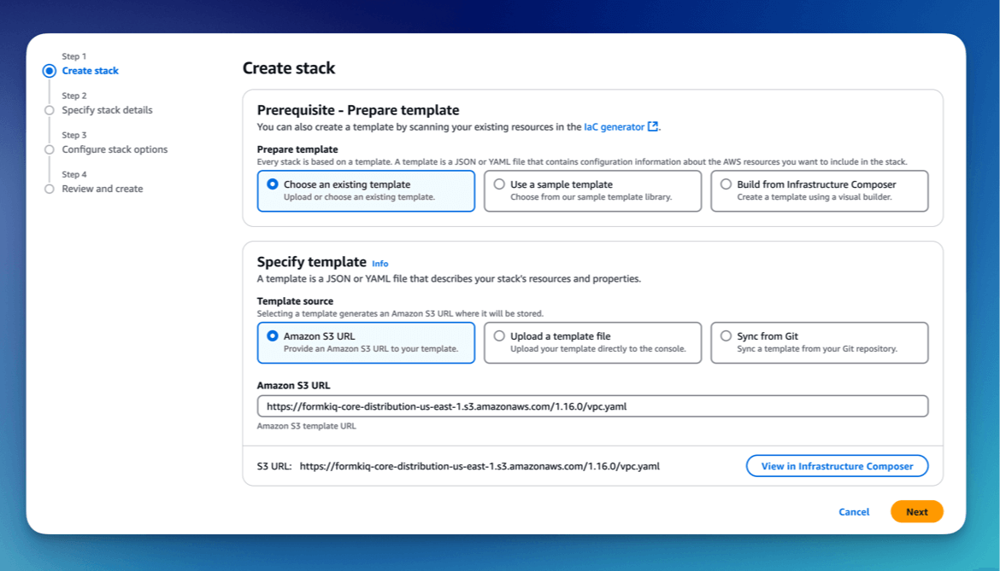
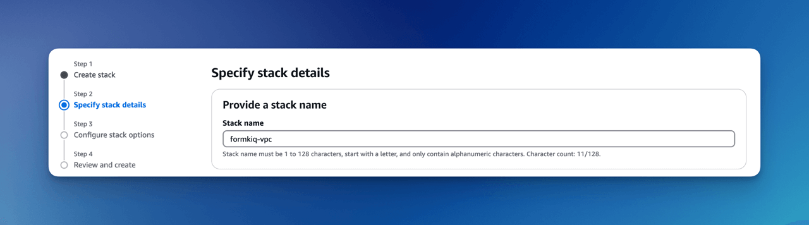
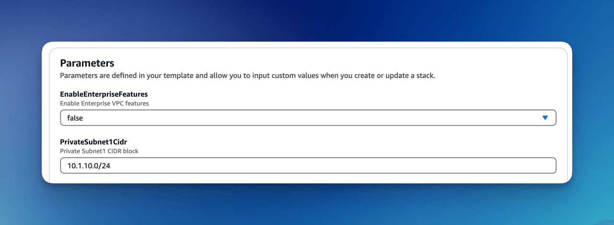
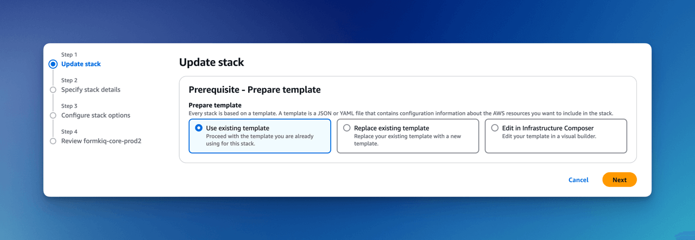

# Quick Start (AWS)

**A quick start guide for deploying FormKiQ into your AWS account using CloudFormation.**

Deploying FormKiQ into your AWS account is quick and seamless with AWS CloudFormation, enabling you to automate the setup of the FormKiQ platform.

To get started, select the CloudFormation template URL corresponding to your region from the provided list. The CloudFormation template will walk you through the configuration parameters to custom your FormKiQ installation.

AWS CloudFormation will handle the deployment process, automatically provisioning and connecting all required resources. In about 15 minutes, your FormKiQ platform will be live and ready to use.

## Prerequisites

For this quickstart you will need access to an AWS account, preferably with administrator access. The FormKiQ installation will create a number of AWS services and using an account with administrator access will ensure you have the correct permissions.

If you do not have a AWS account, you can sign up for one at https://aws.amazon.com.

### AWS Lambda Concurrent Executions

Concurrent executions refer to the number of function invocations that are being handled simultaneously. Each time your Lambda function is invoked, a new instance of the function is created to handle the request. [AWS Lambda](https://aws.amazon.com/pm/lambda) imposes default concurrency limits to prevent misuse and manage resource allocation.

By default, AWS limits the number of concurrent executions for [Lambda](https://aws.amazon.com/pm/lambda) functions to **10** per AWS region. It is recommended that you request to have this increased to account default of **1000**.

#### Check Concurrent Executions


Run **aws cli** command:

```
aws service-quotas get-service-quota --service-code lambda \
--quota-code L-B99A9384 --region <AWS_REGION>
```

Resulting **Value** shows the AWS Lambda Concurrent executions.

```
{
    "Quota": {
        "ServiceCode": "lambda",
        "ServiceName": "AWS Lambda",
        "QuotaCode": "L-B99A9384",
        "QuotaName": "Concurrent executions",
        "Value": 1000.0,
        "Unit": "None",
        ...
    }
}
```

:::note
This increase must be requested for each region FormKiQ will be deployed into.
:::

#### Request Concurrent Executions Increase

You can request this increase via the Service Quotas Dashboard:

| AWS Region    | Request Increase Link |
| -------- | ------- |
| us-east-1 | https://us-east-1.console.aws.amazon.com/servicequotas/home/services/lambda/quotas |
| us-east-2 | https://us-east-2.console.aws.amazon.com/servicequotas/home/services/lambda/quotas |
| us-west-2 | https://us-west-2.console.aws.amazon.com/servicequotas/home/services/lambda/quotas |
| ca-central-1 | https://ca-central-1.console.aws.amazon.com/servicequotas/home/services/lambda/quotas |
| eu-central-1 | https://eu-central-1.console.aws.amazon.com/servicequotas/home/services/lambda/quotas |
| eu-west-1 | https://eu-west-1.console.aws.amazon.com/servicequotas/home/services/lambda/quotas |
| eu-west-3 | https://eu-west-3.console.aws.amazon.com/servicequotas/home/services/lambda/quotas |
| ap-south-1 | https://ap-sout-1.console.aws.amazon.com/servicequotas/home/services/lambda/quotas |
| ap-southeast-1 | https://ap-southeast-1.console.aws.amazon.com/servicequotas/home/services/lambda/quotas |
| ap-southeast-2 | https://ap-southeast-2.console.aws.amazon.com/servicequotas/home/services/lambda/quotas |
| ap-northeast-2 | https://ap-northeast-2.console.aws.amazon.com/servicequotas/home/services/lambda/quotas |
| sa-east-1 | https://sa-east-1.console.aws.amazon.com/servicequotas/home/services/lambda/quotas |

For more information, please refer to this [AWS Tutorial on Requesting a Quota Increase](https://aws.amazon.com/getting-started/hands-on/request-service-quota-increase/).


### AWS Service Role For ECS

Before installation verify that the AWSServiceRoleForECS has been enabled on your AWS Account. 


Run **aws cli** command:

```
aws iam create-service-linked-role --aws-service-name ecs.amazonaws.com
```
:::note
You will receive a message such as `An error occurred (InvalidInput) when calling the CreateServiceLinkedRole operation: Service role name AWSServiceRoleForECS has been taken in this account, please try a different suffix.`

This means that this step has already been performed, either in CloudShell or by a previous FormKiQ installation process, so you do not need to take any further action.

If you attempted to run a FormKiQ installation before doing this step, the installation will likely have failed, but will likely have created this role, so you would receive this error message.

In either of these cases, you should now be able to install FormKiQ in your AWS Account.
:::


## Installation Links

**For installation support, feedback, or updates, [please join our FormKiQ Slack Community](https://join.slack.com/t/formkiqcommunity/shared_invite/zt-2ki1i21w1-9ZYagvhY7ex1pH5Cyg2O3g)**

:::note
NOTE: Please ensure you've read the Prerequisites above and that AWSServiceRoleforECS has been enabled for your account.
:::

The FormKiQ installation process uses [AWS CloudFormation](https://docs.aws.amazon.com/cloudformation). AWS CloudFormation is a service that automates the process of creating and managing cloud resources. It allows you to easily install and update FormKiQ using a single url.

To install FormKiQ, **click** the installation link for the AWS region you want to deploy FormKiQ into below:

| AWS Region    | Install Link | AWS Region    | Install Link | 
| -------- | ------- | -------- | ------- |
| us-east-1 | [Install FormKiQ](https://console.aws.amazon.com/cloudformation/home?region=us-east-1#/stacks/new?stackName=formkiq-core-prod&templateURL=https://formkiq-core-distribution-us-east-1.s3.amazonaws.com/1.16.0/template.yaml)| us-east-2 | [Install FormKiQ](https://console.aws.amazon.com/cloudformation/home?region=us-east-2#/stacks/new?stackName=formkiq-core-prod&templateURL=https://formkiq-core-distribution-us-east-2.s3.amazonaws.com/1.16.0/template.yaml)|
| us-west-2 | [Install FormKiQ](https://console.aws.amazon.com/cloudformation/home?region=us-west-2#/stacks/new?stackName=formkiq-core-prod&templateURL=https://formkiq-core-distribution-us-west-2.s3.amazonaws.com/1.16.0/template.yaml)| ca-central-1 | [Install FormKiQ](https://console.aws.amazon.com/cloudformation/home?region=ca-central-1#/stacks/new?stackName=formkiq-core-prod&templateURL=https://formkiq-core-distribution-ca-central-1.s3.amazonaws.com/1.16.0/template.yaml)|
| eu-central-1 | [Install FormKiQ](https://console.aws.amazon.com/cloudformation/home?region=eu-central-1#/stacks/new?stackName=formkiq-core-prod&templateURL=https://formkiq-core-distribution-eu-central-1.s3.amazonaws.com/1.16.0/template.yaml)| eu-west-1 | [Install FormKiQ](https://console.aws.amazon.com/cloudformation/home?region=eu-west-1#/stacks/new?stackName=formkiq-core-prod&templateURL=https://formkiq-core-distribution-eu-west-1.s3.amazonaws.com/1.16.0/template.yaml)|
| eu-west-3 | [Install FormKiQ](https://console.aws.amazon.com/cloudformation/home?region=eu-west-3#/stacks/new?stackName=formkiq-core-prod&templateURL=https://formkiq-core-distribution-eu-west-3.s3.amazonaws.com/1.16.0/template.yaml)| ap-south-1 | [Install FormKiQ](https://console.aws.amazon.com/cloudformation/home?region=ap-south-1#/stacks/new?stackName=formkiq-core-prod&templateURL=https://formkiq-core-distribution-ap-south-1.s3.amazonaws.com/1.16.0/template.yaml)|
| ap-southeast-1 | [Install FormKiQ](https://console.aws.amazon.com/cloudformation/home?region=ap-southeast-1#/stacks/new?stackName=formkiq-core-prod&templateURL=https://formkiq-core-distribution-ap-southeast-1.s3.amazonaws.com/1.16.0/template.yaml)| ap-southeast-2 | [Install FormKiQ](https://console.aws.amazon.com/cloudformation/home?region=ap-southeast-2#/stacks/new?stackName=formkiq-core-prod&templateURL=https://formkiq-core-distribution-ap-southeast-2.s3.amazonaws.com/1.16.0/template.yaml)|
| ap-northeast-2 | [Install FormKiQ](https://console.aws.amazon.com/cloudformation/home?region=ap-northeast-2#/stacks/new?stackName=formkiq-core-prod&templateURL=https://formkiq-core-distribution-ap-northeast-2.s3.amazonaws.com/1.16.0/template.yaml)| sa-east-1 | [Install FormKiQ](https://console.aws.amazon.com/cloudformation/home?region=sa-east-1#/stacks/new?stackName=formkiq-core-prod&templateURL=https://formkiq-core-distribution-sa-east-1.s3.amazonaws.com/1.16.0/template.yaml)|

:::note
If the region you want to use is not listed, follow the [Install with SAM CLI](#install-with-sam-cli).

In addition to most AWS Regions, FormKiQ Core is also available to install using SAM CLI into the **AWS GovCloud (US) West** region; however, it is not currently available for **AWS GovCloud (US) East**.

FormKiQ Core does not currently support **AWS China** installations, mainly due to a mismatch in the AWS product versions available.
:::

:::note
NOTE: For FormKiQ Pro and Enterprise users, you'll find a similar single click installation URL in your custom [GitHub](https://github.com) repository you were provided.
:::

## Install FormKiQ

Clicking the above installation link will bring you to the AWS CloudFormation Console. The FormKiQ installation URL will be auto populated in the **Amazon S3 URL**.


Click the **Next** button to move to the next page.

### Set Stack Name

The stack name uniquely identifies your FormKiQ deployment within AWS CloudFormation. 

We recommended to use the naming convention **formkiq-core-&lt;app_environment&gt;**, ie: formkiq-core-prod, formkiq-core-dev, etc. The **&lt;app_environment&gt;** allows you to differentiate between multiple installations of FormKiQ. This will give context to each FormKiQ installation and prevent accidentally deleting the wrong FormKiQ installation stack.


:::note
For production installations, we recommend using [AWS Organizations](https://aws.amazon.com/organizations) to create a separate account to run your production version of FormKiQ. AWS makes it easy to switch between accounts within an organization, and best practice is to keep your production environment in a separate account from any non-production resources. This not only helps with security, but also to help organize your costs. Ideally, you would have a new AWS account within your AWS organization for each environment (e.g., dev, test/qa, staging/pre-prod, and production).
:::

### Installation Parameters

The following is description of the FormKiQ installation parameters:


#### **AdminEmail** *(Required)*:

The email address of the administrator who will manage the FormKiQ

:::note
Installations to AWS GovCloud (US) do not create an admin user. Instructions for creating an initial user [can be found here](/docs/platform/document_console#creating-the-initial-console-user).
:::

#### **AppEnvironment** *(Required)*:

AppEnvironment is a unique identifier for FormKiQ installations. The identifier should provider context to what kind of information is contained in the installation, IE: prod, staging, dev.

#### **EnablePublicUrls**:

Whether to enable "/public" endpoints, defaults to false. Public endpoints allow external users to submit documents, such as through a web form. As with any publicly-available functionality, there is a risk of abuse if enabled.

:::note
You can always enable/disable your public endpoints at any time by updating your FormKiQ CloudFormation Stack and changing the value you've set.
:::

#### **PasswordMinimumLength**:

Set the Amazon Cognito password policies, minimum password length requirement for all users.

#### **PasswordRequireLowercase**:

Set the Amazon Cognito password policies, to require one lowercase letter in all passwords.

#### **PasswordRequireNumbers**:

Set the Amazon Cognito password policies, to require one number in all passwords.

#### **PasswordRequireSymbols**:

Set the Amazon Cognito password policies, to require one symbol in all passwords.

#### **PasswordRequireUppercase**:

Set the Amazon Cognito password policies, to require one uppercase letter in all passwords.

#### **VpcStackName**:

The name of the CloudFormation VPC stack that can be created after the initial FormKiQ install, using the add-on CloudFormation template for VPC https://docs.formkiq.com/docs/getting-started/quick-start#create-vpc.

Some services such as Typesense, and OpenSearch require a VPC. Only required if you are using any of these services; otherwise, this can remain empty.

#### **TypesenseApiKey**:

Optional: API Key to access the [Typesense](https://typesense.org) server. Typesense is used to provide full text search support for document metadata. The API Key can be any random string of characters. To enable Typesense, the **VpcStackName** also needs to be set (see link:#vpc-cloudformation[VPC CloudFormation]).

#### **TypesenseMemory**:

Amount of memory (in MB) allocated to Typesense (suggested to be 2-3 times the size of your data). Can be left as default if Typesense isn't used.

#### **CapacityProvider**:

AWS Fargate capacity provider to use. (Only required if using Typesense)

:::note
Typesense is optional, since it requires a VPC to be created, which can add to your AWS usage costs. Without Typesense, you will only be able to search documents using tags and the document's created date.
:::

Click the **Next** button to move to the next page.

### Configure stack options

Scroll down to the bottom of the page, select **ALL** the checkboxes.


Click the **Next** button to move to the next page.

### Review and create

Scroll down to the bottom.


Click the **Submit** button to start the FormKiQ installation.

:::info
You will receive an email to the AdminEmail account once the installation is complete. Once you receive your email you can move to the next section to setup your Admin password.
:::

:::note
The CloudFormation installation of your new FormKiQ stack should take between fifteen and thirty minutes.
:::

### Configure Admin Password

Once the FormKiQ CloudFormation installation has completed, an email will be sent to the email specified as the AdminEmail. This email will contain a link that will confirm the email address and allow the recipient to set a password for the administrator account.

* Clicking the **Verify Email** link will allow you to set your administrator password.


:::note
Installations to AWS GovCloud (US) do not include a Welcome email by default, since the admin user needs to created manually. Instructions for creating an initial user [can be found here](/docs/platform/document_console#creating-the-initial-console-user).
:::


#### Set Admin Password

Clicking on the **Verify Email** link will open the FormKiQ console and allow you to set the Admin password.


#### FormKiQ Console

Once your password is set you can now login to the FormKiQ Console.


:::info
Additional FormKiQ users can be created using [Amazon Cognito](/docs/platform/api_security). See [API Security](/docs/platform/api_security) for more information.
:::

:::note
Due to restrictions related to AWS GovCloud (US) and the lack of CloudFront availability, the FormKiQ Document Console is not installed as part of the deployment. Instead, you can deploy a docker image into GovCloud for internal or external access. [More information can be found here](/docs/platform/document_console#docker-image).
:::

## Install VPC

Certain FormKiQ features (e.g. Typesense and the OpenSearch add-on) require a VPC to be configured.

Below is a CloudFormation link to a custom VPC template that works with FormKiQ to add VPC support to FormKiQ.

:::note
Select the link below that is **in the same region as your FormKiQ installation**.
:::

| AWS Region    | Install Link | AWS Region    | Install Link |
| -------- | ------- | -------- | ------- |
| us-east-1 | [Install VPC](https://console.aws.amazon.com/cloudformation/home?region=us-east-1#/stacks/new?stackName=formkiq-vpc&templateURL=https://formkiq-core-distribution-us-east-1.s3.amazonaws.com/1.16.0/vpc.yaml) | us-east-2 | [Install VPC](https://console.aws.amazon.com/cloudformation/home?region=us-east-2#/stacks/new?stackName=formkiq-vpc&templateURL=https://formkiq-core-distribution-us-east-2.s3.amazonaws.com/1.16.0/vpc.yaml) |
| us-west-2 | [Install VPC](https://console.aws.amazon.com/cloudformation/home?region=us-west-2#/stacks/new?stackName=formkiq-vpc&templateURL=https://formkiq-core-distribution-us-west-2.s3.amazonaws.com/1.16.0/vpc.yaml) | ca-central-1 | [Install VPC](https://console.aws.amazon.com/cloudformation/home?region=ca-central-1#/stacks/new?stackName=formkiq-vpc&templateURL=https://formkiq-core-distribution-ca-central-1.s3.amazonaws.com/1.16.0/vpc.yaml) |
| eu-central-1 | [Install VPC](https://console.aws.amazon.com/cloudformation/home?region=eu-central-1#/stacks/new?stackName=formkiq-vpc&templateURL=https://formkiq-core-distribution-eu-central-1.s3.amazonaws.com/1.16.0/vpc.yaml) | eu-west-1 | [Install VPC](https://console.aws.amazon.com/cloudformation/home?region=eu-west-1#/stacks/new?stackName=formkiq-vpc&templateURL=https://formkiq-core-distribution-eu-west-1.s3.amazonaws.com/1.16.0/vpc.yaml) |
| eu-west-3 | [Install VPC](https://console.aws.amazon.com/cloudformation/home?region=eu-west-3#/stacks/new?stackName=formkiq-vpc&templateURL=https://formkiq-core-distribution-eu-west-3.s3.amazonaws.com/1.16.0/vpc.yaml) | ap-south-1 | [Install VPC](https://console.aws.amazon.com/cloudformation/home?region=ap-south-1#/stacks/new?stackName=formkiq-vpc&templateURL=https://formkiq-core-distribution-ap-south-1.s3.amazonaws.com/1.16.0/vpc.yaml) |
| ap-southeast-1 | [Install VPC](https://console.aws.amazon.com/cloudformation/home?region=ap-southeast-1#/stacks/new?stackName=formkiq-vpc&templateURL=https://formkiq-core-distribution-ap-southeast-1.s3.amazonaws.com/1.16.0/vpc.yaml) | ap-southeast-2 | [Install VPC](https://console.aws.amazon.com/cloudformation/home?region=ap-southeast-2#/stacks/new?stackName=formkiq-vpc&templateURL=https://formkiq-core-distribution-ap-southeast-2.s3.amazonaws.com/1.16.0/vpc.yaml) |
| ap-northeast-2 | [Install VPC](https://console.aws.amazon.com/cloudformation/home?region=ap-northeast-2#/stacks/new?stackName=formkiq-vpc&templateURL=https://formkiq-core-distribution-ap-northeast-2.s3.amazonaws.com/1.16.0/vpc.yaml) | sa-east-1 | [Install VPC](https://console.aws.amazon.com/cloudformation/home?region=sa-east-1#/stacks/new?stackName=formkiq-vpc&templateURL=https://formkiq-core-distribution-sa-east-1.s3.amazonaws.com/1.16.0/vpc.yaml) |

### Create CloudFormation Stack

After clicking one of the one-click VPC installation links and logging into your AWS account, you'll be brought to the CloudFormation Create Stack console. The **Amazon S3 URL** is populated with the FormKiQ VPC installation URL.



Click the **Next** button to move to the next page.

### Set Stack Name

The stack name uniquely identifies your FormKiQ VPC deployment within AWS CloudFormation. 

We recommended to use the naming convention **formkiq-vpc**.



### Installation Parameters

The following is description of the VPC installation parameters:



#### **EnableEnterpriseFeatures**:

If you are using OpenSearch, you need to enable enterprise features, which automatically setups VPC endpoints.

:::note
This is not required for FormKiQ Core.
:::

#### **CIDR Ranges**:

The VPC sets up 3 public, and 3 private subnets.

When creating the VPC, you need to specify an IPv4 network range for the VPC, in CIDR notation. For example, 10.1.0.0/16.

:::note
We recommend choosing a CIDR block that you know is not being used by any existing AWS resources in your AWS Organization. Ideally, each AWS account (one for each environment) is using its own CIDR range, e.g., 10.10.0.0/16 for dev, 10.20.0.0/16 for test/qa, etc.
:::

#### **VpcLabel**:

The label added to the created VPC. This will be visible in the AWS Management Console when viewing your VPCs, and will help identify this VPC in future.

### Configure stack options

Scroll down to the bottom of the page, select **ALL** the checkboxes.


Click the **Next** button to move to the next page.

### Review and create

Scroll down to the bottom.


Click the **Submit** button to start the VPC installation.

:::info
Once the installation has completed, you will need to attach this Stack to your FormKiQ installation, by updating the **VpcStackName** parameter.
:::

## Update FormKiQ

**This step is essential in order to enable access to Typesense or OpenSearch**

After creating the VPC stack, the main FormKiQ CloudFormation stack needs to be updated. Select the FormKiQ CloudFormation stack and then click the **Update** button.

When updating the stack you will want to choose **Use existing template**.



For the **VpcStackName** parameter, set the value to the same value you used for the VPC stack you created above; in our example, it was **formkiq-vpc**.


Click the **Next** button to move to the next pages. On the last page click the **Submit** button to update the FormKiQ stack. After the Stack completes updating, the FormKiQ installation will have the VPC features enabled.

## Install with SAM CLI

FormKiQ Core was built using the [AWS Serverless Application Model (SAM)](https://aws.amazon.com/serverless/sam/) framework.

The Serverless Application Model Command Line Interface (SAM CLI) is an extension of the AWS CLI that adds functionality for deploying serverless applications.

### Prerequisite

To use SAM CLI, you will need to install the following tools:

* AWS CLI - Install the AWS CLI (https://aws.amazon.com/cli/)
* SAM CLI - Install the SAM CLI (https://docs.aws.amazon.com/serverless-application-model/latest/developerguide/serverless-sam-cli-install.html)

### Get Latest Release

The latest version of FormKiQ Core can be found on the https://github.com/formkiq/formkiq-core/releases page on Github.

Download the file with the naming convention of: `formkiq-core-X.X.X.zip`

Once downloaded, unzip the file in its own directory.

```
INSTALL.md
LICENSE
template.yaml
...
```

### Sam deploy

To deploy FormKiQ Core, run the following command in the same folder as the **template.yaml** file.

```bash
sam deploy --guided --capabilities CAPABILITY_IAM CAPABILITY_AUTO_EXPAND CAPABILITY_NAMED_IAM
```

The command will package and deploy your application to AWS, with a series of prompts:

| Argument | Description | Default Value |
| -------- | ------- | ------- |
| **Stack Name** | The name of the stack to deploy to CloudFormation. This should be unique to your account and region | formkiq-core-&lt;AppEnvironment&gt; |
| **AdminEmail** | Set the admin email address. During the FormKiQ installation, this email address will be automatically set up with administrator access. |
| **AppEnvironment** | AppEnvironment is a unique identifier for FormKiQ installations. The identifier should provider context to what kind of information is contained in the installation, IE: prod, staging, dev. | prod |
| **EnablePublicUrls** | Whether to enable "/public" endpoints. | false
| **PasswordMinimumLength** | Minimum Password Length | 8
| **PasswordRequireLowercase** | Whether Password requires a lowercase letter | false
| **PasswordRequireNumbers** | Whether Password requires a number | false
| **PasswordRequireSymbols** | Whether Password requires a symbol | false
| **PasswordRequireUppercase** | Whether Password requires a uppercase letter | false
| **VpcStackName** | Optional: The name of the FormKiQ VPC CloudFormation stack | null
| **TypesenseApiKey** | Optional: API Key to access the Typesense server | null
| **CapacityProvider** | Optional: CapacityProvider used by AWS Fargate service | FARGATE_SPOT


* **Confirm changes before deploy**: If set to yes, any change sets will be shown to you before execution for manual review. If set to no, the AWS SAM CLI will automatically deploy application changes.
* **Allow SAM CLI IAM role creation**: FormKiQ Core's AWS SAM templates create AWS IAM roles required for the AWS Lambda function(s) included to access AWS services. The permissions are passed in by the `sam deploy` command above. Set Value to 'Y'
* **Save arguments to samconfig.toml**: If set to yes, your choices will be saved to a configuration file inside the project, so that in the future you can just re-run `sam deploy` without parameters to deploy changes to your application.

Once you have set all of these options, SAM CLI will create a changeset and will display a list of all actions that will be performed as part of the changeset. If you have set "confirm changes before deploy" to "y", you will then be asked whether or nor to deploy this changeset. Choose "y" to complete the installation.

Once the FormKiQ Core stack has been deployed, you will be able to find your API Gateway Endpoint URL in the output values displayed after deployment.

### FormKiQ Console for AWS GovCloud (US)

Due to restrictions related to AWS GovCloud (US) and the lack of CloudFront availability, the FormKiQ Document Console is not installed as part of the deployment. Instead, you can deploy a docker image into GovCloud for internal or external access. [More information can be found here](/docs/platform/document_console#docker-image).

## API Walkthrough and Reference

To try out the API, try our [API Walkthrough](/docs/getting-started/api-walkthrough/). You can also check out the [FormKiQ API Reference](/docs/category/api-reference) for more endpoints you can try out.