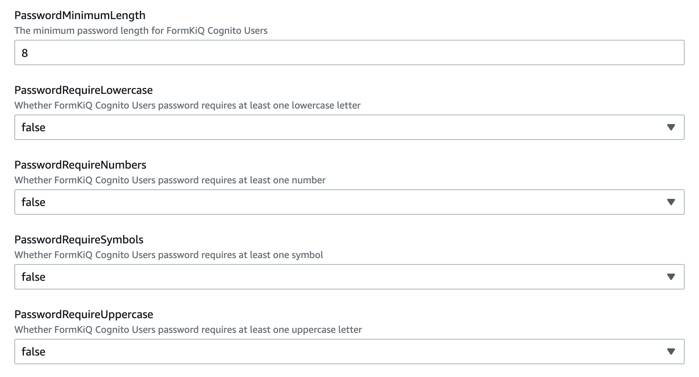
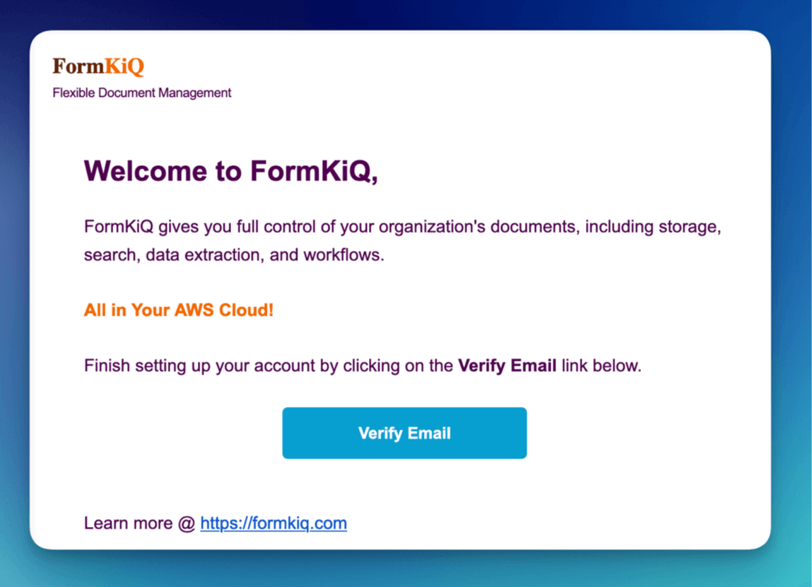
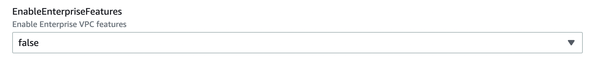

# Quick Start


## Prerequisites

For this quickstart you will need access to an AWS account, preferably with administrator access. The FormKiQ installation will create a number of AWS services and using an account with administrator access will ensure you have the correct permissions.

If you do not have a AWS account, you can sign up for one at https://aws.amazon.com.

Before installation verify that the AWSServiceRoleForECS has been enabled on your AWS Account. The easiest fix is to open up AWS CLI and run the following against your account once.

```
aws iam create-service-linked-role --aws-service-name ecs.amazonaws.com
```

## Install FormKiQ

**For installation support, feedback, or updates, [please join our FormKiQ Slack Community](https://join.slack.com/t/formkiqworkspace/shared_invite/zt-22ujpnl76-Zztjyt9Zco7h2f1BYjnxyQ)**

:::note
NOTE: Please ensure you've read the Prerequisites above and that AWSServiceRoleforECS has been enabled for your account.
:::

The FormKiQ installation process uses [AWS CloudFormation](https://docs.aws.amazon.com/cloudformation). AWS CloudFormation is a service that automates the process of creating and managing cloud resources. It allows you to easily install and update FormKiQ using a single url.

To install FormKiQ, select the installation link for the AWS region you want to deploy FormKiQ into below:

| AWS Region    | Install Link |
| -------- | ------- |
| us-east-1 | https://console.aws.amazon.com/cloudformation/home?region=us-east-1#/stacks/new?stackName=formkiq-core-prod&templateURL=https://formkiq-core-distribution-us-east-1.s3.amazonaws.com/1.12.0/template.yaml|
| us-east-2 | https://console.aws.amazon.com/cloudformation/home?region=us-east-2#/stacks/new?stackName=formkiq-core-prod&templateURL=https://formkiq-core-distribution-us-east-2.s3.amazonaws.com/1.12.0/template.yaml|
| us-west-2 | https://console.aws.amazon.com/cloudformation/home?region=us-west-2#/stacks/new?stackName=formkiq-core-prod&templateURL=https://formkiq-core-distribution-us-west-2.s3.amazonaws.com/1.12.0/template.yaml|
| ca-central-1 | https://console.aws.amazon.com/cloudformation/home?region=ca-central-1#/stacks/new?stackName=formkiq-core-prod&templateURL=https://formkiq-core-distribution-ca-central-1.s3.amazonaws.com/1.12.0/template.yaml|
| eu-central-1 | https://console.aws.amazon.com/cloudformation/home?region=eu-central-1#/stacks/new?stackName=formkiq-core-prod&templateURL=https://formkiq-core-distribution-eu-central-1.s3.amazonaws.com/1.12.0/template.yaml|
| ap-south-1 | https://console.aws.amazon.com/cloudformation/home?region=ap-south-1#/stacks/new?stackName=formkiq-core-prod&templateURL=https://formkiq-core-distribution-ap-south-1.s3.amazonaws.com/1.12.0/template.yaml|
| ap-southeast-2 | https://console.aws.amazon.com/cloudformation/home?region=ap-southeast-2#/stacks/new?stackName=formkiq-core-prod&templateURL=https://formkiq-core-distribution-ap-southeast-2.s3.amazonaws.com/1.12.0/template.yaml|
| ap-northeast-2 | https://console.aws.amazon.com/cloudformation/home?region=ap-northeast-2#/stacks/new?stackName=formkiq-core-prod&templateURL=https://formkiq-core-distribution-ap-northeast-2.s3.amazonaws.com/1.12.0/template.yaml|
| sa-east-1 | https://console.aws.amazon.com/cloudformation/home?region=sa-east-1#/stacks/new?stackName=formkiq-core-prod&templateURL=https://formkiq-core-distribution-sa-east-1.s3.amazonaws.com/1.12.0/template.yaml|

If the region you want to use is not listed, follow the [Install with SAM CLI](#install-with-sam-cli).

:::note
NOTE: For FormKiQ Pro and Enterprise users, you'll find a similar single click installation url in your custom [GitHub](https://github.com) repository you were provided.
:::

## Create CloudFormation Stack

Clicking the installation link will bring you to the AWS Console Login if you are not already logged in. Once you are logged in, you will be taken to the `CloudFormation Create Stack` page. As you can see the Amazon S3 URL is automatically populated with the FormKiQ installation url. This url tells CloudFormation where it can find the CloudFormation yaml files that describes all the FormKiQ resources to create.

### Create Stack


Clicking the `Next` button will take you to the stack details page. On this page we can configure FormKiQ.

### Set Stack Name


The first thing you will need to set is the CloudFormation Stack Name. The Stack name can include letters (A-Z and a-z), numbers (0-9), and dashes (-). We recommended to use the naming convention `formkiq-core-<app_environment>`, ie: formkiq-core-prod, formkiq-core-dev, etc. The <app_environment> allows you to differentiate between multiple installations of FormKiQ. This will give context to each FormKiQ installation and prevent accidentally deleting the wrong FormKiQ installation stack.

:::note
For production installations, we recommend using [AWS Organizations](https://aws.amazon.com/organizations) to create a separate account to run your production version of FormKiQ. AWS makes it easy to switch between accounts within an organization, and best practice is to keep your production environment in a separate account from any non-production resources. This not only helps with security, but also to help organize your costs. Ideally, you would have a new AWS account within your AWS organization for each environment (e.g., dev, test/qa, staging/pre-prod, and production).
:::

### Set Admin Email


Set the admin email address. During the FormKiQ installation, this email address will be automatically set up with administrator access. An email will be sent to the address  that provides a link to where the administrator password can be set.

### Set App Environment


AppEnvironment is a unique identifier for FormKiQ installations. The identifier should provider context to what kind of information is contained in the installation, IE: prod, staging, dev.

### Set Capacity Provider


FormKiQ uses AWS Fargate service to run certain services. AWS Fargate supports using either FARGATE or FARGATE_SPOT capacity provider. While FARGATE_SPOT is much cheaper, we recommend that it be used only for development environments, with FARGATE being used for production environments.

### Enable Public Urls


Whether to enable "/public" endpoints, defaults to false. Public endpoints allow external users to submit documents, such as through a web form. As with any publicly-available functionality, there is a risk of abuse if enabled.

:::note
You can always enable/disable your public endpoints at any time by updating your FormKiQ CloudFormation Stack and changing the value you've set.
:::

### Set Password Policy



FormKiQ uses [Amazon Cognito](https://aws.amazon.com/cognito) as the identity store for all users. Cognito support number of different password policies that you can configure.

### Configure Typesense


Optional: API Key to access the [Typesense](https://typesense.org) server. Typesense is used to provide full text search support for document metadata. The API Key can be any random string of characters. To enable Typesense, the `VpcStackName` also needs to be set (see link:#vpc-cloudformation[VPC CloudFormation]).

:::note
Typesense is optional, since it requires a VPC to be created, which can add to your AWS usage costs. Without Typesense, you will only be able to search documents using tags and the document's created date.
:::

### Configure VPC


The name of the CloudFormation VPC stack that can be created after the initial FormKiQ install, using the add-on <a href="/docs/getting-started/quick-start#create-vpc">CloudFormation template for VPC</a>.
Some services such as Typesense, Tesseract, and OpenSearch require a VPC. Only required if you are using any of these services; otherwise, this can remain empty.

Keep selecting `Next` until you get to the last `Submit Create Stack` page. Once you've checked the checkboxes, you can click `Submit` to being the stack creation.


The operation to create your new FormKiQ stack should take between fifteen and thirty minutes.

## Welcome Email

Once the FormKiQ CloudFormation installation has completed, an email will be sent to the email specified as the AdminEmail. This email will contain a link that will confirm the email address and allow the recipient to set a password for the administrator account.



### Verify Email

Clicking the `Verify Email` link will allow you to set your administrator password.

### Set Admin Password


### FormKiQ Console

Once your password is set you can now login to the FormKiQ Console.


Once in the FormKiQ Console, you can start working with FormKiQ.


:::note
Additional FormKiQ users can be created using [Amazon Cognito](https://aws.amazon.com/cognito). See [API Security](/docs/platform/api_security) for more information.
:::

## Create VPC

Certain FormKiQ features (currently Typesense and the OpenSearch add-on for FormKiQ Enterprise) require a VPC to be configured, and then the FormKiQ stack needs to be updated to use that VPC.

Below you'll find single-click installs links for creating a FormKiQ VPC.

Select the link below that is **in the same region as your FormKiQ installation**.

| AWS Region    | Install Link |
| -------- | ------- |
| us-east-1 | https://console.aws.amazon.com/cloudformation/home?region=us-east-1#/stacks/new?stackName=formkiq-vpc&templateURL=https://formkiq-core-distribution-us-east-1.s3.amazonaws.com/1.12.0/vpc.yaml |
| us-east-2 | https://console.aws.amazon.com/cloudformation/home?region=us-east-2#/stacks/new?stackName=formkiq-vpc&templateURL=https://formkiq-core-distribution-us-east-2.s3.amazonaws.com/1.12.0/vpc.yaml |
| us-west-2 | https://console.aws.amazon.com/cloudformation/home?region=us-west-2#/stacks/new?stackName=formkiq-vpc&templateURL=https://formkiq-core-distribution-us-west-2.s3.amazonaws.com/1.12.0/vpc.yaml |
| ca-central-1 | https://console.aws.amazon.com/cloudformation/home?region=ca-central-1#/stacks/new?stackName=formkiq-vpc&templateURL=https://formkiq-core-distribution-ca-central-1.s3.amazonaws.com/1.12.0/vpc.yaml |
| eu-central-1 | https://console.aws.amazon.com/cloudformation/home?region=eu-central-1#/stacks/new?stackName=formkiq-vpc&templateURL=https://formkiq-core-distribution-eu-central-1.s3.amazonaws.com/1.12.0/vpc.yaml |
| ap-south-1 | https://console.aws.amazon.com/cloudformation/home?region=ap-south-1#/stacks/new?stackName=formkiq-vpc&templateURL=https://formkiq-core-distribution-ap-south-1.s3.amazonaws.com/1.12.0/vpc.yaml |
| ap-southeast-2 | https://console.aws.amazon.com/cloudformation/home?region=ap-southeast-2#/stacks/new?stackName=formkiq-vpc&templateURL=https://formkiq-core-distribution-ap-southeast-2.s3.amazonaws.com/1.12.0/vpc.yaml |
| ap-northeast-2 | https://console.aws.amazon.com/cloudformation/home?region=ap-northeast-2#/stacks/new?stackName=formkiq-vpc&templateURL=https://formkiq-core-distribution-ap-northeast-2.s3.amazonaws.com/1.12.0/vpc.yaml |
| sa-east-1 | https://console.aws.amazon.com/cloudformation/home?region=sa-east-1#/stacks/new?stackName=formkiq-vpc&templateURL=https://formkiq-core-distribution-sa-east-1.s3.amazonaws.com/1.12.0/vpc.yaml |

### Create Stack

After clicking one of the one-click VPC installation links and logging into your AWS account, you'll be brought to the CloudFormation Create Stack console. The `Amazon S3 URL` is populated with the FormKiQ VPC installation URL.


Click `Next` to continue to the configuration page.

### Set Stack Parameters

Stack Name will be needed for when you update the main FormKiQ stack.


EnableEnterpriseFeatures is for FormKiQ Enterprise; it must be set to true in order for FormKiQ Enterprise to be configured correctly for any add-ons or customizations. **It is not required for FormKiQ Core or Pro.**



When creating the VPC, you need to specify an IPv4 network range for the VPC, in CIDR notation. For example, 10.1.0.0/16.

NOTE: We recommend choosing a CIDR block that you know is not being used by any existing AWS resources in your AWS Organization. Ideally, each AWS account (one for each environment) is using its own CIDR range, e.g., 10.10.0.0/16 for dev, 10.20.0.0/16 for test/qa, etc.

The VPC is also configured with 3 public and 3 private subnets.


VpcLabel: you should also provide a label for the VPC. This will be visible in the AWS Management Console when viewing your VPCs, and will help identify this VPC in future.


## Update FormKiQ Stack

After creating the VPC stack, the main FormKiQ CloudFormation stack needs to be updated.


Select the FormKiQ CloudFormation stack and then click the `Update` button.

When updating the stack you will want to choose `Use current template`.


For the `VpcStackName` parameter, set the value to the same value you used for the VPC stack you created above.

Keep selecting `Next` until you get to the last `Submit Create Stack` page. Once you've checked the checkboxes, you can click `Submit` to being the stack creation.


## Install with SAM CLI

FormKiQ Core was built using the [AWS Serverless Application Model (SAM)](https://aws.amazon.com/serverless/sam/) framework.

The Serverless Application Model Command Line Interface (SAM CLI) is an extension of the AWS CLI that adds functionality for deploying serverless applications.

### Prerequisite

To use SAM CLI, you will need to install the following tools:

* AWS CLI - Install the AWS CLI (https://aws.amazon.com/cli/)
* SAM CLI - Install the SAM CLI (https://docs.aws.amazon.com/serverless-application-model/latest/developerguide/serverless-sam-cli-install.html)

### Get Latest Release

The latest version of FormKiQ Core can be found on the https://github.com/formkiq/formkiq-core/releases page on Github.

Download the file with the naming convention of: `formkiq-core-X.X.X.zip`

Once downloaded, unzip the file in its own directory.

```
INSTALL.md
LICENSE
template.yaml
...
```

### Sam deploy

To deploy FormKiQ Core, run the following command in the same folder as the `template.yaml` file.

```bash
sam deploy --guided --capabilities CAPABILITY_IAM CAPABILITY_AUTO_EXPAND CAPABILITY_NAMED_IAM
```

The command will package and deploy your application to AWS, with a series of prompts:

| Argument | Description | Default Value |
| -------- | ------- | ------- |
| `Stack Name` | The name of the stack to deploy to CloudFormation. This should be unique to your account and region | formkiq-core-&lt;AppEnvironment&gt; |
| `AdminEmail` | Set the admin email address. During the FormKiQ installation, this email address will be automatically set up with administrator access. |
| `AppEnvironment` | AppEnvironment is a unique identifier for FormKiQ installations. The identifier should provider context to what kind of information is contained in the installation, IE: prod, staging, dev. | prod |
| `EnablePublicUrls` | Whether to enable "/public" endpoints. | false
| `PasswordMinimumLength` | Minimum Password Length | 8
| `PasswordRequireLowercase` | Whether Password requires a lowercase letter | false
| `PasswordRequireNumbers` | Whether Password requires a number | false
| `PasswordRequireSymbols` | Whether Password requires a symbol | false
| `PasswordRequireUppercase` | Whether Password requires a uppercase letter | false
| `VpcStackName` | Optional: The name of the FormKiQ VPC CloudFormation stack | null
| `TypesenseApiKey` | Optional: API Key to access the Typesense server | null
| `CapacityProvider` | Optional: CapacityProvider used by AWS Fargate service | FARGATE_SPOT


* **Confirm changes before deploy**: If set to yes, any change sets will be shown to you before execution for manual review. If set to no, the AWS SAM CLI will automatically deploy application changes.
* **Allow SAM CLI IAM role creation**: FormKiQ Core's AWS SAM templates create AWS IAM roles required for the AWS Lambda function(s) included to access AWS services. The permissions are passed in by the `sam deploy` command above. Set Value to 'Y'
* **Save arguments to samconfig.toml**: If set to yes, your choices will be saved to a configuration file inside the project, so that in the future you can just re-run `sam deploy` without parameters to deploy changes to your application.

Once you have set all of these options, SAM CLI will create a changeset and will display a list of all actions that will be performed as part of the changeset. If you have set "confirm changes before deploy" to "y", you will then be asked whether or nor to deploy this changeset. Choose "y" to complete the installation.

Once the FormKiQ Core stack has been deployed, you will be able to find your API Gateway Endpoint URL in the output values displayed after deployment.
