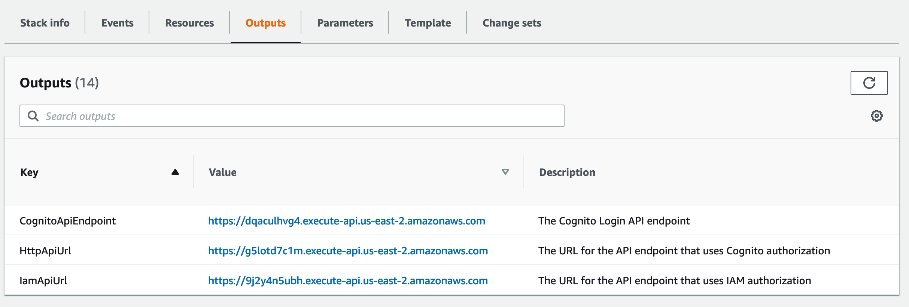

# Add Document Tags

Use this guide to add tags to FormKiQ documents. Tags help organize documents and support metadata-driven search.

:::note
For structured metadata with validation, typed values, and stronger search behavior, use [Attributes](/docs/features/attributes). Tags are useful for simple key-value metadata and legacy tag-based workflows.
:::

## Before You Begin

Confirm you have:

- A deployed FormKiQ environment. See [Quick Start](/docs/getting-started/quick-start#install-formkiq).
- cURL or an API client such as Postman.
- A JWT access token. See [Get a JWT Authentication Token](/docs/how-tos/jwt-authentication-token).
- At least one document in FormKiQ.
- Optional: [jq](https://jqlang.github.io/jq/) for formatting JSON responses.

## Variables Used

| Placeholder | Description |
| --- | --- |
| `HTTP_API_URL` | FormKiQ API endpoint from the CloudFormation stack output, including `https://`. |
| `AUTHORIZATION_TOKEN` | JWT access token used in the `Authorization` header. |
| `SITE_ID` | Optional FormKiQ site ID. Use `default` unless your deployment uses multiple sites. |
| `DOCUMENT_ID` | ID of the document to tag. |
| `TAG_KEY` | Tag key to retrieve, such as `category`. |
| `FILE_NAME` | Local file name to upload. |
| `FILE_CONTENT_TYPE` | MIME type for the uploaded file, such as `application/pdf`. |
| `PRESIGNED_UPLOAD_URL` | Temporary Amazon S3 upload URL returned by FormKiQ. |

The examples below use shell variables. Replace the values before running the commands:

```bash
export HTTP_API_URL="https://your-formkiq-api.example.com"
export AUTHORIZATION_TOKEN="your-jwt-access-token"
export SITE_ID="default"
export DOCUMENT_ID="your-document-id"
export TAG_KEY="category"
```

## Step 1: Find the FormKiQ API Endpoint

Open the [AWS CloudFormation console](https://console.aws.amazon.com/cloudformation), select your FormKiQ stack, and open the **Outputs** tab.



Use the `HttpApiUrl` output as `HTTP_API_URL`.

## Step 2: Add a Tag to an Existing Document

Use `POST /documents/{documentId}/tags` to add a tag.

```bash
curl -X POST "${HTTP_API_URL}/documents/${DOCUMENT_ID}/tags?siteId=${SITE_ID}" \
  -H "Authorization: ${AUTHORIZATION_TOKEN}" \
  -H "Content-Type: application/json" \
  -d '{"key": "category", "value": "person"}'
```

A successful response confirms the tag was created.

```json
{
  "message": "Created Tag 'category'"
}
```

## Step 3: Add a Multi-Value Tag

Use `values` when a tag needs more than one value.

```bash
curl -X POST "${HTTP_API_URL}/documents/${DOCUMENT_ID}/tags?siteId=${SITE_ID}" \
  -H "Authorization: ${AUTHORIZATION_TOKEN}" \
  -H "Content-Type: application/json" \
  -d '{"key": "playerId", "values": ["111", "222"]}'
```

## Step 4: Get a Specific Document Tag

Use `GET /documents/{documentId}/tags/{tagKey}` to retrieve one tag.

```bash
curl -X GET "${HTTP_API_URL}/documents/${DOCUMENT_ID}/tags/${TAG_KEY}?siteId=${SITE_ID}" \
  -H "Authorization: ${AUTHORIZATION_TOKEN}"
```

A successful response returns the tag.

```json
{
  "key": "category",
  "value": "person"
}
```

## Step 5: Add a Document with Tags

You can include tags when creating a document.

```bash
curl -X POST "${HTTP_API_URL}/documents?siteId=${SITE_ID}" \
  -H "Authorization: ${AUTHORIZATION_TOKEN}" \
  -H "Content-Type: application/json" \
  -d '{"path": "test.txt", "contentType": "text/plain", "content": "This is sample content", "tags": [{"key": "category", "value": "person"}]}'
```

A successful response returns the created `documentId`. The response may also include the `siteId`.

```json
{
  "documentId": "b18e0d3b-48cb-4589-ab5d-f19e27b44f05",
  "siteId": "default"
}
```

## Step 6: Add Tags During a Large Document Upload

For larger files, include tags when requesting the presigned upload URL.

```bash
curl -X POST "${HTTP_API_URL}/documents/upload?siteId=${SITE_ID}" \
  -H "Authorization: ${AUTHORIZATION_TOKEN}" \
  -H "Content-Type: application/json" \
  -d '{"path": "sample.pdf", "contentType": "application/pdf", "tags": [{"key": "category", "value": "person"}]}'
```

The response includes a presigned upload URL, a `documentId`, and may include headers that must be sent to Amazon S3.

```json
{
  "url": "https://formkiq-core-dev-documents-XXXXXX.s3.us-east-2.amazonaws.com/05c1dc43-e9f3-4bb5...",
  "documentId": "05c1dc43-e9f3-4bb5-9732-077c02dac2c9",
  "headers": {}
}
```

Upload the file to the returned URL. If the response includes headers, send those headers exactly as returned.

```bash
curl -v -H "Content-Type: FILE_CONTENT_TYPE" \
  --upload-file FILE_NAME \
  "PRESIGNED_UPLOAD_URL"
```

If the response includes S3 headers, add each returned header to the upload request:

```bash
curl -v \
  -H "Content-Type: FILE_CONTENT_TYPE" \
  -H "RETURNED_HEADER_NAME: RETURNED_HEADER_VALUE" \
  --upload-file FILE_NAME \
  "PRESIGNED_UPLOAD_URL"
```

## Verify the Result

Retrieve the tag or search for the tag value.

```bash
curl -X GET "${HTTP_API_URL}/documents/${DOCUMENT_ID}/tags/${TAG_KEY}?siteId=${SITE_ID}" \
  -H "Authorization: ${AUTHORIZATION_TOKEN}"
```

## Troubleshooting

| Problem | Likely cause | What to check |
| --- | --- | --- |
| `401 Unauthorized` | Token is missing or expired. | Get a new JWT access token. |
| `404 Not Found` | The document ID or tag key does not exist. | Confirm the `DOCUMENT_ID` and `TAG_KEY`. |
| Tag is not returned in search | Search criteria do not match the stored tag. | Confirm whether the tag uses `value` or `values`. |
| Upload with tags fails | Request body, upload URL handling, or returned headers are incorrect. | Check JSON formatting, use the returned presigned URL exactly, and include returned headers. |
| Tag is not found in a multi-site deployment | The request used the wrong site. | Confirm `SITE_ID` or omit it only when using the default site. |

## Next Steps

- [Document Search](/docs/how-tos/api-document-search)
- [Documents](/docs/features/documents)
- [Attributes](/docs/features/attributes)
