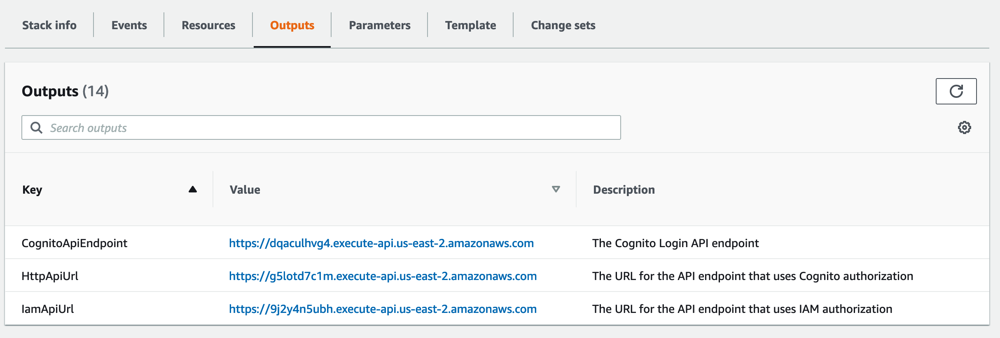

# Getting an JWT Authentication Token

This tutorial will take you through the basics of the FormKiQ Document API, including: adding documents, working with document tags, and searching for documents.

## Prerequisite

* You have installed FormKiQ; see the [Quickstart](/docs/getting-started/quick-start) for more information
* Install either: cURL or your favorite API Client, like https://www.postman.com.
* Optionally install: https://stedolan.github.io/jq, a command-line JSON processor which formats JSON so it is more readable.
* All shell commands are shown for Unix-based systems. Windows has analogous commands for each.


## CloudFormation Outputs

We are going to need to know the name of a few AWS resources creating during the FormKiQ installation. Opening the [CloudFormation console](https://console.aws.amazon.com/cloudformation), find your FormKiQ stack and click the `Outputs` tab.



The following are outputs we'll need to know.

| Argument | Description
| -------- | ------- |
| `CognitoApiEndpoint` | The Cognito API Endpoint

## Get JWT Authentication Token

The first thing we need is a https://jwt.io that will tell the API we are authorized to make the API request.

Authenticating can be done using the Cognito API Endpoint url with the following command. The descriptions of the required arguments are in the table below.

```
curl -X POST https://COGNITO_API_ENDPOINT_URL/login \
   -H "Content-Type: application/json" \
   -d '{"username": "USERNAME", "password": "PASSWORD"}'
```

| Argument | Description
| -------- | ------- |
| `COGNITO_API_ENDPOINT_URL` | The Cognito API endpoint URL found in the CloudFormation Outputs.
| `USERNAME` | The administrator email address.
| `PASSWORD` | The administrator password.


The JSON response should return successful response like below:
```
{
  ...
  "AuthenticationResult": {
    "AccessToken": "eyJraWQiOiJkdkpnTHlm ...",
  }
  ...
}
```

You can use the `AccessToken` to access the FormKiQ API.

:::note
The `AccessToken` is only valid for 1 hour.
:::

## Summary

Throughout this tutorial, you have successfully used the FormKiQ Cognito API to authenticate against FormKiQ and retrieve an `AccessToken` that can be used to access the FormKiQ API.
