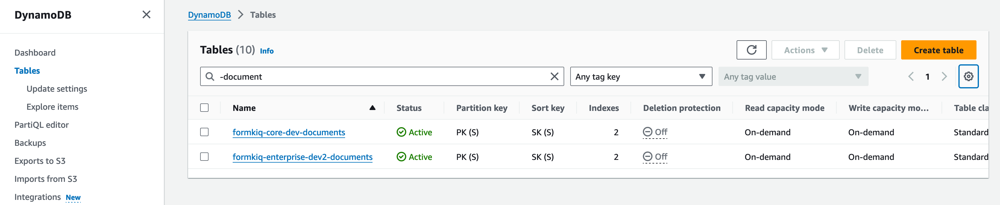
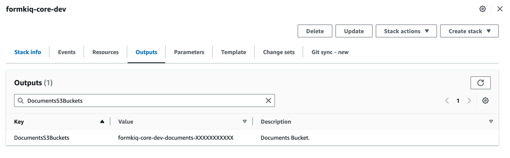
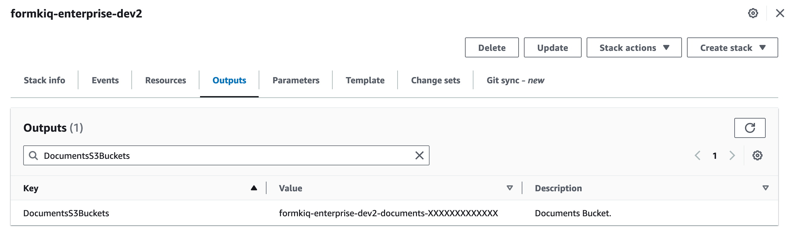

# Documnet Migration from FormKiQ Core to Enterprise

This guide will show you how to migrate documents from a FormKiQ Core installation to an Enterprise installation.

## What you’ll need

* [AWS Command Line Interface (AWS CLI)](https://aws.amazon.com/cli)

* AWS CLI configured with DynamoDb / S3 access to the FormKiQ installations

* [jq](https://jqlang.github.io/jq/) is a lightweight and flexible command-line JSON processor. 

## Document Metadata

The document metadata is stored in [Amazon DynamoDB](https://aws.amazon.com/dynamodb/). The migration of the metadata involves determining the source and destintation DynamoDB tables and using the AWS cli to migrate the data from one table to another.

### Source / Target Tables

The source and target tables can be found from the [DynamoDB console](https://console.aws.amazon.com/dynamodbv2/home) by searching for the `AppEnvironment` names used in the FormKiQ installation.



### Export/Import Data

To export the contents from a DynamoDB table and then import the data into another DynamoDB table using the AWS CLI, you can follow these general steps:

Export the data from the source DynamoDB table to a JSON file. Make sure to update the `YOUR_SOURCE_TABLE_NAME` and `YOUR_TARGET_TABLE_NAME`.

```
aws dynamodb scan --table-name YOUR_SOURCE_TABLE_NAME \
| jq '{"YOUR_TARGET_TABLE_NAME": [.Items[] | {PutRequest: {Item: .}}]}' > dynamodb_data.json
```

Import the data from the JSON file into the destination DynamoDB table.
```
aws dynamodb batch-write-item \
    --request-items file://dynamodb_data.json

```

## Document Content

FormKiQ stores the content of the documents in [Amazon S3](https://aws.amazon.com/s3) in the bucket labeled `-documents`.

### Source / Target S3 Buckets

Looking at the CloudFormation Outputs from both the source and target installations you will find the name of the S3 buckets.





### Copy Content

You can use the aws s3 sync command to copy all contents from one S3 bucket to another. 

```
aws s3 sync s3://source-bucket-name s3://destination-bucket-name
```

## Summary

And there you have it! We have shown how easy it is to migrate documents from a FormKiQ Core installation to a Enterprise installation.

This is just the tip of the iceberg when it comes to working with the FormKiQ APIs. d

If you have any questions, reach out to us on our https://github.com/formkiq/formkiq-core or https://formkiq.com.
