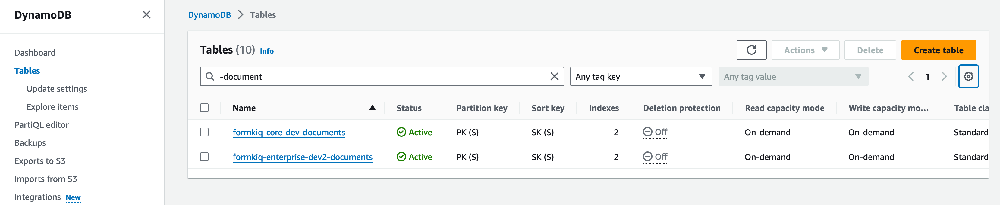
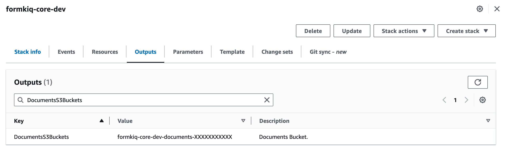
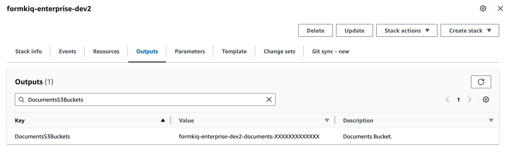

# Migrate Documents from Core to Enterprise

Use this guide to migrate document metadata and document content from a FormKiQ Core deployment to a FormKiQ Enterprise deployment.

This guide uses the [FileSync CLI](/docs/formkiq-modules/modules/filesync-cli) for the DynamoDB metadata copy, the AWS CLI for S3 document content copy, and optional post-migration steps for timestamp repair and OpenSearch sync.

## Before You Begin

Confirm you have:

- Access to the AWS account and Region for both the source and target FormKiQ deployments.
- The [FileSync CLI](/docs/formkiq-modules/modules/filesync-cli) installed and configured.
- AWS CLI installed and configured with access to DynamoDB, S3, and any KMS keys used by both deployments.
- [jq](https://jqlang.github.io/jq/) installed if you need to run the optional timestamp repair step.
- The source and target FormKiQ CloudFormation stacks available in AWS.
- A maintenance window or cutover plan that prevents writes to the source during the final migration pass.
- A backup or rollback plan before changing production data.

:::warning
Test this process in a non-production environment before using it for production data. Confirm table names, bucket names, permissions, FormKiQ version compatibility, and expected document counts before running writes against the target environment.
:::

:::caution
The DynamoDB restore command performs a direct table-to-table copy. Use it only when the source and target document tables have compatible key schema and item structure. Prefer an empty or controlled target table because matching items can be overwritten.
:::

## Variables Used

| Placeholder | Description |
| --- | --- |
| `FK_PROFILE` | FileSync CLI profile configured for the target environment and permitted to read the source table. |
| `SOURCE_TABLE` | DynamoDB table that stores source FormKiQ document metadata. |
| `TARGET_TABLE` | DynamoDB table that stores target FormKiQ document metadata. |
| `SOURCE_BUCKET` | S3 bucket that stores source FormKiQ document content. |
| `TARGET_BUCKET` | S3 bucket that stores target FormKiQ document content. |
| `SITE_ID` | FormKiQ site ID to verify or reindex after migration. Use `default` unless you use a named site. |
| `AWS_REGION` | AWS Region for the migration commands. |

Set the values before running the commands:

```bash
export FK_PROFILE="default"
export SOURCE_TABLE="your-source-documents-table"
export TARGET_TABLE="your-target-documents-table"
export SOURCE_BUCKET="your-source-documents-bucket"
export TARGET_BUCKET="your-target-documents-bucket"
export SITE_ID="default"
export AWS_REGION="us-east-1"
```

## Step 1: Plan the Cutover

Before copying production data:

1. Confirm the Core and Enterprise deployments are on compatible FormKiQ versions.
2. Confirm the target Enterprise deployment is new, empty, or safe to overwrite.
3. Pause writes to the source during the final migration pass.
4. Record expected source document counts and S3 object counts.
5. Confirm the migration identity has DynamoDB, S3, and KMS permissions for both environments.

If the source remains active during the first copy, run a final DynamoDB restore and S3 sync during the cutover window before directing users to the Enterprise deployment.

## Step 2: Identify the Source and Target DynamoDB Tables

FormKiQ stores document metadata in Amazon DynamoDB. Open the [DynamoDB console](https://console.aws.amazon.com/dynamodbv2/home) and search for the `AppEnvironment` names used by the source and target FormKiQ deployments.



Record the source table as `SOURCE_TABLE` and the target table as `TARGET_TABLE`.

## Step 3: Copy Document Metadata

Use the FileSync CLI `--restore-dynamodb` command to copy document metadata from the source table to the target table.

```bash
fk --restore-dynamodb \
  --from-table "$SOURCE_TABLE" \
  --to-table "$TARGET_TABLE" \
  --profile "$FK_PROFILE" \
  --thread-count 16
```

The command uses DynamoDB pagination, batch writes, and retries for unprocessed items. Increase or reduce `--thread-count` based on table size, provisioned capacity, and throttling behavior.

To restore only selected partition keys, repeat `--pk` for each partition key:

```bash
fk --restore-dynamodb \
  --from-table "$SOURCE_TABLE" \
  --to-table "$TARGET_TABLE" \
  --profile "$FK_PROFILE" \
  --pk "site#default#document#example-document-id"
```

:::note
The FileSync CLI profile must resolve AWS credentials that can read the source table and write to the target table. For cross-account migrations, use an AWS role or credentials that have access to both tables.
:::

## Step 4: Identify the Source and Target S3 Buckets

FormKiQ stores document content in Amazon S3. The document bucket is usually identified by the `-documents` suffix or by the CloudFormation stack outputs.

Review the CloudFormation outputs for both the source and target deployments.





Record the source bucket as `SOURCE_BUCKET` and the target bucket as `TARGET_BUCKET`.

## Step 5: Copy Document Content

Use `aws s3 sync` to copy document content from the source bucket to the target bucket.

```bash
aws s3 sync "s3://${SOURCE_BUCKET}" "s3://${TARGET_BUCKET}" \
  --region "$AWS_REGION"
```

For production migrations, run the command once before the cutover window and again during cutover to copy changed objects.

If your deployment uses S3 object versioning, object tags, custom KMS keys, or cross-account buckets, validate that the copy strategy preserves the data you need. `aws s3 sync` is usually sufficient for current document objects, but it is not a full S3 version-history migration plan.

## Step 6: Optional: Restore Last Modified Dates

If you copied metadata with `fk --restore-dynamodb`, FormKiQ `lastModifiedDate` values should already be present in the target table. Use this step only if another import path or repair process changed target document timestamps.

Update the target table from the source table using a paginated scan:

```bash
#!/bin/bash
set -euo pipefail

TOKEN_FILE=""

while true; do
  if [ -n "$TOKEN_FILE" ]; then
    aws dynamodb scan \
      --table-name "$SOURCE_TABLE" \
      --projection-expression "PK, SK, lastModifiedDate" \
      --filter-expression "SK = :skValue AND attribute_exists(lastModifiedDate)" \
      --expression-attribute-values '{":skValue": {"S": "document"}}' \
      --exclusive-start-key "file://${TOKEN_FILE}" \
      --region "$AWS_REGION" \
      --output json > scan_results.json
  else
    aws dynamodb scan \
      --table-name "$SOURCE_TABLE" \
      --projection-expression "PK, SK, lastModifiedDate" \
      --filter-expression "SK = :skValue AND attribute_exists(lastModifiedDate)" \
      --expression-attribute-values '{":skValue": {"S": "document"}}' \
      --region "$AWS_REGION" \
      --output json > scan_results.json
  fi

  jq -c '.Items[] | {PK: .PK.S, SK: .SK.S, lastModifiedDate: .lastModifiedDate.S}' scan_results.json |
  while IFS= read -r row; do
    PK=$(echo "$row" | jq -r '.PK')
    SK=$(echo "$row" | jq -r '.SK')
    lastModifiedDate=$(echo "$row" | jq -r '.lastModifiedDate')

    aws dynamodb update-item \
      --table-name "$TARGET_TABLE" \
      --key "{\"PK\": {\"S\": \"$PK\"}, \"SK\": {\"S\": \"$SK\"}}" \
      --update-expression "SET lastModifiedDate = :newDate" \
      --expression-attribute-values "{\":newDate\": {\"S\": \"$lastModifiedDate\"}}" \
      --region "$AWS_REGION" > /dev/null
  done

  if jq -e '.LastEvaluatedKey' scan_results.json > /dev/null; then
    jq '.LastEvaluatedKey' scan_results.json > last_evaluated_key.json
    TOKEN_FILE="last_evaluated_key.json"
  else
    break
  fi
done
```

## Step 7: Optional: Sync OpenSearch

If the Enterprise deployment uses OpenSearch, rebuild or verify the search index after the metadata and content are copied.

Create a document ID file from the target environment:

```bash
fk --list-documents \
  --site-id "$SITE_ID" \
  --profile "$FK_PROFILE" > migrated-document-ids.txt
```

Sync the migrated documents into OpenSearch:

```bash
fk --sync-opensearch \
  --site-id "$SITE_ID" \
  --file migrated-document-ids.txt \
  --content \
  --profile "$FK_PROFILE"
```

Verify that the documents exist in OpenSearch:

```bash
fk --sync-opensearch-verify \
  --site-id "$SITE_ID" \
  --file migrated-document-ids.txt \
  --profile "$FK_PROFILE"
```

## Verify the Result

After migration:

1. Compare document counts between the source and target DynamoDB tables.
2. Compare S3 object counts and total bucket size.
3. Open the target FormKiQ console and confirm migrated documents are visible.
4. Retrieve several migrated documents through the API.
5. Download sampled documents and confirm content opens correctly.
6. Confirm tags, attributes, metadata, and `lastModifiedDate` values are correct for sampled documents.
7. Run search and full-text checks if OpenSearch or full-text search is enabled.

## Troubleshooting

| Problem | Likely cause | What to check |
| --- | --- | --- |
| `fk --restore-dynamodb` cannot find the table | Incorrect table name, Region, profile, or permissions. | Confirm the FileSync CLI profile, `SOURCE_TABLE`, `TARGET_TABLE`, and DynamoDB permissions. |
| DynamoDB restore is slow or throttled | Thread count is too high for the source or target table capacity. | Reduce `--thread-count`, check DynamoDB throttling metrics, and retry during a quieter window. |
| Target records are overwritten | The target table already had matching keys. | Restore into a clean target table or selectively restore only known-safe `--pk` values. |
| S3 sync skips objects | Incorrect bucket name, insufficient permissions, or KMS access issue. | Confirm `s3:ListBucket`, `s3:GetObject`, `s3:PutObject`, and required `kms:Decrypt` / `kms:Encrypt` permissions. |
| Documents appear but downloads fail | Metadata and S3 content are out of sync. | Confirm document object keys exist in the target bucket and rerun the final S3 sync. |
| Search does not return migrated documents | OpenSearch index has not been rebuilt or synced. | Run `fk --sync-opensearch` and `fk --sync-opensearch-verify` for the migrated document IDs. |
| Modified dates do not match | Target metadata was changed after the DynamoDB restore. | Run the optional timestamp repair step and recheck sampled documents. |

## Next Steps

- [FileSync CLI](/docs/formkiq-modules/modules/filesync-cli)
- [Migration and Data Import](/docs/platform/migration-and-data-import)
- [Backup and Recovery](/docs/platform/backup_and_recovery)
- [Status Monitoring and Alerting](/docs/how-tos/set-up-status-monitoring-and-alerting)
