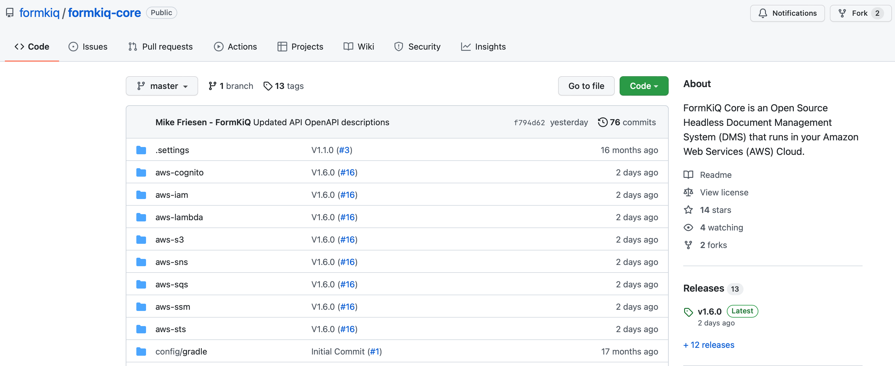

= FormKiQ Installation

Throughout this tutorial, we’ll walk you through the downloading of FormKiQ Core and installing it into your AWS account.

FormKiQ was built using the https://aws.amazon.com/serverless/sam/[AWS Serverless Application Model (AWS SAM)]. The https://aws.amazon.com/serverless/sam/[AWS SAM] is an open-source framework that you can use to build serverless applications on https://aws.amazon.com[AWS].

== Install AWS SAM CLI

In order to install FormKiQ you first need to install the https://docs.aws.amazon.com/serverless-application-model/latest/developerguide/serverless-sam-cli-install.html[AWS SAM CLI] by following the https://docs.aws.amazon.com/serverless-application-model/latest/developerguide/serverless-sam-cli-install.html[installation instructions] for your particular platform.

Once installed you can verify installation.

----
sam --version
----

On successful installation, you should see output like the following:
----
SAM CLI, version 1.46.0
----

== Get FormKiQ Core

== SAM Deploy

== Subscription Confirmation Email

== Welcome to FormKiQ Email

