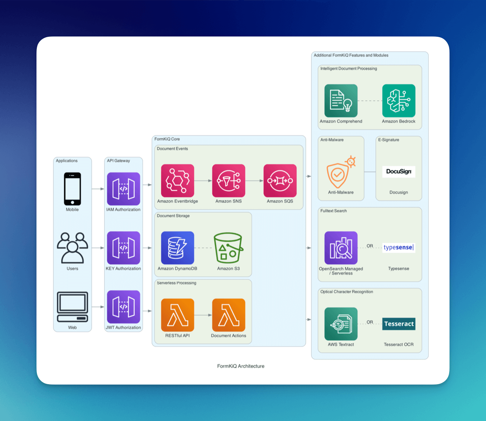
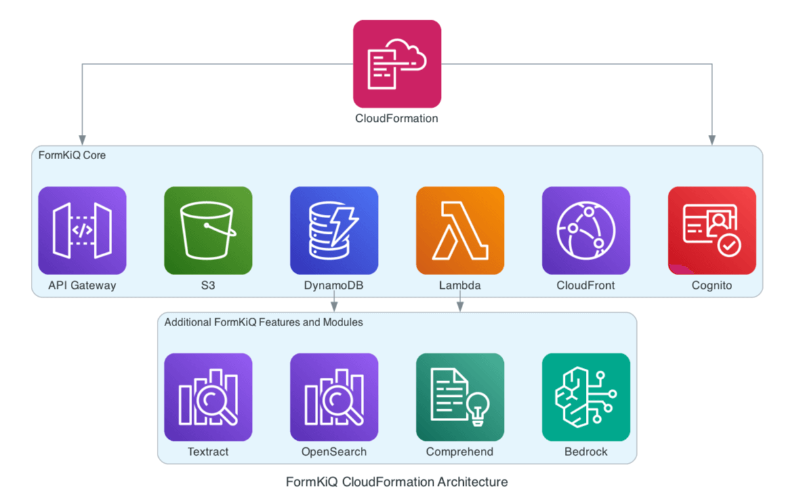

# Overview

Document management is at the core of most organizations, with numerous documents that need to be stored, tracked, managed and organized. **FormKiQ strives to be the most flexible, customizable and cost-effective document management platform available**, whether functioning as a turnkey document management system or providing a secure and scalable document layer for multitier architectures.

## Architecture

## Key Features
FormKiQ is an API-first document management platform that deploys to your [Amazon Web Services](https://aws.amazon.com) account. Its flexible and scalable design allows for anyone to quickly and easily add document management functionality to any application, through our robust set of document management APIs, reducing development time by up to two-thirds.

## Deployment

FormKiQ deploys into your AWS account and is available in most AWS regions, giving you full control of your documents 100% of the time.

FormKiQ uses [AWS CloudFormation](https://docs.aws.amazon.com/AWSCloudFormation/latest/UserGuide/Welcome.html) which is an infrastructure-as-code service that enables the provisioning AWS resources using templates. This approach not only reduces the risk of manual errors but also ensures consistency across deployments, making it easier to manage complex architectures and adhere to best practices.

The benefits of using CloudFormation include automation of the resource provisioning process, faster deployment times, and simplified management of infrastructure changes. It allows for version control of your infrastructure, meaning any changes can be tracked and rolled back if necessary. This level of control and repeatability is essential for organizations looking to implement DevOps practices and maintain compliance in dynamic cloud environments.

## Technical Design
FormKiQ uses headless architecture, separating the web UI from the backend API. This allows integration with any web application (using our ReactJS console as reference), mobile apps, and backend services.

FormKiQ is built to scale, for any use case. It can be used by the largest corporation to the smallest team, employing serverless technology so you only pay for what you use.

## Licensing
FormKiQ (https://github.com/formkiq/formkiq-core) is an Open Core product. The core document management functionality is made available through an Open Source license. Additional document management functionality, as well as add-on modules, professional services, and both on-boarding and operational support are available with FormKiQ Essentials, Advanced, and Enterprise, via [https://formkiq.com](https://formkiq.com).

## Support
**For installation support, feedback, or updates, [please join our FormKiQ Slack Community](https://join.slack.com/t/formkiqworkspace/shared_invite/zt-22ujpnl76-Zztjyt9Zco7h2f1BYjnxyQ)**

:::note
Our commercially-licensed FormKiQ offerings have additional support options, including the **[FormKiQ Support Portal](https://formkiq.freshdesk.com/support/home)**, Zoom sessions, and a private Slack channel.
:::