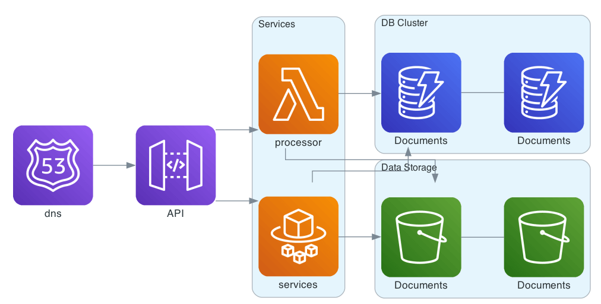

# Overview

Document management is at the core of most organizations, with numerous documents that need to be stored, tracked, managed and organized. FormKiQ strives to be the most flexible, customizable and cost-effective document management system available.

FormKiQ is an API-first (head-less) document management platform that can run in any [Amazon Web Services](https://aws.amazon.com) account. It's API-first design allows for anyone to quickly and easily add document management functionality to any application, through our robust set of document management APIs, cutting months off of development time. Since FormKiQ runs in any AWS account, you maintain full control of your documents 100% of the time.

FormKiQ has been designed using *headless architecture* design principles, which means that the web UI is completely decoupled from the backend API. This allows not only for any other web application to be integrated with the Document API (with the default ReactJS web console available as a reference), but also allows for other front-ends to be created, such as a mobile app, and makes the API available for backend services and integrations.

FormKiQ is built to scale, for any use case. It can be used by the largest corportation to the smallest team, employing serverless technology so you only pay for what you use.

FormKiQ (https://github.com/formkiq/formkiq-core) is an Open Core product. The core document management functionality is made available through an Open Source license. Additional, advanced document management functionality, as well and add-on modules, professional services, and both on-boarding and operational support are available via https://formkiq.com.

