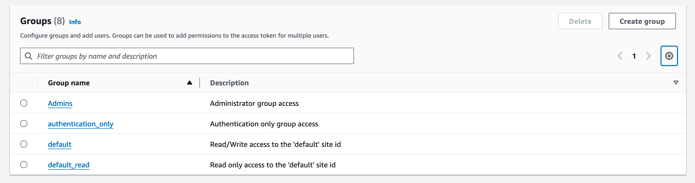

# Security

## Overview

FormKiQ is designed with a robust security framework to safeguard user data and sensitive information. FormKiQ employs a Role-Based Access Control (RBAC) as its default security mechanism, ensuring a streamlined and efficient authorization process for all users. The RBAC system assigns roles to users based on their responsibilities, granting access only to the resources essential for their tasks.

:::note
By default the `AdminEmail` configured during the installation process is setup as an administrator with full access
:::

:::note
[FormKiQ Pro/Enterprise](https://www.formkiq.com/products/formkiq-enterprise) users have the ability to use Attribute-based Access Control (ABAC) through [Open Policy Agent](https://www.openpolicyagent.org/).
:::

## Groups

FormKiQ supports multi-tenancy environments by defining user group(s) and then linking these groups to the different FormKiQ site(s). Each user can be associated with one or more groups, reflecting their role or responsibilities within the platform. These groups, in turn, determine the user's access privileges across different sites within the platform.

The user's groups link to the FormKiQ's sites that the user will be granted access to; users can be in one or more groups, granting access to specific sites with specified roles.

| Group | Description
| -------- | ------- |
| Admins | Administrator group access |
| authentication_only | Authentication only group access |
| **site name** | Read/Write/Delete access to **site_name** |
| **site name**_read | Read access to site **site_name** |

FormKiQ comes with 4 groups by default. 

* **Admins** - Users in this group have full administrative privileges to all sites

* **authentication_only** - Users in this group can authenticate and receive a access token, but do not have access to any sites. Used mainly with the Document Sharing API to share specific folders / documents with a user

* **default** - The "default" FormKiQ site that is created on installation. Users in this group will have read/write/delete access to the "default" site.

* **default_read** - The "default" FormKiQ site that is created on installation. Users in this group will have read access to the "default" site.

Here is what the groups in [Amazon Cognito](https://aws.amazon.com/cognito) looks like by default.

:::note
The Cognito User pool can be found by visiting the [Cognito Console](https://console.aws.amazon.com/cognito) page and searching for the `AppEnvironment` name you configured during installation.

:::

### Add Multi-Tenant Site

Creating a new Multi-Tenant Site is as easy as creating a new group and adding users to the group.

To add a new group to Amazon Cognito:

* Open the [Amazon Cognito Console](https://console.aws.amazon.com/cognito)
* Click on the `Group` tab and click `Create Group`

* Enter a `Group Name` and click `Create Group`

The site has now been created and you can add users to this group to give them access to the finance site.

### Add User to Site

:::note
If you do not see a Cognito User pool, check that the region you are in matches the region where you have installed FormKiQ.
:::

Clicking the Cognito Users tab, you should see the administrator user that was created during the installation process.

To add a new user, click the `Create user` button.

On the *Create User* page,

* enter the `Email Address` of the user to create
* select `Send an email invitation`
* click `Mark email address as verified`
* select `Generate a password`

Click the `Create user` button to finish creating the new user. The user receive an email at the specified email address, with a link to finalize setting up their account.

The user is now created with read / write access to the default site id.

## API Endpoints 

The FormKiQ API is built on top of [AWS API Gateway](https://aws.amazon.com/api-gateway/). API Gateway offers the flexibility to empowers customers to choose the most suitable authentication and authorization methods based on their specific application requirements. 

By default FormKiQ API supports 3 different types of authorization:

* JSON Web Token(JWT) Authorizers

* Amazon Identity and Access Management (IAM) authorization

* API Key authorization

FormKiQ supports these different authorization mechanisms by deplying multiple copies of the API. This allows you to use the authentication mechanism that suits your needs.

The FormKiQ API URL(s) can be found in the CloudFormation outputs of your FormKiQ stack.

:::note
[FormKiQ Enterprise](https://www.formkiq.com/products/formkiq-enterprise) users have additional authentication options like Security Assertion Markup Language (SAML) or custom authentication mechanisms
:::

### JSON Web Token(JWT) Authorizers

JWT authentication, also known as [JSON Web Token](https://jwt.io/introduction) authentication, is a method used to verify the identity of users or systems accessing web applications or APIs. It is based on the use of digitally signed tokens containing encoded claims about the user's identity and permissions. 

By default, FormKiQ uses [Amazon Cognito](https://aws.amazon.com/cognito) as the JWT Issuer and authorization is handled through role-based access control assigned to each user.

The API that uses the JWT authentication can be found in the CloudFormation Outputs of the FormKiQ installation under the `HttpApiUrl` key.

### Amazon Identity and Access Management (IAM) authorization

[IAM Authentication](https://docs.aws.amazon.com/apigateway/latest/developerguide/http-api-access-control-iam.html) allows customers to call the FormKiQ API by signing requests using [Signature Version 4](https://docs.aws.amazon.com/IAM/latest/UserGuide/reference_aws-signing.html) with AWS credentials. 

IAM Authentication is typically used for machine-to-machine authorization as there is no user information inside of the token.

The API that uses the IAM authentication can be found in the CloudFormation Outputs of the FormKiQ installation under the `IamApiUrl` key.

:::note
You need the IAM execute-api permission to be able to use IAM Authentication and all requests will be run with administration privileges.
:::

### API Key

FormKiQ allows for the generating of an API key that can be used to access the FormKiQ API for a particular `SiteId`.

The API key can be generated using the `POST /configuration/apiKeys` API endpoint using credentials with `administrator` privileges.

The API that uses the Key authentication can be found in the CloudFormation Outputs of the FormKiQ installation under the `KeyApiUrl` key.

:::note
Each API key is only valid for a particular SiteId.
:::
