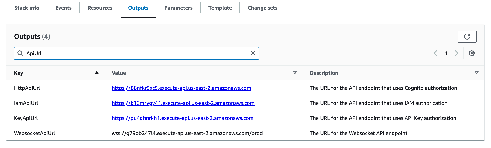

# API Security

The FormKiQ API is built on top of [AWS API Gateway](https://aws.amazon.com/api-gateway/). API Gateway offers the flexibility to empowers customers to choose the most suitable authentication method based on their specific application requirements. 

The FormKiQ installation deploys multiple copies of the API, with each one using a different authentication mechanism. This allows you to choose the authentication mechanism that suits your needs.

The FormKiQ API URL(s) can be found in the CloudFormation outputs of your FormKiQ stack.

:::note:
[FormKiQ Enterprise](https://www.formkiq.com/products/formkiq-enterprise) users have additional authentication options like Security Assertion Markup Language (SAML).
:::

## JSON Web Token(JWT)

JWT authentication, also known as [JSON Web Token](https://jwt.io/introduction) authentication, is a method used to verify the identity of users or systems accessing web applications or APIs. It is based on the use of digitally signed tokens containing encoded claims about the user's identity and permissions. 

By default, FormKiQ uses [Amazon Cognito](https://aws.amazon.com/cognito) as the JWT Issuer and authorization is handled through role-based access control assigned to each user.

The API that uses the JWT authentication can be found in the CloudFormation Outputs of the FormKiQ installation under the `HttpApiUrl` key.

## AWS IAM

[IAM Authentication](https://docs.aws.amazon.com/apigateway/latest/developerguide/http-api-access-control-iam.html) allows customers to call the FormKiQ API by signing requests using [Signature Version 4](https://docs.aws.amazon.com/IAM/latest/UserGuide/reference_aws-signing.html) with AWS credentials. 

The API that uses the JWT authentication can be found in the CloudFormation Outputs of the FormKiQ installation under the `IamApiUrl` key.

:::note:
You need the IAM execute-api permission to be able to use IAM Authentication and all requests will be run with administration privileges.
:::

## API Key

FormKiQ allows for the generating of an API key that can be used to access the FormKiQ API for a particular `SiteId`.

The API key can be generated using the `POST /configuration/apiKeys` API endpoint using credentials with `administrator` privileges.

The API that uses the Key authentication can be found in the CloudFormation Outputs of the FormKiQ installation under the `KeyApiUrl` key.

:::note:
Each API key is only valid for a particular SiteId.
:::

## Amazon Cognito

FormKiQ comes with a fully-functional console for interacting with documents, built using React. This console can be referenced when creating custom applications that will interact with the FormKiQ Document API. The console URL can be found in the CloudFormation outputs.

Console access is controlled through the [Amazon Cognito JWT authorizer](https://aws.amazon.com/cognito). By default the `AdminEmail` configured during the CloudFormation creation is created as an administrator user.

Additional users can be added manually through the [Cognito Console](https://console.aws.amazon.com/cognito).

### Create User

To add a new user, start by visiting the [Cognito Console](https://console.aws.amazon.com/cognito). You should find the Cognito User pool with the configured `AppEnvironment` in the name.

:::note:
If you do not see a Cognito User pool, check that the region you are in matches the region where you have installed FormKiQ.
:::

Clicking the Cognito Users tab, you should see the administrator user that was created during the installation process.

To add a new user, click the `Create user` button.

On the *Create User* page,

* enter the `Email Address` of the user to create
* select `Send an email invitation`
* click `Mark email address as verified`
* select `Generate a password`

Click the `Create user` button to finish creating the new user. The user receive an email at the specified email address, with a link to finalize setting up their account.

The user is now created with read / write access to the default site id.

### Group Permissions

FormKiQ starts with three default groups.

* Admins - Group for administrators of FormKiQ
* default - Read / Write permission for the default site id
* default_read - Read permission for the default site id

By default if a user belongs to no groups, it will be given the "default" group permissions. By clicking on any of the groups users can be easily added or removed.

