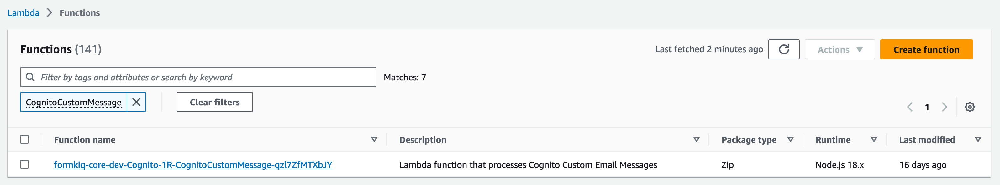
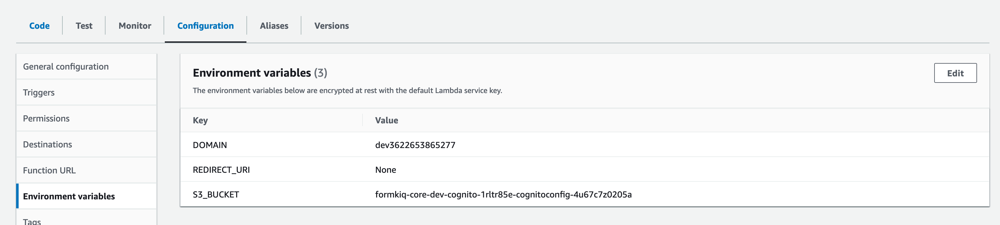
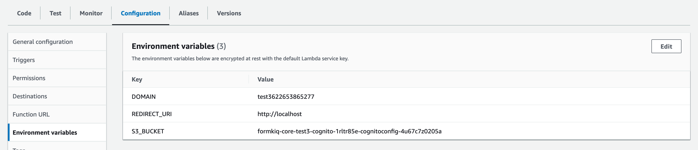

# Document Console

## Overview

FormKiQ Document Console is a modern web application built with [React](https://react.dev) that provides an intuitive interface for managing your digital documents. This frontend application offers comprehensive document management capabilities while maintaining security and ease of use.

### Core Features

- **Document Management**
  - Upload documents from any device
  - Preview documents without downloading
  - Create folders and maintain hierarchical organization
  - Add attributes and schemas for better categorization
  - Powerful search across all document properties

- **Security & Access Control**
  - User authentication and authorization
  - Role-based access control
  - Document-level permissions
  - Encryption support

- **Administration**
  - Configure document usage limits
  - Manage integration settings
  - Create and manage API keys
  - Customize interface settings and themes

### Edition-Specific Features

- **Essentials**
  - Basic workflow engine
  - Document queues
  - Single sign-on (SSO) support

- **Advanced & Enterprise**
  - Advanced workflow orchestration
  - Custom queue routing and management
  - Enhanced IDP (Intelligent Document Processing) with custom models
  - Multi-step approval flows
  - Custom modules, features, and white-labelling

## Deployment Options

### CloudFront/S3 Deployment

The default deployment utilizes AWS infrastructure for optimal performance:

- **CloudFront**: Content delivery network (CDN) providing:
  - High performance
  - Global distribution
  - Enhanced security
  - SSL/TLS encryption

- **Amazon S3**: Storage backend containing:
  - Console application files
  - Static assets
  - Configuration files

:::note
CloudFront is not available in certain AWS regions (e.g., **AWS GovCloud (US) West**). For these regions, use the Docker deployment option below.
:::

### Docker Deployment

For environments where CloudFront isn't available, FormKiQ provides an official [Docker image](https://hub.docker.com/repository/docker/formkiq/document-console).

#### Prerequisites
Collect the following CloudFormation outputs from your FormKiQ installation:


| Environment Variable | Description |
|---------------------|-------------|
| `HTTP_API_URL` | API endpoint using Cognito authorization |
| `COGNITO_USER_POOL_ID` | Cognito User Pool identifier |
| `COGNITO_CLIENT_ID` | Cognito Client identifier |
| `COGNITO_API_URL` | Cognito Login API endpoint |

#### Launch Command
```bash
docker run -p 80:80 \
  -e HTTP_API_URL=... \
  -e COGNITO_USER_POOL_ID=... \
  -e COGNITO_CLIENT_ID=... \
  -e COGNITO_API_URL=... \
  formkiq/document-console:VERSION
```

## Initial Setup

In environments like AWS GovCloud (US) West where automatic setup isn't available, you'll need to:
1. Deploy the console using Docker
2. Configure the welcome email
3. Create the initial admin user

### Configuring Welcome Email

1. Locate the CognitoCustomMessage Lambda function:
   

2. Navigate to Configuration → Environment Variables:
   

3. Set the `REDIRECT_URI` environment variable:
   - For local deployment: `http://localhost`
   - For EC2 deployment: Your EC2 instance URL
   

### Creating Initial Admin User

1. Follow the instructions in the [API Security section](/docs/platform/api_security#add-user-to-site) to create your first user
2. The user will receive a welcome email with a password setup link
3. After setting the password, this user can access the console and create additional users

## Customization

The FormKiQ Document Console is open source. You can find the source code and contribution guidelines on [GitHub](https://github.com/formkiq/formkiq-document-console).

:::note
While JWT and console authentication require at least one Cognito user, you can also use AWS IAM authentication or API key-based authentication for programmatic access.
:::