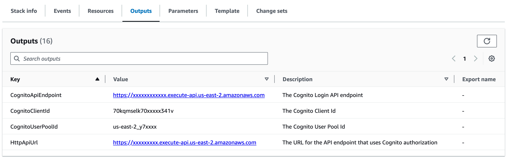

# Document Console


## Overview

The FormKiQ Document Console is an intuitive and user-friendly web application built using [React](https://react.dev), designed to serve as the frontend for efficiently managing your digital documents. This powerful tool offers a seamless and modern interface, making document management an effortless and organized process.

Key features of the FormKiQ Document Console include:

1. **Document Organization**: The console provides a central hub for organizing and categorizing your documents. Users can easily create folders, assign tags, and maintain a structured hierarchy for their files.

2. **User-Friendly Interface**: The application boasts a clean and user-friendly design, ensuring that users can navigate through their documents with ease. The responsive interface adapts to various screen sizes, enhancing the user experience.

3. **Document Upload**: Users can upload documents directly from their devices. This flexibility simplifies the process of populating the document repository.

4. **Document Preview**: The console allows users to preview documents without the need to download them. This feature can save time and provide a quick overview of the content.

5. **Document Search**: The search functionality is robust, making it easy to find specific documents using keywords, tags, or other search parameters. This feature is particularly useful for those dealing with large document repositories.

6. **Security**: The FormKiQ Document Console often includes security measures to protect sensitive information. This can include user authentication, encryption, and access control to ensure that only authorized personnel can access certain documents.

10. **Document Workflow**: Some consoles integrate workflow management, allowing for the creation of custom processes for document approval, review, and distribution.

11. **Notification System**: Users can receive alerts and notifications regarding changes, updates, or actions related to their documents, ensuring they stay informed.

12. **Customization**: The application may offer options for customizing the interface, such as choosing themes, layouts, or personalized settings to meet individual preferences.

The FormKiQ Document Console is a versatile tool for individuals and organizations that require a reliable and efficient solution for document management. It simplifies the process of document storage, retrieval, and collaboration, ultimately enhancing productivity and ensuring that important information is easily accessible and well-organized.

## CloudFront / S3

The FormKiQ Document Console uses [AWS CloudFront](https://aws.amazon.com/cloudfront) and [Amazon S3](https://aws.amazon.com/s3/) to efficiently serve the console as a Single Page Application (SPA).

[AWS CloudFront](https://aws.amazon.com/cloudfront) is a content delivery network (CDN) service built for high performance, and security.

[Amazon S3](https://aws.amazon.com/s3/) is an object store that contains the console source files.

## Docker Image

The FormKiQ Document Console is also available as a [docker image](https://hub.docker.com/repository/docker/formkiq/document-console) that can be used when [AWS CloudFront](https://aws.amazon.com/cloudfront) is not available.

To run the docker image collect the following CloudFormation outputs from your FormKiQ installation.



| Environment Varaible    | Description |
| -------- | ------- |
| `HTTP_API_URL` | The URL for the API endpoint that uses Cognito authorization |
| `COGNITO_USER_POOL_ID` | The Cognito User Pool Id |
| `COGNITO_CLIENT_ID` | The Cognito Client Id |
| `COGNITO_API_URL` | The Cognito Login API endpoint |

Docker Run Command:

```
docker run -p 80:80 \
-e HTTP_API_URL=... \
-e COGNITO_USER_POOL_ID=... \
-e COGNITO_CLIENT_ID=... \
-e COGNITO_API_URL=... \ 
formkiq/document-console:VERSION
```

## Customizations

The source code to the FormKiQ Document Console is available from the [github.com](https://github.com/formkiq/formkiq-document-console) page.
