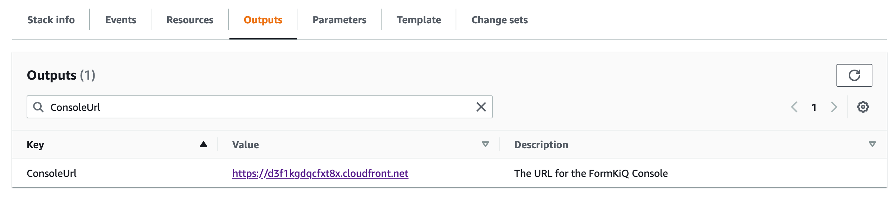
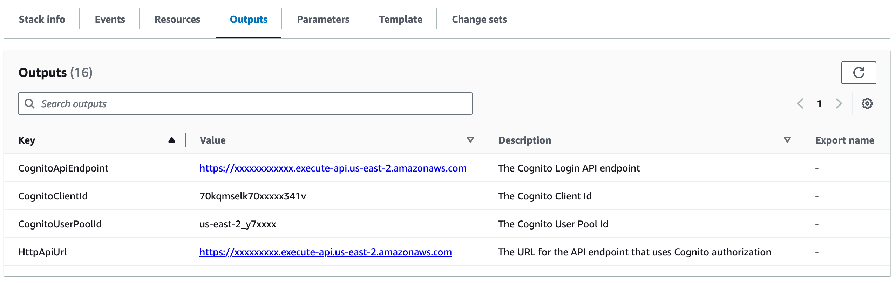
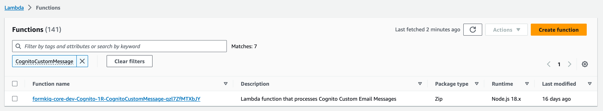
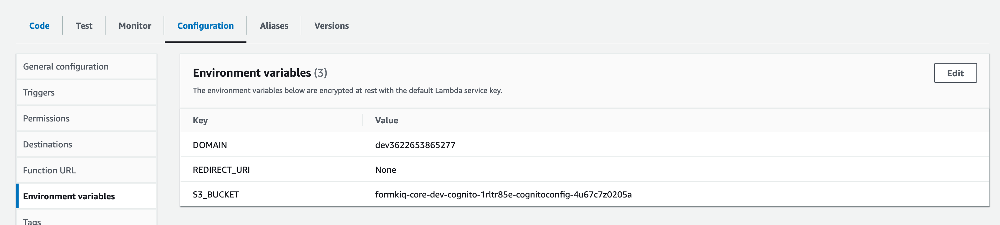
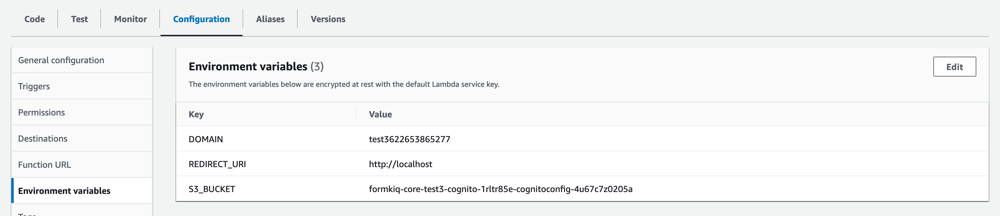

# Document Console

## Overview

The FormKiQ Document Console is the browser-based interface for working with documents, users, sites, metadata, workflows, and administration features. It is a static web application that connects to the FormKiQ API using Cognito/JWT authentication.

In standard AWS regions, the console is deployed with the FormKiQ stack and served through Amazon CloudFront. In regions where CloudFront is not available, such as AWS GovCloud (US), the console can be deployed separately using Docker.

## Console Architecture

| Component | Role |
|-----------|------|
| Amazon CloudFront | Serves the console web application in standard AWS regions. |
| Amazon S3 | Stores the static console assets and configuration files. |
| Amazon Cognito | Provides user login and JWT tokens for console sessions. |
| FormKiQ HTTP API | The API endpoint used by the console after login. |
| CloudFormation outputs | Provide the console URL, API URL, Cognito user pool, Cognito client, and Cognito login endpoint. |

The console uses JWT authentication. AWS IAM and API key authentication are available for programmatic API access, but they are not console login methods.

## Find the Console URL

After installation, open the CloudFormation **Outputs** tab for the FormKiQ stack.



Common outputs include:

| Output | Purpose |
|--------|---------|
| `ConsoleUrl` | Opens the FormKiQ Document Console. |
| `HttpApiUrl` | API endpoint used by JWT-authenticated console and API requests. |
| `CognitoUserPoolId` | Cognito user pool used for users and groups. |
| `CognitoClientId` | Cognito app client used by console login. |
| `CognitoApiUrl` | Cognito login API endpoint used by the console. |

If the console URL does not open, confirm that the CloudFormation stack has completed successfully and that you are using the output from the same AWS region where FormKiQ was installed.

## Core Console Capabilities

Core console capabilities include:

- Uploading and viewing documents
- Browsing sites and folder-style paths
- Searching documents by metadata, tags, attributes, and available search configuration
- Editing document metadata, tags, attributes, and schemas
- Managing users and groups through the configured identity model
- Creating and managing API keys when API key authentication is enabled
- Accessing administrative configuration available to the signed-in user's role

Commercial modules and deployment options can add capabilities such as SSO, workflows, queues, document generation, enhanced IDP, advanced access control, custom domains, and white-label or specialized console behavior.

For document concepts, see [Documents](/docs/features/documents). For access-control details, see [Security](/docs/platform/security).

## Deployment Options

### CloudFront/S3 Deployment

In standard AWS regions, FormKiQ deploys the console as static frontend assets served through CloudFront.

- CloudFront provides the browser-facing console URL.
- S3 stores the static console application files.
- The console configuration points the frontend to the FormKiQ HTTP API and Cognito resources.
- Login and API calls use Cognito/JWT authentication.

:::note
CloudFront is not available in certain AWS regions, including AWS GovCloud (US) West. For these regions, use the Docker deployment option below.
:::

### Docker Deployment

For environments where CloudFront is not available, or when you need to host the console yourself, FormKiQ provides an official [Docker image](https://hub.docker.com/repository/docker/formkiq/document-console).

The Docker-hosted console still connects to the same FormKiQ API and Cognito resources. It needs the same configuration values that the CloudFront-hosted console receives from CloudFormation.

#### Prerequisites

Collect the following CloudFormation outputs from your FormKiQ installation:



| Environment Variable | Description |
|----------------------|-------------|
| `HTTP_API_URL` | FormKiQ API endpoint using Cognito/JWT authorization. |
| `COGNITO_USER_POOL_ID` | Cognito user pool identifier. |
| `COGNITO_CLIENT_ID` | Cognito app client identifier. |
| `COGNITO_API_URL` | Cognito login API endpoint. |

#### Launch Command

```bash
docker run --name formkiq-document-console \
  -p 80:80 \
  -e HTTP_API_URL=<HttpApiUrl> \
  -e COGNITO_USER_POOL_ID=<CognitoUserPoolId> \
  -e COGNITO_CLIENT_ID=<CognitoClientId> \
  -e COGNITO_API_URL=<CognitoApiUrl> \
  formkiq/document-console:<version>
```

Use the Document Console image version that matches your FormKiQ deployment whenever possible.

## Initial Setup

In environments such as AWS GovCloud (US) West where automatic console setup is not available, you need to:

1. Deploy the console using Docker.
2. Configure the welcome email redirect URL.
3. Create the initial admin user.
4. Confirm the user has access to the expected site, usually `default`.

### Configuring Welcome Email

The `REDIRECT_URI` value controls where Cognito password setup and verification links send the user after they open the welcome email. For Docker deployments, set it to the URL where users will access the console.

1. Locate the CognitoCustomMessage Lambda function:

   

2. Navigate to **Configuration > Environment Variables**:

   

3. Set the `REDIRECT_URI` environment variable:

   - For local deployment: `http://localhost`
   - For EC2 deployment: the EC2 instance URL or DNS name
   - For a custom domain: the console domain, such as `https://console.example.com`

   

### Creating Initial Admin User

1. Follow the instructions in the [Security section](/docs/platform/security#add-user-to-site) to create your first user.
2. Confirm the user belongs to a group or site with the required permissions.
3. The user receives a welcome email with a password setup link.
4. After setting the password, the user can access the console and create or manage additional users based on their permissions.

:::note
The Document Console requires a Cognito/JWT user with site access. If a user has no site access, they may authenticate successfully but still be unable to use the console.
:::

## Authentication and Access

The console uses Cognito/JWT authentication.

| Access method | Console use | Programmatic API use |
|---------------|-------------|----------------------|
| Cognito/JWT | Yes | Yes, through `HttpApiUrl`. |
| AWS IAM | No | Yes, through `IamApiUrl`. |
| API key | No | Yes, through `KeyApiUrl`, when enabled. |
| SSO/custom JWT | Yes, when configured | Depends on deployment and module configuration. |

By default, FormKiQ uses Cognito groups and sites to determine what a signed-in user can access. The default site is `default`.

For details, see [Security](/docs/platform/security) and [Multi-Tenant vs Multi-Instance](/docs/platform/multi-tenant-vs-multi-instance).

## Custom Domains and SSO

Console-adjacent configuration is usually handled through commercial modules or identity-provider setup:

- For custom console and API domains, see [Custom Domains](/docs/formkiq-modules/modules/custom-domains).
- For SSO and custom JWT options, see [Single Sign-On and Custom JWT Authorizer](/docs/formkiq-modules/modules/single-sign-on-and-custom-jwt-authorizer).
- For identity-provider tutorials, see [Microsoft Entra ID](/docs/tutorials/Identity%20Management/microsoft-entra-id), [Google Workspace](/docs/tutorials/Identity%20Management/google-workspace), and [Okta](/docs/tutorials/Identity%20Management/okta).

## Troubleshooting

### Console URL Does Not Open

Confirm the FormKiQ CloudFormation stack is complete and use the `ConsoleUrl` output from the same AWS region where FormKiQ was installed. In AWS GovCloud (US), deploy the console with Docker because CloudFront is not available.

### Login Works but Documents Do Not Load

Confirm the console is using the correct `HTTP_API_URL` value and that the signed-in user has access to the expected site. Also check browser developer tools for API errors and CloudWatch logs for backend errors.

### Welcome Email Link Opens the Wrong URL

Update the `REDIRECT_URI` environment variable on the CognitoCustomMessage Lambda function so the welcome email points to the correct console URL.

### User Has No Site Access

Confirm the user belongs to the correct Cognito group or site access configuration. For the default deployment, users commonly need access to the `default` site or another site-specific group.

### Docker Console Shows Authentication or Configuration Errors

Verify that all Docker environment variables came from the same FormKiQ stack and AWS region:

- `HTTP_API_URL`
- `COGNITO_USER_POOL_ID`
- `COGNITO_CLIENT_ID`
- `COGNITO_API_URL`

### API Calls Fail After Login

Check whether the console is pointed at `HttpApiUrl`, not `IamApiUrl` or `KeyApiUrl`. The console uses JWT authentication and should call the JWT-authenticated HTTP API.

## Customization

The FormKiQ Document Console is open source. You can find the source code and contribution guidelines on [GitHub](https://github.com/formkiq/formkiq-document-console).

## Where to Go Next

- Install FormKiQ: [Quick Start (AWS)](/docs/getting-started/quick-start)
- Test the API: [API Walkthrough](/docs/getting-started/api-walkthrough)
- Review authentication: [Security](/docs/platform/security)
- Plan sites and tenancy: [Multi-Tenant vs Multi-Instance](/docs/platform/multi-tenant-vs-multi-instance)
- Configure custom domains: [Custom Domains](/docs/formkiq-modules/modules/custom-domains)
