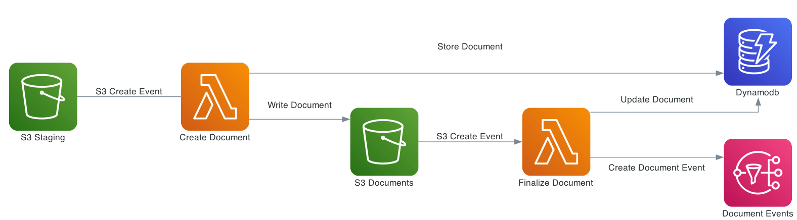

# Document Storage

FormKiQ uses the [Amazon Simple Storage Service (Amazon S3)](https://aws.amazon.com/s3/) as the backend object store for all documents. Amazon S3 is a manage object storage service that offers industry-leading scalability, data availability, security, and performance.

Amazon S3 is a cost-effective storage solution that's easy-to-use, supports multiple storage classes for cost optimization, and allows for fine-tuned access controls to meet specific business, organizational, and compliance requirements.

By default FormKiQ installs with `two` S3 buckets.

| Bucket | Description
| -------- | ------- |
| Staging | A temporary holding place for documents waiting for processing |
| Documents | The permanent post-processing document storage |


## Path Layout

FormKiQ is a multi-tenant application, so a specific S3 key structure is used to identify which tenant owns the document.

### Documents added to ROOT

Any documents that are added to the "ROOT" of the S3 bucket, e.g. a document with S3 key of `document1.txt`, are assumed to be part of the `DEFAULT` siteId.

Documents can also be added to the `DEFAULT` siteId if the key starts with `default`, e.g. S3 key of `default/document1.txt`.

### Documents added to SiteId

Documents can be added to a specific siteId by having that siteId as the first "folder" of they key, e.g. S3 key of `group1/document1.txt` will add the document1.txt to the `group1` siteId.

### Documents with a PATH

As of version 1.7.0, documents can be added and have a `path` tag automatically created. Following the same pattern as above *EXCEPT* the S3 key *MUST* start with either `default` or the `siteId` path.

For examples:

S3 key of `default/dir1/dir2/document1.txt` will add a document with a `path` tag of `dir1/dir2/document1.txt` to the `default` siteId.

S3 key of `group1/dir1/dir2/document2.txt` will add a document with a `path` tag of `dir1/dir2/document2.txt` to the `group1` siteId.


## Add Document Workflow



Documents can be added to S3 via the FormKiQ API or directly to the `Staging` S3 bucket. While it is recommended to only use the API for your standard workflow, it can be advantageous to add documents directly to the `Staging` S3 bucket, for operations such as initial document migration.

When a document is added to the `Staging` S3 bucket, an S3 object create event is created that calls the Document Create [AWS Lambda](https://aws.amazon.com/lambda/). The Document Create Lambda writes a record to [Amazon DynamoDB](https://aws.amazon.com/documentdb/), and moves the document to the `Documents` S3 bucket.

Once the document is added to the `Documents` S3 bucket, another S3 event is created which adds a message to the Update Document [Amazon SQS queue](https://aws.amazon.com/sqs). An Update Document Lambda is listening to the Update Document SQS queue and adds and updates document metadata whenever an event is added to the queue. Any S3 object tags that have been specified will also be included as document metadata.

:::note
Each time a document is create or updated the AWS Lambda function also posts a message to [Amazon Simple Notification Service](https://aws.amazon.com/sns), which can be used to trigger additional document processing.
:::

## FKB64 File Format

For initial document migration or other occasional uses, the `Staging` S3 bucket does allow direct uploads using a internal file format.

:::warning
Writing files directly to the `Documents` S3 bucket (i.e., not the `Staging` bucket) is *NOT* supported and may cause stability issues.
:::

As of version 1.7.0, you can use the S3 Layout describe above if the S3 key ends in `.fkb64`

For example creating the following JSON and saving it as `document1.fkb64` in the ROOT of the `Staging` bucket will add the `content` field as a document in the `default` siteId.

Required fields are marked below.

```
{
  "path": "document1.txt",
  "userId": "joesmith", // <required>
  "contentType": "text/plain", // <required>
  "isBase64": true, // <required>
  "content": "dGhpcyBpcyBhIHRlc3Q=", // <required>
  "tags": [
    {
      "key": "category",
      "value": "document"
    },
    {
      "key": "user",
      "values": ["1", "2"]
    }
  ],
  "metadata": [
    {
      "key": "property1",
      "value": "value1"
    }
  ]
}
```

Note: The `.fkb64` matches the [Add Document Request](https://docs.formkiq.com/docs/latest/api/index.html#tag/Documents/operation/AddDocument). Refer to the API for a listing of all properties.