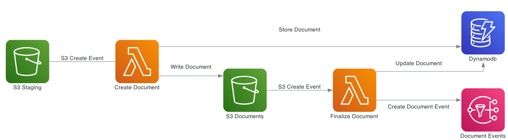

# Document Storage

FormKiQ stores document content in [Amazon Simple Storage Service (Amazon S3)](https://aws.amazon.com/s3/) and stores document metadata, attributes, paths, status, indexes, and operational state in Amazon DynamoDB.

S3 is the binary content layer. The FormKiQ API, queues, Lambda functions, metadata records, and events are what make the stored objects behave like managed documents.

## Storage Model

| Layer | AWS service | Stores |
|-------|-------------|--------|
| Document content | Amazon S3 | Original file bytes, uploaded content, and object versions. |
| Document metadata | Amazon DynamoDB | `documentId`, path, content type, tags, attributes, site, status, and indexes. |
| Processing state | DynamoDB, SQS, Lambda | Document processing, retries, actions, queues, and workflow state. |
| Events | SNS, SQS, EventBridge | Document lifecycle messages for automation and integrations. |

:::warning
Do not write files directly to the Documents bucket. Use the FormKiQ API, a presigned upload URL, or the staging bucket `.fkb64` import format for supported ingestion paths.
:::

## S3 Buckets

FormKiQ deploys separate S3 buckets for staging and permanent document storage.

| Bucket | Purpose | Direct user access |
|--------|---------|--------------------|
| Staging | Temporary intake location for supported import flows and processing handoff. | Only for supported migration/import workflows such as `.fkb64`. |
| Documents | Permanent managed storage for document content. | Do not write directly. FormKiQ manages this bucket through APIs and processing services. |

Most users should not need to interact with either bucket directly. Application integrations should use the FormKiQ API. Large file uploads should use the presigned S3 upload flow returned by the API.

## Recommended Upload Methods

| Method | Best for | Notes |
|--------|----------|-------|
| `POST /documents` | Smaller inline documents and simple API tests. | Sends document content through the FormKiQ API. |
| `POST /documents/upload` | Larger files and production uploads. | Creates document metadata and returns a presigned S3 URL for direct upload. |
| `.fkb64` staging upload | Bulk migration or controlled import workflows. | Uploads a JSON package to the staging bucket for processing. |
| S3 Deep Link | Documents that already live in another S3 bucket. | References external S3 objects without copying them into FormKiQ managed storage. |

For API examples, see the [Documents API Tutorial](/docs/tutorials/Documents/documents-api). For endpoint details, see [Add Document](/docs/api-reference/add-document), [Add Document Upload](/docs/api-reference/add-document-upload), and [Get Document Upload](/docs/api-reference/get-document-upload).

## S3 Key Structure

FormKiQ uses S3 keys and document paths to support site-based document organization.

### Default Site Documents

The default site is named `default`.

- Root-level files such as `document1.txt` belong to the `default` site.
- Files can also use the `default/` prefix, such as `default/document1.txt`.

### Site-Specific Documents

Use the site ID as the prefix when importing or organizing site-specific documents.

- `finance/invoice.pdf` belongs to the `finance` site.
- `legal/contracts/vendor.pdf` belongs to the `legal` site.

### Nested Paths

Nested paths are supported for organizing documents inside a site.

| S3 key | Site ID | Document path |
|--------|---------|---------------|
| `default/dir1/dir2/document1.txt` | `default` | `dir1/dir2/document1.txt` |
| `finance/invoices/2026/invoice1.pdf` | `finance` | `invoices/2026/invoice1.pdf` |

For direct staging imports, keys must start with either `default/` or `{siteId}/` when using nested paths.

## Document Processing Workflow



### Inline API Upload

1. A client calls `POST /documents` with document content and metadata.
2. FormKiQ creates a DynamoDB document record.
3. Document content is written to managed S3 storage.
4. FormKiQ emits document lifecycle events.
5. Optional workflows, rulesets, OCR, classification, or indexing actions process the document.

### Presigned S3 Upload

1. A client calls `POST /documents/upload`.
2. FormKiQ creates a document record and returns a presigned S3 upload URL.
3. The client uploads file bytes directly to S3 using the returned URL and required headers.
4. S3 events trigger FormKiQ processing.
5. Metadata, tags, attributes, events, and optional search indexes are updated.

This is the recommended pattern for larger files because file bytes go directly to S3 instead of passing through the API request body.

### Staging Bucket Import

1. A `.fkb64` file is uploaded to the staging bucket.
2. S3 create events trigger FormKiQ import processing.
3. FormKiQ extracts document content and metadata from the `.fkb64` payload.
4. The document is registered in DynamoDB and moved into managed document storage.
5. Standard document events and processing steps continue.

### Document Update or Replacement

Document content can be replaced by updating the document metadata and uploading new content through the upload URL returned by the API. If document versioning is enabled, updates can create additional document versions.

For details, see [Documents](/docs/features/documents) and [Document Versioning](/docs/formkiq-modules/modules/document-versioning).

## Direct Upload Format (FKB64)

For special cases such as bulk migration, FormKiQ supports direct uploads to the staging bucket using the `.fkb64` format.

Use this path only when you need a controlled staging-bucket import. For normal application uploads, use the document APIs.

### FKB64 File Specification

Files must:

- End in the `.fkb64` extension
- Contain valid JSON matching the [Add Document](/docs/api-reference/add-document) request shape
- Include Base64-encoded content when `isBase64` is `true`

Example:

```json
{
  "userId": "joesmith",
  "contentType": "text/plain",
  "isBase64": true,
  "content": "dGhpcyBpcyBhIHRlc3Q=",
  "path": "document1.txt",
  "tags": [
    {
      "key": "category",
      "value": "document"
    },
    {
      "key": "user",
      "values": ["1", "2"]
    }
  ],
  "metadata": [
    {
      "key": "property1",
      "value": "value1"
    }
  ]
}
```

For migration guidance, see [Migration and Data Import](/docs/platform/migration-and-data-import).

## S3 Deep Links

S3 Deep Links let FormKiQ reference documents that already live in another S3 bucket without copying them into FormKiQ managed storage.

Use S3 Deep Links when:

- The source file must remain in an existing S3 bucket.
- Another system owns the original object lifecycle.
- You want FormKiQ metadata, workflow, or search behavior around externally stored S3 content.

Cross-account S3 Deep Links require bucket policy permissions. If the source bucket uses SSE-KMS, the KMS key must also allow FormKiQ to decrypt the object.

For details, see [Documents](/docs/features/documents#aws-s3-deep-link).

## Security and Access

FormKiQ storage access should remain controlled through the deployed stack, IAM roles, and FormKiQ APIs.

- Document content is stored in customer-controlled S3 buckets.
- API requests use JWT, IAM, or API key authentication depending on endpoint and configuration.
- S3 objects are accessed by FormKiQ service roles and presigned URLs generated by FormKiQ.
- Data is encrypted in transit with HTTPS/TLS.
- S3 server-side encryption is used for stored document content.
- Cross-account S3 access and KMS decrypt permissions must be configured explicitly for S3 Deep Links.

For access-control details, see [Security](/docs/platform/security).

## Versioning and Recovery

FormKiQ enables S3 versioning for document storage buckets. This helps support document recovery, rollback scenarios, and protection against accidental overwrite or deletion.

Recovery planning should account for:

- S3 object versions for document content
- DynamoDB point-in-time recovery for document metadata
- Search index rebuilds where full-text search is enabled
- CloudFormation stack state for infrastructure recovery

For details, see [Backup and Recovery](/docs/platform/backup_and_recovery).

## Lifecycle and Cost Management

S3 storage cost depends on document volume, object size, request volume, data transfer, retention policy, and storage class.

Common cost controls include:

- S3 lifecycle policies for older document versions or archived content
- S3 storage classes such as Standard, Intelligent-Tiering, or Glacier classes where appropriate
- Controlled migration concurrency to avoid unnecessary retries and processing cost
- Presigned upload flows for larger files to avoid routing large payloads through API Gateway and Lambda

For cost planning, see [Costs](/docs/platform/costs).

## Events and Automation

Document storage changes are part of FormKiQ's event-driven architecture.

- S3 object events trigger document processing.
- FormKiQ emits document lifecycle events after create, update, delete, and processing actions.
- SNS and SQS support fan-out, buffering, retries, and dead-letter queues.
- EventBridge can be used for broader AWS event routing where configured.

For architecture context, see [Platform Overview](/docs/platform/overview#document-events). For an integration example, see [Document Event Processing](/docs/tutorials/document-event-processing).

## Where to Go Next

- Try document APIs: [API Walkthrough](/docs/getting-started/api-walkthrough)
- Review document features: [Documents](/docs/features/documents)
- Plan migration: [Migration and Data Import](/docs/platform/migration-and-data-import)
- Review recovery controls: [Backup and Recovery](/docs/platform/backup_and_recovery)
- Estimate storage cost: [Costs](/docs/platform/costs)
