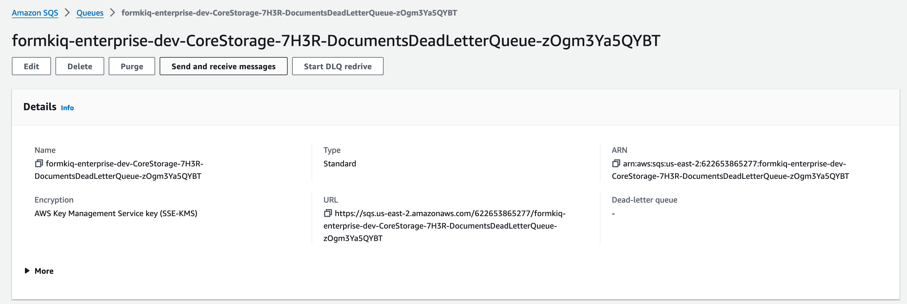
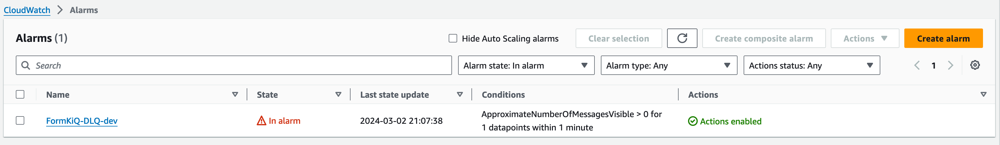
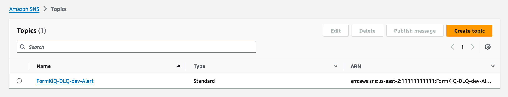
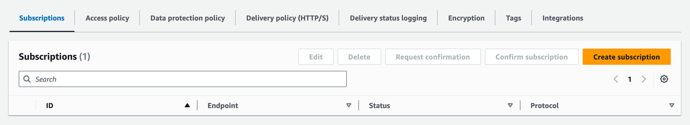
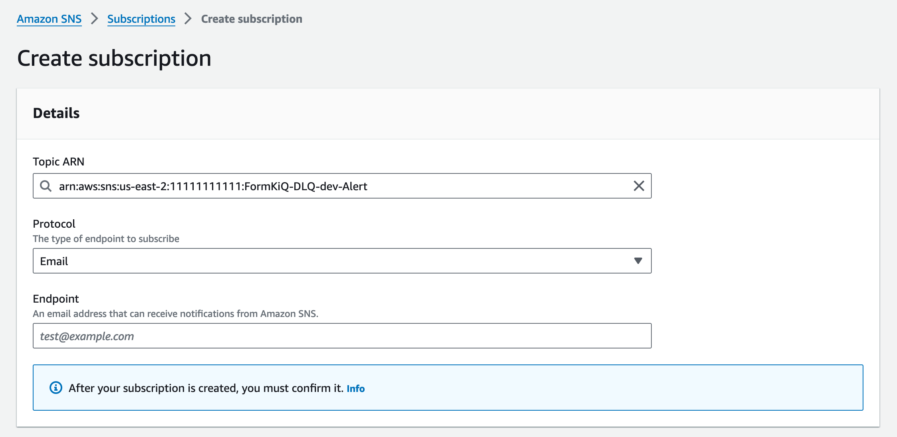
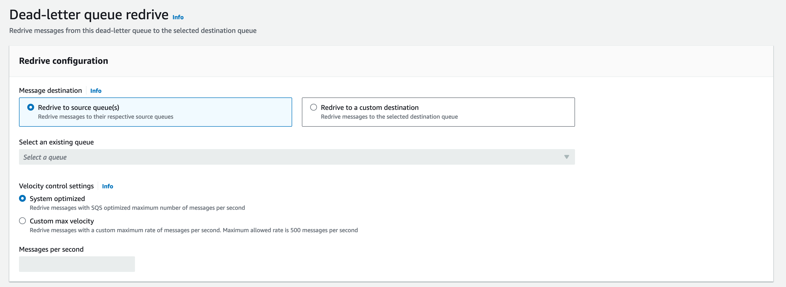
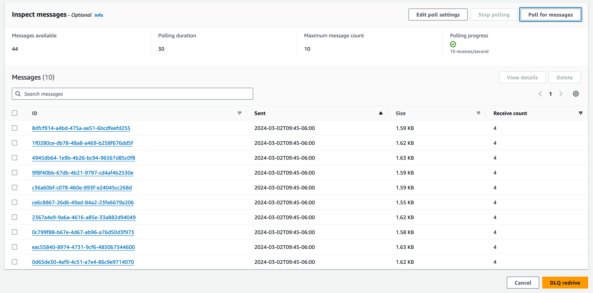

# Dead-Letter Queue (DLQ)

## Overview

FormKiQ uses a message-driven architecture where components communicate through asynchronous message passing. This approach:
- Decouples system components
- Increases system resilience
- Prevents cascading failures
- Enables graceful handling of high load conditions



## Understanding Dead-Letter Queues

[Amazon SQS Dead-Letter Queues (DLQs)](https://docs.aws.amazon.com/AWSSimpleQueueService/latest/SQSDeveloperGuide/sqs-dead-letter-queues.html) provide a mechanism for handling messages that fail processing. FormKiQ implements a centralized DLQ that:
- Captures failed messages from all queues
- Enables investigation of processing failures
- Allows message reprocessing when appropriate
- Provides monitoring and alerting capabilities

## Monitoring and Alerts

### CloudWatch Alarms
FormKiQ automatically configures Amazon CloudWatch Alarms to monitor the DLQ. These alarms:
- Track failed message metrics
- Trigger notifications when messages enter the DLQ
- Integrate with Amazon SNS for alerting



### Setting Up Email Notifications

To receive email alerts when messages fail processing:

1. Access the [Amazon SNS console](https://console.aws.amazon.com/sns/v3/home)
2. Locate the DLQ topic
   

3. Create a subscription:
   - Select the topic
   - Click the `Subscriptions` tab
   - Click `Create Subscription`
   

4. Configure the subscription:
   - Verify the Topic ARN
   - Select `Email` as the Protocol
   - Enter your email address
   - Click `Create subscription`
   

5. Confirm the subscription:
   - Check your email for a confirmation message
   - Click the verification link
   ```
   You have chosen to subscribe to the topic:
   arn:aws:sns:us-east-2:1111111111:FormKiQ-DLQ-dev-Alert

   To confirm this subscription, click or visit the link below 
   (If this was in error no action is necessary):
   Confirm subscription
   ```

## Message Reprocessing (Redrive)

When messages fail processing, you can redirect them back to their original queue using the DLQ redrive feature:

1. Access the DLQ:
   - Find your FormKiQ installation's dead letter queue
   

2. Start the redrive process:
   - Click `Start DLQ redrive`
   

3. Review messages:
   - Click `Poll for messages` with default settings
   
   - Examine message contents by clicking individual messages
   - Delete invalid messages if needed

4. Reprocess messages:
   - Select messages for reprocessing
   - Click `DLQ redrive`
   - Messages return to their original queue

:::note
Messages that fail processing again will return to the DLQ. This helps identify persistent issues that require investigation.
:::

## Best Practices

1. **Regular Monitoring**
   - Set up email notifications
   - Review DLQ contents periodically
   - Track failure patterns

2. **Investigation**
   - Examine message contents
   - Review system logs
   - Identify root causes

3. **Reprocessing**
   - Fix underlying issues before redriving
   - Monitor reprocessed messages
   - Document persistent failures