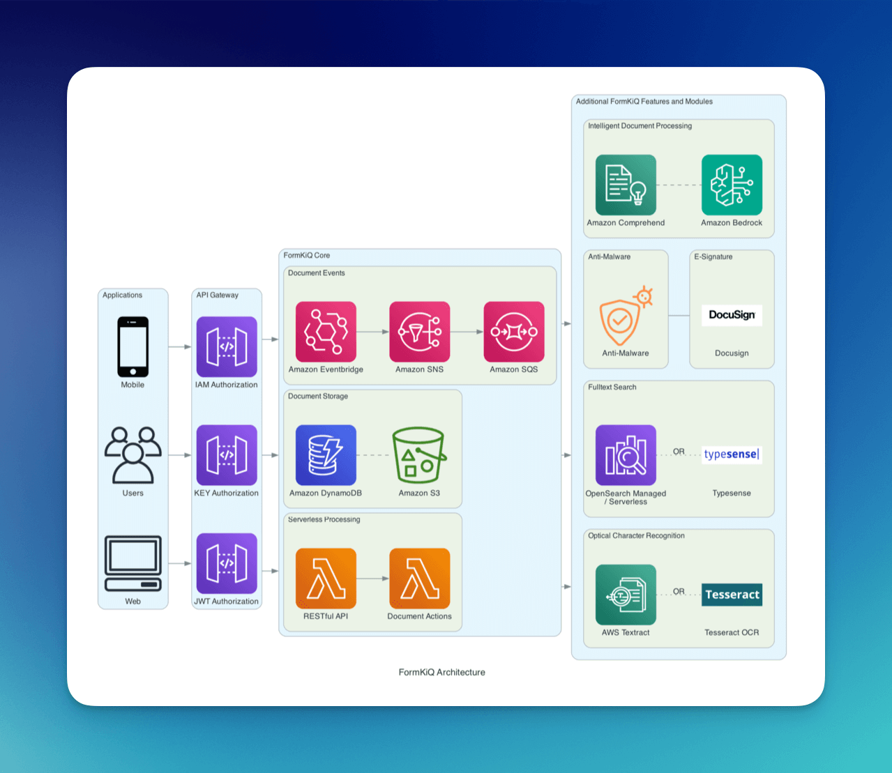
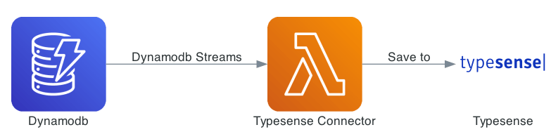

# Overview

FormKiQ is a flexible document management platform, powered by [AWS managed services](https://aws.amazon.com/managed-services/) and [serverless technologies](https://aws.amazon.com/serverless/).

* API-first platform for document storage, processing, classification, transformation, integration, and discovery

* Developed according to the [Six Pillars of the AWS Well-Architected Framework](https://aws.amazon.com/blogs/apn/the-6-pillars-of-the-aws-well-architected-framework/)

* Designed to reduce cost and eliminate implementation agony

* Enhanced with advanced document management functionality, as needed, including optical character recognition, intelligent document processing, and workflows

## Architecture Principles

FormKiQ is designed with all six pillars of the [AWS Well-Architected Framework](https://aws.amazon.com/blogs/apn/the-6-pillars-of-the-aws-well-architected-framework/) in mind:

* *Operational Excellence* - with laC deployments and an event-based architecture that understands the need for resiliency and limited retries

* *Security*: with encryption both in transit and at rest, as well as
robust authentication models (JWT, IAM, and Access-Key-based Auth) for a variety of use cases and implementation options

* *Reliability*: with near-infinite scalability, and an architecture with loosely-coupled services to allow for graceful degradation

* *Performance Efficiency*: using serverless technologies, and with a flexible mechanism to include new advancements in cloud services

* *Cost Optimization*: using a consumption model, and enabling storage tiers and lifecycle policies to reduce cost

* *Sustainability*: relying on managed services whenever available, and working to keep both upstream and downstream

## Components

### Storage

FormKiQ uses the following AWS services for the storage of documents and metadata. 

[Amazon S3](https://aws.amazon.com/s3/) is used to storage the contents of the document.

[Amazon DynamoDB](https://aws.amazon.com/pm/dynamodb) is used for the storage of document metadata.

#### Amazon S3

Amazon S3 offers a robust and efficient storage solution designed to meet the demands of modern data-driven applications. With its intuitive interface and comprehensive set of features, S3 empowers organizations to store, organize, and retrieve data effortlessly. Whether you're a startup, a large enterprise, or an individual developer, Amazon S3 provides the flexibility and scalability to accommodate your storage needs.

##### Key Features and Benefits:

*Scalability*: Amazon S3 is built on an architecture that allows it to seamlessly scale up or down based on your storage requirements. You can start small and grow as your data grows without worrying about infrastructure management.

*Durability and Reliability*: S3 offers high durability, ensuring that your data is redundantly stored across multiple availability zones within a region. This redundancy minimizes the risk of data loss due to hardware failures.

*Security*: S3 provides multiple layers of security, including server-side encryption, access control policies, and the option to use AWS Identity and Access Management (IAM) for fine-grained access control. This ensures that your data is protected from unauthorized access.

*Data Lifecycle Management*: You can define rules to automatically transition data between different storage classes based on access patterns and retention requirements. This helps optimize costs by moving infrequently accessed data to lower-cost storage tiers.

*Versioning and Restore Options*: S3 supports versioning, allowing you to preserve, retrieve, and restore previous versions of objects. This can be crucial for data integrity and recovery in case of accidental deletions or changes.

*Flexible Storage Classes*: S3 offers multiple storage classes, each tailored to specific use cases and cost considerations. This includes Standard, Intelligent-Tiering, Glacier, and more.

#### Amazon DynamoDB

Amazon DynamoDB is a fully managed NoSQL database service provided by Amazon Web Services (AWS). It is designed to provide seamless and high-performance storage for applications that require fast and predictable performance, scalability, and flexible. 

Amazon DynamoDB is built to handle the demands of modern applications that require highly responsive and scalable data storage. It offers a reliable and efficient solution for managing structured or semi-structured data, with low-latency access to your data, automatic scaling, and seamless integration with other AWS services.

##### Key Features and Benefits:

* *Scalability*: DynamoDB scales effortlessly to accommodate growing workloads. It can automatically adjust its capacity based on demand, ensuring that your application remains performant under varying loads.

* *Predictable Performance*: DynamoDB provides consistent, single-digit millisecond latencies for both read and write operations, regardless of data volume or traffic spikes. This makes it suitable for applications that require low-latency access.

* *Fully Managed*: With DynamoDB, AWS takes care of the operational aspects such as hardware provisioning, setup, configuration, patching, backups, and scaling. This allows developers to focus on building applications rather than managing infrastructure.

* *Security*: DynamoDB offers built-in security features, including data encryption at rest and in transit. You can also use AWS Identity and Access Management (IAM) to control access to tables and resources.

* *Automatic Backups and Point-in-Time Recovery*: DynamoDB automatically creates and retains backups of your data, allowing you to restore your table to any point in time within a specified retention period.

* *Event-Driven Architecture*: DynamoDB streams allow you to capture changes to your data in real-time, enabling event-driven architectures and facilitating use cases like data synchronization and notifications.

### Processing

For document processing, FormKiQ uses the following AWS services:

[AWS Lambda](https://aws.amazon.com/lambda/) is used as an event-driven compute service for the processing of documents.

[Amazon ECS (Fargate)](https://docs.aws.amazon.com/AmazonECS/latest/userguide/what-is-fargate.html) is a AWS fully managed tasks and services platform for the running of services that cannot be run using AWS Lambda.

#### AWS Lambda

Amazon Web Services (AWS) Lambda is a serverless compute service that enables developers to run code in response to events without the need to provision or manage servers. AWS Lambda allows you to execute code in the cloud without worrying about server infrastructure, scaling, or maintenance.

##### Key Features and Benefits:

* *Event-Driven Architecture*: AWS Lambda is designed to be event-driven, meaning it executes code in response to specific events or triggers. These triggers can be events from various AWS services, HTTP requests via API Gateway, database changes, file uploads, and more.

* *No Server Management*: One of the most significant advantages of Lambda is that you don't need to worry about provisioning, managing, or scaling servers. AWS takes care of the infrastructure for you, allowing you to focus on writing code.

* *Automatic Scaling*: Lambda functions automatically scale based on the incoming workload. Whether you have a few requests or thousands, AWS Lambda handles the scaling dynamically to ensure your code runs efficiently.

* *Pay-Per-Use Pricing*: AWS Lambda follows a pay-as-you-go pricing model. You're only charged for the compute time used during the execution of your functions, without any upfront costs or idle server charges.

* *Microservices Architecture*: AWS Lambda is an ideal tool for building microservices architectures. You can create small, focused functions that perform specific tasks and then compose them to build complex applications.

* *Secure Execution Environment*: Lambda functions run in an isolated environment, ensuring that your code execution is secure and separate from other workloads. IAM roles and policies control the permissions each function has.

Amazon Elastic Container Service (ECS) with AWS Fargate is a fully managed container orchestration service that allows you to run containers without needing to manage the underlying infrastructure. It simplifies the deployment and management of containerized applications, providing a scalable and efficient way to process compute workloads. Here's a description of using AWS ECS Fargate as a compute processor:

#### AWS ECS Fargate

AWS ECS Fargate combines the power of containerization with the ease of managed services, providing developers with a platform to run containers efficiently and securely.

##### Key Features and Benefits:

* *Container Management*: AWS ECS Fargate lets you package your application code, runtime, libraries, and dependencies into containers. It manages the deployment, scaling, and monitoring of these containers.

* *Serverless Compute*: With Fargate, you don't need to worry about provisioning or managing servers. You specify the resources your containers require, and AWS automatically handles the infrastructure provisioning, scaling, and termination.

* *Resource Isolation*: Each task (group of containers) runs in an isolated environment, ensuring that your workloads are secure and resources are allocated properly. This enables you to run multiple applications with different resource requirements on the same cluster.

* *Scalability*: ECS Fargate allows you to scale your applications seamlessly based on demand. Scaling policies can be defined to automatically adjust the number of tasks running in response to workload changes.

* *Managed Updates*: Fargate automatically handles updates and patches for the underlying infrastructure, ensuring that your applications remain up-to-date and secure.

### API Requests

#### API Gateway

Amazon API Gateway is a managed service that makes it easy to create, publish, and manage APIs at any scale. It acts as a front door for the FormKiQ backend services, that can securely handle and process incoming API requests.

##### Key Features and Benefits

* *API Security*: API Gateway offers multiple security features to protect your APIs. You can use AWS Identity and Access Management (IAM) to control access to your APIs, and you can also integrate with Amazon Cognito for user authentication and authorization.

* *Throttling and Rate Limiting*: API Gateway lets you implement throttling and rate limiting to prevent abuse and ensure fair usage of your APIs. This helps maintain performance and availability.

* *Integration with Backend Services*: API Gateway can integrate with various backend services, including AWS Lambda, and HTTP endpoints. This allows you to route incoming requests to the appropriate backend resources.

* *Monitoring and Logging*: API Gateway provides monitoring and logging capabilities through Amazon CloudWatch, allowing you to track API usage, performance metrics, and errors.

FormKiQ deploys multiple API Gateway instances with different authorizers allows you the flexiblity to use the API in numerous different scenarios. 

FormKiQ supports:
* [Amazon Cognito](https://aws.amazon.com/cognito/) JWT authorizers
* AWS IAM authorizers
* Key-based authorizers
* Custom JWT authorizers

### Document Events

Document events are a powerful feature of FormKiQ. These events allow operations to be triggered on documents automatically, whenever a change occurs. For example, when a document is created, a document event can be triggered to perform one or many actions, such as:

* sending an email notification
* scanning for viruses
* inserting data into a database
* etc.

Document event are created and sent through [Amazon Simple Notification Service (SNS)](https://aws.amazon.com/sns). Amazon SNS is a messaging service that can be used for application-to-application communication. FormKiQ uses it as a publish/subscribe service, where applications can listen to the SNS service and be notified about different document events.

FormKiQ creates a single `SnsDocumentEvent` topic where all document events are sent. You can then use [Amazon SNS subscription filter policies](https://docs.aws.amazon.com/sns/latest/dg/sns-subscription-filter-policies.html) to set up actions for a specific type of event.

FormKiQ provides the following message attributes that you can filter on:

| Message Attribute    | Possible Value(s) | Description |
| -------- | ------- | ------- |
| `type` | create, delete, update | Document Event(s) for create, update, or delete document |
| `siteId` | default, (custom siteId) | Site Tenant Document Event was created in |

See https://docs.aws.amazon.com/sns/latest/dg/sns-subscription-filter-policies.html

#### Amazon SNS

Amazon SNS (Simple Notification Service) is an event platform that offers a powerful and versatile way to facilitate real-time communication and event-driven workflows within the FormKiQ platform. It enables seamless communication between different parts of an application, services, or even across different systems. It provides a reliable and scalable mechanism to distribute messages or events to multiple subscribers or endpoints in a highly efficient manner.

##### Key Features and Benefits:

* *Publish-Subscribe Model*: Amazon SNS follows the publish-subscribe model, where you publish messages to topics, and subscribers receive messages from these topics. This allows you to broadcast messages to multiple recipients without the need for direct communication.

* *Multiple Endpoints*: SNS supports various endpoints, including email, SMS, mobile push notifications, AWS Lambda functions, Amazon SQS queues, and HTTP/HTTPS endpoints. This wide array of endpoints enables you to communicate with different services and systems.

* *Fanout*: SNS enables fanout, meaning you can send a single message to a topic and have it delivered to multiple subscribers simultaneously. This is particularly useful for broadcasting notifications or updates.

* *Delivery Retry Mechanisms*: SNS provides built-in mechanisms for handling message delivery retries, ensuring that messages reach their intended recipients reliably even in the presence of transient errors.

#### Amazon SQS

Amazon SQS (Simple Queue Service) as an event platform provides a reliable and decoupled mechanism for managing and processing events in distributed systems. Amazon SQS is a managed message queuing service that enables seamless communication between different components of an application or between various services.

##### Key Features and Benefits:

* *Decoupled Communication*: SQS enables decoupling of components by allowing senders (producers) to enqueue messages without needing to know who or what will consume them. This promotes loose coupling and flexibility in system design.

* *Reliability and Durability*: SQS ensures that messages are reliably stored until they are successfully processed by consumers (receivers). This guarantees that messages won't be lost due to transient failures.

* *Scalability*: Amazon SQS is designed for high throughput and can automatically scale to accommodate varying workloads and message volumes.

## Features

FormKiQ is a full-featured document management system, that leverages the infrastructure and services of AWS to make it all possible.

FormKiQ Core (https://formkiq.com/products/formkiq-core) provides the [four essential functions of document management](https://formkiq.com/essential-functions-of-a-dms/), specifically:

* Document Collection and Storage

* Document Organization and Classification

* Document Processing and Transformation

* Document Discovery, Presentation, and Integration

[FormKiQ Pro](https://formkiq.com/products/formkiq-pro) provides additional functionality, including:

* Optical Character Recognition

* Anti-Malware / Anti-Virus Scanning

* Document Versioning to enable Document Control

* Additional Document Actions for Customized Workflows

* Document Tag Schemas to enable required, optional, and default tags and metadata

* Full Document Encryption, both in-transit and at-rest

[FormKiQ Enterprise](https://formkiq.com/products/formkiq-enterprise) provides access to add-on modules and custom module development.

### Documents

At the heart of the FormKiQ document management platform lies a sophisticated framework that seamlessly integrates storing, retrieving, and organizing documents. Our platform's robust storage capabilities ensure documents are securely housed and easily retrievable, leveraging cutting-edge technologies like Amazon S3 to guarantee data integrity and scalability. 

Documents can be organized in a way that mirrors their workflow, projects, or departments. This intuitive hierarchy ensures efficient navigation, as documents are logically grouped for swift access. Users can effortlessly retrieve specific files by browsing through familiar folder paths or by utilizing powerful search functionalities. This combination of advanced storage solutions and user-centric organization not only streamlines document management but also enhances collaboration and knowledge sharing across teams. Our platform transforms document handling into a seamless and structured process, offering a comprehensive solution for businesses seeking to optimize their document management practices.

### Document Tags

FormKiQ's document management platform revolutionizes the way documents are organized and retrieved by offering robust tagging capabilities. With our tagging feature, documents can be meticulously labeled using a variety of options: 

* a standalone key for broad categorization
* a key paired with a value for detailed classification
* or a key associated with multiple values for comprehensive tagging. 

This flexibility empowers users to tailor their tagging approach according to their specific needs, enhancing document discovery and navigation. Through tags, documents become rich with context, allowing users to quickly identify relevant materials and establish meaningful connections between files. Whether it's a simple keyword, an intricate set of attributes, or a combination of both, our platform's tagging functionality ensures documents are intelligently categorized and readily accessible, fostering a dynamic and user-centric document management experience.

### Document Metadata

Document metadata is custom data that can be directly attach to a document. By embedding metadata within the document, users ensure that essential information remains intact and travels alongside the document, enhancing its context and discoverability.

When using document versioning, as documents evolve and new versions are created, the platform retains a historical record of metadata changes, providing a comprehensive history of the document's attributes across iterations. This powerful feature allows for the fosters accurate tracking and auditing for document controls.

Unlike a document tag (which is unversioned), metadata can only be searched when using one of FormKiQ's full-text solutions. Each document only support up to 25 Metadata entries.

:::note
Each document only support up to 25 Metadata entries.
:::

### Document Actions

The FormKiQ document management platform offers a dynamic and customizable approach to document processing through a comprehensive set of document actions. With the platform, users can seamlessly chain together multiple actions, creating powerful workflows that enhance document processing efficiency. 

These actions encompass a wide spectrum of functionalities, including:

* OCR (Optical Character Recognition) for text extraction
* Antivirus scanning for detecting trojans, viruses, malware & other malicious threats
* Webhooks for seamless integrations
* Intelligent document tagging for accurate categorization of documents using artificial intelligence

This suite of features transforms document management into a seamless process, enabling users to automatically process, organize, and enrich documents based on their unique needs. By chaining actions together, our platform empowers users to create sophisticated workflows that drive productivity, accuracy, and collaboration across the entire document lifecycle.

### Document Sharing

FormKiQ's document sharing feature is designed to enabling effortless collaboration between user groups. This real-time collaboration not only boosts efficiency but also reduces the need for lengthy email chains and back-and-forth communication. 

Document sharing also enhances version control, as all collaborators access and work on the same up-to-date document, preventing confusion caused by outdated versions. 

Document sharing is particularly valuable for remote teams, as it enables everyone to access the same information regardless of their physical location. Overall, document sharing accelerates productivity, encourages effective communication, and streamlines collaborative efforts across diverse groups of individuals.

### Document Single Tag Search

FormKiQ offers a robust search API through seamless integration with Amazon DynamoDB. Leveraging the power of DynamoDB, you can effortlessly search for document(s) by tag(s):

* Search by key
* Search by key and exact value
* Search by key and values that begin with a value

This flexible search functionality empowers users to swiftly locate documents based on their unique tags, streamlining information retrieval and optimizing workflow efficiency. 

### Document Multi Tag Search

FormKiQ supports multi-tag search using the TagSchema module or Full-text module.

### Document Full-text Search

FormKiQ support full-text search through the following services:

[Amazon OpenSearch](https://aws.amazon.com/opensearch-service/) is AWS fully managed distributed search and analytics engine (available in FormKiQ Pro/Enterprise).

[Typesense](https://typesense.org) is used for the storage of document metadata (available in FormKiQ Core/Pro/Enterprise).

##### Opensearch

The FormKiQ document management platform harnesses the power of Amazon OpenSearch, an advanced and open-source search and analytics engine, to deliver an unparalleled full-text search experience. Seamlessly integrated into FormKiQ, OpenSearch empowers users to explore the content within their documents with unparalleled precision. By employing OpenSearch's robust capabilities, users can effortlessly perform comprehensive full-text searches across their entire document repository, swiftly retrieving documents that contain specific keywords, phrases, or concepts. The result is a dynamic document management ecosystem that fosters efficient navigation and empowers users to extract maximum value from their data-rich 
documents.

FormKiQ uses change data capture for DynamoDB to recorder all data changes in DynamoDB and then update Opensearch automatically.

##### Typesense

FormKiQ document management platform supports seamless integration of Typesense. Deployed using AWS ECS Fargate, Typesense eliminates the need for manual server management, ensuring a hassle-free experience. 

Leveraging Typesense's cutting-edge capabilities, users can effortlessly embark on comprehensive searches across their document repository, quickly accessing files that contain specific keywords, phrases, or content. 

FormKiQ uses change data capture for DynamoDB to recorder all data changes in DynamoDB and then update Typesense automatically.

### Optical Character Recognition

FormKiQ document management platform brings a new dimension to efficiency and accessibility by seamlessly incorporating Optical Character Recognition (OCR) technology. This powerful feature enables users to transform images and scanned documents into editable and searchable text, enhancing the way they interact with their documents. The FormKiQ platform empowers users to extract meaningful information from images or non-searchable PDFs, converting them into text that can be indexed, searched, and utilized.

FormKiQ support optical character recognition through the following services:

[Amazon Textract](https://aws.amazon.com/textract/) is AWS fully managed machine learning (ML) service that automatically extracts text, handwriting, and data from scanned documents (available in FormKiQ Pro/Enterprise).

[Tesseract OCR](https://github.com/tesseract-ocr/tesseract) is an open-source software tool developed by Google that is used to convert images containing printed or handwritten text into machine-readable text (available in FormKiQ Core/Pro/Enterprise).

#### Supported Document Types:

| Tesseract    | AWS Textract |
| -------- | ------- |
| PDF | PDF |
| JPEG | JPEG |
| TIFF | TIFF |
| PNG | PNG |
| GIF |  |
| WEBP |  |
| BMP |  |
