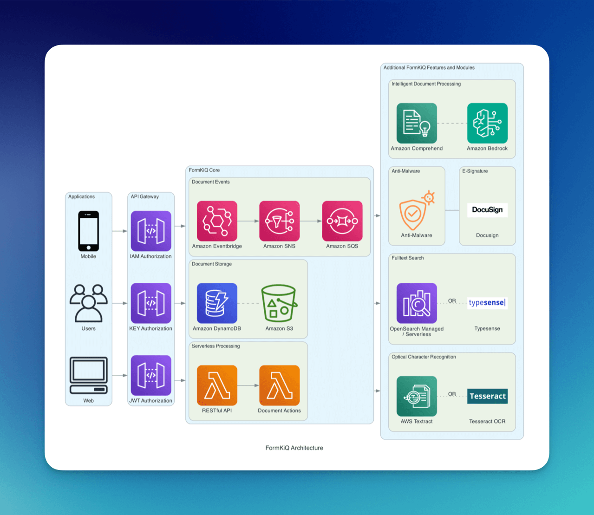

# Overview

FormKiQ is a flexible, API-first document management platform deployed into your AWS account. It uses AWS managed services for document storage, metadata, APIs, identity, events, automation, and optional search so teams can build document-centric workflows without operating a traditional document management stack.

At a high level, FormKiQ stores document content in Amazon S3, stores document metadata and indexes in Amazon DynamoDB, exposes APIs through Amazon API Gateway, authenticates users and services through multiple auth models, and emits document lifecycle events for automation.

## Deployment Boundary

FormKiQ runs in the customer's AWS account. This is a core architectural difference from vendor-hosted SaaS document systems.

| Area | Responsibility |
|------|----------------|
| AWS account and region | Chosen and controlled by the customer. |
| FormKiQ infrastructure | Deployed through CloudFormation into the customer's AWS account. |
| Document content | Stored in customer-controlled Amazon S3 buckets. |
| Document metadata | Stored in customer-controlled DynamoDB tables. |
| Identity and access | Configured through Cognito, IAM, API keys, SSO, or commercial access-control options. |
| AWS managed services | Operated by AWS under the customer's AWS account and service configuration. |

This model gives teams control over data residency, AWS region selection, security posture, networking, monitoring, backup strategy, and integration patterns.

## Who FormKiQ Is For

FormKiQ is designed for:

- Developers building document-centric applications using APIs and SDKs
- Architects seeking scalable AWS-native document infrastructure
- IT teams that want deployment control and managed AWS services
- Operations teams automating document-heavy workflows
- Organizations that need secure, auditable, and extensible document storage

## What Makes FormKiQ Different

Unlike traditional document management systems, FormKiQ is:

- API-first: designed for integration and embedded document workflows
- AWS-native: built on AWS managed services and deployed in the customer's AWS account
- Event-driven: document actions can trigger workflows, queues, and downstream integrations
- Composable: capabilities such as search, OCR, workflows, and modules can be enabled as needed
- Serverless-oriented: core services use managed, elastic infrastructure; optional components may use ECS/Fargate or search services when required

## Core Capabilities

- Document storage and retrieval through APIs and the FormKiQ Console
- Metadata management with tags, attributes, schemas, and classifications
- Search by metadata, attributes, tags, and optional full-text indexes
- Document processing workflows, rulesets, queues, OCR, and classification
- Event-driven automation through document lifecycle events
- Multi-tenant support through sites and access-control boundaries
- API integration through JWT, IAM, and API key authentication models

## Core Components

### API and Identity

| Component | Role |
|-----------|------|
| Amazon API Gateway | Exposes the FormKiQ APIs and supports JWT, IAM, and API key access patterns. |
| Amazon Cognito | Provides the default user pool, admin user flow, console login, and JWT authentication. |
| AWS IAM | Enables signed AWS-authenticated API access for backend services and AWS workloads. |
| API keys | Supports controlled service access when API key authentication is enabled. |

For details, see [Security](/docs/platform/security).

### Storage and Metadata

| Component | Role |
|-----------|------|
| Amazon S3 | Stores document content and supports versioning, lifecycle rules, and durable object storage. |
| Amazon DynamoDB | Stores document metadata, attributes, indexes, site data, audit data, and operational state. |

For details, see [Document Storage](/docs/platform/document_storage) and [DynamoDB Schema](/docs/platform/database_schema).

### Processing and Automation

| Component | Role |
|-----------|------|
| AWS Lambda | Runs event-driven processing, API handlers, document actions, and lightweight automation. |
| Amazon ECS on Fargate | Supports container-based workloads where longer-running or specialized runtime processing is needed. |
| Rulesets and workflows | Route documents into processing, review, approval, or automation paths. |

### Event System

#### Document Events

FormKiQ emits events when documents are created, updated, deleted, or processed. These events allow teams to extend FormKiQ without tightly coupling custom code to the core document API.

Common event attributes include:

| Message Attribute | Values | Description |
|-------------------|--------|-------------|
| `type` | create, update, delete | Document operation. |
| `siteId` | default, custom | Site or tenant identifier. |

Event-driven architecture uses:

- Amazon SNS for event distribution and fan-out
- Amazon SQS for reliable processing, buffering, and dead-letter queue handling
- Amazon EventBridge for event routing and broader AWS integration patterns, where configured

For failure handling, see [Dead Letter Queue](/docs/platform/error_handling/dlq).

### Search and Indexing

FormKiQ supports basic metadata search through DynamoDB-backed access patterns. Optional enhanced search capabilities can use search engines such as Typesense or OpenSearch, depending on deployment and commercial module configuration.

Search capability affects:

- Installation choices, especially whether a VPC stack is required
- Runtime cost, because search clusters or containers may have dedicated capacity
- Query behavior, because full-text search differs from tag or attribute lookup
- Scaling strategy, because indexing and query throughput depend on the search backend

For search behavior, see [Search](/docs/features/search). For cost impact, see [Costs](/docs/platform/costs).

### Document Console

The FormKiQ Document Console provides a web interface for document access, administration, and user workflows. In most AWS regions it is deployed with the main FormKiQ stack. AWS GovCloud (US) has separate console deployment considerations.

For details, see [Document Console](/docs/platform/document_console).

## Request and Document Flow

A typical API-driven document flow looks like this:

1. A user or service calls the FormKiQ API through API Gateway.
2. API Gateway authenticates the request using JWT, IAM, or API key authentication.
3. FormKiQ validates access to the target site.
4. Document content is stored in Amazon S3, either inline for smaller files or through a presigned S3 upload flow.
5. Document metadata, attributes, path, and state are stored in DynamoDB.
6. Document lifecycle events are emitted through the event system.
7. Optional rulesets, workflows, OCR, classification, or module actions process the document.
8. Search indexes are updated when search features are enabled.
9. Users or systems retrieve the document, metadata, content URL, audit data, or search results through the API.

## Identity and Access

FormKiQ supports multiple authentication models because different integrations need different access patterns.

| Authentication model | Common use |
|----------------------|------------|
| JWT | Interactive users, the FormKiQ Console, and first API tests. |
| AWS IAM | Server-side AWS workloads, automation, and service-to-service access. |
| API key | Controlled service access where API keys are enabled. |
| SSO and custom identity options | Commercial deployments with enterprise identity requirements. |

Access is commonly scoped by site. The default site is named `default`, and additional sites can be used for multi-tenant or segmented document spaces.

For details, see [Security](/docs/platform/security) and [Multi-Tenant vs Multi-Instance](/docs/platform/multi-tenant-vs-multi-instance).

## Networking and Optional VPC

Core FormKiQ deployments use AWS managed services and do not require customers to operate application servers. Some optional capabilities, such as Typesense, OpenSearch, private networking, or enterprise-specific integrations, may require VPC resources.

The optional VPC stack is installed separately and then attached to the main FormKiQ stack through the `VpcStackName` parameter.

For installation steps, see [Quick Start (AWS)](/docs/getting-started/quick-start#install-vpc).

## Observability and Operations

FormKiQ uses AWS-native operational tooling:

- CloudFormation stack events for deployment and update status
- Amazon CloudWatch Logs for Lambda and service logs
- Amazon CloudWatch Metrics for API Gateway, Lambda, DynamoDB, queues, and other AWS services
- Amazon SQS dead-letter queues for failed asynchronous processing
- Amazon SNS alerts for DLQ and operational notifications, where configured
- Audit and user activity data stored by FormKiQ for governance and reporting use cases

For operational guidance, see [Updates, Upgrades, and Rollbacks](/docs/platform/updates_upgrades_and_rollbacks), [Backup and Recovery](/docs/platform/backup_and_recovery), and [Dead Letter Queue](/docs/platform/error_handling/dlq).

## Backup and Recovery

FormKiQ relies on AWS-native durability and recovery controls.

| Data type | Primary service | Common recovery control |
|-----------|-----------------|-------------------------|
| Document content | Amazon S3 | S3 versioning, lifecycle rules, replication, and backup strategies. |
| Document metadata | Amazon DynamoDB | Point-in-time recovery and table backups. |
| Users and groups | Amazon Cognito | Export and account recovery planning. |
| Search indexes | Typesense or OpenSearch, when enabled | Reindexing, snapshots, or service-specific backup strategy. |
| Infrastructure | CloudFormation | Template history, stack updates, and rollback behavior. |

For details, see [Backup and Recovery](/docs/platform/backup_and_recovery).

## FormKiQ Concepts

These concepts appear throughout FormKiQ APIs, security rules, workflows, and architecture documentation.

### Documents

A document is the primary entity in FormKiQ. It includes:

- Binary content stored in Amazon S3
- Metadata and attributes stored in DynamoDB
- A unique `documentId`
- A virtual path
- Optional tags, attributes, actions, versions, and workflow state

### Sites

A site represents an isolated namespace within a FormKiQ deployment.

- Documents belong to exactly one site
- Sites support multi-tenant architectures
- Access control is enforced at the site level
- The default site is named `default`

### Attributes

Attributes are structured metadata fields attached to documents.

- Used for filtering, querying, validation, and automation
- Can be used with schemas and classifications
- Support richer document models than simple tags

### Rulesets and Workflows

Rulesets and workflows automate document handling. They can route documents, trigger processing, assign review queues, or connect document events to downstream business processes.

## Architecture Principles

FormKiQ follows AWS Well-Architected Framework principles.

### Operational Excellence

- Infrastructure as Code through CloudFormation
- Event-driven architecture
- CloudWatch-based logging and metrics
- Designed update and rollback paths

### Security

- Encryption in transit and at rest
- JWT, IAM, and API key authentication options
- Site-level access boundaries
- Role-based and advanced access-control options
- Customer-controlled AWS account and region

### Reliability

- Managed AWS services with built-in durability
- Decoupled asynchronous processing
- Dead-letter queues for failed message handling
- DynamoDB point-in-time recovery and S3 versioning

### Performance Efficiency

- Elastic managed services
- Presigned S3 upload paths for larger files
- DynamoDB access patterns for metadata and attributes
- Optional search engines for full-text search needs

### Cost Optimization

- Serverless and managed-service pricing for core components
- S3 lifecycle and storage-tier options
- DynamoDB on-demand capacity by default
- Optional search and module costs based on enabled capabilities

## Scaling FormKiQ Components

FormKiQ scales through the AWS services that make up the deployment. For large imports, high API volume, search-heavy workloads, or document processing bursts, review each service boundary rather than treating the platform as a single capacity pool.

### Amazon S3

Document content is stored in S3. S3 is highly scalable, but workload design still matters.

- Use presigned upload flows for larger files.
- Use lifecycle policies to control storage cost over time.
- Monitor request patterns and data transfer for large migrations.
- Consider replication or backup requirements for recovery and data residency.

### Amazon DynamoDB

Document metadata, attributes, and indexes are stored in DynamoDB.

By default, FormKiQ uses on-demand capacity mode, which provides:

- Automatic scaling based on traffic
- No capacity planning for normal traffic patterns
- Pay-per-request pricing

Although on-demand capacity is fully managed, it is not unlimited. DynamoDB tables and global secondary indexes scale independently based on recent traffic patterns. Extremely sharp increases or sustained bursts can still be throttled if they exceed service limits or adaptive scaling windows.

Key considerations:

- Each table and each global secondary index has its own throughput behavior.
- High-cardinality access patterns scale better than hot partitions.
- Large migrations should use controlled concurrency.
- Throttling can surface as elevated API latency or failed writes.

Monitor DynamoDB capacity pressure using CloudWatch metrics such as:

- `ThrottledRequests`
- `ConsumedReadCapacityUnits`
- `ConsumedWriteCapacityUnits`
- `SuccessfulRequestLatency`
- `ReadThrottleEvents`
- `WriteThrottleEvents`

### AWS Lambda

Lambda scales concurrently as events and API requests increase, subject to account and regional concurrency limits.

- Confirm Lambda concurrency quotas before high-volume deployments or imports.
- Monitor duration, errors, throttles, and iterator age where applicable.
- Long-running or specialized workloads may be better suited to ECS/Fargate.

### Amazon API Gateway

API Gateway handles request routing, throttling, authentication integration, and logging.

- Watch request count, latency, integration latency, and 4xx/5xx errors.
- Use the correct API URL for the authentication model: `HttpApiUrl`, `IamApiUrl`, or `KeyApiUrl`.
- For high-volume integrations, review API throttling and client retry behavior.

### Amazon SQS and SNS

Queues and topics decouple document processing from API requests.

- Monitor queue depth, message age, processing errors, and DLQs.
- Use DLQ redrive carefully after fixing the underlying processing issue.
- For high-volume event consumers, use filtering and batching where appropriate.

### Search Backends

Full-text search scaling depends on the configured backend, such as Typesense or OpenSearch.

- Plan capacity based on document volume, indexing rate, query rate, and retention needs.
- Monitor indexing failures and query latency.
- Reindexing may be required after schema, analyzer, or backend changes.

### Migration and Import Workloads

Large imports should be treated as controlled workloads.

- Start with a small batch and validate metadata, permissions, and search behavior.
- Increase concurrency gradually.
- Monitor API Gateway, Lambda, DynamoDB, SQS, and search metrics.
- Account for source-system limits as well as FormKiQ and AWS service limits.

For migration guidance, see [Migration and Data Import](/docs/platform/migration-and-data-import).

## Where to Go Next

- Install FormKiQ: [Quick Start (AWS)](/docs/getting-started/quick-start)
- Make the first API request: [API Walkthrough](/docs/getting-started/api-walkthrough)
- Review security and access: [Security](/docs/platform/security)
- Understand storage: [Document Storage](/docs/platform/document_storage)
- Plan tenancy: [Multi-Tenant vs Multi-Instance](/docs/platform/multi-tenant-vs-multi-instance)
- Estimate AWS usage: [Costs](/docs/platform/costs)
- Prepare operations: [Updates, Upgrades, and Rollbacks](/docs/platform/updates_upgrades_and_rollbacks)
