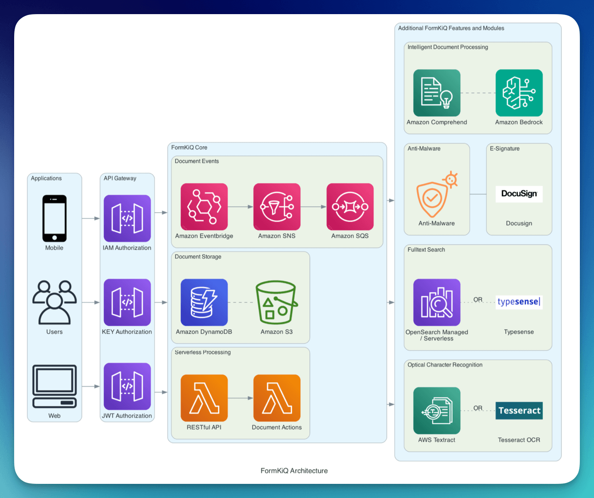

# Overview

FormKiQ is a **flexible, API-first document management platform** built entirely on AWS managed services and serverless technologies. It is designed for teams that need to store, manage, process, and automate documents at scale without operating traditional document management infrastructure.

FormKiQ provides a composable foundation for document-driven applications, enabling secure storage, rich metadata, event-driven workflows, and full-text search while following **AWS Well-Architected Framework** principles.

## Who FormKiQ Is For

FormKiQ is designed for:

- **Developers** building document-centric applications using APIs and SDKs
- **Architects** seeking a scalable, serverless document management solution
- **Organizations** that require secure, auditable, and extensible document storage
- **Teams** that want automation and workflows without managing servers

## What Makes FormKiQ Different

Unlike traditional document management systems, FormKiQ is:

- **API-first** — designed for integration, not UI dependency
- **Serverless by default** — no servers, clusters, or capacity planning
- **Event-driven** — document actions automatically trigger workflows
- **Composable** — features can be enabled incrementally
- **AWS-native** — built exclusively on managed AWS services

## Core Capabilities

- **Document storage and retrieval**  
  Securely store documents and retrieve them through APIs

- **Metadata management with attributes**  
  Attach structured key-value metadata to documents

- **Full-text search**  
  Search document content and metadata efficiently

- **Document processing workflows**  
  Automatically process documents using rules and events

- **Event-driven automation**  
  Integrate downstream systems using document lifecycle events

- **Multi-tenant support**  
  Isolate data across sites and tenants within a single deployment

## Deployment Models

FormKiQ is deployed into **your AWS account** and runs entirely within your infrastructure.

- Deployed using Infrastructure as Code
- No shared runtime with other customers
- Full control over data residency and security
- Supports single-tenant and multi-tenant architectures

## Architecture Principles

FormKiQ is built following the **AWS Well-Architected Framework**.

### Operational Excellence
- Infrastructure as Code (IaC)
- Event-driven architecture
- Automated retries and observability

### Security
- Encryption in transit and at rest
- Multiple authentication models:
  - JWT
  - AWS IAM
  - API keys
- Fine-grained access control

### Reliability
- Serverless scalability
- Loosely coupled services
- Graceful degradation

### Performance Efficiency
- Managed AWS services
- Optimized access patterns
- Horizontal scalability

### Cost Optimization
- Pay-per-use pricing
- Tiered storage options
- Lifecycle policies

### Sustainability
- Efficient use of managed services
- Reduced idle resources
- Event-driven compute

## Core Components

### Storage Layer

#### Amazon S3
***Primary document storage***
- Unlimited scalability
- Multiple storage tiers
- Versioning support
- Lifecycle management
- Server-side encryption

#### Amazon DynamoDB
***Metadata and index storage***
- Sub-millisecond performance
- Automatic scaling
- Point-in-time recovery
- ACID transactions
- Event streams

### Processing Layer

#### AWS Lambda
***Serverless compute***
Best suited for:
- Event-driven processing
- Short-lived workflows
- Lightweight transformations

#### Amazon ECS (Fargate)
***Container-based processing***
Best suited for:
- Long-running or intensive workloads
- Custom runtime environments
- Batch and streaming processing

### API Layer

#### Amazon API Gateway
***Request management***
- Authentication via:
  - Cognito JWT
  - IAM
  - API keys
  - Custom JWT
- Throttling and quotas
- Monitoring and logging

### Event System

#### Document Events
Emitted for:
- Document creation
- Updates
- Deletions
- Custom processing stages

#### Amazon SNS
***Event distribution***
| Message Attribute | Values | Description |
|------------------|--------|-------------|
| `type` | create, update, delete | Document operation |
| `siteId` | default, custom | Tenant identifier |

Features:
- Publish/subscribe delivery
- Fan-out to multiple consumers
- Filter policies

#### Amazon SQS
***Event processing***
- Reliable delivery
- Dead-letter queues
- FIFO support
- Message retention

## FormKiQ Concepts

These are the core concepts used throughout the FormKiQ platform. Understanding these concepts will help you design document workflows, integrate APIs, and reason about security and scalability.

### Documents

A **document** is the primary entity in FormKiQ.

A document consists of:
- Binary content (stored in Amazon S3)
- Metadata and attributes (stored in DynamoDB)
- A unique `documentId`
- A virtual path

### Sites

A **site** represents an isolated namespace within a FormKiQ deployment.

- Documents belong to exactly one site
- Sites enable multi-tenant architectures
- Access control is enforced at the site level

The default site is named `default`.

### Attributes

**Attributes** are structured key-value pairs attached to documents.

- Used for filtering, querying, and automation
- Can be indexed or non-indexed
- Support multiple data types

Attributes enable documents to behave like structured data while remaining file-based.

### How Documents Flow Through FormKiQ

- A document is uploaded via the API (inline or presigned S3 upload)
- Document metadata and attributes are stored in DynamoDB
- Document content is stored in Amazon S3
- Events are emitted for document actions via Amazon SNS, SQS, EventBridge
- Optional workflows process the document (OCR, classification, rulesets)
- Documents become searchable via metadata and full-text indexing

## Scaling FormKiQ Components

### Amazon DynamoDB

Document metadata, attributes, and indexes are stored in DynamoDB.

By default, FormKiQ uses On-Demand capacity mode, which provides:
  • Automatic scaling based on traffic
  • No capacity planning
  • Pay-per-request pricing

On-Demand Capacity Throughput Behavior
Although On-Demand capacity is fully managed, it is not unlimited.

DynamoDB On-Demand tables scale automatically up to a service-defined maximum throughput. Scaling is adaptive and based on recent traffic patterns. Under normal conditions, DynamoDB can rapidly increase capacity to handle sudden spikes, but sustained or extreme bursts may temporarily exceed the adaptive scaling window.

Key characteristics of On-Demand scaling:
- Capacity scales automatically based on usage history
- Sudden spikes are supported, but extremely sharp increases may be throttled
- Each table and each global secondary index (GSI) scales independently
- Throughput limits apply at both the table and index level

When the adaptive limit is exceeded, DynamoDB returns throttling errors.

#### Monitor Capacity

You can monitor DynamoDB capacity pressure using Amazon CloudWatch metrics, including:

- **ThrottledRequests**: Indicates requests rejected due to insufficient capacity.
- **ConsumedReadCapacityUnits and ConsumedWriteCapacityUnits**: Shows actual usage and growth trends.
- **SuccessfulRequestLatency**: Elevated latency can signal capacity saturation.
- **ReadThrottleEvents / WriteThrottleEvents**: Explicit indicators that DynamoDB limits are being exceeded.

#### On-Demand Throughput Maximums and Configuration

Although On-Demand mode automatically adjusts throughput to match demand, you can specify maximum read and write throughput limits for each table and its global secondary indexes (GSIs). These limits:
  • Bound capacity usage to help control costs
  • Prevent runaway consumption from unoptimized traffic
  • Safeguard downstream services from unexpected load