# Security

## Overview

FormKiQ is deployed into your AWS account, so security is shared between the FormKiQ application controls and the AWS controls you configure around the stack. The platform uses AWS-native services for identity, API access, storage encryption, backups, logging, and network controls.

By default, the `AdminEmail` configured during installation is created as an administrator with full access.

For production planning in regulated or control-sensitive environments, use the [Regulated Production Deployment Checklist](/docs/platform/regulated-production-deployment-checklist) alongside this security reference.

| Security area | How FormKiQ handles it |
| --- | --- |
| API authentication | JWT, AWS IAM, and API key endpoints are deployed for different integration patterns. |
| User authorization | Role-Based Access Control (RBAC) maps users and groups to FormKiQ sites and permissions. |
| Document authorization | Attribute-Based Access Control (ABAC) can evaluate document metadata through Open Policy Agent (OPA). |
| Data protection | Documents, metadata, and search indexes use AWS-managed encryption services. |
| Operational recovery | DynamoDB Point-in-Time Recovery is configured for FormKiQ tables except cache tables. |
| Network controls | VPC deployment options can be combined with customer-managed controls such as VPC Flow Logs and AWS DNS Firewall. |

## Data Security

FormKiQ protects document content and metadata with encryption, authentication, and access control. The exact AWS resources depend on the modules and deployment options selected during installation.

### Encryption in Transit

All API and console traffic should use HTTPS endpoints. FormKiQ API endpoints are served through AWS API Gateway, which supports:

- TLS 1.2 or higher
- HTTPS-only API access
- API Gateway managed certificates
- Custom domain certificates when configured by the customer

### Encryption at Rest

FormKiQ uses AWS-managed encryption services for the primary data stores used by the platform.

| Data type | AWS service | Notes |
| --- | --- | --- |
| Document files | Amazon S3 | Stores uploaded document content and related files. |
| Metadata and configuration | Amazon DynamoDB | Stores document metadata, site data, permissions, queues, workflow state, and configuration records. |
| Search indexes | Amazon OpenSearch Service | Used when enhanced full-text search is installed. |
| Logs and execution data | Amazon CloudWatch | Stores service logs and operational events based on the deployed stack configuration. |

For more detail on how documents and metadata are stored, see [Document Storage](/docs/platform/document_storage). For encryption-specific module options, see [Full Encryption](/docs/formkiq-modules/modules/full-encryption).

## API Security

FormKiQ deploys separate API Gateway endpoints for the supported authentication methods. This lets you choose the endpoint that matches the caller rather than forcing every integration through one authentication model.

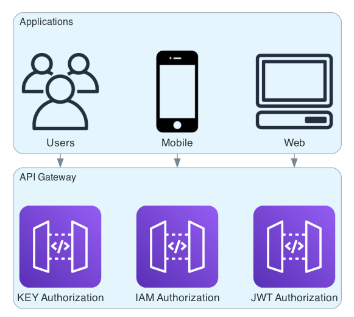

The FormKiQ API URL values are available in the CloudFormation outputs of your FormKiQ stack.

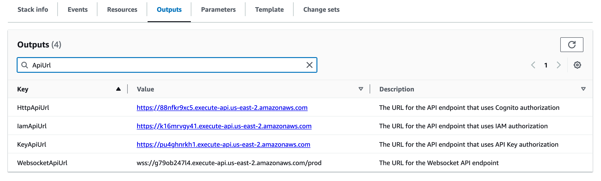

| Authentication method | CloudFormation output | Best fit |
| --- | --- | --- |
| JWT token | `HttpApiUrl` | FormKiQ Console users, browser clients, interactive testing, and user-context API calls. |
| AWS IAM | `IamApiUrl` | Machine-to-machine integrations, AWS services, backend jobs, and automation that can sign requests with AWS Signature Version 4. |
| API key | `KeyApiUrl` | Site-scoped integrations where a generated key is easier to manage than a user token. |

:::note
[FormKiQ Enterprise](https://www.formkiq.com/products/formkiq-enterprise) customers can use additional authentication options such as SAML or custom JWT authorizers. See [Single Sign-On and Custom JWT Authorizer](/docs/formkiq-modules/modules/single-sign-on-and-custom-jwt-authorizer).
:::

### JWT Token

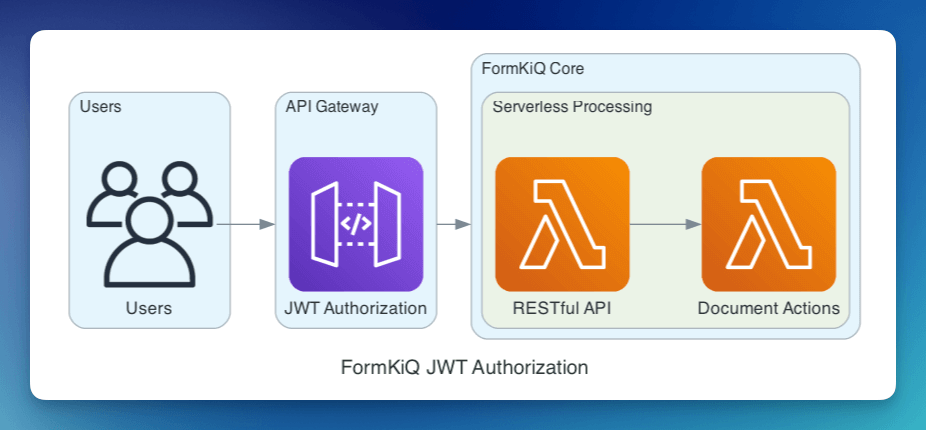

JWT authentication is the default path for user-context API calls. By default, FormKiQ uses [Amazon Cognito](https://aws.amazon.com/cognito/) as the JWT issuer, and authorization is handled through the user's assigned groups and permissions.

A JWT token can be obtained through:

- [FormKiQ Console](/docs/platform/security#formkiq-console)
- [Curl CLI](/docs/platform/security#curl-cli)
- [AWS CLI](/docs/platform/security#aws-cli)

Use the `HttpApiUrl` CloudFormation output when calling the JWT-secured API.

#### FormKiQ Console

You can inspect the FormKiQ Console network requests in browser developer tools and copy the `Authorization` header for local testing.

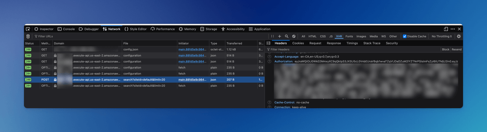

:::caution
Browser developer tools are useful for development and troubleshooting. Do not use copied browser tokens as a production integration pattern.
:::

##### Google Chrome

1. Log in to the FormKiQ Console.
2. Open Developer Tools with `F12`, `Ctrl+Shift+I`, or `Cmd+Option+I`.
3. Select the **Network** tab.
4. Refresh the page.
5. Find an API request that includes an `Authorization` header.
6. Copy the bearer token from the request headers.

##### Safari

1. Log in to the FormKiQ Console.
2. Enable the Develop menu from **Safari > Preferences > Advanced**.
3. Select **Show Develop menu**.
4. Open Web Inspector with `Cmd+Option+I`.
5. Select the **Network** tab.
6. Refresh the page and copy the token from an API request header.

##### Mozilla Firefox

1. Log in to the FormKiQ Console.
2. Open Developer Tools with `Ctrl+Shift+I` or `Cmd+Option+I`.
3. Select the **Network** tab.
4. Refresh the page.
5. Find an API request with an `Authorization` header.
6. Copy the bearer token from the request headers.

#### Curl CLI

The Cognito API endpoint can be found in the FormKiQ CloudFormation outputs.

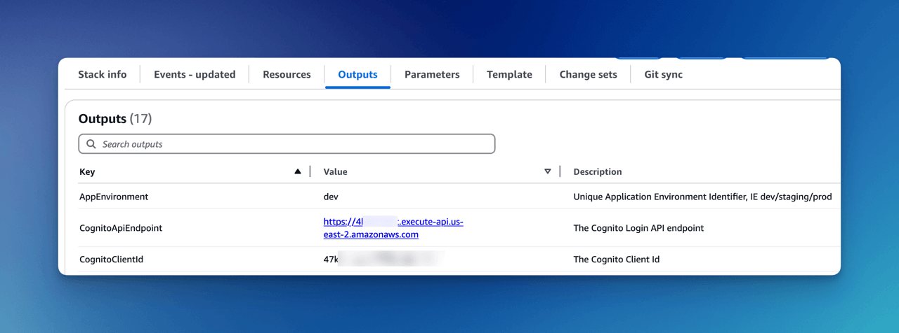

Use that endpoint to request a JWT token:

```bash
curl -X POST https://COGNITO_API_ENDPOINT_URL/login \
  -H "Content-Type: application/json" \
  -d '{"username": "USERNAME", "password": "PASSWORD"}'
```

#### AWS CLI

The Cognito `CognitoClientId` can be found in the FormKiQ CloudFormation outputs.


Use the client ID to request a JWT token:

```bash
aws cognito-idp initiate-auth \
  --client-id YOUR_COGNITO_APP_CLIENT_ID \
  --auth-flow USER_PASSWORD_AUTH \
  --auth-parameters USERNAME=your_username,PASSWORD=your_password
```

The response includes an access token, ID token, refresh token, token type, and expiration:

```json
{
  "ChallengeParameters": {},
  "AuthenticationResult": {
    "AccessToken": "eyJraWQiOiJ0W...",
    "ExpiresIn": 86400,
    "TokenType": "Bearer",
    "RefreshToken": "eyJjdHkiO...",
    "IdToken": "eyJraWQiOiI5YUpvb..."
  }
}
```

### AWS IAM

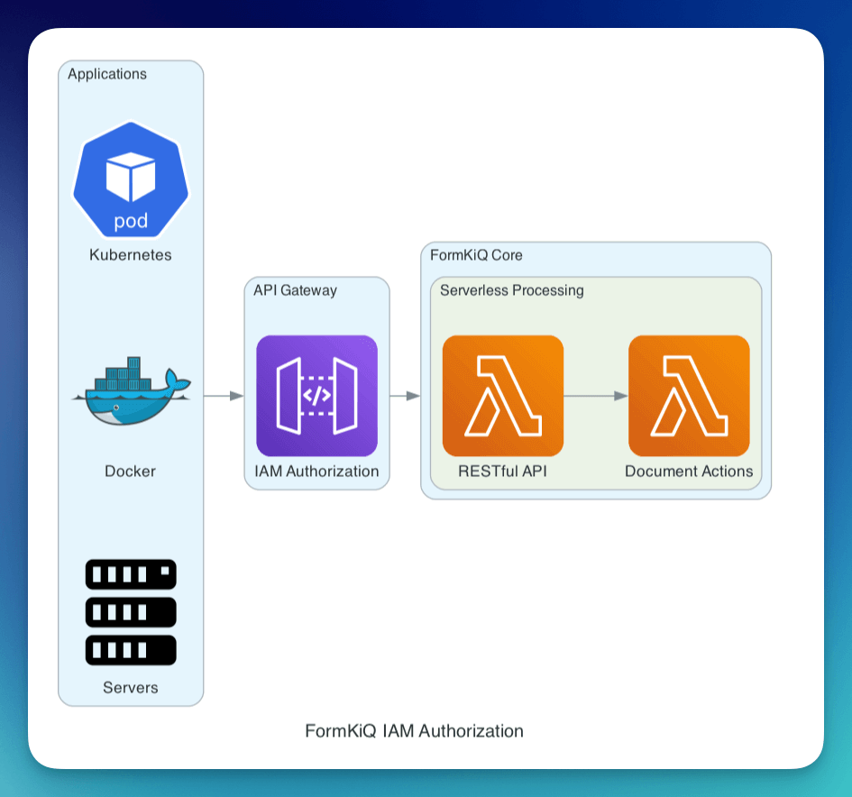

IAM authentication allows API callers to sign requests using [AWS Signature Version 4](https://docs.aws.amazon.com/IAM/latest/UserGuide/reference_aws-signing.html). This is commonly used for backend services, scheduled jobs, AWS Lambda functions, and other machine-to-machine integrations.

Use the `IamApiUrl` CloudFormation output when calling the IAM-secured API.

IAM-authenticated requests are authorized by AWS IAM before they reach the FormKiQ API. Because IAM requests do not carry normal FormKiQ user group context, they are typically treated as administrative or service-level integrations. For more detail on the production security value of IAM authentication, see [IAM Authentication Option](/docs/platform/security#iam-authentication-option).

#### Setting Up IAM Authorization

From the AWS IAM Console, create a new IAM user or role for the integration.

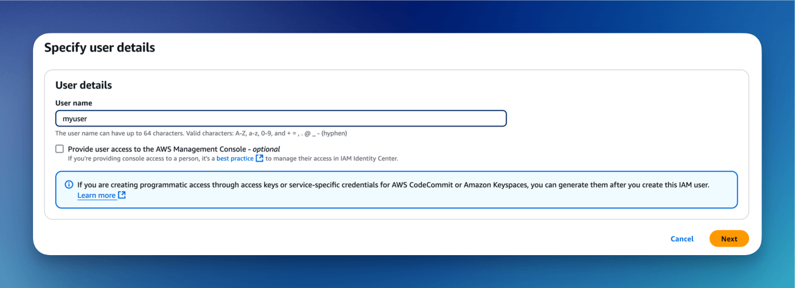

For quick testing, you can attach the AWS-managed `AmazonAPIGatewayInvokeFullAccess` policy.

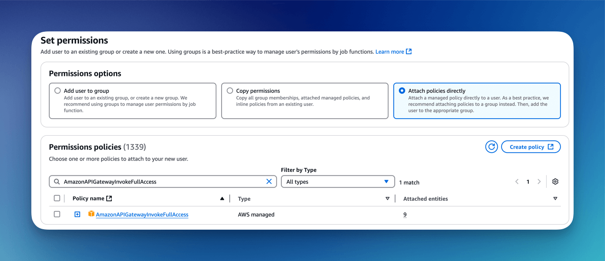

For production, prefer a least-privilege IAM policy scoped to the FormKiQ API Gateway resource instead of granting access to all API Gateway invoke operations.

```json
{
  "Version": "2012-10-17",
  "Statement": [
    {
      "Effect": "Allow",
      "Action": "execute-api:Invoke",
      "Resource": "arn:aws:execute-api:<region>:<account-id>:<api-id>/*/*/*"
    }
  ]
}
```

Create an access key only when the integration cannot use an IAM role.

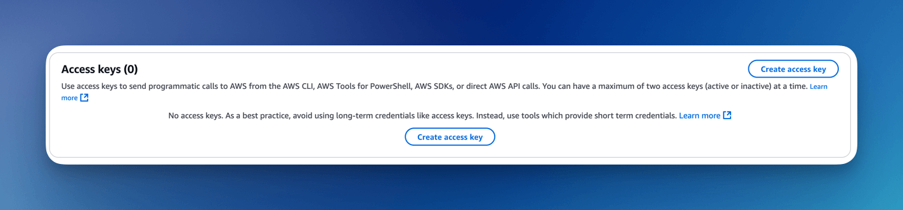

You can then use the access key and secret key to sign requests to the FormKiQ IAM API. In AWS-hosted workloads, prefer IAM roles over long-lived access keys.

### API Key

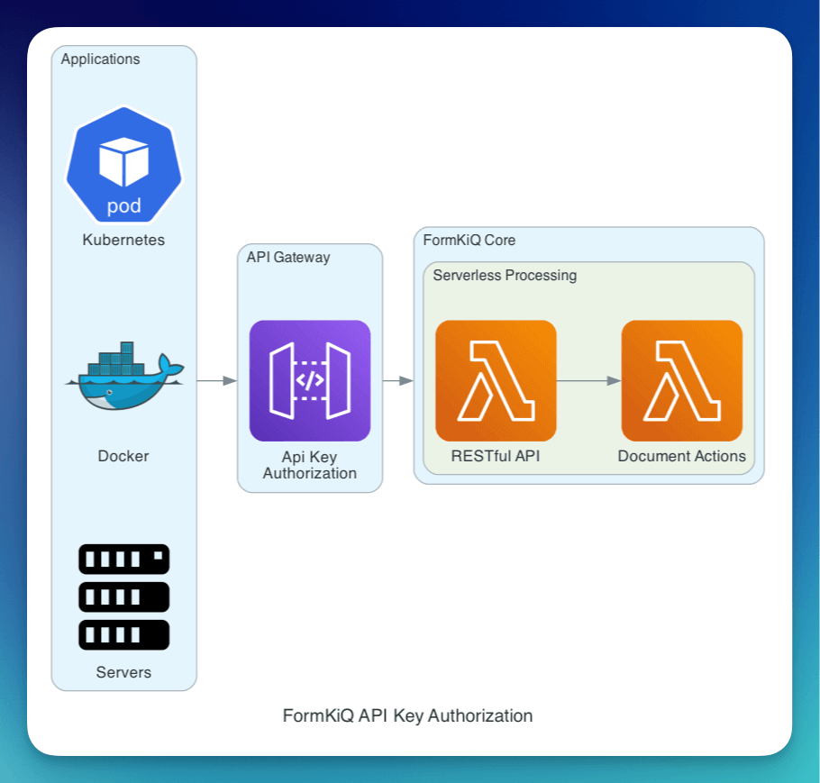

FormKiQ API keys provide site-scoped access to the API. Each API key is valid for a particular `SiteId`.

Use the `KeyApiUrl` CloudFormation output when calling the API key-secured API.

To create an API key from the FormKiQ Console:

1. Log in to the FormKiQ Console as an administrator.
2. Navigate to **Administration > API Keys**.
3. Choose **Create new**.
4. Set the key name and permissions.
5. Copy the generated key immediately.

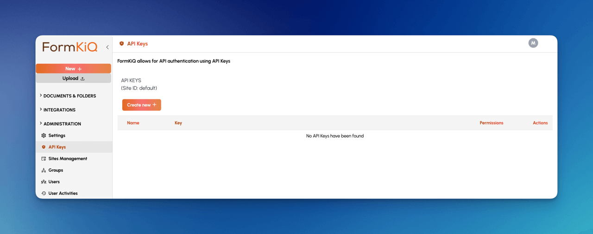

API keys can also be generated through the `POST /configuration/apiKeys` API endpoint using credentials with `administrator` privileges.

:::note
Store API keys securely, rotate them on a regular schedule, and remove unused keys. API keys should not be embedded in public client-side applications.
:::

## Authorization and Access Control

Authentication confirms who or what is calling the API. Authorization controls what that caller can do after authentication succeeds.

FormKiQ supports:

- Site-level and group-level permissions through Role-Based Access Control (RBAC)
- Folder-level permissions for more specific document area controls
- Attribute-Based Access Control (ABAC) through Open Policy Agent for metadata-driven access decisions

## Role-Based Access Control (RBAC)

FormKiQ supports multi-tenant environments by grouping users according to their roles and mapping those groups to one or more sites.

Each user can be associated with one or more groups. These groups determine the user's access across sites in the platform.

You can choose between:

- **Automatic Site Permissions**: Sites and permissions are inferred from group names.
- **Defined Site Permissions**: Sites are created explicitly, and permissions are granted through the API. This is supported in FormKiQ Essentials, Advanced, and Enterprise.

### Automatic Site Permissions

In automatic mode, any group whose name matches the supported pattern automatically creates or links to a site with the same name and grants the corresponding permissions.

:::note
FormKiQ sites are created automatically when a user interacts with the API.
:::

| Group | Access Level |
| --- | --- |
| `Admins` | Full administrator rights on all sites. |
| `authentication_only` | Can log in, but has no site access. |
| `<site>` | Read, write, and delete access on `<site>`. |
| `<site>_read` | Read-only access on `<site>`. |
| `<site>_govern` | Read, write, delete, and govern access on `<site>`. |

Example group behavior:

| User group | Resulting access |
| --- | --- |
| `Finance` | Read, write, and delete access on the `finance` site. |
| `Finance_read` | Read-only access on the `finance` site. |
| `Finance_govern` | Read, write, delete, and govern access on the `finance` site. |

If a user belongs to multiple groups, their permissions combine.

| Example user membership | Resulting access |
| --- | --- |
| `Managers` and `Finance_read` | Read, write, and delete access on `managers`; read-only access on `finance`. |

:::note
Govern access provides additional permissions for data governance and document control roles.
:::

#### Default Cognito Groups

By default, FormKiQ uses [Amazon Cognito](https://aws.amazon.com/cognito/) for user authentication and creates these groups:

| Default Group | Permissions |
| --- | --- |
| `Admins` | Full administrator privileges across all sites. |
| `authentication_only` | Can authenticate, but has no site access. |
| `default` | Read, write, and delete access on the `default` site. |
| `default_read` | Read-only access on the `default` site. |

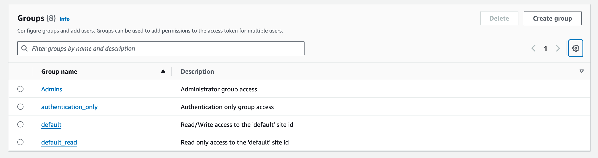

:::note
The Cognito user pool can be found by opening the [Cognito Console](https://console.aws.amazon.com/cognito) and searching for the `AppEnvironment` name configured during installation.

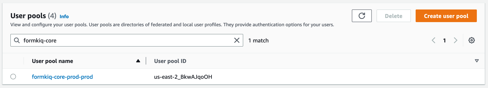
:::

##### Add Multi-Tenant Site

Creating a new multi-tenant site is as simple as creating a new group and adding users to that group.

To add a new group:

1. Open the FormKiQ Console as an administrator.
2. Select **Groups** under **Administration**.
3. Choose **Create New Group**.
4. Enter the group name.

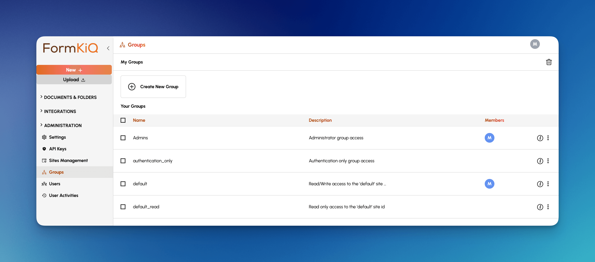

The site is created and users can be added to the group to give them access.

##### Add User to Site

To add a new user:

1. Open the FormKiQ Console as an administrator.
2. Select **Users** under **Administration**.
3. Choose **Create New User**.
4. Enter the user details.

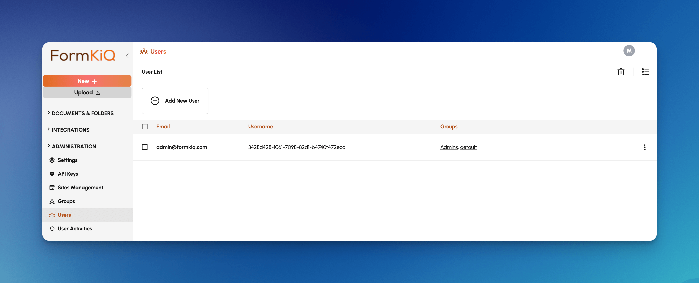

##### Add User to Group

To add a user to a group:

1. Open the FormKiQ Console as an administrator.
2. Select **Groups** under **Administration**.
3. Open the far-right menu on the group.
4. Choose **Add Member**.

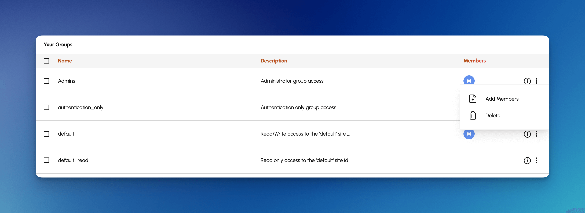

Search for the user and add them to the group.

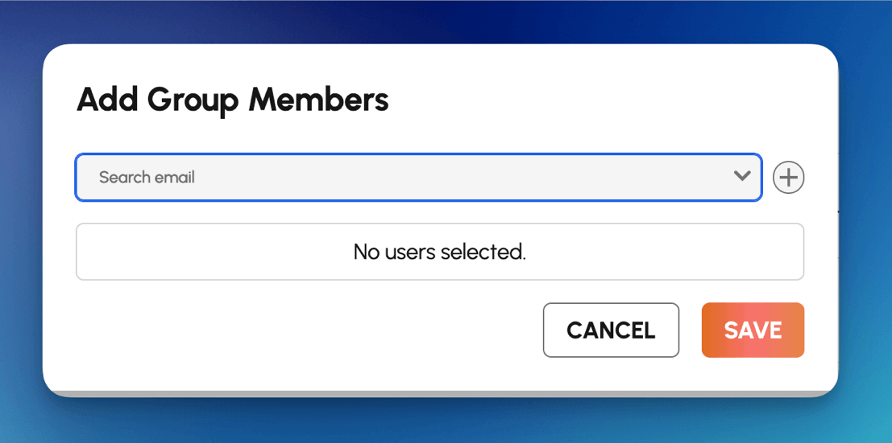

### Defined Site Permissions

Defined site permissions require explicit creation of FormKiQ sites. User groups can then be linked to a site with specific permissions.

#### Add Site

A defined site can only be created by a user with administrator access.

The example below creates a FormKiQ site called `projects`.

##### POST /sites

```json
{
  "site": {
    "id": "projects",
    "title": "A site that contains system projects",
    "status": "ACTIVE"
  }
}
```

#### Add Group Permissions

Use `PUT /sites/:siteId/groups/:groupName/permissions` to give a group specific permissions for a site.

For example, if you have a group called `employees` and want members of that group to have read and write access to the `projects` site, call:

```http
PUT /sites/projects/groups/employees/permissions
```

```json
{
  "permissions": ["READ", "WRITE"]
}
```

### Folder Permissions

Beyond site-wide roles, you can control specific folders by assigning folder-scoped RBAC through the API. Folder permissions work in addition to site-level RBAC. A user must have the required site-level permission and folder-level permission to perform an action.

#### Permission Types

| Permission | Allows |
| --- | --- |
| `READ` | List or download documents in the folder. |
| `WRITE` | Create or update documents in the folder. |
| `DELETE` | Remove documents from the folder. |
| `GOVERN` | Perform governance actions such as audit logs or retention holds. |

#### API Endpoint

Use this endpoint to set folder role permissions:

```http
PUT /folders/permissions
```

**Request Body Parameters**

| Field | Type | Description |
| --- | --- | --- |
| `path` | string | Folder path within the site. |
| `roles` | array | List of role and permission mappings to apply. |
| `roleName` | string | Cognito group or custom role to grant folder permissions to. |
| `permissions` | string[] | One or more of `READ`, `WRITE`, `DELETE`, and `GOVERN`. |

**Example Request Body**

```json
{
  "path": "invoices/2025/Q2",
  "roles": [
    {
      "roleName": "Finance",
      "permissions": ["READ", "WRITE", "DELETE"]
    },
    {
      "roleName": "Managers",
      "permissions": ["READ"]
    }
  ]
}
```

## Attribute-Based Access Control (ABAC)

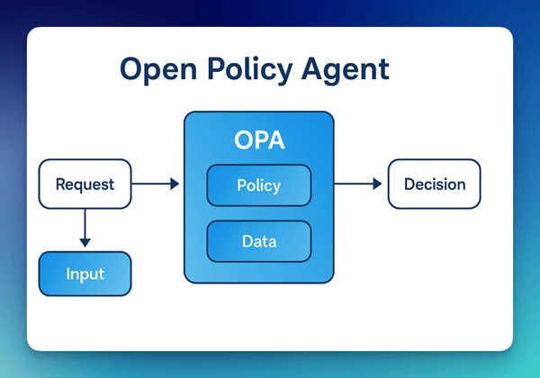

Attribute-Based Access Control (ABAC) evaluates attributes related to the user, document, and request context. Unlike RBAC, which assigns permissions based on predefined groups, ABAC can make access decisions from metadata such as department, document type, owner, classification, or project.

FormKiQ's ABAC support is implemented through [Open Policy Agent (OPA)](https://www.openpolicyagent.org/).

:::note
Attribute-Based Access Control (ABAC) is supported with [FormKiQ Advanced and Enterprise](https://www.formkiq.com/products/formkiq-advanced).
:::

### OPA Evaluation Policies

OPA evaluates policies and returns decisions based on policy rules. The common outcomes are `allow`, `deny`, and `partial`.

#### Allow

An allow policy grants access when the specified conditions are met.

```rego
package example

default allow = false

allow {
  input.user.role == "admin"
}
```

#### Deny

A deny policy blocks access when the specified conditions are met. Deny policies can enforce restrictions that override broad access.

```rego
package example

default deny = false

deny {
  "guest" in input.user.roles
}

deny {
  "guest" in input.user.roles
  data.documents.documentType == "private"
}
```

#### Partial

OPA partial evaluation can compute document criteria that must be met before a user can access a document.

The policy below restricts users in the `guest` role to documents whose `documentType` attribute is `public`.

```rego
package example

default allow = false

allow {
  "guest" in input.user.roles
  data.documents.documentType == "public"
}
```

#### Partial Limitations

When using `POST /search`, multiple attribute criteria may require a configured composite key so DynamoDB can search efficiently across the requested criteria. `POST /searchFulltext` uses OpenSearch and does not have the same DynamoDB composite key limitation.

For module-specific setup details, see [Open Policy Agent](/docs/formkiq-modules/modules/open_policy_agent).

### Document Attributes

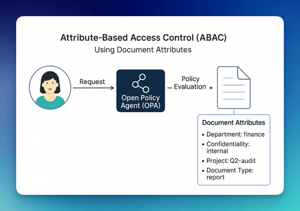

FormKiQ enables ABAC by attaching metadata, called document attributes, to individual documents. These attributes can be evaluated by OPA policies to determine whether a user is allowed to access, modify, or delete a document.

Common document attributes include:

- `department`
- `confidentiality`
- `owner`
- `project`
- `documentType`
- `classification`

These attributes form the resource context used in OPA decisions. When a user makes a request, the policy can evaluate both user attributes and document attributes.

#### API Endpoint

This endpoint allows administrators to define or update OPA access policies for a site:

```http
PUT /sites/:siteId/opa/accessPolicy/policyItems
```

**Request Body Parameters**

| Field | Type | Description |
| --- | --- | --- |
| `type` | string | Type of policy logic. Only `ALLOW` is currently supported. |
| `allRoles` | string[] | The user must belong to all listed roles to match the policy. |
| `anyRoles` | string[] | The user must belong to at least one listed role to match the policy. |
| `attributes` | array | Attribute matchers used to evaluate access. |

Each attribute object supports these operators:

| Operator | Description |
| --- | --- |
| `eq` | Equal to a string, number, boolean, or username match. |
| `neq` | Not equal to. |
| `gt` | Greater than, for numbers only. |
| `gte` | Greater than or equal to. |
| `lt` | Less than. |
| `lte` | Less than or equal to. |

:::note
When `eq.input.matchUsername` is `true`, the document attribute must equal the authenticated user's username.
:::

#### Example Use Cases

##### Restrict Access to Reports Only

Allow users with the `finance` and `auditor` roles to access documents where `documentType` is `report`.

```json
{
  "type": "ALLOW",
  "allRoles": ["finance", "auditor"],
  "attributes": [
    {
      "key": "documentType",
      "eq": {
        "stringValue": "report"
      }
    }
  ]
}
```

##### Owner-Only Access

Allow users to access documents only if they are the owner based on the username in the access token.

```json
{
  "type": "ALLOW",
  "anyRoles": ["user"],
  "attributes": [
    {
      "key": "owner",
      "eq": {
        "input": {
          "matchUsername": true
        }
      }
    }
  ]
}
```

## Operational Security Controls

These controls help harden a production FormKiQ deployment. Some are configured by FormKiQ automatically, while others should be reviewed as part of your AWS account and network security baseline.

### DynamoDB Point-in-Time Recovery

FormKiQ automatically configures Point-in-Time Recovery for all DynamoDB tables except cache tables, with a 35-day recovery window. This protects document metadata and configuration data from accidental deletion, application errors, and service disruptions.

Point-in-Time Recovery supports:

- Recovery to a specific point within the recovery window
- Business continuity planning
- Data protection for accidental writes or deletes
- Compliance and retention requirements that require recoverable operational data

For broader recovery planning, see [Backup and Recovery](/docs/platform/backup_and_recovery).

### IAM Authentication Option

IAM authentication is a strong production option for backend systems and AWS-native integrations.

Using IAM authentication can provide:

- Fine-grained AWS IAM policies for API invocation
- Credential management through AWS IAM roles
- CloudTrail visibility for AWS-authenticated requests
- Conditional access using IAM policy conditions such as source IP restrictions
- Integration with AWS identity federation

Use IAM roles where possible. Use long-lived access keys only when the caller cannot assume a role.

### AWS DNS Firewall

AWS DNS Firewall can be implemented by FormKiQ customers to filter and control outbound DNS traffic from their VPC. Once configured, these DNS firewall settings are customer-managed and are not modified by FormKiQ updates.

DNS Firewall can help with:

- Blocking DNS queries to known malicious domains
- Reducing DNS-based data exfiltration risk
- Enforcing approved domain allow or deny lists
- Logging DNS activity for security analysis
- Supporting network security compliance controls

### Password Policy

FormKiQ password policy settings can be customized for each instance using the CloudFormation template.

A production password policy should align with your organization's security requirements and should consider:

- Minimum password length
- Complexity requirements
- Password reuse restrictions
- Account recovery process
- Identity provider requirements when SSO is used

Strong password policies reduce the risk from brute force attacks, dictionary attacks, and credential stuffing.

### VPC Flow Logs

VPC Flow Logs can be configured by customers to monitor network traffic within their VPC. Once associated with the VPC, these logs are customer-managed and are not modified by FormKiQ updates.

VPC Flow Logs can help with:

- Security monitoring for unusual network patterns
- Troubleshooting connectivity issues
- Compliance evidence for network activity monitoring
- Operational visibility into traffic between resources
- Integration with SIEM or log analytics systems

## Production Security Checklist

Review these items before moving a FormKiQ deployment into production:

- Confirm the admin user and `Admins` group membership are correct.
- Remove or disable unused users.
- Use `authentication_only` for users who should authenticate but should not have site access.
- Prefer IAM authentication for AWS-hosted service integrations.
- Scope IAM policies to the required FormKiQ API Gateway resources where possible.
- Rotate API keys and remove unused keys.
- Store API keys and access keys in a secure secret store.
- Confirm site, group, and folder permissions match your tenant model.
- Configure password policy settings to match organizational requirements.
- Review DynamoDB Point-in-Time Recovery and broader backup requirements.
- Review S3, DynamoDB, and OpenSearch encryption requirements.
- Enable VPC Flow Logs for VPC deployments where network auditability is required.
- Consider AWS DNS Firewall for VPC deployments with strict outbound DNS controls.
- Monitor API Gateway, Lambda, Cognito, and application logs in CloudWatch.
- Use ABAC and OPA when document metadata should affect access decisions.

## Where to Go Next

- [API Walkthrough](/docs/getting-started/api-walkthrough)
- [Document Console](/docs/platform/document_console)
- [Multi-Tenant vs Multi-Instance](/docs/platform/multi-tenant-vs-multi-instance)
- [Compliance, Data Residency, and Data Sovereignty](/docs/platform/compliance-data-residency-and-data-sovereignty)
- [Backup and Recovery](/docs/platform/backup_and_recovery)
- [Full Encryption](/docs/formkiq-modules/modules/full-encryption)
- [Single Sign-On and Custom JWT Authorizer](/docs/formkiq-modules/modules/single-sign-on-and-custom-jwt-authorizer)
