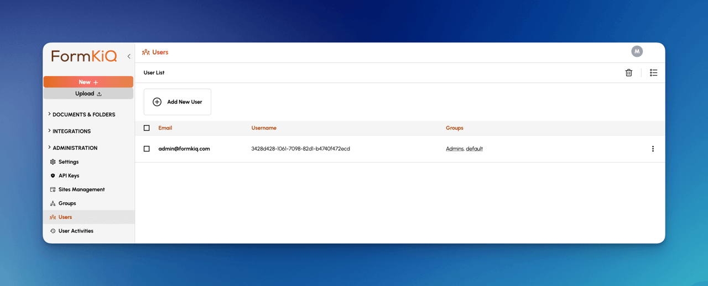

# Security

## Overview

FormKiQ is designed with a robust security framework to safeguard access to documents, prioritizing protection measures at every layer of its architecture. FormKiQ supports advanced access control mechanisms using Role-Based Access Control (RBAC) with [Amazon Cognito Groups](https://aws.amazon.com/cognito) and Attribute-Based Access Control (ABAC) through [Open Policy Agent (OPA)](https://www.openpolicyagent.org/). These features ensure users have appropriate access to documents based on their roles and specific attributes.

:::note
By default the `AdminEmail` configured during the installation process is setup as an administrator with full access
:::

## Data Security

FormKiQ implements comprehensive security through encryption, access controls, and authentication:

### Encryption in Transit
All data transmissions are encrypted using:
- TLS 1.2 or higher
- HTTPS-only endpoints
- API Gateway managed certificates

### Encryption at Rest
FormKiQ Essentials, Advanced, and Enterprise offerings use AWS-managed encryption services for:

- Document Storage (S3)
- Metadata Storage (DynamoDB)
- Search Index (OpenSearch, part of the Enhanced Full-Text Search Add-On Module)

## API Security

There are 3 APIs deployed with FormKiQ providing authorization using:

* [JWT Tokens](https://docs.aws.amazon.com/apigateway/latest/developerguide/http-api-jwt-authorizer.html)
* [AWS IAM Authorization](https://docs.aws.amazon.com/apigateway/latest/developerguide/http-api-access-control-iam.html)
* API Key Authorization

### JWT Token


A JWT Token can be obtained via a few different methods:

* [FormKiQ Console](/docs/platform/security#formkiq-console)
* [Curl CLI](/docs/platform/security#curl-cli)
* [AWS CLI](/docs/platform/security#aws-cli)

#### FormKiQ Console 

Access your JWT token using your browser developer tools:


##### **Google Chrome**
1. Log in to FormKiQ Web Console
2. Open Developer Tools (`F12` or `Ctrl+Shift+I` / `Cmd+Option+I`)
3. Select **Network** tab
4. Refresh page
5. Find request with token in **Authorization** header
6. Copy token using **Copy as cURL**

##### **Safari**
1. Log in to FormKiQ Web Console
2. Enable Develop menu:
   - **Safari > Preferences > Advanced**
   - Check **Show Develop menu**
3. Open Web Inspector (`Cmd+Option+I`)
4. Select **Network** tab
5. Refresh page
6. Locate and copy token from request headers

##### **Mozilla Firefox**
1. Log in to FormKiQ Web Console
2. Open Developer Tools (`Ctrl+Shift+I` or `Cmd+Option+I`)
3. Select **Network** tab
4. Refresh page
5. Find request with token
6. Copy using **Copy Request Headers**

#### Curl CLI

The Cognito API Endpoint can be found in the FormKiQ CloudFormation Outputs.


Using the API Endpoint you can obtain a JWT Token via:

```bash
curl -X POST https://COGNITO_API_ENDPOINT_URL/login \
   -H "Content-Type: application/json" \
   -d '{"username": "USERNAME", "password": "PASSWORD"}'
```

#### AWS CLI

The Cognito **CognitoClientId** can be found in the FormKiQ CloudFormation Outputs.


Using the **CognitoClientId**, you can obtain a JWT Token via:

```bash
aws cognito-idp initiate-auth \
  --client-id YOUR_COGNITO_APP_CLIENT_ID \
  --auth-flow USER_PASSWORD_AUTH \
  --auth-parameters USERNAME=your_username,PASSWORD=your_password
```

The results from the command should be as follows.

```JSON
{
    "ChallengeParameters": {},
    "AuthenticationResult": {
        "AccessToken": "eyJraWQiOiJ0W...",
        "ExpiresIn": 86400,
        "TokenType": "Bearer",
        "RefreshToken": "eyJjdHkiO...",
        "IdToken": "eyJraWQiOiI5YUpvb..."
    }
}
```

### AWS IAM


Endpoints secured with IAM require that your API requests be signed using AWS Signature Version 4. This method leverages using AWS credentials.

[More information on how IAM Authentication fits into Cloud Security best practices](/docs/platform/security#iam-authentication-option)

#### Setting Up IAM Authorization

From AWS IAM Console, create a new user.


Attach **AmazonAPIGatewayInvokeFullAccess** policy to user.


Create user Access Key and generate AccessKey/SecretKey.


You an now use the AccessKey / SecretKey to call the FormKiQ API. 

### API Key


1. Log in to FormKiQ Console
2. Navigate to **Administration > API Keys**
3. Click **Create new**
4. Set name and permissions
5. Copy generated key immediately


## Role-Based Access Control (RBAC)

FormKiQ supports multi-tenancy environments by defining user group(s) and then linking these groups to the different FormKiQ site(s). Each user can be associated with one or more groups, reflecting their role or responsibilities within the platform. These groups, in turn, determine the user's access privileges across different sites within the platform.

The user's groups link to the FormKiQ's sites that the user will be granted access to; users can be in one or more groups, granting access to specific sites with specified roles.

| Group | Description
| -------- | ------- |
| Admins | Administrator group access |
| authentication_only | Authentication only group access |
| **site name** | Read/Write/Delete access to **site_name** |
| **site name**_read | Read access to site **site_name** |


FormKiQ comes with 4 groups by default. 

* **Admins** - Users in this group have full administrative privileges to all sites

* **authentication_only** - Users in this group can authenticate and receive a access token, but do not have access to any sites. Used mainly with the Document Sharing API to share specific folders / documents with a user

* **default** - The "default" FormKiQ site that is created on installation. Users in this group will have read/write/delete access to the "default" site.

* **default_read** - The "default" FormKiQ site that is created on installation. Users in this group will have read access to the "default" site.

Here is what the groups in [Amazon Cognito](https://aws.amazon.com/cognito) looks like by default.


:::note
The Cognito User pool can be found by visiting the [Cognito Console](https://console.aws.amazon.com/cognito) page and searching for the `AppEnvironment` name you configured during installation.


:::

### Add Multi-Tenant Site

Creating a new Multi-Tenant Site is as easy as creating a new group and adding users to the group.

To add a new group:

* Open the FormKiQ Console as an Administrator
* Click on the **Groups** menu option under the **Administration** left menu
* Click **Create New Group** and enter the name of the group


The site has now been created and you can add users to this group to give them access to the finance site.

### Add User to Site

To add a new user:

* Open the FormKiQ Console as an Administrator
* Click on the **Users** menu option under the **Administration** left menu
* Click **Create New User** and enter the name of the user



### Add User to Group

To add a user to a group:

* Open the FormKiQ Console as an Administrator
* Click on the **Groups** menu option under the **Administration** left menu
* Click the far right menu on the Group you want to add the user to and click Add Member


You can search for the user and add it to the group.


## Attribute-Based Access Control (ABAC)

Attribute-Based Access Control (ABAC) is a dynamic and flexible method of managing access permissions based on the evaluation of attributes related to the user, the resource, and the environment. Unlike Role-Based Access Control (RBAC), which assigns permissions based on predefined roles, ABAC uses policies that evaluate various attributes to determine access rights.

FormKiQ's ABAC is implemented using [Open Policy Agent (OPA)](https://www.openpolicyagent.org/). OPA is an open-source, general-purpose policy engine that allows for fine-grained access control based on user attributes and other contextual information. ABAC enables dynamic and context-aware access control policies.

### Evaluation Policies

[Open Policy Agent (OPA)](https://www.openpolicyagent.org/) evaluates the policies and returns decisions based on the evaluation. The evaluation outcomes in OPA are `allow`, `deny`, and `partial`.

#### Allow

The allow policy in OPA explicitly grants access to a document. This decision is made when the conditions specified in the policy are met. For example, a policy might allow access if a user has the appropriate role or attribute, or if the request is made during certain hours.

```
package example

default allow = false

allow {
    input.user.role == "admin"
}
```

#### Deny

The deny policy in OPA explicitly denies access to a resource. This decision is made when the conditions specified in the policy are met. Deny policies can be used to enforce restrictions that override any allow policies.

```
package example

default deny = false

deny {
    "guest" in input.user.roles
}
deny {
    "guest" in input.user.roles
    data.documents.documentType == "private"
}
```

#### Partial

OPA's partial evaluation feature allows for the computation of policy decisions based on the attributes attached to a document or resource. Partial evaluation generates a list of criteria that need to be met to gain access to the document or resource.

The OPA policy below restricts access to users in the "guest" role to documents whose `documentType` attribute is "public".

```
package example

default allow = false

allow {
    "guest" in input.user.roles
    data.documents.documentType == "public"
}
```

#### Partial Limitations

Due to OPA's partial evaluation flexibility there are some limitation to be aware of.

When using searching for documents using POST `/search`, if you are using multiple attributes criteria you will need to have an attribute `composite key` configured to enable DynamoDb to search for the criteria. Alternatively using POST `/searchFulltext` uses OpenSearch and does not have such limitation.

:::note
Attribute-Based Access Control (ABAC) is only supported when using [FormKiQ Advanced/Enterprise](https://www.formkiq.com/products/formkiq-advanced).
:::

## API Endpoints 

The FormKiQ API is built on top of [AWS API Gateway](https://aws.amazon.com/api-gateway/). API Gateway offers the flexibility to empowers customers to choose the most suitable authentication and authorization methods based on their specific application requirements. 

By default FormKiQ API supports 3 different types of authorization:

* JSON Web Token(JWT) Authorizers

* Amazon Identity and Access Management (IAM) authorization

* API Key authorization


FormKiQ supports these different authorization mechanisms by deplying multiple copies of the API. This allows you to use the authentication mechanism that suits your needs.

The FormKiQ API URL(s) can be found in the CloudFormation outputs of your FormKiQ stack.


:::note
[FormKiQ Enterprise](https://www.formkiq.com/products/formkiq-enterprise) users have additional authentication options like Security Assertion Markup Language (SAML) or custom authentication mechanisms
:::

### JSON Web Token(JWT) Authorizers

JWT authentication, also known as [JSON Web Token](https://jwt.io/introduction) authentication, is a method used to verify the identity of users or systems accessing web applications or APIs. It is based on the use of digitally signed tokens containing encoded claims about the user's identity and permissions. 

By default, FormKiQ uses [Amazon Cognito](https://aws.amazon.com/cognito) as the JWT Issuer and authorization is handled through role-based access control assigned to each user.

The API that uses the JWT authentication can be found in the CloudFormation Outputs of the FormKiQ installation under the `HttpApiUrl` key.


### Amazon Identity and Access Management (IAM) authorization

[IAM Authentication](https://docs.aws.amazon.com/apigateway/latest/developerguide/http-api-access-control-iam.html) allows customers to call the FormKiQ API by signing requests using [Signature Version 4](https://docs.aws.amazon.com/IAM/latest/UserGuide/reference_aws-signing.html) with AWS credentials. 

IAM Authentication is typically used for machine-to-machine authorization as there is no user information inside of the token.

[More information on how IAM Authentication fits into Cloud Security best practices](/docs/platform/security#iam-authentication-option)

The API that uses the IAM authentication can be found in the CloudFormation Outputs of the FormKiQ installation under the `IamApiUrl` key.


:::note
You need the IAM execute-api permission to be able to use IAM Authentication and all requests will be run with administration privileges.

**For more information on creating this IAM User, please [see the instructions in our API Walkthrough](/docs/getting-started/api-walkthrough/#aws-iam).**
:::

### API Key

FormKiQ allows for the generating of an API key that can be used to access the FormKiQ API for a particular `SiteId`.

The API key can be generated using the `POST /configuration/apiKeys` API endpoint using credentials with `administrator` privileges.

The API that uses the Key authentication can be found in the CloudFormation Outputs of the FormKiQ installation under the `KeyApiUrl` key.


:::note
Each API key is only valid for a particular SiteId.
:::

## Cloud Security

**In addition to FormKiQ's Well-Architected Framework, other security and compliance considerations should be reviewed:**

### DynamoDB Point-in-Time Recovery

FormKiQ automatically configures Point-in-Time Recovery for all DynamoDB tables (except cache tables) with a 35-day recovery window. This automated backup feature ensures that your document data is protected against accidental deletions, application errors, or service disruptions.

**Why DynamoDB Backups Matter in Production**

Automated backups for your DynamoDB tables provide essential data protection for your FormKiQ deployment:

- **Data Recovery**: Quickly restore to any point within the last 35 days in case of accidental deletion or corruption
- **Business Continuity**: Minimize downtime and data loss in the event of application errors or service disruptions
- **Compliance Requirements**: Meet regulatory requirements for data retention and disaster recovery capabilities
- **Operational Peace of Mind**: Operate with confidence knowing that your document database is continuously backed up

FormKiQ's implementation of Point-in-Time Recovery requires no additional configuration from customers while providing enterprise-grade data protection for your document management system.

### IAM Authentication Option

FormKiQ supports IAM Authentication for API access, providing an enhanced security option for environments where additional access controls are required.

**Why IAM Authentication Matters in Production**

Using IAM Authentication for your FormKiQ API access establishes strong identity-based security:

- **Fine-grained Access Control**: Leverage AWS IAM policies to define precise permissions for API operations
- **Credential Management**: Eliminate the need to manage separate API keys by using your existing AWS identity system
- **Audit Trail**: Benefit from detailed CloudTrail logs of all authenticated API requests
- **Conditional Access**: Apply additional security conditions such as source IP restrictions or MFA requirements
- **Integration with Identity Federation**: Seamlessly connect with your organization's identity provider

By enabling IAM Authentication for your FormKiQ deployment, you can implement defense-in-depth security strategies while maintaining compatibility with your existing AWS security practices.


### AWS DNS Firewall

AWS DNS Firewall can be implemented by FormKiQ customers to filter and control outbound DNS traffic from their VPC. Once configured, these DNS firewall settings will not be modified by any FormKiQ updates.

**Why AWS DNS Firewall Matters in Production**

AWS DNS Firewall provides an essential layer of protection for your FormKiQ deployment by controlling DNS resolution and preventing DNS-based threats. In production environments, this service offers several important security benefits:

- **Malware Prevention**: Block DNS queries to known malicious domains, helping prevent malware downloads and command-and-control communications
- **Data Exfiltration Protection**: Prevent unauthorized data transfers that use DNS tunneling techniques to bypass standard security controls
- **Domain Filtering**: Implement allow/deny lists to ensure your FormKiQ resources only communicate with approved domains
- **Compliance Assurance**: Meet regulatory requirements for network security controls and demonstrate proactive threat prevention
- **Security Monitoring**: Generate logs of DNS activity for security analysis and threat detection

By implementing AWS DNS Firewall with your FormKiQ deployment, you establish preventative controls against DNS-based threats while maintaining visibility into DNS query patterns that might indicate security issues.

FormKiQ respects your DNS security configurations and operates within the boundaries established by your DNS Firewall rules, providing an additional layer of security for your document management system.

### Password Policy

FormKiQ allows customization of the password policy for each FormKiQ instance using the CloudFormation template. 

#### Why Strong Passwords Matter in Production

In production environments, strong passwords are your first line of defense against unauthorized access. Production systems typically contain sensitive data, customer information, and business-critical functionality that must be protected.
A robust password policy helps safeguard against various attack vectors:

- Brute force attacks where attackers systematically attempt every possible password combination
- Dictionary attacks that try common words and phrases
- Credential stuffing attacks using passwords leaked from other breaches

By implementing strong password requirements (length, complexity, rotation periods), you significantly reduce the risk of security breaches that could lead to data loss, service disruption, or compliance violations. For regulated industries, strong password policies are often a compliance requirement.

Your FormKiQ password policy should align with your organization's security posture and industry best practices while balancing security with usability.

### VPC Flow Logs

VPC Flow Logs can be set up by FormKiQ customers to monitor network traffic within their Virtual Private Cloud environment. Once associated with the VPC, these logs will not be modified by any FormKiQ updates.

**Why VPC Flow Logs Matter in Production**

VPC Flow Logs provide valuable network traffic visibility for your FormKiQ deployment, capturing information about IP traffic going to and from network interfaces in your VPC. In production environments, these logs serve multiple critical functions:

- **Security Monitoring**: Detect suspicious traffic patterns or potential network intrusions by analyzing traffic flows to and from your FormKiQ resources
- **Troubleshooting**: Diagnose connectivity issues between components or with external services by identifying blocked or failed connection attempts
- **Compliance Requirements**: Meet regulatory requirements for network traffic monitoring and data access auditing
- **Operational Insights**: Gain visibility into traffic patterns to optimize network configurations and resource allocation

By implementing VPC Flow Logs for your FormKiQ deployment, you create a continuous audit trail of network activity that can be integrated with security information and event management (SIEM) systems or analyzed directly for security and operational insights.

FormKiQ operates within your configured VPC environment, respecting your network security controls and logging configurations without interference.
