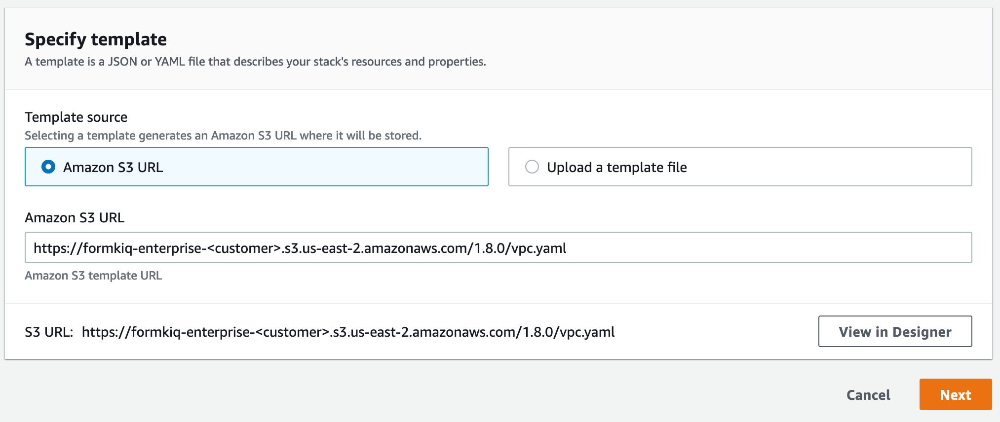
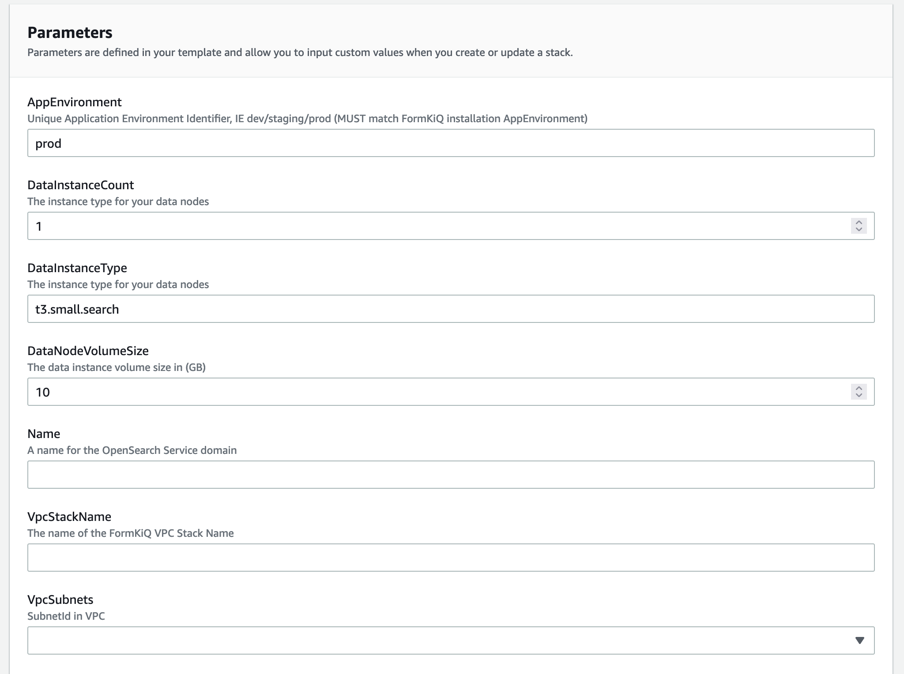
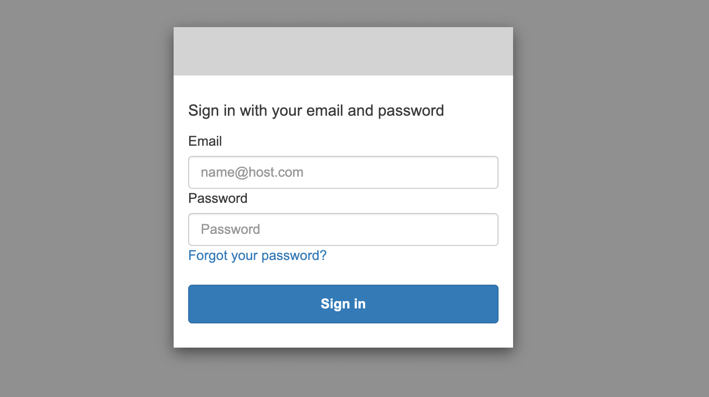

# Enhanced Fulltext Document Search

## Overview

Enhanced Fulltext Document Search is a FormKiQ Enterprise Add-On Module that enhances built-in search functionality by integrating OpenSearch.

✅ Extend Search Functionality, including multiple tag parameters and fulltext queries, through OpenSearch

✅ Optionally Include OCR Results in fulltext queries

## Installation

<iframe width="560" height="315" src="https://www.youtube.com/embed/brvHNrICnXE" title="YouTube video player" frameborder="0" allow="accelerometer; autoplay; clipboard-write; encrypted-media; gyroscope; picture-in-picture; web-share" allowfullscreen></iframe>

On your customized FormKiQ Enterprise repository page, you'll find your CloudFormation single-click installation links.

The Enhanced Fulltext Document Search module uses the AWS OpenSearch service. The OpenSearch service can be inside of a VPC or outside of a VPC. FormKiQ provides methods for doing either type of installation.

If you are NOT using a VPC, you can skip the `Install VPC` section.

### Install VPC (recommended)

To install OpenSearch inside of a VPC, the first step is to use the provided `VPC Creation Script` link to create a VPC preconfigure to work with FormKiQ.

The VPC CloudFormation script, will create a AWS VPC specifically designed to work with FormKiQ. Multiple Public / Private Subnets will be created across multiple availability zones to provide the best reliability possible.

You can customize the CIDR ranges to meet your network requirements.

:::note
Remember the Stack Name you used to install the VPC, as you'll need it in the next section.
:::

### Install OpenSearch

On your customized FormKiQ Enterprise repository page, you'll find your CloudFormation single-click installation links.

When configurating the OpenSearch **WITH VPC**, you'll need to enter the VpcStackName which is the name of the VPC Stack you created above. The script will use outputs from the previous script in its configuration. You'll also need to select the same private subnet CIDRs used during the creation of the VPC.

It is also important that your `AppEnvironment` match exactly the same string used in your FormKiQ installation.

:::note
Remember the Stack Name you used to install OpenSearch, as you'll need it in the next section.
:::

### Update FormKiQ

After installing OpenSearch, you'll need to enable the OpenSearch module in FormKiQ. This is done by selecting your FormKiQ Stack from the CloudFormation console and click the `Update Stack`.

On the CloudFormation configuration page, enter the Stack Names of the OpenSearch installation and optionally the VPC installation.

CloudFormation will then update FormKiQ installation to enable OpenSearch.

## Kibana

Kibana is a powerful data visualization and exploration tool designed to work seamlessly with Opensearch. It allows users to transform large volumes of data into interactive, visually appealing dashboards, graphs, and charts. Kibana is useful for organizations seeking to gain actionable insights from their data, as it enables real-time monitoring, data analysis, and the detection of trends and patterns.

### Authentication

Kibana access is securely controlled through AWS IAM (Identity and Access Management) roles, ensuring that only authorized users and services can interact with the Kibana environment within an AWS infrastructure. 

#### Users

By default the FormKiQ `Admins` group is the only group that has the IAM role/policy access to Kibana. The role is configured on the Cognito group as shown below.

:::warning
The IAM role attached to the `Admins` group should NOT be attached to a new role unless you intend for them to have full admin access to FormKiQ. A new role should be created and only the Kibana policy on the `Admins` IAM role is needed.
:::

#### System

For the FormKiQ application to have access to Opensearch / Kibana a `opensearch_lambda_role` role is created.

The `opensearch_lambda_role` is given Opensearch permissions.

The `opensearch_lambda_role` is then mapped back to AWS IAM roles.

### OpenSearch Dashboards URL

The url to access the Kibana console can be found on the `AWS Opensearch Console page` under the `OpenSearch Dashboards URL`. This url will not be publicly accessible as Opensearch should be deployed to a private subnet to ensure not anyone can get access.

Clicking the `OpenSearch Dashboards URL` will open the Kibana login dialog.

:::note
To access the url, a VPN or an SSH tunnel needs to be setup. Links for example on how to set these up can be found below.

#### AWS Client VPN

See https://docs.aws.amazon.com/vpn/latest/clientvpn-admin/what-is.html

#### SSH tunnel 

See https://repost.aws/knowledge-center/opensearch-outside-vpc-ssh
:::

## API

The Enhanced Fulltext Document Search Module adds several new endpoints, including the following API endpoint to the Documents section of the API:

* `PUT /documents/{documentId}/fulltext` - Replaces the specified document's fulltext metadata for OpenSearch (if exists)

:::note
all FormKiQ API endpoints are case-sensitive
:::

